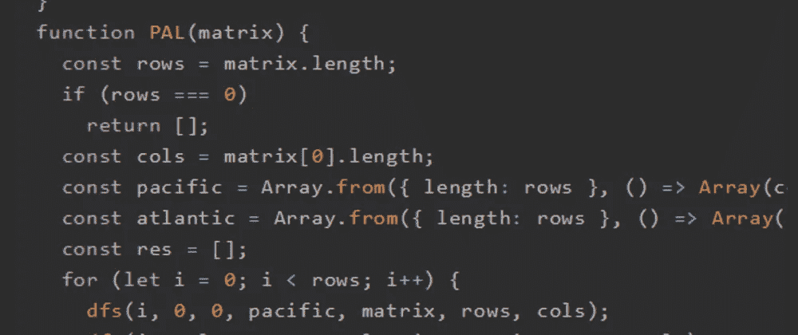
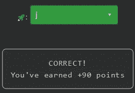

# 天才之路:优越#56

> 原文：<https://blog.devgenius.io/road-to-genius-superior-56-267fd2cb971a?source=collection_archive---------17----------------------->



每天我都要解决几个 Codr 分级模式的编码挑战和难题。目标是达到天才的等级，在这个过程中我解释了我是如何解决这些问题的。你不需要任何编程背景就可以开始，而且你会学到很多新的有趣的东西。

```
function dfs(i, j, height, m, matrix, rows, cols) {
  if (i >= rows || i < 0)
    return;
  if (j >= cols || j < 0)
    return;
  if (matrix[i][j] < height)
    return;
  if (m[i][j] === true)
    return;
  m[i][j] = true;
  dfs(i + 1, j, matrix[i][j], m, matrix, rows, cols);
  dfs(i - 1, j, matrix[i][j], m, matrix, rows, cols);
  dfs(i, j + 1, matrix[i][j], m, matrix, rows, cols);
  dfs(i, j - 1, matrix[i][j], m, matrix, rows, cols);
}
function PAL(matrix) {
  const rows = matrix.length;
  if (rows === 0)
    return [];
  const cols = matrix[0].length;
  const pacific = Array.from({ length: rows }, () => Array(cols).fill(false));
  const atlantic = Array.from({ length: rows }, () => Array(cols).fill(false));
  const res = [];
  for (let i = 0; i < rows; i++) {
    dfs(i, 0, 0, pacific, matrix, rows, cols);
    dfs(i, cols - 1, 0, atlantic, matrix, rows, cols);
  }
  for (let i = 0; i < cols; i++) {
    dfs(0, i, 0, pacific, matrix, rows, cols);
    dfs(rows - 1, i, 0, atlantic, matrix, rows, cols);
  }
  for (let i = 0; i < rows; i++) {
    for (let j = 0; j < cols; 🚀++) {
      if (pacific[i][j] === true && atlantic[i][j] === true)
        res.push([i, j]);
    }
  }
  return res;
}
let M = [[7, 1, 3, 9, 6], [9, 4, 8, 9, 7], [3, 9, 2, 8, 3], [5, 9, 2, 6, 3], [2, 6, 2, 4, 1]];
let A = PAL(M).length;// 🚀 = ? (identifier)
// such that A = 10 (number)
```

我对今天的挑战有点失望，我们只需要修复一个超级简单的错误，所以这将是一个很短的插曲:)

错误出现在第二个 for 循环中:

```
for (let i = 0; i < rows; i++) {
    for (let j = 0; j < cols; 🚀++) {
```

鉴于 for 循环的简单性，您已经看到了这一点🚀应该是`j`。



我很有信心我们会在未来的一集中再次遇到这个代码。我们暂时把它留在这里。

通过解决这些挑战，你可以训练自己成为一名更好的程序员。您将学到更新更好的分析、调试和改进代码的方法。因此，你在商业上会更有效率和价值。今天就在[https://nevolin.be/codr/](https://nevolin.be/codr/)开始行动并成为认证 Codr