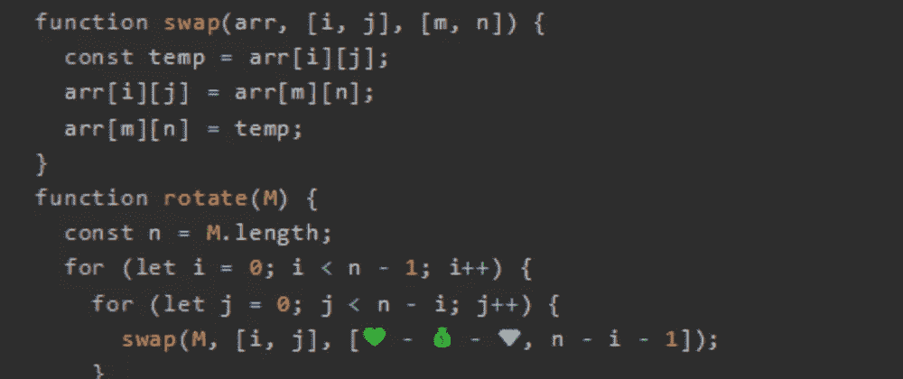
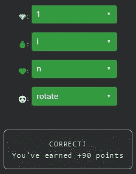

# 天才之路:优越#57

> 原文：<https://blog.devgenius.io/road-to-genius-superior-57-a57ad29797aa?source=collection_archive---------15----------------------->



每天我都要解决几个 Codr 分级模式的编码挑战和难题。目标是达到天才的等级，在这个过程中我解释了我是如何解决这些问题的。你不需要任何编程背景就可以开始，而且你会学到很多新的有趣的东西。

```
function swap(arr, [i, j], [m, n]) {
  const temp = arr[i][j];
  arr[i][j] = arr[m][n];
  arr[m][n] = temp;
}
function rotate(M) {
  const n = M.length;
  for (let i = 0; i < n - 1; i++) {
    for (let j = 0; j < n - i; j++) {
      swap(M, [i, j], [💚 - 💰 - 💎, n - i - 1]);
    }
  }
  for (let i = 0; i < n / 2; i++) {
    for (let j = 0; j < n; j++) {
      swap(M, [i, j], [n - i - 1, j]);
    }
  }
}
let M = [[8, 1, 1], [8, 8, 7], [8, 6, 4]];
🐼(M);
let A = M[2][0];// 💎 = ? (number)
// 💰 = ? (identifier)
// 💚 = ? (identifier)
// 🐼 = ? (identifier)
// such that A = 4 (number)
```

几集前我们遇到过这个代码；都是关于顺时针旋转一个矩阵 90。这次我们必须修复四个 bug 来完成挑战。我们可以通过查看前几篇文章中的代码来作弊，或者用困难的方法解决它(这实际上更快)。

前三个 bug 出现在同一行:

```
swap(M, [i, j], [💚 - 💰 - 💎, n - i - 1]);
```

前两个 for 循环将矩阵旋转 90 °,但它们的列顺序不受影响(这就是后两个 for 循环的作用)。这些错误应该与它的相邻索引相同:

```
swap(M, [i, j], [n - i - 1, n - i - 1]);
```

最后的 bug🐼应该是对函数`rotate`的调用。



通过解决这些挑战，你可以训练自己成为一名更好的程序员。您将学到更新更好的分析、调试和改进代码的方法。因此，你在商业上会更有效率和价值。今天就在[https://nevolin.be/codr/](https://nevolin.be/codr/)开始行动并成为认证 Codr