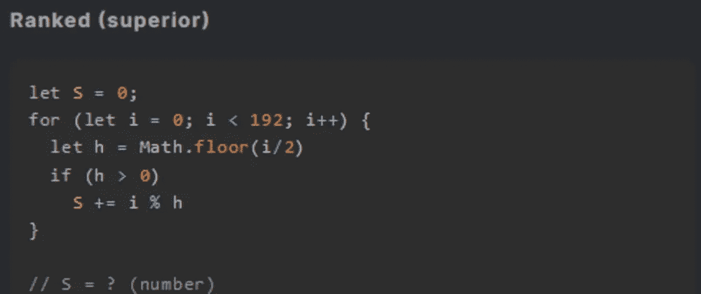
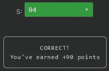

# 天才之路:优越#58

> 原文：<https://blog.devgenius.io/road-to-genius-superior-58-8316362e953?source=collection_archive---------10----------------------->



每天我都要解决几个 Codr 分级模式的编码挑战和难题。目标是达到天才的等级，在这个过程中我解释了我是如何解决这些问题的。你不需要任何编程背景就可以开始，而且你会学到很多新的有趣的东西。

```
let S = 0;
for (let i = 0; i < 192; i++) {
  let h = Math.floor(i/2)
  if (h > 0)
    S += i % h
}// S = ? (number)
```

今天的编码挑战是一个非常有趣的挑战，因为我们需要比平时玩得更聪明来解决它。虽然只有几行代码，但我们需要一个策略来解决它。

for 循环迭代了 192 次，这是相当多的，所以在我们的头脑中、纸上或 excel 中做它将是一个巨大的过度。让我们先简要分析一下代码在伪代码中的作用:

```
S = 0
for i in [0 to 192]:
  h = floor(i/2)
  S += i % h
return S
```

变量`h`是`i`的一半。将`i`除以`h`的余数加到`S`。让我们做一些迭代来说明这一点:

```
i:0 S+=0
i:1 S+=0
i:2 S+=0
i:3 S+=0
i:4 S+=0
i:5 S+=1
i:6 S+=0
i:7 S+=1
i:8 S+=0
i:9 S+=1i:10 S+=0
i:11 S+=1
i:12 S+=0
i:13 S+=1
i:14 S+=0
i:15 S+=1
i:16 S+=0
i:17 S+=1
i:18 S+=0
i:19 S+=1
```

请注意，数字[0，9]产生三个 1。但是其他的，也就是[10，19]产生五个一。[20，29]也是如此，以此类推……简单来说这个算法与范围内的奇数个数有关，除了前十个数:

```
The first 10 numbers (0 to 9) produce 3 odd numbers.The next 90 numbers (10 to 99) produce 9*5=45 odd numbers.The next 90 numbers produce once again 45 odd numbers.The last 2 numbers (190 to 192) produce 1 odd number.3 + 45 + 45 + 1 = 94
```



通过解决这些挑战，你可以训练自己成为一名更好的程序员。您将学到更新更好的分析、调试和改进代码的方法。因此，你在商业上会更有效率和价值。今天就在[https://nevolin.be/codr/](https://nevolin.be/codr/)开始行动并成为认证 Codr