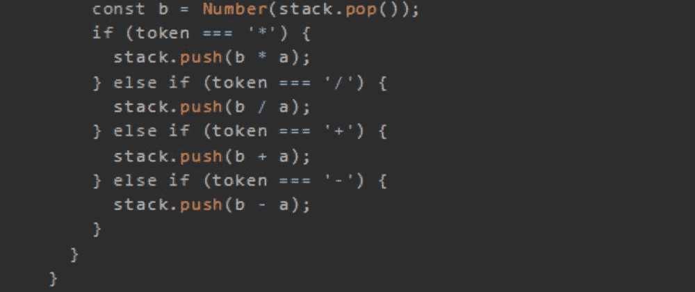
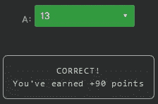

# 天才之路:优越#59

> 原文：<https://blog.devgenius.io/road-to-genius-superior-59-6ac757f81662?source=collection_archive---------9----------------------->



每天我都要解决几个 Codr 分级模式的编码挑战和难题。目标是达到天才的等级，在这个过程中我解释了我是如何解决这些问题的。你不需要任何编程背景就可以开始，而且你会学到很多新的有趣的东西。

```
function RPN(tokens) {
  const stack = [];
  for (let index = 0; index < tokens.length; index++) {
    const token = tokens[index];
    if (!Number.isNaN(Number(token))) {
      stack.push(token);
    } else {
      const a = Number(stack.pop());
      const b = Number(stack.pop());
      if (token === '*') {
        stack.push(b * a);
      } else if (token === '/') {
        stack.push(b / a);
      } else if (token === '+') {
        stack.push(b + a);
      } else if (token === '-') {
        stack.push(b - a);
      }
    }
  }
  return stack.pop();
}let arr = ['1', '8', '5', '6', '+', '5', '*', '/', '*', '6', '+', '7', '+']
let A = RPN(arr);
A = Math.floor(A)// A = ? (number)
```

我们的老朋友反向波兰符号(RPN)又回来了。为了完成挑战，我们必须解决符号，让我们用伪代码来完成:

```
arr = 1 8 5 6 + 5 * / * 6 + 7 +
stack = []index: 0, 1, 2 & 3
stack = [1 8 5 6]index: 4
token: +
push(5 + 6 = 11)
stack = [1 8 11]index: 5
stack = [1 8 11 5]index: 5
token: *
push(11 * 5 = 55)
stack = [1 8 55]index: 6
token: /
push(8 / 55 = 0.145)
stack = [1 0.145]index: 7
token: *
push(0.145 * 1 = 0.145)
stack = [0.145]index: 8
stack = [0.145 6]index: 9
token: +
push(0.145 + 6 = 6.145)
stack = [6.145]index: 10
stack = [6.145 7]index: 11
token: +
push(6.145 + 7 = 13.145)
stack = [13.145]A = Floor(stack.pop())
A == 13
```



通过解决这些挑战，你可以训练自己成为一名更好的程序员。您将学到更新更好的分析、调试和改进代码的方法。因此，你在商业上会更有效率和价值。今天就在[https://nevolin.be/codr/](https://nevolin.be/codr/)开始行动并成为认证 Codr