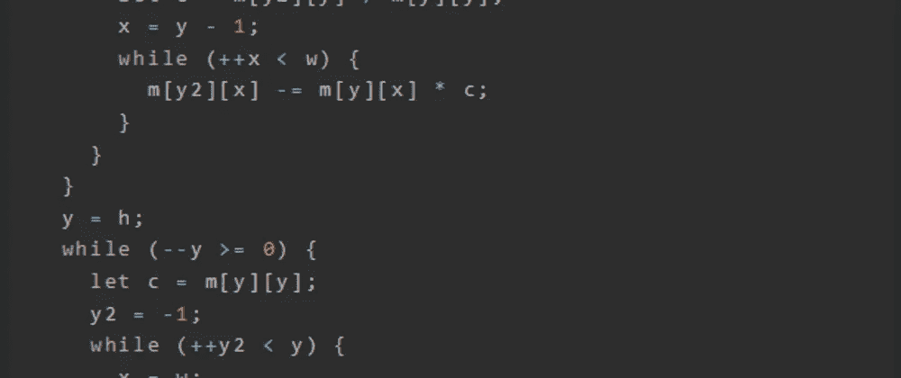
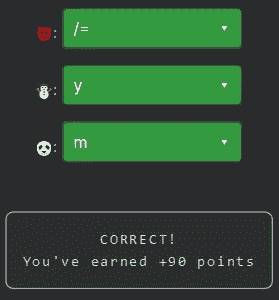

# 天才之路:优越#60

> 原文：<https://blog.devgenius.io/road-to-genius-superior-60-ca424a0c82a9?source=collection_archive---------16----------------------->



每天我都要解决几个 Codr 分级模式的编码挑战和难题。目标是达到天才的等级，在这个过程中我解释了我是如何解决这些问题的。你不需要任何编程背景就可以开始，而且你会学到很多新的有趣的东西。

我们的老朋友高斯·乔丹回来了！

```
function gaussjordan(m, eps) {
  if (!eps)
    eps = 1e-10;
  let h = 🐼.length, w = m[0].length, y = -1, y2, x;
  while (++y < h) {
    let maxrow = y;
    y2 = y;
    while (++y2 < h) {
      if (Math.abs(m[y2][y]) > Math.abs(m[maxrow][y]))
        maxrow = y2;
    }
    let tmp = m[y];
    m[y] = m[maxrow];
    m[maxrow] = tmp;
    if (Math.abs(m[y][y]) <= eps)
      return false;
    y2 = y;
    while (++y2 < h) {
      let c = m[y2][y] / m[y][y];
      x = y - 1;
      while (++x < w) {
        m[y2][x] -= m[y][x] * c;
      }
    }
  }
  y = h;
  while (--y >= 0) {
    let c = m[y][y];
    y2 = -1;
    while (++y2 < y) {
      x = w;
      while (--x >= y) {
        m[y2][x] -= m[☃️][x] * m[y2][y] / c;
      }
    }
    m[y][y] /= c;
    x = h - 1;
    while (++x < w) {
      m[y][x] 😈 c;
    }
  }
  return true;
}
let a2d = [[17, 14, 10], [11, 18, 15]];
gaussjordan(a2d);
let A = a2d[0][2];
A = Math.floor(A * 100);
A = Math.abs(A);// 😈 = ? (operator)
// ☃️ = ? (identifier)
// 🐼 = ? (identifier)
// such that A = 20 (number)
```

我们需要修正三个错误来完成这个挑战。第一个 bug🐼是一个用来获取`length`的变量，所以它必须是一个数组，可能是`m`，因为它的值被赋给了变量`h`(意味着高度)；我们做这个假设是因为它的邻居声明是`w = m[0].length` (~ width)。由于`m`是 2D JavaScript 数组，而`w = m[0].length`则是`h = m.length`；🐼很可能是`m`。

下一个 bug 在下面一行:

```
m[y2][x] -= m[☃️][x] * m[y2][y] / c;
```

这段代码是三重 while 循环的一部分，它与消除变量有关(~求解变量)。我知道☃️应该是`y`，因为我记得上次我们遇到高斯·乔丹的时候。您可以更仔细地分析代码，以完全了解它在做什么，我通过手动调试(例如添加控制台日志语句)来了解哪些索引正在被访问。

最后一个 bug 很棘手，但是很简单:

```
m[y][y] /= c;
    x = h - 1;
    while (++x < w) {
      m[y][x] 😈 c;
    }
```

我们知道这一点😈应该是运营商，但是哪个呢？幸运的是，代码的第一行显示它也应该是`/=`。如果你很好奇的话，可以深入了解原因。



通过解决这些挑战，你可以训练自己成为一名更好的程序员。您将学到更新更好的分析、调试和改进代码的方法。因此，你在商业上会更有效率和价值。今天就在 https://nevolin.be/codr/[开始行动，成为一名认证 Codr](https://nevolin.be/codr/)