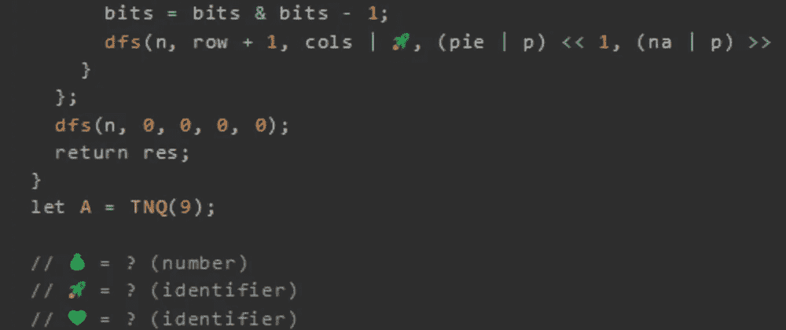

# 天才之路:优越#61

> 原文：<https://blog.devgenius.io/road-to-genius-superior-61-12fb12ef04b1?source=collection_archive---------15----------------------->



每天我都要解决几个 Codr 分级模式的编码挑战和难题。目标是达到天才的等级，在这个过程中我解释了我是如何解决这些问题的。你不需要任何编程背景就可以开始，而且你会学到很多新的有趣的东西。

```
function TNQ(n) {
  let res = 0;
  const dfs = (n, row, cols, pie, na) => {
    if (row >= n) {
      res++;
      return;
    }
    let bits = ~(cols | pie | na) & (1 << n) - 💰;
    while (bits) {
      let 💚 = bits & -bits;
      bits = bits & bits - 1;
      dfs(n, row + 1, cols | 🚀, (pie | p) << 1, (na | p) >> 1);
    }
  };
  dfs(n, 0, 0, 0, 0);
  return res;
}
let A = TNQ(9);// 💰 = ? (number)
// 🚀 = ? (identifier)
// 💚 = ? (identifier)
// such that A = 352 (number)
```

我想我们还没有遇到函数`TNQ`。我不知道它是做什么的，也不知道它是如何工作的。但是从表面上看，它包含了很多位操作。让我们开始吧。

第一个 bug 出现在这里:

```
let bits = ~(cols | pie | na) & (1 << n) - 💰;
```

我不知道什么💰应该是；我们可以选择的答案有 0，1 和 9。从任何数字中减去零都没有意义，减去 9 也有点奇怪，最有可能的答案是 1。

第二个 bug💚是变量名声明，该行下面唯一未声明的变量是`p`。

最后一个 bug 出现在这一行:

```
dfs(n, row + 1, cols | 🚀, (pie | p) << 1, (na | p) >> 1);
```

bug 是 or 运算中的右侧变量；这可能是任何事情。但是如果你看看它的相邻参数(右边)，它们都使用`p`作为 or 运算的右边变量。让我们来试试这个:


通过解决这些挑战，你可以训练自己成为一名更好的程序员。您将学到更新更好的分析、调试和改进代码的方法。因此，你在商业上会更有效率和价值。从今天开始在[https://nevolin.be/codr/](https://nevolin.be/codr/)成为一名认证的 Codr