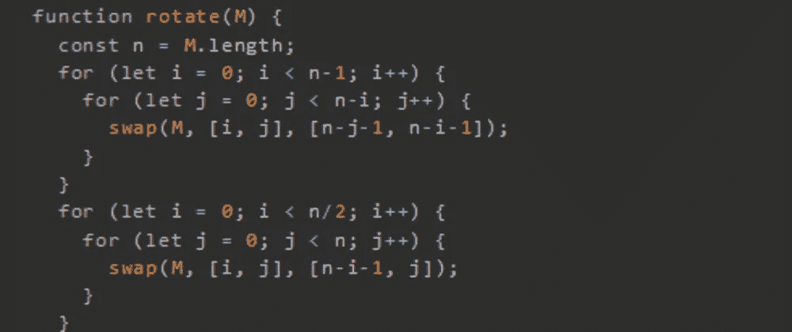
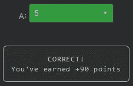

# 天才之路:优越#62

> 原文：<https://blog.devgenius.io/road-to-genius-superior-62-6269dd408822?source=collection_archive---------12----------------------->



每天我都要解决几个 Codr 分级模式的编码挑战和难题。目标是达到天才的等级，在这个过程中我解释了我是如何解决这些问题的。你不需要任何编程背景就可以开始，而且你会学到很多新的有趣的东西。

```
function swap(arr, [i, j], [m, n]) {
  const temp = arr[i][j];
  arr[i][j] = arr[m][n];
  arr[m][n] = temp;
}function rotate(M) {
  const n = M.length;
  for (let i = 0; i < n-1; i++) {
    for (let j = 0; j < n-i; j++) {
      swap(M, [i, j], [n-j-1, n-i-1]);
    }
  }
  for (let i = 0; i < n/2; i++) {
    for (let j = 0; j < n; j++) {
      swap(M, [i, j], [n-i-1, j]);
    }
  }
}let M = [
  [6,5,9],
  [8,1,5],
  [3,4,1]
]
rotate(M);
let A = M[2][1]// A = ? (number)
```

我们以前遇到过几次这个代码，它是关于顺时针旋转一个矩阵 90 度。现在这应该是小菜一碟！

下面是一些伪代码:

```
M = [
 6 5 9
 8 1 5
 3 4 1
]rotate 90°M = [
 3 8 6
 4 1 5
 1 5 9
]
```

为了找到答案，我们需要在旋转矩阵中找到`A = M[2][1]`，它是 5(在第 3 行第 2 列)。



通过解决这些挑战，你可以训练自己成为一名更好的程序员。您将学到更新更好的分析、调试和改进代码的方法。因此，你在商业上会更有效率和价值。今天就在[https://nevolin.be/codr/](https://nevolin.be/codr/)开始行动并成为认证 Codr