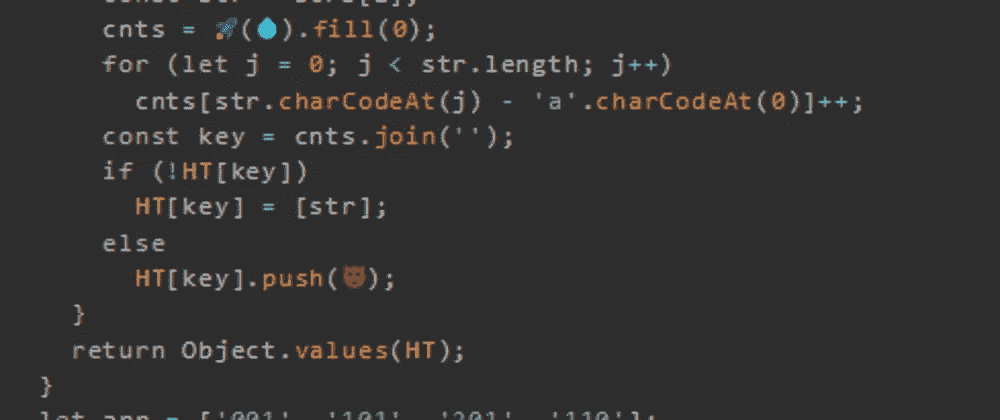
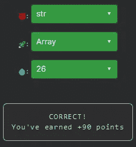

# 天才之路:优越#63

> 原文：<https://blog.devgenius.io/road-to-genius-superior-63-5aefb75c6908?source=collection_archive---------12----------------------->



每天我都要解决几个 Codr 分级模式的编码挑战和难题。目标是达到天才的等级，在这个过程中我解释了我是如何解决这些问题的。你不需要任何编程背景就可以开始，而且你会学到很多新的有趣的东西。

```
function gans(strs) {
  let cnts = [];
  const HT = {};
  for (let i = 0; i < strs.length; i++) {
    const str = strs[i];
    cnts = 🚀(💧).fill(0);
    for (let j = 0; j < str.length; j++)
      cnts[str.charCodeAt(j) - 'a'.charCodeAt(0)]++;
    const key = cnts.join('');
    if (!HT[key])
      HT[key] = [str];
    else
      HT[key].push(😈);
  }
  return Object.values(HT);
}
let arr = ['001', '101', '201', '110'];
let A = gans(arr).length;// 😈 = ? (identifier)
// 🚀 = ? (identifier)
// 💧 = ? (number)
// such that A = 1 (number)
```

今天的挑战将会很有趣，我们必须修正三个错误。

前两个错误出现在同一行:

```
let cnts = []
...
cnts = 🚀(💧).fill(0);
```

很容易判断这应该是什么，因为变量`cnts`被声明为数组，函数`fill`也用于数组。所以最合理的答案是🚀就是要上`Array`的课。第二个 bug💧应该是一个数字，表示数组应该有多大。的可能答案💧都是一堆没什么意义的随机数，除了“26”。拉丁字母表中的字母数正好是 26。

最后一个 bug 如下所示:

```
if (!HT[key])
      HT[key] = [str];
    else
      HT[key].push(😈);
```

第一个 if 条件是如果`HT`不包含`key`，则生成一个以`str`为单元素的数组；否则它应该推送`str`，因为`key`存在(并且它的值是一个数组)。



但是这段代码实际上做了什么呢？如果我们分析代码，我们会注意到输入是一串字符串。函数`gans`遍历每个字符串。对于每个字符串，它使用`cnts`数组来跟踪每个字符串中每个字符的计数。然后，它将所有这些计数连接成一个字符串`key`。下面是一些伪代码:

```
input = ['abc', 'bac', 'def'] str = 'abc'
  cnts = [1 1 1 0 0 0 0 ...]
  key = '1110000000 ...'
  HT = {
    '1110000000 ...' : ['abc']
  } str = 'bac'
  cnts = [1 1 1 0 0 0 0 ...]
  key = '1110000000 ...'
  HT = {
    '1110000000 ...' : ['abc', 'bac']
  } str = 'def'
  cnts = [0 0 0 1 1 1 0 ...]
  key = '0001110000 ...'
  HT = {
    '1110000000 ...' : ['abc', 'bac'],
    '0001110000 ...' : ['def']
  }
```

简而言之，这段代码是一个确定字谜的算法。变位词是通过重新排列另一个单词(或短语)的字母来拼写的单词(或短语)。

但是有些事情是不合理的，这个挑战的输入是:

```
let arr = ['001', '101', '201', '110'];
```

它应该包含 3 个唯一的变位词(001；110 + 101;201).然而`A`的输出只有 1 而不是 3，为什么？

原因是因为这个算法被设计成只处理拉丁字符。问题在于内部 for 循环:

```
cnts[str.charCodeAt(j) - 'a'.charCodeAt(0)]++;
```

该循环遍历字符串中的每个字符，并从该值中减去字母“a”的 ASCII 值。数字的 ASCII 值小于字符的 ASCII 值，因此该值将为负；这个数组中的负索引将导致 undefined，因为唯一可用的索引是 0 到 25。所以我们输入字符串的所有`key`变量都是 26 个零。

通过解决这些挑战，你可以训练自己成为一名更好的程序员。您将学到更新更好的分析、调试和改进代码的方法。因此，你在商业上会更有效率和价值。今天就在[https://nevolin.be/codr/](https://nevolin.be/codr/)开始行动并成为认证 Codr