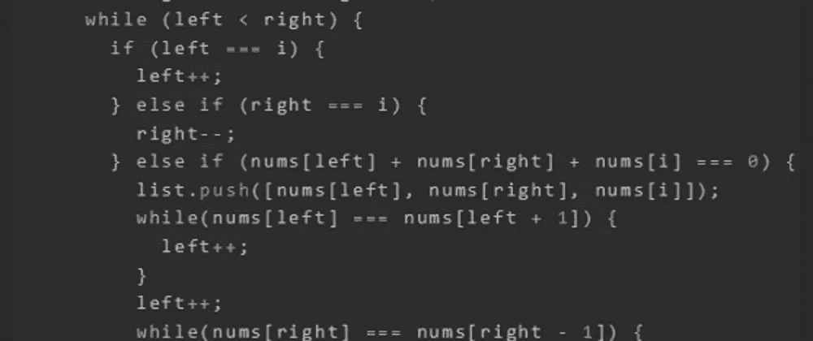
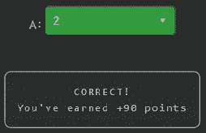

# 天才之路:优越#64

> 原文：<https://blog.devgenius.io/road-to-genius-superior-64-e818e35af2c9?source=collection_archive---------16----------------------->



每天我都要解决几个 Codr 分级模式的编码挑战和难题。目标是达到天才的等级，在这个过程中我解释了我是如何解决这些问题的。你不需要任何编程背景就可以开始，而且你会学到很多新的有趣的东西。

```
function threeSum(nums) {
  if (nums.length < 3) return [];
  const list = [];
  nums.sort((a, b) => a - b);
  for (let i = 0; i < nums.length; i++) {
    if (nums[i] > 0) break;
    if (i > 0 && nums[i] === nums[i - 1]) continue;
    let left = i;
    let right = nums.length - 1;
    while (left < right) {
      if (left === i) {
        left++;
      } else if (right === i) {
        right--;
      } else if (nums[left] + nums[right] + nums[i] === 0) {
        list.push([nums[left], nums[right], nums[i]]);
        while(nums[left] === nums[left + 1]) {
          left++;
        }
        left++;
        while(nums[right] === nums[right - 1]) {
          right--;
        }
        right--;
        continue;
      } else if (nums[left] + nums[right] + nums[i] > 0) {
        right--;
      } else {
        left++;
      }
    }
  }
  return list;
};let A = threeSum([-0,1,-1,1,-0,0]);
A = A.length;// A = ? (number)
```

在今天的挑战中，我们正在处理一个函数`threeSum`，我不知道它是做什么的，但它与三和有关。

挑战希望我们解决`A`，它是`threeSum`输出的`length`。这个函数返回一个数组`list`。

我们不知道这个函数做什么，但是我们知道它的输出。让我们弄清楚这个`list`数组是如何被填充的。我们发现向该数组添加项目的唯一地方是这里:

```
} else if (nums[left] + nums[right] + nums[i] === 0) {
   list.push([nums[left], nums[right], nums[i]]);
   ...
}
```

正如我们所见，当来自`nums`(输入)的三个数之和等于零时，它将一个项(数组)推入`list`。简而言之，该算法旨在寻找总和为零的三元组。

当我们全面分析代码时，我们看到输入数组`nums`是按升序排序的；最外层的 for 循环遍历由`i`索引的`nums`中的每个数字；其后是位于`i`右侧的`left`和`right`指针。以这种方式，该算法仅搜索总和为零的唯一三元组。这里有一些伪代码来说明这个过程:

```
nums = [-0, 1, -1, 1, -0, 0]
-> sort
nums = [-1, -0, -0, 0, 1, 1]----------
    i = 0
 left = 0
right = 5
...
(-0) + 1 + (-1) = 0  --> push
    i = 0
 left = 1
right = 5
----------
    i = 1
 left = 1
right = 5
...
(-0) + 0 + (-0) = 0  --> push
    i = 1
 left = 2
right = 3
----------for all other attempts:
i + left + right !== 0list.length == 2
```



通过解决这些挑战，你可以训练自己成为一名更好的程序员。您将学到更新更好的分析、调试和改进代码的方法。因此，你在商业上会更有效率和价值。今天就在[https://nevolin.be/codr/](https://nevolin.be/codr/)开始行动，成为一名认证 Codr