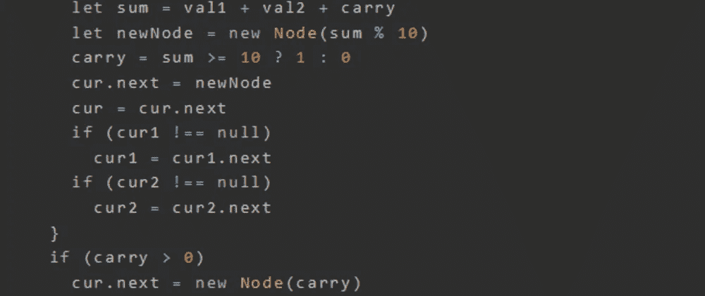
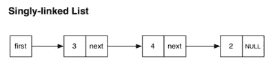
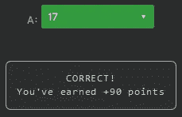

# 天才之路:优越#65

> 原文：<https://blog.devgenius.io/road-to-genius-superior-65-3bfe4a3efa33?source=collection_archive---------5----------------------->



每天我都要解决几个 Codr 分级模式的编码挑战和难题。目标是达到天才的等级，在这个过程中我解释了我是如何解决这些问题的。你不需要任何编程背景就可以开始，而且你会学到很多新的有趣的东西。

```
function Node(val) {
    this.val = val;
    this.next = null;
}function myst(cur1, cur2) {
  if (cur1 === null || cur2 === null)
    return null;
  let head = new Node(0)
  let cur = head 
  let carry = 0 
  while (cur1 !== null || cur2 !== null) {
    let val1 = cur1 !== null ? cur1.val : 0
    let val2 = cur2 !== null ? cur2.val : 0
    let sum = val1 + val2 + carry
    let newNode = new Node(sum % 10) 
    carry = sum >= 10 ? 1 : 0 
    cur.next = newNode
    cur = cur.next
    if (cur1 !== null)
      cur1 = cur1.next
    if (cur2 !== null)
      cur2 = cur2.next
  }
  if (carry > 0)
    cur.next = new Node(carry)
  return head.next
};let x = new Node(9)
x.next = new Node(6)
x.next.next = new Node(1)let y = new Node(7)
y.next = new Node(8)
y.next.next = new Node(1)let out = myst(x, y);
let A = out.val;
while (out.next) {
  A += out.val;
  out = out.next
}// A = ? (number)
```

这里有一个我们从未遇到过的挑战。它似乎与链表有关，如果你是编程新手，这是一个需要学习的重要数据结构。

这段代码创建了两个独立的链表`x`和`y`(在代码的末尾)。然后使用`x`和`y`作为参数调用一些神秘的函数`myst`。最后，根据`myst`的输出计算变量`A`。

链表的基本结构是一个`Node`。一个简单的节点包含一些值和一个指向下一个节点的指针。链表只是一个节点链:



现在你理解了链表，我们来分析一下函数`myst`。它接受两个链表，从头到尾迭代两个链表。它创建一个新的链表`head`，其节点值由`sum`计算:

```
let sum = val1 + val2 + carry
    let newNode = new Node(sum % 10) 
    carry = sum >= 10 ? 1 : 0
```

让我们用伪代码来说明整个过程:

```
x => (9) -> (6) -> (1) -> END
y => (7) -> (8) -> (1) -> ENDmyst(x, y)
  head => (0) -> END  
  carry = 0
  while :
    sum = (9 + 7 + 0) % 10 = 6
    newNode => (6) -> END
    carry = 1
    head => (0) -> (6) -> END sum = (6 + 8 + 1) % 10 = 5
    newNode => (5) -> END
    carry = 1
    head => (0) -> (6) -> (5) -> END sum = (1 + 1 + 1) % 10 = 3
    newNode => (6) -> END
    carry = 0
    head => (0) -> (6) -> (5) -> (3) -> END return head.next out => (6) -> (5) -> (3) -> END
A = 6
while:
  A += 6
  A += 5
  //// A += 3 is not done because that node's "next" points to END (null)
A == 17
```



通过解决这些挑战，你可以训练自己成为一名更好的程序员。您将学到更新更好的分析、调试和改进代码的方法。因此，你在商业上会更有效率和价值。今天就在[https://nevolin.be/codr/](https://nevolin.be/codr/)开始行动并成为认证 Codr