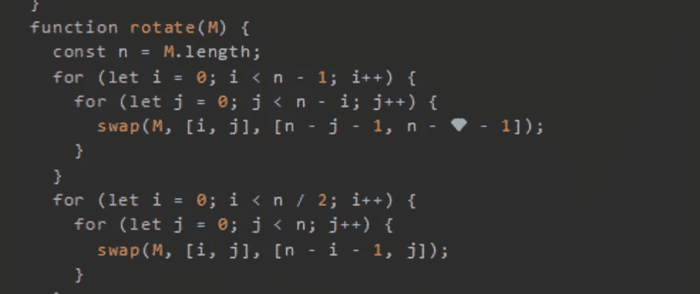
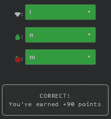

# 天才之路:优越#66

> 原文：<https://blog.devgenius.io/road-to-genius-superior-66-5e015f3664cf?source=collection_archive---------12----------------------->



每天我都要解决几个 Codr 分级模式的编码挑战和难题。目标是达到天才的等级，在这个过程中我解释了我是如何解决这些问题的。你不需要任何编程背景就可以开始，而且你会学到很多新的有趣的东西。

```
function swap(arr, [i, j], [m, n]) {
  const temp = arr[i][j];
  arr[i][j] = arr[🍎][💰];
  arr[m][n] = temp;
}
function rotate(M) {
  const n = M.length;
  for (let i = 0; i < n - 1; i++) {
    for (let j = 0; j < n - i; j++) {
      swap(M, [i, j], [n - j - 1, n - 💎 - 1]);
    }
  }
  for (let i = 0; i < n / 2; i++) {
    for (let j = 0; j < n; j++) {
      swap(M, [i, j], [n - i - 1, j]);
    }
  }
}
let M = [[2, 7, 1], [4, 2, 9], [8, 7, 3]];
rotate(M);
let A = M[2][1];// 💎 = ? (identifier)
// 💰 = ? (identifier)
// 🍎 = ? (identifier)
// such that A = 9 (number)
```

我们的好朋友`rotate`又回来了，如果你记得这个函数顺时针旋转一个矩阵 90°。这次我们必须修复三个错误才能继续。

前两个 bug 出现在函数`swap`的同一行。该功能在`i,j`与`m,n`交换两个元素。知道了这一点，我们就知道🍎和💰应该分别是`m`和`n`。

最后也是第三个 bug 出现在这里:

```
swap(M, [i, j], [n - j - 1, n - 💎 - 1]);
```

这将调用`i,j`上的函数`swap`与`n-j-1, n-i-1`进行交换，这对正确旋转至关重要。



通过解决这些挑战，你可以训练自己成为一名更好的程序员。您将学到更新更好的分析、调试和改进代码的方法。因此，你在商业上会更有效率和价值。今天就在 https://nevolin.be/codr/开始行动，成为一名认证 Codr