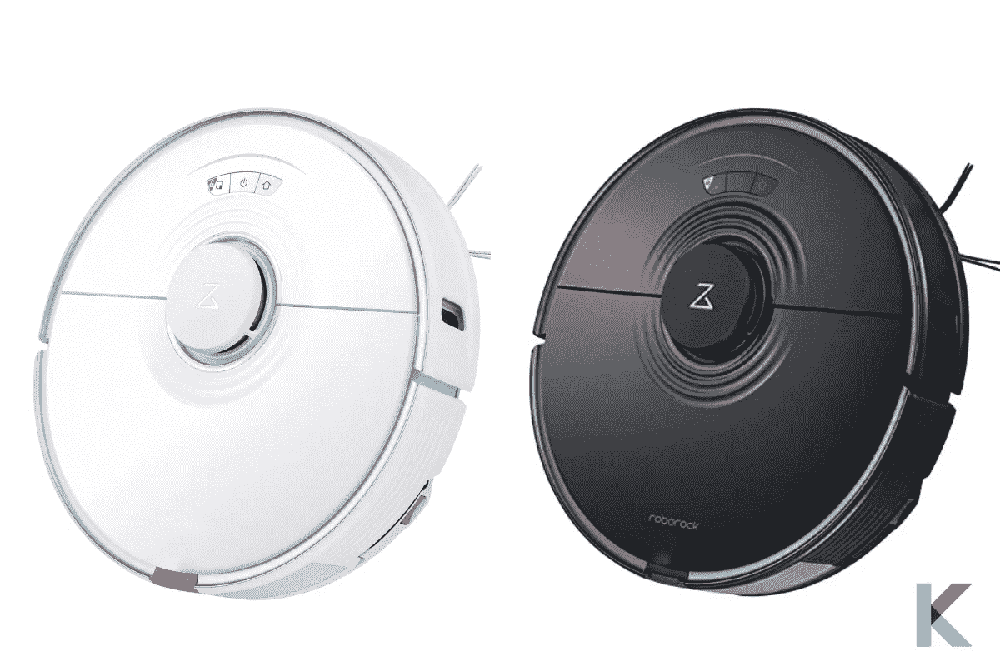
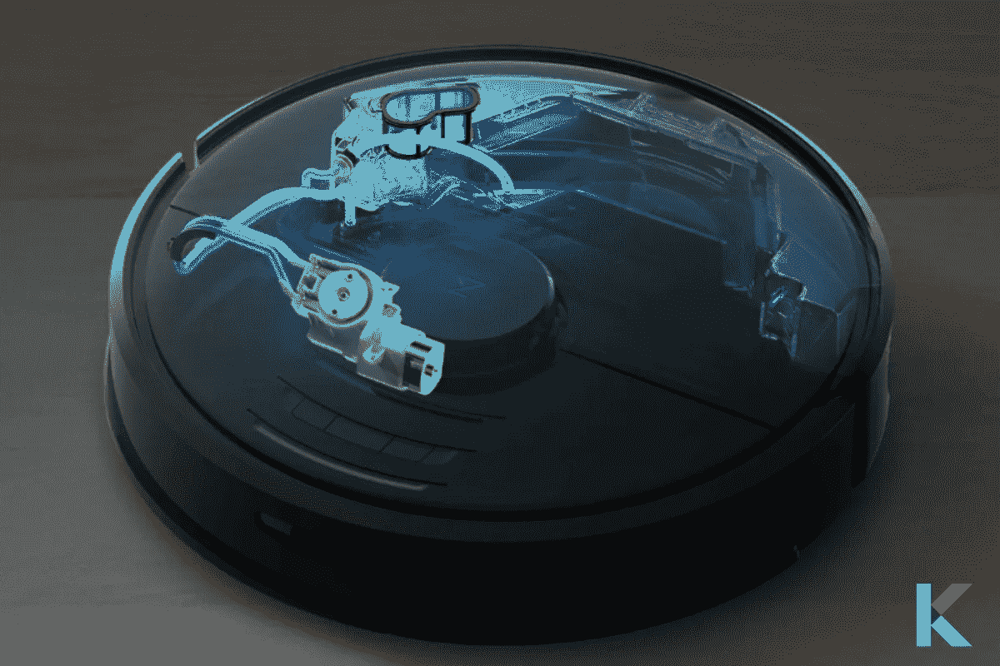
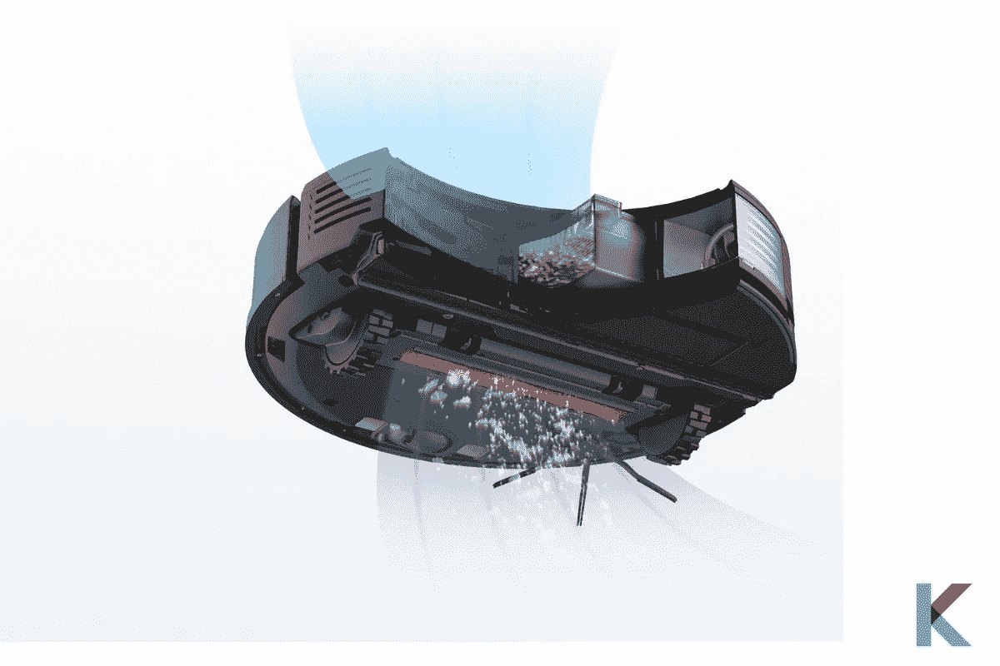
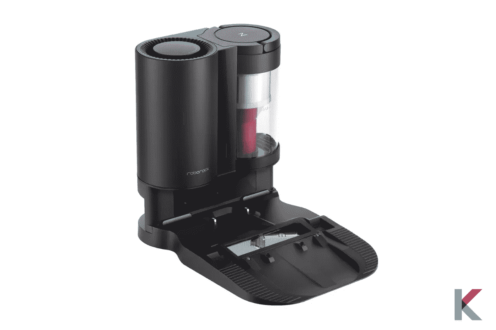
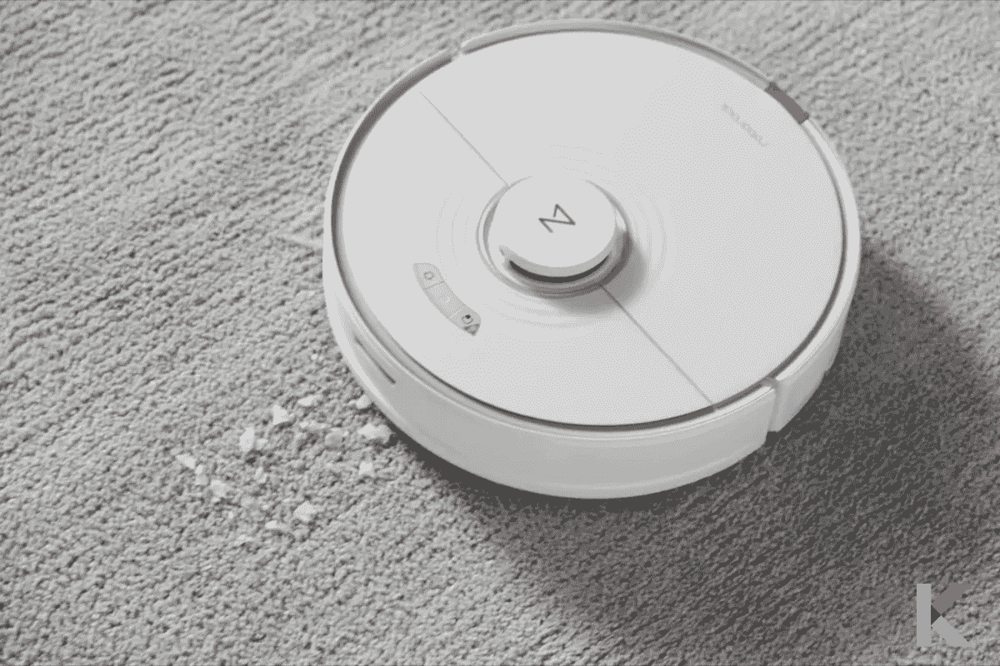
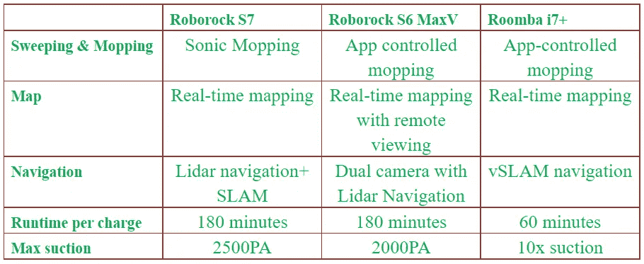
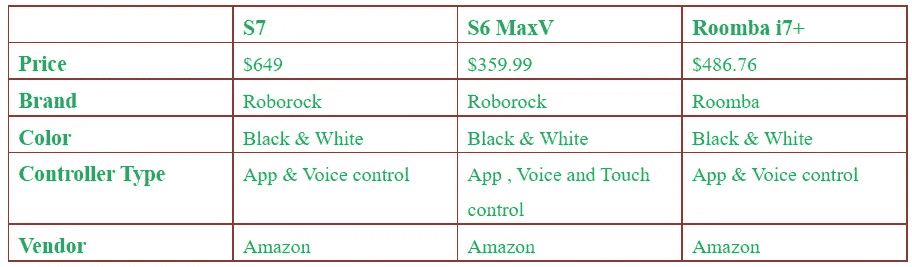

# Roborock S7 机器人吸尘器和拖把—完整回顾

> 原文：<https://blog.devgenius.io/roborock-s7-robot-vacuum-and-mop-complete-review-6477cd7e8f32?source=collection_archive---------6----------------------->

如果你对真空和拖地功能很感兴趣，现在你会激动不已。现代社会是围绕自动化而建立的，所以我们可以从我们的新机器人真空中期待任何东西。如果您是家庭自动化的新手，新的 Roborock S7 机器人吸尘器和拖把是您开始新旅程的绝佳选择。开始不要迟到。我们特意为您回顾了这一点。

***在这篇文章中，你会学到:***

*   最好的 Roborock S7 机器人真空是什么？
*   Roborock S7 机器人吸尘器的优缺点
*   Roborock S7 的特性
*   Roborock S7 的设计
*   RoboRock S7 的应用和测绘性能
*   新 Roborock 自动空坞是什么？
*   如何使用 Roborock S7？
*   如何用 Roborock S7 拖地吸尘？
*   如何设置 Roborock S7？
*   与另一款真空吸尘器相比有何特点？
*   价格比较
*   Roborock S7 值得买吗？

# 最好的 Roborock S7 机器人真空是什么？

Roborock S7 机器人吸尘器和拖把是[robo rock](https://kodmy.com/roborock-s7-robot-vacuum-and-mop/)最新的混合机器人吸尘器和拖把。它结合了快速制图功能和充满自定义的应用程序功能。它有三种主要模式，即真空，拖把，或两者同时进行。

当它发现地毯时，它很聪明地举起拖把。不仅智能拖地性能，而且提供强大的吸尘性能。如果你想更深入地清洁，你可以设置拖把仅模式。太神奇了！因此，现在我们开始深入了解 Roborock S7。

快一点！ [***从亚马逊***](https://amzn.to/3AzJ35K) 获取之前版本的 Roborock S7。

# Roborock S7 机器人真空的利弊

**优点**

*   出色的映射功能
*   自动升高拖把工作良好
*   完美的地毯检测
*   广泛的自动化功能
*   自动清空码头是可用的

**缺点**

*   拖把垫可以挂在地毯上
*   应用程序中的潜水空间可能是一个小故障
*   高经常性成本

# Roborock S7 的特性

***声波振动技术*** —每分钟高达 3000 次循环的刷洗，实现更深层的清洁。

***智能拖把升降*** —用自升降拖把穿越你家充满挑战的环境，防止交叉污染。

***超声波地毯识别*** —它会在应用程序中显示你的地毯在哪里。因此，你可以在长毛绒或中毛绒地毯上放置免拖把区域。

*****2500Pa 强吸力*** —最大吸力 2500Pa。你可以很容易地把格里姆从地毯上拉出来，从地板上掸去灰尘。**

*****多级映射精准导航*** —每个房间自动识别并精确映射多达 4 级。**

*****自动清空停靠支持*** —停靠时，可以自动清空机器人的垃圾箱。可以单独购买。**

*****激光雷达导航*** —它通过精确的路线跟踪创建精确的家庭地图。**

*****超长续航*** —一次充电最多可清洁 180 分钟。**

**如果你喜欢[将 Roboroc S7 的所有功能与另一款智能吸尘器](https://kodmy.com/compare/smart-robot-vacuums?modelList=roborock-s7-robot-vacuum,irobot-roomba-i7-plus)进行比较，你可以在这里找到。**

# **项目信息**

*   ***尺寸* : 19.06 x 15.63 x 6.1 英寸**
*   ***体重* : 15.67 磅**
*   ***模式*:吸尘和拖地**
*   ***智能家居兼容性*:亚马逊 Alexa、谷歌助手、Siri**
*   ***车载垃圾箱容量* : 0.47 升**

# **Roborock S7 的设计**

**Roborock 真空具有独特的形状和紧凑的设计。所以，这个真空像往常一样是圆形的。它保持在 10 厘米(高度)以下，适合大多数床、加热器等。机器人吸尘器有黑色和白色两种颜色。当考虑它的设计时，它与它以前的模型没有变化。但是它有一些独特的特征。**

****

**它有 LED 状态灯，指示机器人当前正在做什么。白色表示吸尘，蓝色表示拖地。给电池充电时呈现蓝色，充电后变成绿色。**

**你可以在激光塔周围看到波浪状的设计元素。它代表了声波拖地(脉动拖地板)。太酷了。它的外观看起来像玻璃，但上面是由塑料制成的，并有金属表面。**

****

**不用担心底部的主刷。它由防止头发缠绕的橡胶制成。此外，水箱和拖地板永久安装在机器人真空吸尘器中。您可以毫不费力地轻松更换和拆卸拖地盘和水箱。**

# **RoboRock S7 的应用和测绘性能**

**它通过兼容 Android 和 iOS 的 Roborock 应用程序进行控制。令人欣慰的是，它使用起来简单明了。您可以从同一个应用程序管理相同的公司设备。安装应用程序并将 S7 连接到 Wi-Fi 后。然后毫不费力地让它上路。此外，您可以使用此应用程序设置定期清理。**

**你第一次运行机器人时，它会用激光雷达绘制你的空间。然后自动创建房间。以后你可以随意编辑，取什么名字都行。S7 支持 4 个独立的地图，因此您需要进入设置，然后管理地图或通过应用程序设备页面上的编辑地图按钮访问地图。之后，点击恢复，使地图，你想激活。然后，您可以指示机器人吸尘器创建一个新的。**

# **什么是新的 Roborock S7 自动空坞？**

****

**Roborock auto empty dock 专用于 Roborock S7。一旦清理灰尘自动清空。它有一个大容量的 3L 袋，可以容纳长达 8 周的灰尘。智能清空模式是一个有趣的功能。您可以根据需要选择合适的清空选项。**

**吸尘器完成清洁工作后，当它将机器人垃圾箱中的电机放入底座的袋子中时，它会自动返回底座充电。这是我见过的最有用的功能。用吸尘器清扫地板的过程现在完全自动化了。此外，您可以随时使用该应用程序打开和关闭电源。多层空气过滤是另一个有用的功能，可以将细小的灰尘锁在坞站内。如果你现在有 S7 并且想升级垃圾箱，我认为这是一个显而易见的选择，值得购买。**

# **如何使用 Roborock S7？**

**S7 可以由语音助手控制，如亚马逊 Alexa、谷歌助手和 Siri。它还兼容像 Mi Home 和 Google Home 这样的智能家居中枢应用程序。此外，Roborock 便于您使用 S7 上的按钮进行控制，并且具有 Roborock 应用程序。不要担心来自好奇的宠物和你的孩子的意外激活。它增加了方便的儿童锁按钮。**

# **如何用 Roborock S7 拖地吸尘？**

****

**声波拖地是如何工作的？有时候你可能会想。放松点。Roborock S7 包括一个 300 毫升的水箱、特殊的拖把布和 VibraRise 拖把支架。声波拖地是振动垫的另一个名字。VibraRise 拖把支架以 50Hz 的频率振动，因此您可以听到声波。**

**深度拖地选项以紧凑的 Z 型模式运行。它覆盖地板的每个区域两次。所以，它提供了伟大的吸尘和顶层拖地。它具有改进的主刷、相同尺寸的集尘箱、水箱和增强的拖地功能。您可以为家中每一层、地板和每个房间设置各种清洁模式。**

**用你的新机器人吸尘相对比较快，而且整体性能很强。它有一个绘图功能，可以绘制你家的楼层。它可以自动检测地毯，并相应增加吸力。这个机器人吸尘器足够聪明，可以避免拖地毯。此外，它还同时集成了拖把和吸尘器的一些漂亮功能。它还带有一个浮动刷。它可以在不同的表面上调节高度，以便有效清洁。**

# **如何设置 Roborock S7？**

**Roborock S7 的设置过程与之前的 Roborock 真空吸尘器一样简单。一旦你有了 S7，你就可以打开包装，组装所有的东西。之后，将基座插入插座，给机器人电池充满电。以下是设置您的 [Roborock S7](https://www.tomsguide.com/reviews/roborock-s7) 的几个步骤。**

*   **第一步:安装 Roborock 的应用程序**
*   **第二步:提起机器人的盖子**
*   **第 3 步:两边有两个电源按钮，按住两个按钮。**
*   **第四步:你会看到重置 Wi-Fi 警告和 Wi-Fi 指示灯闪烁**
*   **第五步:点击应用程序中的+按钮，一旦检测到 S7，点击应用程序中的 S7 图标。**
*   **第 6 步:一旦与 S7 Wi-Fi 配对，指示灯会逐渐亮起。**
*   **第 7 步:按照应用程序中的提示连接 S7。**

# **与另一款真空吸尘器相比有何特点？**

****

# **价格比较**

**新的机器人吸尘器于 2021 年 3 月 24 日发布。它在 Walmart.com 和亚马逊有售，价格为 599-649 美元。**

****

# **Roborock S7 值得买吗？**

**我们已经复习了 Roborock S7 机器人吸尘器和拖把。那么，你对 Roborock S7 机器人吸尘器有想法了。它的声波拖地功能确保了极好的拖地效果。机器人可以举起它的拖盘。因此，它不会将湿拖把拖过地毯。多神奇的功能啊！不想再为此烦恼了。它有一个自动清空的垃圾箱。所以，我不想用一次性袋子。或者，您可以使用安装的集尘器。可以手动清空。有这么多优秀的功能。所以，Roborock S7 值得你购买。不过，如果你有任何其他偏好，可以选择 [iRobot Roomba i7+](https://kodmy.com/the-best-robot-vacuum-in-2021/) 和 Roborock S6 Max。**

**快一点！ [***从亚马逊***](https://amzn.to/3i0sOY6) 获得 iRobot Roomba i7+。**

*****我们挑*****

**正如我们上面提到的，它有着神奇的先进功能，如智能拖把升降，新的橡胶刷，升级的浮动刷和声波拖地技术。这是一个相当安静的机器人真空吸尘器，不仅仅是它的价格。所以，Roborock S7 是你家的不二之选。如果你需要大量的定制选项，拖地和吸尘一起进行，并且想要一个自动清空的坞站，你可以购买它。但是，如果你想要一个机载相机，并且预算紧张，就不要买它。**