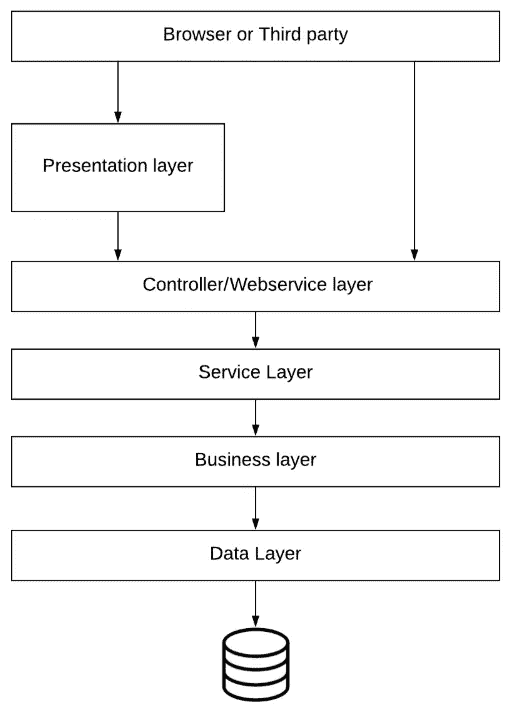

# 集成软件应用在现代社会中的作用

> 原文：<https://blog.devgenius.io/role-of-integration-software-applications-in-the-modern-days-8319b637c8d5?source=collection_archive---------25----------------------->

Emile Perron 在 [Unsplash](https://unsplash.com/s/photos/programming?utm_source=unsplash&utm_medium=referral&utm_content=creditCopyText) 上的照片

以前我写过为什么每个开发人员都应该知道和理解 API 在软件开发中的重要性。([阅读更多](https://medium.com/@ahmedahsankhan/why-all-the-developers-should-learn-and-understand-rest-soap-services-377c13388b5b))。在今天这个互联网、云计算、物联网的时代，如果我们的应用程序是独立的，它将无法生存。新时代的应用程序需要与其他应用程序或外部系统连接，以降低开发成本和实现可重用性。在这篇文章中，我将解释不同类型的 web 服务以及为什么我们需要集成开发软件应用程序。

# REST 和 SOAP 的主要区别:

如果你在谷歌上搜索这个，你会看到许多作家写这个话题。所以我在这里长话短说。REST 和 SOAP 是实现 API(应用程序编程接口)的两种方式。API 接受来自外部系统的请求，并通过互联网协议(如 HTTP/HTTPS)将响应返回给请求者。REST 和 SOAP 所做的是，它们使得从一个应用程序向另一个应用程序传输数据成为可能。这两者的不同之处在于他们实现这个东西的方式。

## 肥皂:

SOAP 代表简单对象应用平台。SOAP 是一种标准化协议，它使用 HTTP 和 SMTP 等其他协议发送消息。SOAP 只能接受严格定义的 XML 格式的消息。

## 休息:

谈到 REST，这意味着具象状态转移，这里我们将重点讨论 REST 的两个主要方面。首先是 REST 读取多种格式的数据，比如纯文本、JSON、HTML 等格式。关于 REST 的第二点是，REST API 文档是以 JSON 格式编写的，扩展名为。yaml 或者。json 类型，它被称为 Swagger 文件。与此相反，SOAP API 文档是以 XML 格式编写的，它被称为 Web 服务描述语言，也称为 wsdl，文件被保存为。wsdl 扩展类型。

你可以在[链接](https://raygun.com/blog/soap-vs-rest-vs-json/)上阅读更多差异。

# 集成系统的作用:

集成软件是用来集成多个软件应用程序或多个数据源的软件。正如我们之前了解到的，SOAP 和 REST 应用程序读取和理解不同格式的消息。这就像一个人用法语交谈并理解，而另一个人用汉语交谈一样。所以我们需要有人在两者之间进行翻译。这就是集成软件应用发挥作用的地方。它将一种消息格式转换成另一种格式，或者在最基本的情况下，它只是连接两个彼此不可访问的应用程序。最简单的集成形式可能是使用连接器文件将 java 应用程序连接到 MySQL 数据库。

> 将任何端点连接到任何端点是现代集成平台的一个关键特征。

## 多层软件架构:

在基础级别，新开发人员学习由单层架构组成的编程，如使用他们选择的编程语言(如 Java/C++/Javascript 等)的移动、桌面或 web 应用程序。但是，随着他们技能的提高，他们发现独立的应用程序并不那么有用，因为它们不能满足客户的业务需求。企业系统越大，层次就越多，因此需要专门的集成软件应用程序来集成多层应用程序。

多层架构的示例如下所示:

## 数据集成工具:

有许多供应商有他们自己的集成软件工具来帮助集成软件的开发。集成可以在 REST-REST、SOAP-SOAP、REST-SOAP 之间进行，反之亦然，或者只通过使用集中式数据库，其中数据可以由一个应用程序写入，并由另一个应用程序通过使用批处理或使用消息队列读取，在消息队列中，消息被写入队列并由应用程序实时读取。IBM 提供了自己的软件工具包，名为 IBM Integration Bus，在 IIB 版本 11 中也被称为 [App Connect Enterprise (ACE)。IIB 提供了所有的功能，以帮助开发上述所有情况的集成软件应用程序。还有许多其他工具，例如微软 SQL Server Integration Services(SSIS)、Oracle Data Service Integrator、Informatica PowerCenter 等等。它取决于企业应用程序的需求，这使得选择要使用的集成工具变得容易。集成工具的完整列表可在](https://www-01.ibm.com/common/ssi/ShowDoc.wss?docURL=/common/ssi/rep_ca/3/877/ENUSZP18-0043/index.html&request_locale=en)[这里](https://www.alooma.com/blog/data-integration-tools)获得。

# 结论:

在本文中，我解释了应用程序是如何暴露给外部世界的，或者暴露给希望与它们通信的安全环境中的其他应用程序(SOAP 和 REST APIs)。我还讨论了为什么应用程序需要与其他应用程序连接才能工作。在文章的最后，我讨论了多层软件架构以及集成工具在集成这些层以使它们有用并满足企业应用程序的业务需求方面的作用。