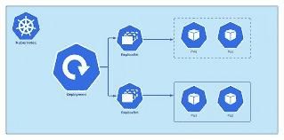

# 部署中的滚动更新和回滚(Kubernetes)

> 原文：<https://blog.devgenius.io/rolling-updates-rollbacks-in-deployments-kubernetes-7764c93efb79?source=collection_archive---------6----------------------->

演职员表:[https://congdonglinux.com/](https://congdonglinux.com/)

部署的重要方面是:升级、部署、回滚。

**升级**:部署最新主要版本和关闭旧版本的能力。

**首次展示**:能够在不停机的情况下部署最新的次要版本(bugfix、hotfix、次要特性、增强)。

回滚(roll back):在出现问题的情况下，能够恢复到旧的工作版本。

> 以下是 K8s 世界里发生的事情:

1.  当我们第一次创建部署时，它会创建一个展示。
2.  新的卷展栏会创建新的修订。
3.  将来，当触发一个新的部署(同名)时，会创建一个新的部署，并增加版本。
4.  这有助于我们跟踪所做的更改，并使我们能够回滚到以前的版本部署。
5.  检查首次展示状态:` kubectl 首次展示状态部署<deployment-name>'</deployment-name>
6.  要检查历史、修订和首次展示的变更原因:` kubectl 首次展示历史部署<deployment name="">`请执行以下操作</deployment>

> **部署策略#1 - >重新创建:**

1.  假设您的应用程序有 5 个实例在运行
2.  部署新版本时，我们可以销毁旧版本的 5 个实例，然后部署新版本的 5 个实例。
3.  问题是会有停机时间。
4.  这主要是在重大变更、中断变更或向后兼容不可能时完成的。
5.  这不是 K8s 中的默认策略。

> **部署策略#2 - >滚动更新:**

1.  在这种策略中，我们不会删除所有已经运行的实例。
2.  我们一次删除一定比例的实例，同时生成相同比例的新版本。
3.  这个升级是 K8s 中的默认策略。
4.  这没有停机时间。

> 让我们用一个例子来理解:

1.  假设已经有一个部署运行一个 pod 的 3 个副本，映像为 nginx:1.7.0。
2.  现在，您希望更改图像的版本。
3.  这可以通过更改部署文件中的映像版本并运行命令来完成:` kubectl apply -f <deployment file="" path="">`来完成</deployment>
4.  以上也可以通过:` ku bectl set image deployment myapp-deployment nginx = nginx . 1 . 7 . 1`。
5.  请记住，如果我们执行第 4 步，那么集群中的实际文件和部署定义将会不一致
6.  运行命令:` kubectl describe deployment <deployment name="">`查看部署的细节，并注意两种策略的区别。</deployment>

> 升级如何在引擎盖下工作:

1.  当一个部署被应用时，它创建一个副本集，并使用部署配置中提到的实例数量旋转 pod。
2.  然后，当使用更改重新应用部署时，它会创建一个新的副本集，并启动部署配置中提到的实例数量的 pod，同时从较旧的副本集中删除 pod。
3.  但是需要注意的是，旧的副本集仍然存在，如果需要，将用于回滚。
4.  要回滚部署:` kube CLT rollout undo deployment<deployment name="">`—这也将按照升级时发生的类似顺序运行。</deployment>
5.  回滚后，新的副本集仍然存在。
6.  请记住，为了查看历史修订的变更原因，我们需要在编辑/应用部署时添加—记录标志(每个部署需要设置一次)
7.  当我们执行回滚时，发生回滚的修订将从历史记录中删除，并在历史记录中创建一个新条目。
8.  如果在升级过程中出现任何错误，kubernetes 将主动停止升级，并停止删除以前运行的实例