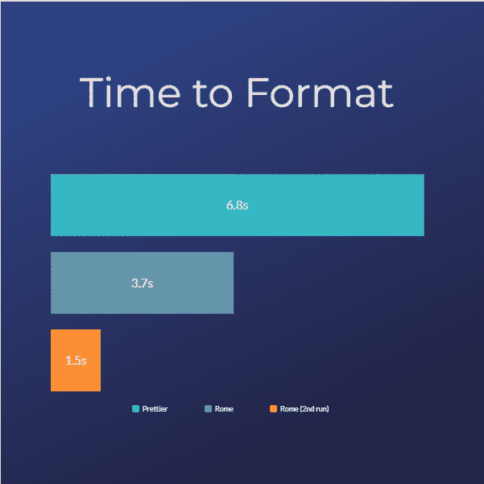

# 罗马 vs 漂亮。在块上尝试新的格式化程序

> 原文：<https://blog.devgenius.io/rome-vs-prettier-trying-out-the-new-formatter-on-the-block-9b3424d315dc?source=collection_archive---------8----------------------->


# 介绍

Rome 被设计成 JavaScript、Typescript、HTML、Markdown 和 CSS 的格式化程序、linter、bundler 等等。这是一个很大的变化，但它旨在成为 web 开发工具的一站式商店。在这篇文章中，我将回顾我在罗马 vs 漂亮的经历。

作为免责声明，因为罗马只关注这些语言的比较也将只关注这些！

# 什么是格式化程序？

格式化程序将自以为是的风格惯例应用于文本文件，在这里是我们的编码文件！这些约定可以包括但不限于缩进样式、引用用法、代码行长度等等，具体取决于语言！

我将根据以下标准对两者进行评估:

*   格式化时间
*   格式化

# 设置 Rom

Rome 与 IDE 中的集成紧密相关。然而，它只支持 Visual Studio 代码，我们只需在扩展中搜索 Rome:


但是为了这篇文章的目的，我想从 CLI 运行 beauty 和 Rome。罗马建议暂时只在本地安装

```
npm i -D rome@next
```

然后将以下脚本添加到 package.json 中

```
"scripts": { 
    "rome:format": "rome format ." 
}
```

# 罗马 vs 更漂亮:时间

这是罗马的时间:


更漂亮:


罗马第二轮:


哇，罗马，快多了！这里有一个图表，只是为了好玩



越低越好

# 罗马 vs 更漂亮:格式

那么，实际的格式呢？罗马和漂亮是非常固执己见，当谈到格式，不允许这么多的定制。

更漂亮(来自他们的网站)有 23 个选项，因为它已经存在了这么长时间，有插件来补充它。另一方面，罗马提供了以下三种选择:

如果需要，它们都提供了一种忽略格式的方法:

```
// rome-ignore format: <explanation> 
// prettier-ignore
```

Rome 还提供了一种他们称之为**错误恢复**的东西。尽管有语法错误，也允许格式化工作，这是 prettier 没有提供的。在他们的公告页面上有一个整洁的小 GIF:【https://rome.tools/blog/2022/04/05/rome-formatter-release

下面是 Rome 的一些格式化代码的简单示例:


# 结论

对本文中的所有内容都要持保留态度，因为罗马格式化程序仍处于 alpha 阶段，所以还有很多可以改变的地方。

关于它实际上是如何工作的更多信息，请查看他们的[网站](https://rome.tools/#formatter)。

在 web 开发工具领域，Rome 是一个非常有趣的新概念。如果他们设法做出易于使用的东西，整合我们所有的需求，那么它将解决我们 web 开发人员的一个主要问题。

更多内容在[相关代码](https://relatablecode.com)

如果你喜欢这个，请随时在 LinkedIn 或 Twitter 上与我联系

在我的[时事通讯](https://relatablecode.substack.com/)中查看我的免费开发者路线图和每周科技行业新闻。

*原载于 2022 年 4 月 13 日 https://relatablecode.com**[*。*](https://relatablecode.com/rome-vs-prettier-trying-out-the-new-formatter-on-the-block/)*