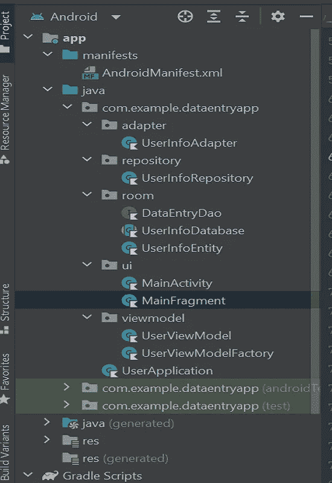
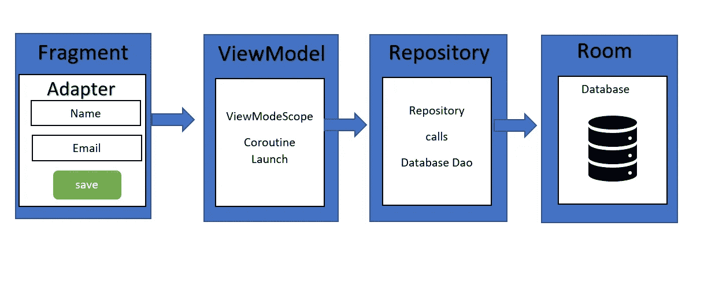
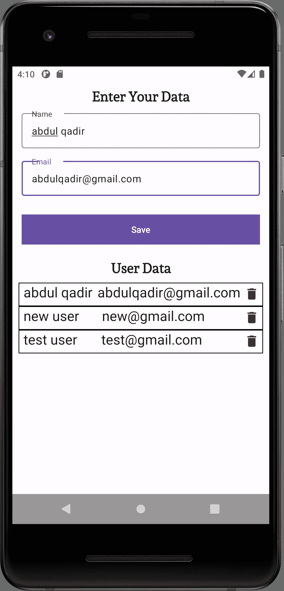

# 使用 kotlin 协同程序流的房间数据库，通过 android 架构组件插入、获取和删除数据库中的值

> 原文：<https://blog.devgenius.io/roomdatabase-a-simple-data-entry-application-using-kotlin-coroutines-coroutine-flow-and-viewmodels-ce2621a75a71?source=collection_archive---------6----------------------->

这是一个使用 roomDatabase 的简单数据输入应用程序，用户可以使用协程和主安全线程在 SQlite 数据库中插入、获取和删除值。当数据库更新时，协程流用于实时更新更改。

**框架和库:**

RoomDatabase，ViewModel，ViewModelFactory，LiveData，Flow，Coroutines，ListAdapter，ViewBinding。

**依赖:**

```
// Room components
def room_version = "2.4.3"
implementation "androidx.room:room-ktx:$room_version"
kapt "android.arch.persistence.room:compiler:1.0.0"
implementation("androidx.room:room-runtime:$room_version")
// optional - Kotlin Extensions and Coroutines support for Room
kapt("androidx.room:room-compiler:$room_version")
// optional - Test helpers
testImplementation("androidx.room:room-testing:$room_version")

def lifecycle_version = "2.4.0"
// Lifecycle components
implementation "androidx.lifecycle:lifecycle-livedata-ktx:$lifecycle_version"
implementation "androidx.lifecycle:lifecycle-common-java8:$lifecycle_version"
implementation "androidx.lifecycle:lifecycle-viewmodel-ktx:$lifecycle_version"
implementation 'org.jetbrains.kotlinx:kotlinx-coroutines-core:1.3.2'
implementation "androidx.lifecycle:lifecycle-extensions:2.2.0"
```

**项目结构及流程:**

在进入代码之前，让我们从项目结构开始，在这个项目中有 5 个不同的包适配器、存储库、房间、ui 和视图模式，见图。1 用于项目结构。



图一。项目结构

为了更好地理解，请查看图中的项目流程。2、它显示了不同阶级之间的关系。



图。2 项目流程

**房间数据库:**

让我们从使用 room 创建数据库开始代码。Room 是 Jetpack 的一部分，它在 SQLite 数据库上提供了一个抽象层，用于在本地保存和执行数据操作。

1.  **房间**

**1.1 UserInfoEntity.kt**

```
@Entity(tableName = "user_info", indices = [Index(value = ["email","name"], unique = true)])
data class UserInfoEntity(
    @PrimaryKey(autoGenerate = true) @ColumnInfo(name = "user_id")
    val id : Int = 0,
    val name: String,
    val email: String,
)
```

UserInfoEntity.kt 包含数据库中 **user_info** 表中每一列的字段。下面的代码是一个定义用户表的实体，该表包含 id(主键)、name 和 email 列。

**1.2 UserInfoDao.kt**

```
@Dao
interface DataEntryDao {

    @Insert(onConflict = OnConflictStrategy.*REPLACE*)
    suspend fun insert(userInfo: UserInfoEntity)

    @Query("SELECT * FROM user_info")
    fun getAllUsers(): Flow<List<UserInfoEntity>>

    @Query("delete from user_info where user_id = :u_id")
    suspend fun deleteById(u_id : Int)
}
```

kt 是一个定义数据库交互的数据访问对象接口类。它包括我们对插入、获取和删除用户的查询。类应该用 Dao 标记。

在上面的代码中，流是一个值的异步序列，它一次产生一个值(而不是一次产生所有的值)，可以从网络请求、数据库调用或其他异步代码等异步操作中产生值。
它通过其 API 支持协程，因此您也可以使用协程来转换流。

**1.3 UserInfoDatabase.kt**

```
@Database(entities = [UserInfoEntity::class], version = 1, exportSchema = false)
abstract class UserInfoDatabase : RoomDatabase() {

    abstract fun dataEntryDao(): DataEntryDao

    companion object {

        @Volatile
        private var INSTANCE: UserInfoDatabase? = null
fun getDatabase(ctx: Context, scope: CoroutineScope): UserInfoDatabase {
            return when (val temp = INSTANCE) {
                null -> *synchronized*(this) **{** Room.databaseBuilder(
                        ctx.*applicationContext*, UserInfoDatabase::class.*java*,
                        "user_info"
                    )
                        .fallbackToDestructiveMigration()
                        .build()
                **}** else -> temp
            }
        }
    }
}
```

这是 UserInfo 数据库的抽象类，它扩展了 RoomDatabase 并创建了它的单例实例。*注意:当您修改数据库模式时，您需要更新版本号并定义一个迁移策略。*

**2。储存库**

2.1 **用户信息仓库. kt**

```
class UserInfoRepository(private val dataEntryDao: DataEntryDao) {

   var allUsers: Flow<List<UserInfoEntity>> = dataEntryDao.getAllUsers()

    suspend fun insert(userInfo: UserInfoEntity) {
        dataEntryDao.insert(userInfo)
    }

   suspend fun deleteById(u_id : Int){
        dataEntryDao.deleteById(u_id)
    }
}
```

在我们的 UserInfoRepository.kt 中，我们使用协程流来实时获取更改，注意:Room 在一个单独的线程上执行所有查询。
观察到的流量会在数据发生变化时通知观察者。

**3。viewmodel**

**3.1 UserViewModel.kt**

```
class UserViewModel(private val repository: UserInfoRepository) : ViewModel() {

    val allWords: LiveData<List<UserInfoEntity>> = repository.allUsers.*asLiveData*()
fun insert(userInfo: UserInfoEntity) = *viewModelScope*.*launch* **{** repository.insert(userInfo)
    **}** fun delete(userid : Int){
        *viewModelScope*.*launch* **{** repository.deleteById(userid)
        **}** }
}
```

我们的视图模型类 UserViewModel 负责以生命周期意识的方式存储和管理 UI 相关的数据。 **ViewModel** 类允许数据在配置后继续存在。

*请注意:* 不要引用生命周期比你的视图模型短的上下文！例如:Activity、Fragment、View
保持引用会导致内存泄漏，例如，ViewModel 引用了一个被破坏的 Activity！所有这些对象都可以被操作系统销毁，并在配置发生变化时重新创建，这在视图模型的生命周期中会发生很多次

**3.2 用户视图模型工厂. kt**

```
class UserViewModelFactory(private val repository: UserInfoRepository): ViewModelProvider.Factory {
    override fun <T : ViewModel> create(modelClass: Class<T>): T {
        if (modelClass.isAssignableFrom(UserViewModel::class.*java*)) {
            @Suppress("UNCHECKED_CAST")
            return UserViewModel(repository) as T
        }
        throw IllegalArgumentException("Unknown ViewModel class")
    }
}
```

*如果您自己正在创建一个新项目，并且对 ViewModelFactory 有问题，请在 android{}块*内的 build.gradle 模块级别中添加这一行

*kotlinOptions {
freeCompilerArgs+=[
"-Xjvm-default = all "，
]
}*

**4。UserApplication.kt**

```
class UserApplication : Application(){

   private val applicationScope = *CoroutineScope*(*SupervisorJob*())private val database by *lazy* **{** UserInfoDatabase.getDatabase(this,  applicationScope) **}**val repository by *lazy* **{** UserInfoRepository(database.dataEntryDao()) 
 **}**}
```

**5。适配器**

**5.1 用户信息适配器**

```
class UserInfoAdapter : ListAdapter<UserInfoEntity, UserInfoViewHolder>(UserInfoComparator()) {

     var itemClickListener: (UserInfoEntity) -> Unit = **{}** lateinit var binding : RecyclerviewItemBinding

    inner class UserInfoViewHolder(private val binding:   RecyclerviewItemBinding)  : RecyclerView.ViewHolder(binding.*root*){

        init {
            binding.deleteIcon.setOnClickListener **{** itemClickListener(getItem(*layoutPosition*))
            **}** }

        fun bind(userInfoEntity: UserInfoEntity) {
            binding.itemName.*text* = userInfoEntity.name
            binding.itemEmail.*text* = userInfoEntity.email
        }
    }

    class UserInfoComparator : DiffUtil.ItemCallback<UserInfoEntity>() {
        override fun areItemsTheSame(oldItem: UserInfoEntity, newItem: UserInfoEntity): Boolean {
            return oldItem === newItem
        }

        override fun areContentsTheSame(oldItem: UserInfoEntity, newItem: UserInfoEntity): Boolean {
            return oldItem.id == newItem.id
        }
    }

    override fun onCreateViewHolder(parent: ViewGroup, viewType: Int): UserInfoViewHolder {
        val inflater = LayoutInflater.from(parent.*context*)
        binding = RecyclerviewItemBinding.inflate(inflater, parent, false)
        return UserInfoViewHolder(binding)
    }

    override fun onBindViewHolder(holder: UserInfoViewHolder, position: Int) {
        holder.bind(getItem(position))
    }
}
```

6。ui

**6.1 MainFragment.kt**

```
class MainFragment : Fragment() {

    private var _binding: FragmentMainBinding? = null

    private val wordViewModel: UserViewModel by *viewModels* **{** UserViewModelFactory((*activity*?.*application* as UserApplication).repository)
    **}** val userAdapter = UserInfoAdapter()

    private val binding get() = _binding!!

    override fun onCreateView(
        inflater: LayoutInflater, container: ViewGroup?,
        savedInstanceState: Bundle?
    ): View? {

        _binding = FragmentMainBinding.inflate(inflater, container, false)
        return binding.*root* }

    override fun onViewCreated(view: View, savedInstanceState: Bundle?) {
        super.onViewCreated(view, savedInstanceState)

        binding.buttonSave.setOnClickListener **{** wordViewModel.insert(UserInfoEntity(name =binding.userName.*text*.toString(), email =  binding.email.*text*.toString()))
        **}** //To check if the email is valid or not
        binding.email.*addTextChangedListener* **{** validateField()
        **}** binding.userName.*addTextChangedListener* **{** validateField()
        **}** userAdapter.itemClickListener = **{** wordViewModel.delete(**it**.id)
            Snackbar.make(view,
                **it**.email + " is removed", Snackbar.*LENGTH_LONG*).show();
        **}** binding.recyclerview.*adapter* = userAdapter
        wordViewModel.allWords.observe(*viewLifecycleOwner*, *Observer* **{** userInfo **->** Collections.reverse(userInfo)
            userAdapter.submitList(userInfo)
        **}**)
    }

    override fun onDestroyView() {
        super.onDestroyView()
        _binding = null
    }

    private fun isValidEmail(email: String): Boolean {
        val pattern: Pattern = Patterns.*EMAIL_ADDRESS* return pattern.matcher(email).matches()
    }

    private fun validateField(){
        binding.buttonSave.*isEnabled* = isValidEmail(binding.email.*text*.toString()) && binding.userName.*text*.*isNotEmpty*()

    }
}
```

6.2 MainActivity.kt

```
class MainActivity : AppCompatActivity() {

    private lateinit var appBarConfiguration: AppBarConfiguration
    private lateinit var binding: ActivityMainBinding

    override fun onCreate(savedInstanceState: Bundle?) {
        WindowCompat.setDecorFitsSystemWindows(*window*, false)
        super.onCreate(savedInstanceState)

        binding = ActivityMainBinding.inflate(*layoutInflater*)
        setContentView(binding.*root*)

        val navHostFragment =
            *supportFragmentManager*.findFragmentById(R.id.*nav_host_fragment_content_main*) as NavHostFragment
        val navController = navHostFragment.*navController* navController.navigate(R.id.*MainFragment*)
    }

    override fun onCreateOptionsMenu(menu: Menu): Boolean {
        *menuInflater*.inflate(R.menu.*menu_main*, menu)
        return true
    }

    override fun onOptionsItemSelected(item: MenuItem): Boolean {
        return when (item.*itemId*) {
            R.id.*action_settings* -> true
            else -> super.onOptionsItemSelected(item)
        }
    }

    override fun onSupportNavigateUp(): Boolean {
        val navController = *findNavController*(R.id.*nav_host_fragment_content_main*)
        return navController.*navigateUp*(appBarConfiguration)
                || super.onSupportNavigateUp()
    }
} 
```

7。XML 布局

你可以在这里的 [github](https://github.com/abdulqadirtr/RoomDatabase-Data-Entry-App) repo 中找到 xml 布局文件。

# 输出



图 3。输出

**源代码:**

[Github 链接](https://github.com/abdulqadirtr/RoomDatabase-Data-Entry-App)获取源代码

abdulqadirtr/RoomDatabase-Data-Entry-App:一个简单的数据输入应用程序，使用 room database 和协程来插入、获取和删除值。(github.com)