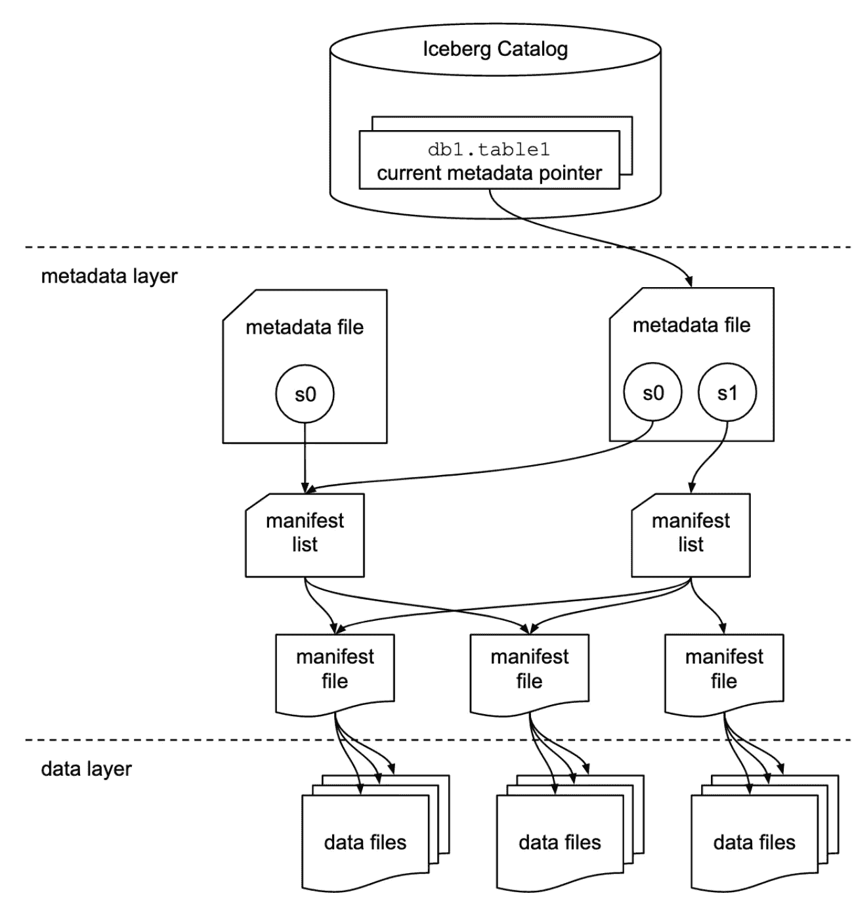

# S3 数据湖上的行级事务

> 原文：<https://blog.devgenius.io/row-level-transactions-on-s3-data-lake-c6e44ecf85e8?source=collection_archive---------4----------------------->

在基于不可变对象存储的数据湖中，行级操作总是很棘手。为了克服这个问题，我们编写了 ETL，以便在每次检测到更新或删除时覆盖整个分区甚至整个表。但是现在冰山表的行级操作变得更加容易，因为 Athena 对冰山的支持增加了很多。我们将讨论同样的例子和一些可能发生的常见错误。

# 冰山—数据湖的表格格式

在像 MySQL 这样的 RDBMS 中，与底层数据的所有交互，比如读写，都是由数据库的存储引擎处理的。类似地，像 Iceberg 这样的表格式的主要目标是向人和工具提供表的抽象，并允许他们有效地与表的底层数据进行交互。冰山做到这一点的帮助下，额外的元数据层上的实际数据文件的 S3。你可以在这篇[详细而简单的文章](https://www.dremio.com/resources/guides/apache-iceberg-an-architectural-look-under-the-covers/)中阅读更多冰山架构



图片来自 Dremio 博客

# 雅典娜和冰山

Athena 支持 Iceberg table 已经有一段时间了——但是非常有限。现在有了引擎 v3，新的版本最近来了，冰山支持加强:

*   **ORC 和 Avro 支持** —使用 [Apache Avro](https://avro.apache.org/) 和 [Apache ORC](https://orc.apache.org/) 基于行和列的文件格式创建 Iceberg 表。对这些格式的支持是对现有拼花支持的补充。
*   **合并到** —使用`MERGE INTO`命令有效合并大规模数据。`MERGE INTO`将`INSERT`、`UPDATE`和`DELETE`操作组合成一个事务。这减少了数据管道中的处理开销，并且需要编写更少的 SQL。更多信息参见[更新冰山表数据](https://docs.aws.amazon.com/athena/latest/ug/querying-iceberg-updating-iceberg-table-data.html)和[合并到](https://docs.aws.amazon.com/athena/latest/ug/merge-into-statement.html)。
*   **CTAS 和视图支持** —在冰山表中使用`CREATE TABLE AS SELECT` (CTAS)和`CREATE VIEW`语句。更多信息，参见[创建表格为](https://docs.aws.amazon.com/athena/latest/ug/create-table-as.html)和[创建视图](https://docs.aws.amazon.com/athena/latest/ug/create-view.html)。
*   **真空支持** —您可以使用`VACUUM`语句通过删除不再需要的快照和数据来优化您的数据湖。您可以使用此功能来提高读取性能，并满足监管要求，如 GDPR 。更多信息，参见[优化冰山表](https://docs.aws.amazon.com/athena/latest/ug/querying-iceberg-data-optimization.html)和[真空](https://docs.aws.amazon.com/athena/latest/ug/vacuum-statement.html)。

## 使用 CTAS 创建冰山表

CTAS 可以用来从一个正常的雅典娜表创建一个冰山表:

```
CREATE TABLE icb_test.icb_bucket_initial
WITH (table_type = 'ICEBERG',
      format = 'PARQUET', 
      location = 's3://athena-icb-bucket-test/icb_test/icb_bucket_1/', 
      is_external = false,
      vacuum_min_snapshots_to_keep = 10
   ) 
AS SELECT device_id,
truck_id,
order_uuid,
ticket_number
from athena_normal_tables.ticket
where year = '2022' and month='11' and day='10' and hour = '11';
```

现在，如果在源表中有一个`timestamp`列，可能会得到一个错误*NOT _ SUPPORTED:Iceberg 不支持时间戳精度(3)。请改用“时间戳(6)”。*转换如下所示的时间戳列类型来解决这个问题:

```
CREATE TABLE icb_test.icb_bucket_timestamp
WITH (table_type = 'ICEBERG',
      format = 'PARQUET', 
      location = 's3://athena-icb-bucket-test/icb_test/icb_bucket_1/', 
      is_external = false,
      vacuum_min_snapshots_to_keep = 10
   ) 
AS SELECT device_id,
truck_id,
order_uuid,
ticket_number,
cast(ingestion_timestamp_utc as timestamp(6)) as ingestion_timestamp_utc -- Typecasting
from athena_normal_tables.ticket
where year = '2022' and month='11' and day='10' and hour = '11';
```

使用`WITH NO DATA`创建没有数据的表格:

```
CREATE TABLE icb_test.icb_bucket_with_no_data
WITH (table_type = 'ICEBERG',
      format = 'PARQUET', 
      location = 's3://athena-icb-bucket-test/icb_test/icb_bucket_1/', 
      is_external = false,
      vacuum_min_snapshots_to_keep = 10
   ) 
AS SELECT device_id,
truck_id,
order_uuid,
ticket_number,
cast(ingestion_timestamp_utc as timestamp(6)) as ingestion_timestamp_utc -- Typecasting
from athena_normal_tables.ticket
WITH NO DATA
```

# 冰山表上的行级操作

现在让我们讨论如何从 Iceberg 表中插入/更新/删除行

## 插入

一旦创建了 Iceberg 表，您就可以使用`INSERT INTO`或`MERGE`语句从普通的 Athena 表中插入数据

```
INSERT INTO iceberg_table (col1, col2, ...) VALUES (val1, val2, ...)
INSERT INTO iceberg_table SELECT * FROM another_normal_table

-- Eg:
INSERT INTO icb_test.icb_test.icb_bucket_with_no_data
SELECT device_id,
truck_id,
order_uuid,
ticket_number,
ingestion_timestamp_utc
from athena_normal_tables.ticket
-- Note that there is no typecasting of timestamp column is 
-- needed while insrerting the data
```

现在我们也使用`MERGE`语句来插入数据。我们将在后面详细讨论完整的`MERGE`命令。

```
-- Insert the records which are not present in account and present in 
-- monthly_accounts_update
-- Here monthly_accounts_update can be a normal Athena table or Icb table but account must bean Iceberg table
MERGE INTO accounts t USING monthly_accounts_update s
    ON (t.customer = s.customer)
    WHEN NOT MATCHED
        THEN INSERT (customer, purchases, address)
              VALUES(s.customer, s.purchases, s.address)
```

使用`MERGE`时，需要注意的是，当单个目标表行匹配多个源行时会出现错误。因此，请确保您在这里有一对一的加入。如果源表有重复项，您可以使用重复数据删除，如下所示

```
MERGE INTO accounts t USING 
( with rw as(select *,row_number() over(partition by customer,purchases,address) rn 
from monthly_accounts_update)
select customer,purchases,address from rw where rn = 1) as s
    ON (t.customer = s.customer)
    WHEN NOT MATCHED
        THEN INSERT (customer, purchases, address)
              VALUES(s.customer, s.purchases, s.address)
```

## 删除

有`DELETE`命令，但它非常有限，不能用于连接或嵌套其他表。只能与如下静态值一起使用

```
DELETE FROM iceberg_table WHERE category='c3'
```

要在查看其他表的基础上正确删除行，可以使用`MERGE`

```
-- deletes all customers from table accounts that are in the source table monthly_accounts_update.
-- also,monthly_accounts_update can be a normal Athena table or Icb table but account must bean Iceberg table
MERGE INTO accounts t USING monthly_accounts_update s
ON t.customer = s.customer
WHEN MATCHED
THEN DELETE
```

## 更新

就像 delete 一样，只有非常有限的`UPDATE`语句只能用于静态值

```
UPDATE iceberg_table SET category='c4' WHERE category='c1'
```

我们又有了更多用例的`MERGE`。我们上面讨论的插入/删除的所有条件在这里都适用。

```
MERGE INTO accounts t USING monthly_accounts_update s
    ON (t.customer = s.customer)
    WHEN MATCHED
        THEN UPDATE
            SET purchases = s.purchases + t.purchases, address = s.address
```

# Merge 语句

正如我们看到的，上面的`MERGE`是一个强大的命令，可以有条件地更新、删除或插入冰山表中的行。

命令结构如下:

```
MERGE INTO target_table as target_alias 
USING { source_table or query } as source_alias 
ON {join condition to join s and t}
WHEN MATCHED [ AND condition ] 
    THEN DELETE / UPDATE
WHEN NOT MATCHED [ AND condition ]
    THEN INSERT 
```

*   `MERGE`支持任意数量的具有不同`MATCHED`条件的`WHEN`子句。条件子句执行由`MATCHED`状态和匹配条件选择的第一个`WHEN`子句中的`DELETE`、`UPDATE`或`INSERT`操作。
*   如果源行与任何`WHEN`子句都不匹配，并且没有`WHEN NOT MATCHED`子句，则源行被忽略。

下面是一个完整的例子:

```
MERGE INTO accounts t USING monthly_accounts_update s
    ON (t.customer = s.customer)
-- deletes any matching target row for which the source address is Centreville.
    WHEN MATCHED AND s.address = 'Centreville'
        THEN DELETE
    WHEN MATCHED
        THEN UPDATE
            SET purchases = s.purchases + t.purchases, address = s.address
    WHEN NOT MATCHED
        THEN INSERT (customer, purchases, address)
              VALUES(s.customer, s.purchases, s.address)
```

# 结论

数据团队使用昂贵的仓库解决方案的主要原因之一是行级事务。随着像 Iceberg 这样的表格式的出现，开放式数据湖的能力大大增强，现在我们可以重新考虑数据堆栈，使其更具成本效益。