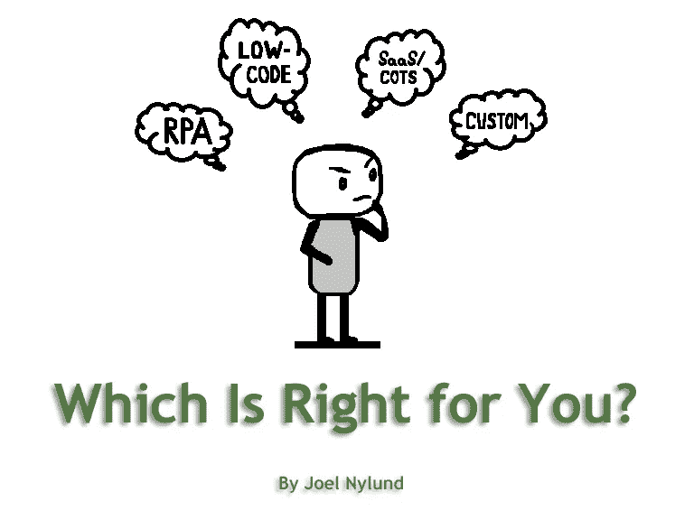
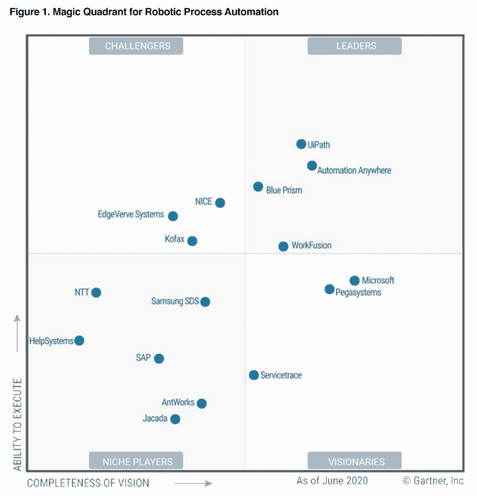
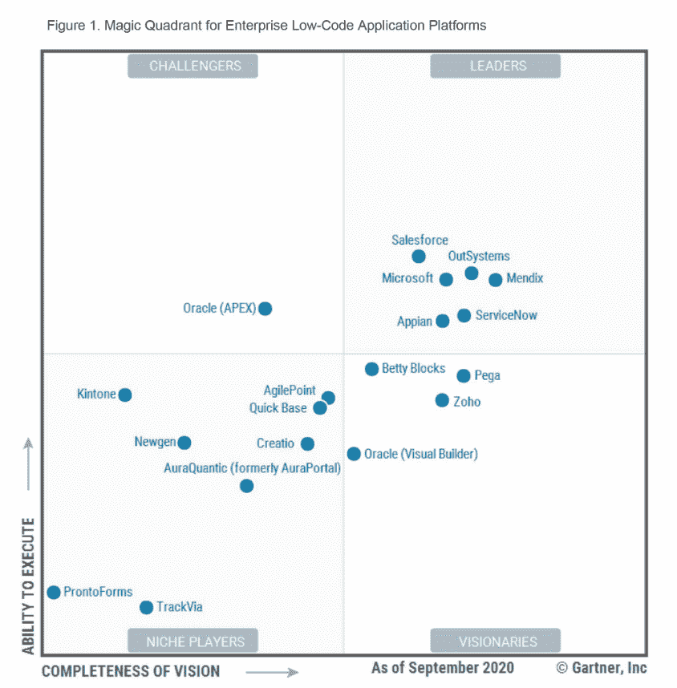
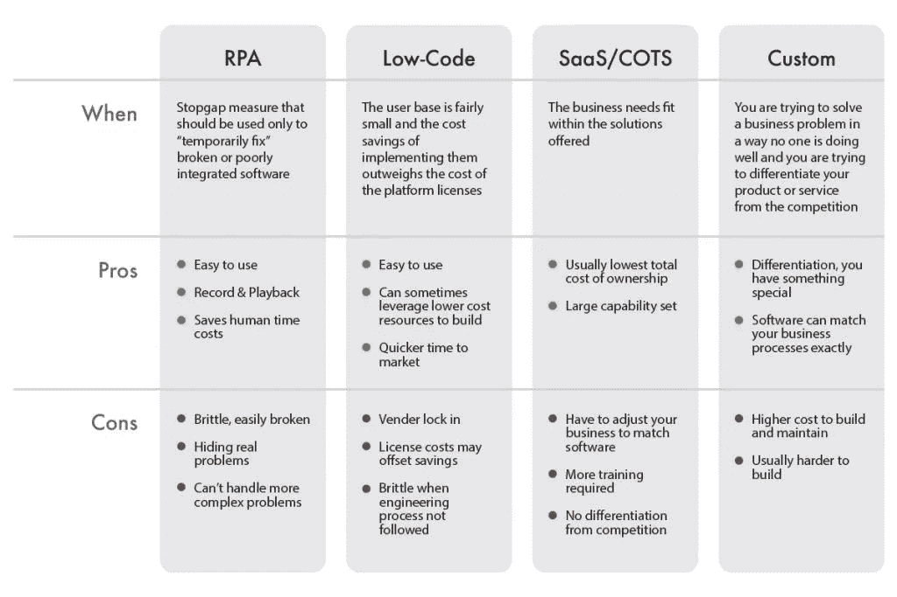

# RPA、低代码、SaaS/COTS、自定义—哪一种适合您？

> 原文：<https://blog.devgenius.io/rpa-low-code-saas-cots-custom-which-is-right-for-you-9f436c1f687?source=collection_archive---------7----------------------->

那是 1994 年。我全职做软件工程师，兼职去研究生院攻读硕士学位。我的一位教授告诉我们，在未来五年内，我们将不再用代码编写软件。第四代语言(4GL)将使它成为可能，因此任何人都可以构建软件，可视化拖放工具将让我们构建任何东西。一晃 26 年过去了，我们仍在编写代码。甚至在 2020 年[最近的文章预测定制软件开发的终结](https://www.inc.com/soren-kaplan/why-no-code-low-code-software-is-industry-disruptor-you-should-pay-attention-to.html)。很快，机器人将使用 [GPT-3](https://towardsdatascience.com/will-gpt-3-kill-coding-630e4518c04d) 为我们编写代码。

解决您的业务问题的软件选项的当前状态非常复杂，并且经常会变得令人不知所措。您阅读了关于机器人流程自动化(RPA)拯救世界、低代码/无代码解决方案节省 80%成本、软件即服务(SaaS)解决方案(如 Salesforce、ServiceNow 等)解决您所有问题的文章。如果这些都不适合你呢？什么时候是时候构建自己的软件了？

在我 25 年以上的软件建设生涯中，我见过很多很多疯狂的事情。我曾见过一家企业使用 Excel 电子表格运行 1 亿多美元的投资服务。我见过一个域名服务器(DNS)被用作关系数据库。对于如何用技术解决商业问题，似乎每个人都有自己的想法。

所有这些选择的现实是，没有银弹，但每一个都可以而且应该在正确的情况下使用。

"*最能解决您的业务问题的工具/平台方法的类型取决于您的情况。*

下面是我的“Joel”对每种工具的总结，以及我认为你应该考虑什么时候使用它们。

**机器人流程自动化(RPA)** —是业务流程自动化的一种形式，基于“软件机器人”的使用 RPA 通常使用录制/回放类型的屏幕抓取来自动执行用户的重复性任务。我将 RPA 视为**一种权宜之计，应该仅用于“暂时修复”损坏或集成不良的软件**。屏幕抓取并不是一个好的长期解决方案，而且随着底层软件的变化，它会变得脆弱。可悲的是，对于一些面临巨大集成问题的公司和政府来说，RPA 可能是一种生活方式。对于其他人，我们应该考虑用适当集成的软件来替代 RPA 流程。根据 Gartner 2020 的报告，UiPath 和 Automation Anywhere 是两个最有竞争力的公司。

**无代码/低代码** —软件平台依靠图形用户界面(GUI)来构建解决业务问题的应用程序。这里的想法是通过不为每个项目“重新发明轮子”来节省资金、缩短上市时间和提高质量。通常你可以使用较少的技术资源来构建这些系统，一个高价的软件工程师可以被一个业务分析师取代。

对于这些平台中的许多平台来说，当 GUI 不能实现某些功能时，它们可以使用脚本或编程语言。我们 Solution Street 已经使用 Salesforce 的平台建立了一个完整的招聘管理系统(RMS ),以及资产管理和人力资源管理。

低代码/无代码平台的缺点是它们将您锁定在该供应商的专有方法和语言中。如果 Salesforce 决定将他们的许可证成本提高 10 倍，我们将不得不在另一个平台上重新实施我们构建的一切。对我们来说，这将是*非常昂贵和耗时的。它们还允许您轻松快速地直接对生产系统进行更改。这是危险的，会导致严重的问题和系统崩溃。我们看到越来越多的客户构建复杂的低代码应用程序，这些程序经常在生产中中断，因为没有遵循“工程过程”。我们在[解决方案街](https://www.solutionstreet.com/)始终遵循工程流程，即使是在使用低代码平台时，我们记录需求，在测试“沙箱”中实现它们，然后仅在回归测试完成时将它们推广到生产中。*

低代码平台的另一个缺点是，除了构建平台的开发成本之外，您还需要支付额外的成本来使用平台。**当用户群相当小，并且实现它们的成本节约超过平台许可的成本时，应该使用低代码平台**。根据 Gartner 的调查，Salesforce 和 OutSystems 是 2020 年最有竞争力的两家供应商。

**软件即服务，商业现成解决方案(SaaS/COTS)** —是商业化生产并解决业务问题的应用程序和/或平台。其中一些允许通过低代码解决方案(如 Salesforce)进行定制，但其他一些只允许通过软件配置进行少量定制。一些 SaaS/COTS 解决方案可以是免费或开源的，而其他的可能要花费数百万美元。**对于试图解决业务问题的公司来说，当他们的业务需求符合所提供的解决方案时，SaaS/COTS 选项几乎总是最佳/最低的成本**。最大的 SaaS 解决方案是在客户关系管理(CRM)和企业资源规划(ERP)领域，但正如他们所说，如果你在寻找什么，最有可能有一个“应用程序”。

定制软件开发(Custom Software Development)—设计软件应用程序，以特定的方式为特定的用户群解决特定的业务问题。定制软件开发历史上一直非常昂贵，但近年来，更便宜的云计算以及开源框架和工具大大降低了创建“自己的”软件的成本。一个 20 年前需要花费数百万美元来构建和托管的应用程序现在可以在几周内完成，每月只需几美元。我们有几个客户在 Heroku 上以每月 9 美元的价格运行复杂的应用程序。Solution Street 的主要服务是为我们的客户构建定制软件。现代框架为你做了这么多工作，在低级代码和使用这些框架之间有一条非常细微的界限。事实上，大多数时候我们并不是从零开始编码，而是从某种东西开始，这种东西让我们完成了一半以上，编码只是为业务增加了特定的区分因素。尽管定制软件开发是我们的核心业务，但我们的主要目标是帮助我们的客户以尽可能最好的方式解决业务问题，所以我们经常在早期询问，是否有 SaaS/COTS 选项可以解决这个问题？低代码在这里是一个好的选择吗？如果没有，那么除了为他们构建软件之外，我们还向我们的客户提供关于[最佳实践](https://www.solutionstreet.com/blog/what-your-software-development-vendor-isnt-telling-you/#.X3tVEdZ7lA4)的建议。我们的客户提出的一个关键问题/答案是“我如何用定制软件区分我的产品或服务？如果用电子表格或低代码选项可以在几个小时内完成的事情，为什么我的客户会使用我的产品？”定制软件的挑战在于它需要大量成本来保持最新和维护。虽然其他选择也有维护成本，但保持定制软件的安全和最新可能比其他选择成本更高。对我来说，**当你试图解决一个现有的人工或自动化解决方案目前无法解决的业务问题，并且你试图让你的产品或服务在竞争中脱颖而出时，应该使用定制软件。**

总之，最能解决您的业务问题的工具/平台方法的类型取决于您的情况。我所在的公司 [Solution Street](https://www.solutionstreet.com/) ，是为数不多的会免费帮你评估你的情况，并做出最佳推荐的公司，即使这意味着不建东西！每个选项都可能很好，也可能不太适合，这取决于使用案例。下表总结了每个选项，以及何时使用每个选项及其具体优缺点。

[订阅](https://us10.list-manage.com/subscribe?u=6a3b68411070f7dab1adb3a8b&id=f0193ac93e)我们的时事通讯，获取更多类似的精彩文章！