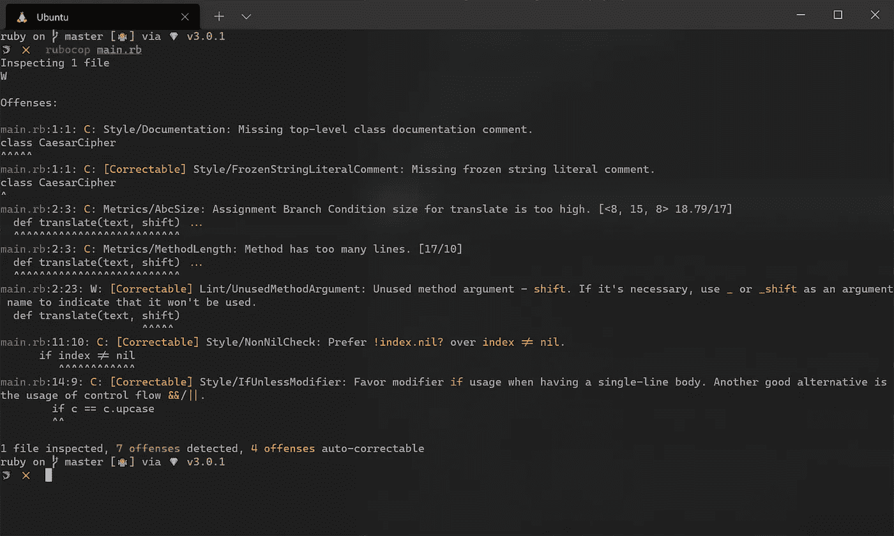
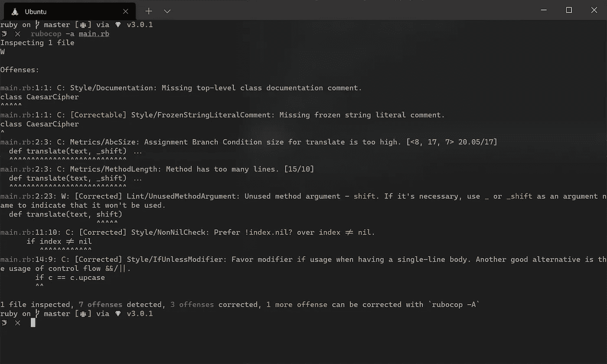
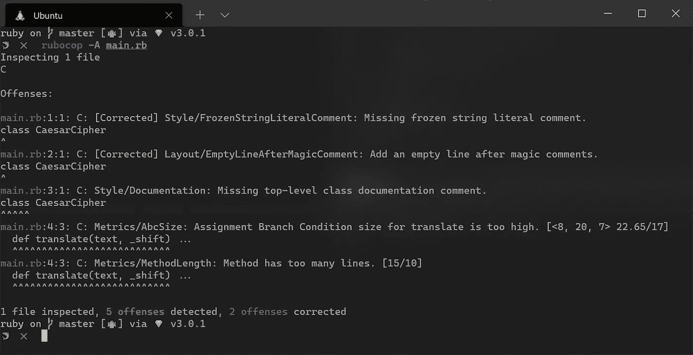

# Ruby 代码林挺和用 RuboCop 自动格式化

> 原文：<https://blog.devgenius.io/ruby-code-linting-and-auto-formatting-with-rubocop-316e9307f129?source=collection_archive---------6----------------------->

林挺是自动检测源代码中的编程和风格错误。一种称为 linter 的静态代码分析工具执行这种检查。另一方面，代码格式化程序是一种与格式化源代码相关的工具，以便它严格遵循一组预先配置的规则。linter 通常会报告违规，但通常由程序员来解决问题，而代码格式化程序将其规则直接应用于源代码，自动纠正格式化错误。

在项目中创建更加一致的代码风格通常需要使用单独的林挺和格式化工具，但是在某些情况下，一个工具可以解决这两个问题。RuboCop，我们将在本文中深入探讨的工具，是后者的一个很好的例子。您将学习如何将它包含在您的 Ruby 项目中，并对其进行配置，以使其输出符合您的期望。

> "代码格式化是关于交流的，而交流是专业开发人员的首要任务."
> 
> —林文治

# 安装 RuboCop

使用 RubyGems 安装 Rubocop 很容易:

```
$ gem install rubocop
```

要检查安装了哪个版本:

```
$ rubocop --version
1.18.3
```

如果您更愿意使用 Bundler，将下面的代码放到您的`*Gemfile*`中，然后运行`*bundle install*`。`*require: false*`部分告诉`*Bundler.require*`不要在你的代码中要求特定的 gem，因为它只会在命令行中使用。

```
gem 'rubocop', require: false
```

检查安装的版本:

```
$ bundle exec rubocop --version
1.18.3
```

# 运行 Rubocop

通过在你的项目中键入`rubocop`，你可以用它的默认设置运行 RuboCop(或者`bundle exec rubocop`，如果和 Bundler 一起安装的话)。如果没有参数传递给该命令，它将检查当前目录和所有子目录中的所有 Ruby 源文件。或者，您可以指定要检查的文件和目录列表。

```
$ bundle exec rubocop
$ bundle exec rubocop src/lib
```

在没有任何配置的情况下，RuboCop 执行了社区驱动的 [Ruby 风格指南](https://medium.com/@ryanneilparker/ruby-style-guide-25069742c0da)中概述的许多准则。运行该命令后，您可能会收到几个错误(违例)。每个报告的违规都包括解决它所需的所有信息，例如违规描述以及发生违规的文件和行号。



您将在报告的底部看到一行，描述了已检查文件的数量、违规总数以及有多少违规可以自动修复。如果您添加了`-a`或`— auto-correct`参数，RuboCop 将试图自动纠正您的源文件中发现的任何错误(那些带有`[Correctable]`前缀的)。

```
$ bundle exec rubocop -a
```



注意现在每个纠正的错误前面都有`[Corrected]`。在报告的底部，还提供了已纠正的违法行为的数量汇总。在前面的例子中，有另一个可纠正的错误没有自动修复，即使在添加了`-a`标志之后。因为一些自动修正可能会稍微改变代码的语义，所以 RuboCop 认为这是不安全的。使用`-A`或`— auto-correct-all`标志也可以自动更正这些错误。

```
$ bundle exec rubocop -A
```



一个好的经验法则是在使用自动更正功能后运行测试套件，以确保代码的行为没有发生意外更改。

# 配置 Rubocop

RuboCop 可以通过在项目的根目录下放置一个`.rubocop.yml`文件来配置。您可以在您的主目录(`~/.rubocop.yml`)或 XDG 配置目录(`~/.config/rubocop/config.yml`)中使用一个全局配置文件，以便对所有项目使用相同的检查。如果在当前或后续父目录中找不到本地范围的项目配置文件，将使用此全局配置文件。

RuboCop 的默认配置存储在它的配置主目录(`/.config/rubocop/default.yml`)中，所有其他的配置文件都继承自它。这意味着在配置项目时，您只需要进行不同于默认设置的更改。这可能意味着启用或禁用特定的检查，或者在接受任何参数的情况下更改它们的行为。

每个单独的检查被 RuboCop 称为一个 cop，每个人负责检测一个特定的违法行为。可用的 COP 分为以下几个部门:

*   [风格副本](https://docs.rubocop.org/rubocop/1.18/cops_style.html)大多基于前面提到的 Ruby 风格指南，它们检查你的代码的一致性。
*   [布局副本](https://docs.rubocop.org/rubocop/1.18/cops_layout.html)识别格式问题，例如使用空白。
*   [Lint cops](https://docs.rubocop.org/rubocop/1.18/cops_lint.html) 检测你代码中的潜在错误，与`ruby -w`相似，但有一系列额外的检查。
*   [度量 cops](https://docs.rubocop.org/rubocop/1.18/cops_metrics.html) 处理源代码度量问题，比如类长度和方法长度。
*   [命名警察](https://docs.rubocop.org/rubocop/1.18/cops_naming.html)对命名惯例感兴趣。
*   安全警察帮助检测潜在的安全问题。
*   [Bundler cops](https://docs.rubocop.org/rubocop/1.18/cops_bundler.html) 检查 Bundler 文件中的不良做法(如`Gemfile`)。
*   [Gemspec cops](https://docs.rubocop.org/rubocop/1.18/cops_gemspec.html) 检查`.gemspec`文件中的不良行为。

RuboCop 还可以用额外的 linters 和 formatters 进行扩展。您可以创建自己的扩展，或者使用与您的项目相关的现有扩展。例如，Rails 扩展可用于实施 Rails 最佳实践和编码约定。

当您第一次创建配置文件时，您会收到大量消息，通知您存在已添加但未配置的新 COP。这是因为 RuboCop 在每个版本中都添加了新的 cops，并且这些都被标记为待定，直到在用户配置中明确启用或禁用。您可以单独启用或禁用邮件中列出的每个 COP，或者使用下面的代码片段来启用所有新的 COP(推荐)。这些消息将被禁止。

```
# .rubocop.yml
AllCops:
  NewCops: enable
```

# 将 RuboCop 集成到现有项目中

大多数 ruby 爱好者没有从头开始开发新项目的奢侈。我们的大部分开发时间都花在遗留代码库上，这可能会产生大量无法立即解决的林挺问题。幸运的是，RuboCop 包含了一个功能，可以生成一个现有罪行的允许列表，可以随着时间的推移逐步解决。这样做的好处是，您可以将林挺添加到现有的项目中，而不会受到堆积如山的无法管理的林挺错误的轰炸，同时还可以在出现任何新的违规时进行标记。

```
$ bundle exec rubocop

614 files inspected, 1248 offenses detected
```

可以使用以下命令创建 allowlist 配置文件:

```
$ bundle exec rubocop --auto-gen-config
Added inheritance from `.rubocop_todo.yml` **in** `.rubocop.yml`.
Created .rubocop_todo.yml.
```

`— auto-gen-config`选项收集所有的违规和计数，并在当前目录中创建一个`.rubocop_todo.yml`文件，该文件忽略当前所有的违规。最后，它导致`.rubocop.yml`从`.rubocop_todo.yml`继承，确保在代码库上运行 RuboCop 不会再次出错。

```
$ bundle exec rubocop
614 files inspected, no offenses detected
```

# 解决现有违规问题

在建立`.rubocop_todo.yml`档案后，不要忽视任何现存的违规行为，并逐一解决它们，这一点至关重要。您可以通过从 cop 的 Exclude 块中删除一个文件，然后修复报告的违规，运行您的测试套件以避免引入错误，并提交。从副本中删除所有文件后，您可以手动从文件中删除副本或重新生成 allowlist 文件。记住尽可能使用`— auto-correct`选项来加快进程。

# 消除林挺误差

尽管 RuboCop 是一个非常棒的工具，但它偶尔会产生误报，或者建议以不利于程序员意图的方式修复代码。发生这种情况时，您可以通过在源代码中添加注释来忽略这种违反。您可以指定应禁用哪些警察或部门，如下所示:

```
# rubocop:disable Layout/LineLength, Style
[..]
# rubocop:enable Layout/LineLength, Style
```

您还可以一次禁用一段代码的所有 COP:

```
# rubocop:disable all
[..]
# rubocop:enable all
```

当您使用行尾注释时，指定的 COP 仅在该行被禁用:

```
**for** x **in** (**0**..**10**) # rubocop:disable Style/For
```

当您在编辑器中键入代码时，可以方便地看到 RuboCop 生成的警告和错误，而不必每次都通过命令行运行检查。幸运的是，RuboCop 集成在大多数流行的代码编辑器和 ide 中都是可用的，主要是通过第三方插件。在 Visual Studio 代码中，您需要做的就是安装这个 [Ruby 扩展](https://marketplace.visualstudio.com/items?itemName=rebornix.Ruby)，并将以下内容添加到您的用户`settings.json`文档中:

```
{
  **"ruby.lint"**: {
    **"rubocop"**: **true**
  }
}
```

# 结论

林挺和自动格式化代码对于代码库来说有很多优势，特别是在开发团队的环境中。即使你不喜欢被告知如何格式化你的代码，记住林挺不仅仅是你的。这也是为了与您合作的其他人，以便每个人都遵循相同的约定，避免在同一个项目中处理多种编码风格的缺点。

同样重要的是，不要把 linter 的输出当成真理，所以要在不偏离你的主要目标的情况下，以一种给你最大好处的方式来配置它。以 RuboCop 丰富的配置选项，这应该不是问题。