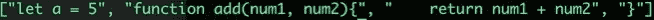

# Ruby:如何制作一个 Transpiler

> 原文：<https://blog.devgenius.io/ruby-how-to-make-a-transpiler-1d6a47dcab4d?source=collection_archive---------5----------------------->

介绍性的故事。

本文的目的是用简单的术语解释 transpiler 是什么以及如何开始。我的目标受众是不知道这是什么的初级或中级程序员。

到本文结束时，您将知道从哪里开始开发自己的 transpilers 或编译器。除雾！

# 这是一个源到源的翻译器。

编译器获取一些源代码，并将其编译成某种低级语言。这种低级语言可能是源代码，也可能是比源代码更低级的东西。例如，C++向下编译成字节码。一些程序员可以乱搞字节码。大多数不能或不会。Typescript 编译成 Javascript，因为 Typescript 是 Javascript 的超集。

transpiler 非常类似，除了它将源代码转换成其他一些源代码。一般来说，这种翻译是人类可读代码之间的相互转换。

人们很容易把这些事情混淆起来，在某些情况下，两者之间的界限会非常模糊。有时程序的需求非常复杂，以至于对于一个程序是移植程序还是编译程序存在争议。

有一些编译工具可以转换代码，也可以编译代码。很乱。

为简单起见，只需将 transpiler 视为源代码到源代码的翻译器。

# 为什么我们需要运输工具？

想象一下，你正在做一个项目，你需要把所有的 JS 文件转换成 ruby 文件，或者把 ruby 文件转换成 GO 文件，或者把 html 文件转换成 erb 文件。原因有很多，但最常见的是，它对于向需要一点更新，甚至可能需要完全重构或迁移的旧项目交付更新非常有用。

在实际工作中，对翻译的需求极为普遍。

过去，Javascript 的创造者在各种语言更新中使用了 transpiler，这是出了名的。

# 怎么才能做到呢？

每个源代码文件都是一个文本文件。很多年前，你的源代码可能是这样的 txt 文件。

在过去的几十年里，我们添加了各种各样的环保小玩意、简易爆炸装置和花哨的文本编辑器。那时候，在你编码的时候没有任何东西可以帮助你。你必须在没有任何警告的情况下编写一些东西，试着编译它，希望你的程序能正常运行。

编译器会把你的文件作为一个数组或者一个巨大的字符串来读取，并尝试编译它。这仍然是今天大多数编译器和传输器的工作方式。

为了制作一个 transpiler，我们只需要读取一个文件，写入另一个文件，并在这个过程中应用一些逻辑来保持语法的正确性。

## 让我们用 ruby 来做一个 ruby 到 javascript 的 transpiler。

下面是一个简单的 Javascript 程序，它将两个数字相加。

将这个文件和一个 ruby 文件放在同一个存储库中，并使用内置的 ruby 方法打开和读取您的 Javascript 文件。

这将把 javascript 文件的内容放入终端。

这是一个好的开始，但是 puts 方法会自动隐藏 JS 文件中存在的字符。在幕后，我们的 ruby 文件正在读取所有的内容，我们也想看到这些内容。

我们可以通过使用 p 命令来告诉 ruby 停止对我们隐藏细节。

我们走吧。js 文件的内容是一个大的 ole 字符串。我们可以清理我们的数据，并通过一些字符串操作使其更易于管理。

现在我们已经将 JS 文件逐行分离，并删除了空行。

幸运的是，Ruby 是一种语法上非常礼貌的语言，所以这个特殊的 transpiler 并不复杂。我们要做的就是删除不必要的 javascript 关键字，添加一些 ruby 关键字

我们不需要“let”关键字，不需要花括号，甚至不需要“return”关键字。我们将遍历数据，用有效的 ruby 语法替换所有的 javascript 语法。

## 这是指出这个 transpiler 速度不快或效率不高的好时机。把这当成一个开始的地方。

如果你不熟悉 gsub！法才知道“！”告诉 ruby 就地改变字符串，gsub 方法遍历字符串并用第二个参数替换第一个参数。

现在，我将为每一行插入新的行字符，并将数组连接回一个字符串。

现在我们有了它，一个有效的字符串形式的 ruby 文件，从我们的 javascript 文件自动转换而来。

# 最后一步，把这个写到 ruby 文件中。

因为我们已经完成了所有的工作，所以编写文件很容易。

这一行告诉 ruby 打开一个名为“output.rb”的新文件，然后将数据写入其中。

这是我们的结果。一个有效的 ruby 文件。

这是一个 transpiler，但是你可能已经猜到了，在这些语言中有很多我们没有考虑到的东西。目前，我的 transpiler 只能处理简单的函数。

只要花一点时间和精力，就可以构建这些概念，最终您可以编写一个适用于大型项目或整个编程语言的 transpiler。

这里有一个完整的要点。

## 直到下一次。

坚强点，我的编码伙伴们。