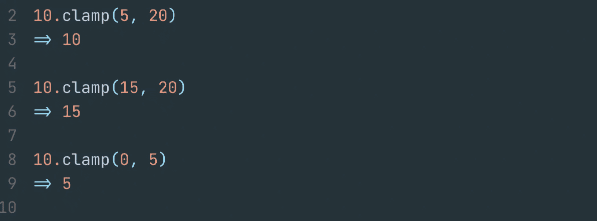
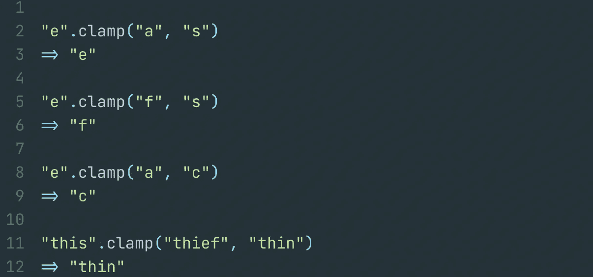
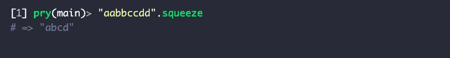
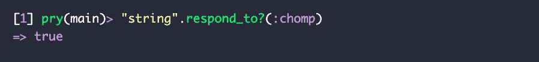
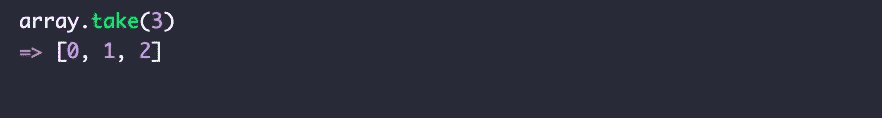
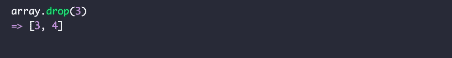

# Ruby 新手？

> 原文：<https://blog.devgenius.io/ruby-newbie-f1eb87795b52?source=collection_archive---------7----------------------->

Ruby 方法&每个新手都需要知道的有趣事实

R *uby* 被誉为让开发者**开心 的编程语言。它像英语一样的语法，易于理解的逻辑，一些行读起来像句子，Ruby 应用程序的代码看起来很清楚，即使对语言或其开发一无所知的人也是如此。**

Ruby 的创造者 Matz Matsumoto 自己说，这种语言是为了减轻程序员的压力而创造的。

> “我相信生活的目的，至少有一部分是为了快乐。基于这种信念，Ruby 被设计成使编程不仅简单而且有趣。它可以让你专注于编程的创造性方面，压力更小。”—***Yukihiro“Matz”松本*** ，*红宝石的创造者*

正如这个博客的标题所说，我是 Ruby 的新手。截至今天，我已经学习这种编程语言整整一周了，我可以诚实地说，它正在慢慢成为我的最爱，或者至少我喜欢和享受学习它，胜过学习 JavaScript 和 React JSX。显然，当你选择一种最喜欢的编程语言或者仅仅是选择哪种语言开始学习如何编码时，有很多要考虑的；语法、需求、社区、你将要构建的项目等等。你会明白，我所列出的远不止这些，但这些是我个人在考虑投入大量时间学习编程语言之前喜欢思考和自问的一些问题。然而在这个特殊的例子中，我的训练营的课程为我选择了，我很高兴他们选择了 Ruby。现在我想我只剩下另一个问题了——我什么时候能开始称自己为 *Rubyist？*

# 关于 Ruby & Matz Matsumoto 的有趣事实

让我们从我最喜欢的一个开始，**m . I . n . a . s . w . a . n .**—Ruby 社区真正以其在社区中的积极支持和紧密联系而闻名*。我们可以把这归咎于它的创造者 Matz Matsumoto。*

据说马茨有着不可否认的令人愉快和友好的举止，这给 Rubyists 社区带来了一个说法**“马茨很好，所以我们也很好”**，后来又被缩写为 **MINASWAN。**

另一个有趣的事实是 Ruby 的新版本每年都会在圣诞节发布。根据 Matz Matsumoto 的说法，这是社区的一个传统…

> “Ruby 原本是我的宠物项目，我的副业项目。所以释放通常发生在我的假期。现在，这是一个传统。这是 ruby-core 送给 ruby 社区的礼物。”

这是我学习 Ruby 比学习 JavaScript 更有趣的另一个原因。在了解了 Ruby 的创造者和他创造这种编程语言背后的推理之后，它让整个事情变得更有趣，因为它是为我们而生的。

# 作为初学者，我的五大 Ruby 方法

来说说目前为止我最喜欢的五个 Ruby 方法吧。
重申我的声明，我对 Ruby 完全陌生，
准确地说是整整一周。所以这些方法就是我所说的“新手方法”或初学者方法，新人在学习如何用 Ruby 编码时必须从这些方法开始。

以下方法*被*列出，因为我不得不在学校实验室使用它们，这意味着我对它们有*需求*。这些方法可能对你没有任何用处，或者它们可能有用，但是你可以参考大量的资源来更好地满足你的需求。
我还会在本页末链接一些权利。
好了，我说的够多了，你懂了。

`clamp` **方法** 该方法以 min 和 max 为两个自变量，定义给定自变量应该箝位的值的范围。

**箝位数字**
`clamp`可用于保持一个数字在 min，max 范围内。

资料来源:BigBinary.com

**夹紧琴弦**
同样，琴弦也可以在一定范围内`clamp`。

资料来源:BigBinary.com

`squeeze` **方法** 这是一个非常简单的方法，对字符串进行操作，本质上是去除重复字符。如果您简单地对一个包含多个相同字符的字符串调用`squeeze`方法，您将得到一个删除了重复字符的字符串:

您还可以在一个参数上传递`squeeze` ——应该被操作的字符串形式的一系列字符。如果您只想删除某些字符的重复项，这很有用。

`respond_to?` **方法** 如果对象响应传递的方法名，则该方法返回 true。

`take` **方法** 该方法返回数组的第一个 **n 个**元素。

`drop` **方法** 该方法返回数组中 **n** 元素之后的元素。

*来源:* [https://www.ruby-lang.org/en/about/](https://www.ruby-lang.org/en/about/)
[https://ruby-doc . org/core-2 . 7 . 0/enumerable . html # method-I-tally](https://ruby-doc.org/core-2.7.0/Enumerable.html#method-i-tally)
[https://www.rubyguides.com/2018/10/method-visibility/](https://www.rubyguides.com/2018/10/method-visibility/)
[https://mixandgo.com/learn/ruby/blocks](https://mixandgo.com/learn/ruby/blocks)
[https://www . bigbinary . com/learn-rubyonrails-book/rails-macros-and-meta programming](https://www.bigbinary.com/learn-rubyonrails-book/rails-macros-and-metaprogramming)
[https://www . honeybadger](https://www.honeybadger.io/blog/how-ruby-ampersand-colon-works/)