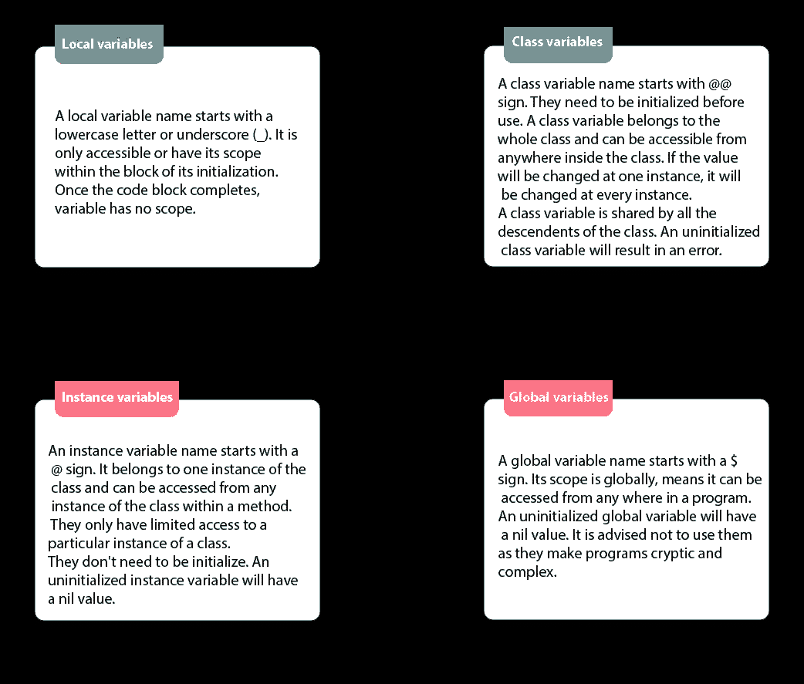

# Ruby:对象生命周期(2)

> 原文：<https://blog.devgenius.io/ruby-object-lifecycle-2-f906844d967b?source=collection_archive---------3----------------------->


[杰森·D](https://unsplash.com/@jasondeblooisphotography?utm_source=medium&utm_medium=referral)在 [Unsplash](https://unsplash.com?utm_source=medium&utm_medium=referral) 上的照片

继续[之前关于 Ruby 中对象生命周期的帖子](https://lendeta.medium.com/ruby-object-lifecycle-1-a29a62615b97)。我将从众多可用的方法中选择一种来讲解变量和对象的基本要点。

# 变量

Ruby 中有四种类型的变量:类、实例、局部和全局变量。为了简化它们之间的区别，我将分享这张图表，因为它帮助我理解了四种不同的类型。



图片来自:[https://www.javatpoint.com/ruby-variables](https://www.javatpoint.com/ruby-variables)

跟踪任何变量的一种方法是将它们的行为存储在一个类变量中。如上所述，类变量可以被类中的所有后代访问和共享，并且在每个实例中都将被更改。它们有时也被称为静态变量或静态方法。实例变量也可以从方法中的类的任何实例访问，但只能有限地访问类的实例。

*注意*当一个类变量或实例变量未初始化时，它将返回一个**错误**或一个**空值**。一定要确保你将在你的类中共享的变量已经初始化了！

# 目标

Ruby 中的一切都是对象。甚至我们分配给一个对象的方法对所有类都是可用的(除非我们明确地告诉 Ruby 它不是)。一个对象甚至可以调用自己。在前一篇文章中，我们创建了一个对象的新实例，并赋予它独特的属性。在特定条件下，您也可以销毁对象的实例。为了证明这一点，让我们举一个例子:

```
class Kirby
attr_accessor :hp :damagedef initialize(hp, damage)
  @hp = hp
  @damage = damage
enddef uses_smash_ultimate
  puts self
 end 
endobject = Kirby.new(HP=100, Damage=10)=> :uses_smash_ultimate
```

在销毁过程中会是什么样子？

```
class Kirby
attr_accessor :hp :damagedef initialize(hp, damage)
  @hp = hp
  @damage = damage
 enddef uses_smash_ultimate
  puts self
 enddef kirby_is_still_alive
  if self.hp > 0
  end 
 enddef ko
  self.destroy
 enddef enemy_defeats_kirby
  hp = 0
 enddef kirby_loses
  if enemy_defeats_kirby
   ko
  else 
   kirby_is_still_alive
  end 
 endend
```

在这个例子中，我们定义了 Kirby 的失败是有条件的。一个实例被摧毁，如果敌人通过留下 0 点生命来击败科比，否则他们仍然活着。

我们可以在 Ruby 中使用的方法之一是"。发送”。与 call 方法的区别在于，它不定义对象，只给它一个消息。然而，Send 确实定义了一个对象，也可以在私有方法中使用。Ruby 使用“.”将参数传递给这些方法变得很方便。发送”。此外，紧接在第一个参数之后发送的参数将成为传递给该方法的参数。

```
class Unlockable
attr_accessor :namedef initialize(unlockable, name)
   @unlockable = unlockable
   @name = name
 enddef completed_challenge(name)
   "New challenger, #{name}!"
 end

 def unlocked(unlocked, argument = nil)
   if unlockable == new_challenger
    @unlockable.send(unlocked)
   else
    unlockable == nil 
   end 
 endend
```

默认情况下，所有方法都是公共的，除非你明确告诉 Ruby 它们是私有的。private 之后的任何实例方法都成为私有方法。但是有了”。send "方法，我们可以访问私有方法。

```
class Unlockableattr_accessor :name
private :namedef initialize(unlockable, name)
   @unlockable = unlockable
   @name = name
 enddef unlocked(unlocked, argument = nil)
   if unlockable == completed_challenge
    @unlockable.send(unlocked)
   else
    unlockable == nil 
   end 
 endprivatedef completed_challenge(name)
   "You got #{name}!"
 endendobject1 = Unlockable.new("Challenger", "Sephiroth")# "You got Sephiroth!"
```

虽然在可以通过“@”访问的私有方法中声明名称可能有些奇怪，但在以后修改它而不必替换类实例会很有用。

希望这能帮助你更多的理解对象和变量。虽然我还没有涵盖大部分内容，但我将在未来继续撰写第 3 部分。度过一个美好的假期周末，继续编码！

_____________________________________________________________

# 社会联系

[LinkedIn](https://www.linkedin.com/in/shirlend)

[GitHub](https://www.github.com/Ro5hi)

[推特](https://www.twitter.com/len_deta)

[Instagram](https://www.instagram.com/_sceptral_)

[YouTube](https://www.youtube.com/channel/UC_0nik4oj1T1Q160XVr0ZlA?view_as=subscriber)