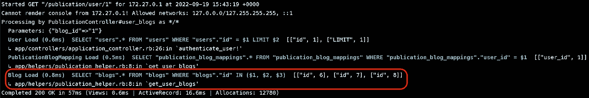
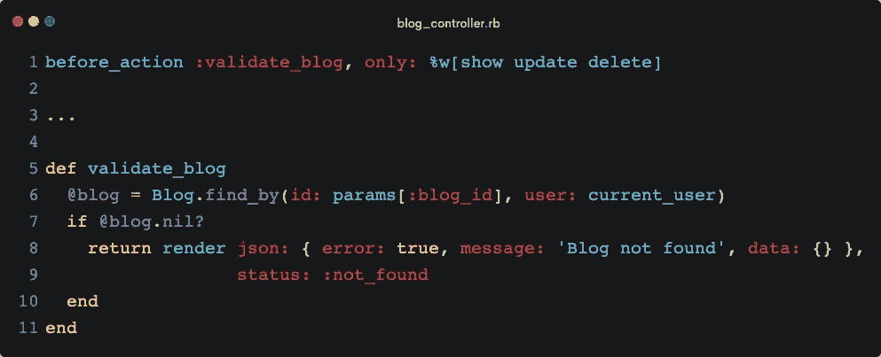

# ruby on Rails——每个开发人员都应该知道的最佳实践

> 原文：<https://blog.devgenius.io/ruby-on-rails-best-practices-every-developer-should-know-ebff44e87da2?source=collection_archive---------0----------------------->


本文用真实的例子解释了使用 Ruby on Rails 开发应用程序时应该遵循的最佳实践！

这些是我们通过阅读这篇文章所要达到的目标，并希望最终作为一名开发人员达到内心平静的最高境界:)

1.  代码可重用性
2.  高速度
3.  表演
4.  可维护性

# 内容

1.  Ruby on Rails 的哲学
2.  胖模特瘦控制器
3.  模块利用率
4.  N+1 查询问题
5.  预加载数据
6.  自定义控制器操作
7.  参数验证
8.  路线约定
9.  必备宝石
10.  结论

# Ruby on Rails 的哲学

在我们进入 Ruby on Rails 的最佳实践之前，我们需要理解它试图暗示给开发者的理念。

## 约定胜于配置

这是在开发 Ruby on Rails 时被牢记的一个设计范例。由于这种理念，应用程序的开发时间大大减少了，因为 Rails 提供了方法、函数、面向对象的原则以及更多现成的东西，这使得使用它的开发人员的生活更加简单。

## 不要重复自己的话

Ruby on Rails 提供了各种特性(其中一些我们将在本文中介绍),使开发人员不必重复代码和重用现有代码，从而减少开发时间，提高可读性，并轻松维护应用程序。

下面是我在解释最佳实践时将参考的 DB 模式。这是一个非常基本的网站实现，允许用户在出版物下写博客和发布博客。


本文遵循的数据库模式

博客表中的`content`是一个`jsonb`格式类型，存储博客的`keywords` & `body`。

让我们跳到使用 Ruby on Rails 创建健壮的、可伸缩的后端应用程序时要遵循的最佳实践！

# 胖模特瘦控制器

在创建新的 API 时，我们总是希望记住的一件主要事情是，API 应该尽可能简单，最简单的 API 不处理任何业务逻辑，只处理请求和响应。实现这一点的一种方法是将一些业务逻辑外包给模型本身，这些逻辑用于业务逻辑。

让我们考虑一下，我们想要获取出现在博客正文中的关键字的**频率。**


获取博客模型中关键词的频率

这是控制器的样子。


获取关键字控制器的频率

获取关键字频率的整个逻辑也可以很容易地写在控制器中，API 响应不会有任何变化。但是如果你仔细想想，这不仅使你的控制器可读性更好，而且这个函数在其他 API 中也很有用，从而使它成为一段潜在的可重用代码！

> 如果您认为一段代码以后可能会被重用，那么将来很可能会是这样。

# 模块利用率

现在，让我们说有不能卸载到模型的需求，然后**模块**是你最好的朋友，为了保持你的控制器干净。

一个例子是，您想要获取特定用户的博客，那么获取用户数据并将其映射到散列的代码可以编写在一个模块中。姑且称之为`BlogHelper`，可以在 Rails 已经提供的`helpers`文件夹下创建。


使用助手功能获取用户博客

这是控制器的样子:


获取用户博客控制器

注意我们的示例 DB 模式中模块和模型的区别？

> 当我们处理一个实体时，我们应该创建一个模型函数，当我们处理 N 个实体时，我们应该创建一个模块函数。

这不是模块函数的唯一用途，它还可以用于创建其他类型的可重用函数。一个例子是，如果您必须进行与时间相关的计算或实现任何自定义算法。

# N+1 查询问题

这是一个非常常见的对象关系映射问题，忽略这个问题很容易，因为 Rails 借助 ActiveRecord & Models 抽象出了数据库查询。

> 当您运行数据库查询来获取父表的 id，并使用这些 id 在子表上逐个进行 N 次查询时，问题就出现了，这就形成了 N+1 查询问题。

这个问题的解决方案是运行恒定数量的查询。

在牢记 DB 模式的同时，我能想到的一个例子是，如果我们想创建一个 API，在数据库中存储 N 个博客。

天真的做法是:


保存博客— N+1 查询问题

第一个查询用于获取使用电子邮件创建博客的用户。接下来的 N 个查询在`blogs.each`循环中执行，其中**博客一次保存一个**。

达到相同结果的更好方法:


批量保存博客— N+1 查询解决方案

第一个查询按原样执行。但是在循环中，我们只创建博客对象并将它们添加到一个数组中。一旦循环完成，我们使用一个查询保存所有的 Blog 对象。总之，这个函数只需要 2 次数据库查询！

`Model.import!`不是 Rails 开箱即用的特性，但是我们可以这样做，因为有一个神奇的 Gem 叫做 [activerecord-import](https://github.com/zdennis/activerecord-import) ！

# 预加载数据

预加载数据意味着从数据库预取数据，以减少后端应用程序的查询次数。

假设我们想要获取某个出版物下的某个用户的博客。


获取用户博客—不预加载数据

第一个查询是获取用户的发布-博客映射。然后，我们遍历该数组，使用`publication.blog`在第 7 行找到博客。这是可能的，因为我们已经创建了一个 ActiveRecord 关联。很棒吧？不完全是。

> 这是 N+1 查询问题的另一种情况。

为了更好地理解这一点，让我们深入一点。

在我的本地数据库中，我已经创建了 3 个 Publication-Blog 映射，一旦我运行了上面的代码，Rails 就会进行 3 次数据库查询，每次获取一个 Blog。


预加载前查询日志

为了解决这个问题，我们不需要做太多。我们只需要改变我们最初的查询。


获取用户博客—预加载数据

`includes`是一种预加载数据的方式，您可以提供相关的模型来获取数据并将其存储在 RAM 中。这是 Rails 服务器日志上的输出:



预加载后查询日志

瞧啊。预加载后，只使用一组 id 进行了一次查询，从数据库中获取所有博客。这就是 Ruby on Rails 的魅力所在，只需做一个简单的改变，我们就能以更好的性能达到同样的效果！

我们可以更进一步。注意另外两个数据库调用`User` & `PublicationBlogMapping`模型？


获取用户博客——急切地加载数据

急切加载基本上试图在一个数据库查询中获取所有内容。


急切加载后查询日志

正如我们所看到的，对整个 API 进行了一次查询。但是我们也可以看到数据库查询是多么的庞大和复杂。这种方法不应该用于所有情况，它只在某些情况下有用，所以要谨慎使用。有时运行 3 个小查询比运行一个复杂的查询更好。在我们的例子中，`includes`方法更好。我们可以通过查看服务器日志中执行的查询来决定是使用`includes`还是`eager_load`。

# 自定义控制器操作

如果我们想用一个或多个 API 来处理数据，我们应该考虑使用定制的控制器动作。

让我们为我们的一个示例模型考虑以下 3 个 API:

1.  通过 ID 获取博客
2.  按 ID 更新博客
3.  按 ID 删除博客

如果你注意到，有一个共同点。**博客 ID** 。

我们首先要做的一件显而易见的事情是，借助 ID 来验证博客是否存在。



自定义控制器操作

是不是很神奇？我们可以使用这个内置的 Rails 特性，在实际的 API 之前执行给定的函数，而不是在每个控制器中添加这 4 行代码。

这不仅使我们的代码可重用，而且如果你注意到的话，它还实现了一种基本形式的**访问控制**。在第 6 行，用户也被添加到数据库查询中，这确保用户只能获得他们写的博客。

# 参数验证

这是一个需要在编写 API 时进行一些初始工作的步骤，但这是一个很好的实践，在以下方面很有用:

1.  帮助其他开发人员在开发过程中不犯错误，不破坏代码。
2.  防止恶意用户发送损坏的数据。

有一个 gem 使我们能够轻松地向我们的路线添加参数验证— [rails-param](https://github.com/nicolasblanco/rails_param) ！

下面是一个示例，说明如果 API 需要这些数据，参数验证会是什么样子:

```
{
  "name": "Blog 1",
  "content": {
    "keywords": ["keyword 1", "keyword 2"],
    "body": "This is dummy text."
  }
}
```


参数验证

# 路线约定

每个人都有自己构造 API 路由、API 函数名和 HTTP 方法的方式。不管你用什么方法，只要确保保持一致。

但是，Rails 向其开发人员暗示了一种常见的方式，记住约定胜于配置！如果我们记住我们的例子，前 5 个 API 是根据 Rails 编写 API 的理想方式。


路线约定

> 获取—索引->获取所有博客
> 
> 发布—创建->创建博客
> 
> GET /:blog_id — show ->按 id 获取博客
> 
> PATCH /:blog_id — update ->按 id 更新博客
> 
> DELETE /:blog_id —删除->按 id 删除博客

以上路线我们甚至不需要写。Ruby on Rails 为我们提供了一种更简单的方法来达到同样的效果！


Rails 隐含的路由约定

`routes.rb`中的`resources`表示前面提到的所有路线。

这些只是惯例，但是请记住，你可以用自己的方式做事。这个想法是，如果每个开发人员都遵循相同的约定，那么代码库就会自动变得更具可读性和可维护性。

# 必备宝石

## 参数验证: [rails-param](https://github.com/nicolasblanco/rails_param)

正如已经讨论过的，这个 Gem 帮助我们轻松地向我们的 API 添加健壮的参数验证。

## 案例转换: [oj](https://github.com/ohler55/oj)

这是一个解决前端和后端开发者之间永无休止的战争的宝石:)通常，前端遵循的用例约定是`camelCase`，后端遵循的用例约定是`snake_case`。

一旦`oj`被配置，它就充当一个拦截器，可以改变**传入请求**中每个键的大小写，也可以改变作为**传出响应**发送的每个键的大小写。

## 实施最佳编码实践: [rubocop](https://github.com/rubocop/rubocop-rails)

顾名思义，Rubocop 是一块宝石，可用于在项目中实施最佳编码实践。它还提供了配置实施和不实施哪些实践的能力。

## 认证:[设计](https://github.com/jinzhu/devise) & [设计-jwt](https://github.com/waiting-for-dev/devise-jwt)

这些宝石帮助我们不必担心处理用户认证、令牌到期逻辑、电子邮件验证等等！

## 调试器:[撬](https://github.com/pry/pry)

伟大的宝石实时调试 API，并找到那些棘手的错误！

## N+1 查询查找器:[项目符号](https://github.com/flyerhzm/bullet)

这是一个在 API 中发现 N+1 个查询并推荐我们如何解决问题的 Gem。

# 结论

归根结底，开发产品时速度是最重要的，可能是任何框架或工具。但与此同时，我们不应该忽视我们编写的代码的质量。我知道在某些情况下，我们不能遵循所有的最佳实践，但是我们应该尝试实现尽可能多的实践，或者至少在解决方案中添加 TODO 语句，以便以后可以解决它。


谢谢你能走到这一步！希望你在读完这篇文章后学到了一些东西。我也希望你尽快找到你的代码库，并尝试实现这些最佳实践，找到内心的平静。

如果您想参考本文中示例所用的代码库，这里有 GitHub 库。

[](https://github.com/interviewstreet/rails-boilerplate-2022) [## GitHub-interview street/rails-样板文件-2022

### 这是一个预配置的 Rails 样板文件，包含截至 9 月的最新 Ruby (v3.1.3)和 Rails(v7.0.2)版本…

github.com](https://github.com/interviewstreet/rails-boilerplate-2022)