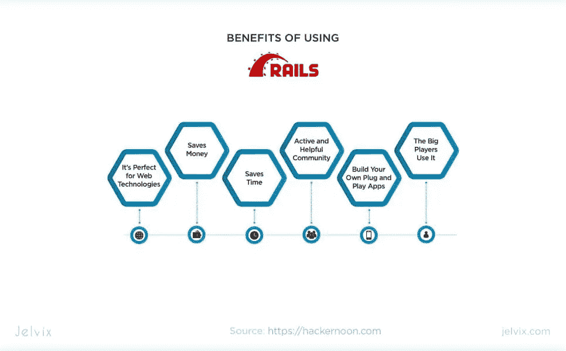
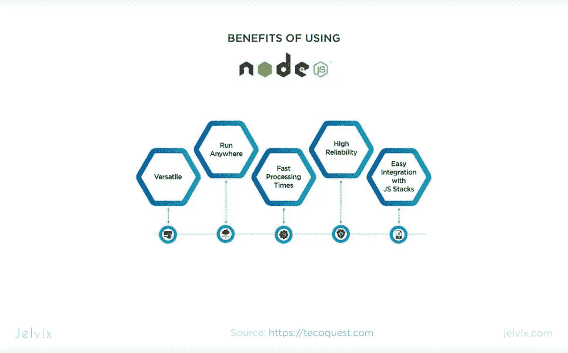
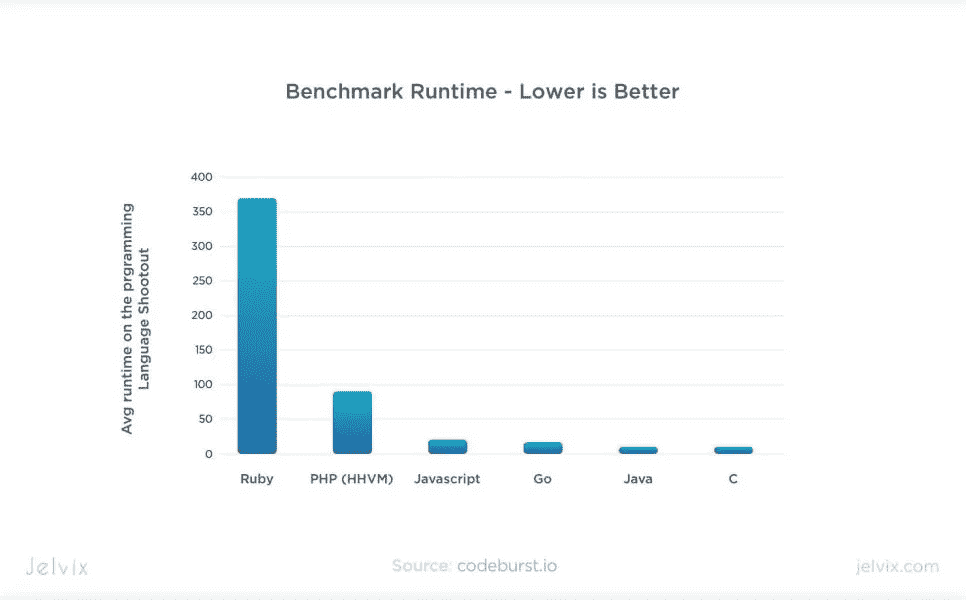
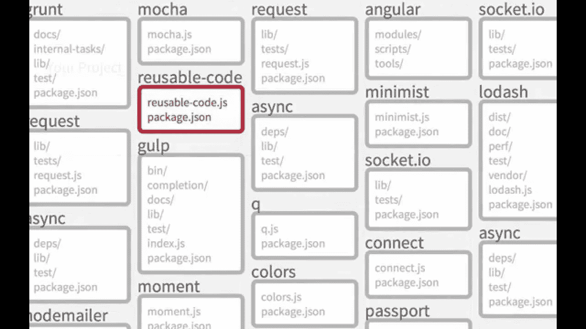
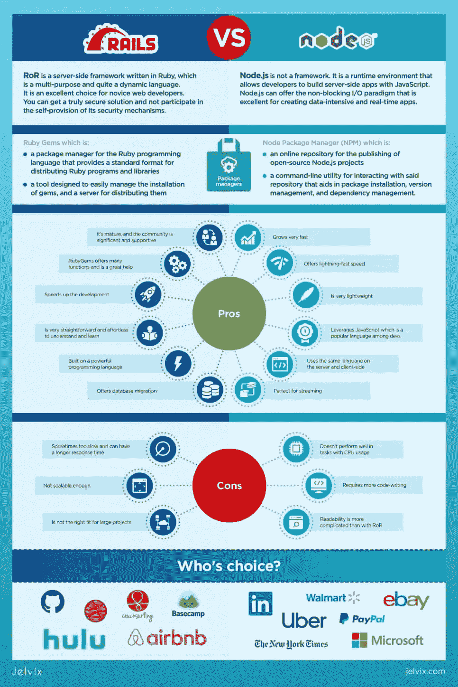

# Ruby on Rails vs Node.js:你的项目应该使用哪一个？

> 原文：<https://blog.devgenius.io/ruby-on-rails-vs-node-js-which-should-you-use-for-your-project-a1c0ffbba75d?source=collection_archive---------2----------------------->

Ruby On Rails 已经存在了十多年了。它是 Twitter、Airbnb 等的首选框架。而现在很多开发者大胆宣称 Ruby 已死，每个人都应该坚持使用 [Node.js](https://en.wikipedia.org/wiki/Node.js) 。坦率地说，并不比 RoR 年轻多少。

同样，它也不是一个框架。它是一种网络服务器技术，与 JavaScript 框架一起使用，如 [Express](https://expressjs.com/) 、 [Meteor、](https://www.meteor.com/)、 [Sails、](https://sailsjs.com/)和数据库，如 [MongoDB](https://www.mongodb.com/) 。然而，LinkedIn、哈比神和 PayPal 等巨头逐渐决定从 RoR 迁移到 Node.js。如果你有兴趣了解更多关于顶级 Node.js 框架的信息，请查看[最佳 Node.js 框架。](https://jelvix.com/blog/best-nodejs-frameworks)

那么，为什么 Ruby on Rails 与 Node.js 的对抗是 web 开发中最受欢迎的话题之一呢？为什么，如果乍一看，这些技术是如此不同？为什么他们会被比较？哪一个是最好的？让我们试着解决这个问题。

# 哪个是正确的解决方案:Ruby on Rails 还是 Node.js？

首先，我们澄清一下，不是说哪个工具更好，哪个更差。Ruby on Rails 和 Node.js 都是最流行的服务器端技术。两者各有利弊。

问题是每种技术都更适合特定的用途。这正是我们追求的目标——比较 Node.js 和 RoR，了解何时选择哪种工具。

因此，为了找出所有的优点和缺点，我们分析了:

*   该技术在过去几年中的普及程度；
*   可扩展性；
*   哪些品牌使用该技术；
*   采用它是多么容易；
*   性能；

记住这些标准，让我们开始 Ruby on Rails 与 Node.js 2020 的比较。

# Ruby On Rails:概述

让我们从 RoR 开始，因为这项技术来得更早。这是一个用 Ruby 编写的服务器端框架，Ruby 是一种多用途且相当动态的语言。当 Ruby on Rails 在 2005 年发布时，它革新了 web 开发过程，提供了一种新的方法。

它引入了一种新的软件设计范式，将约定置于配置之上。而且，这在许多方面减轻了开发人员的工作。例如，现在他们不必再编写样板代码了。因此，开发人员最终可以专注于未来应用程序的功能和逻辑，而不是繁琐的编码。

**今天 Ruby on Rails 的使用者是:**

超过半数的[网站和数百万其他网站](https://trends.builtwith.com/websitelist/Ruby-on-Rails)。所以尽管对这项技术的兴趣，对比 Ruby 和 Node，[降低了](https://trends.google.com/trends/explore?date=all&geo=US&q=%2Fm%2F0505cl)，它仍然非常流行和有用。如果你浏览 Linkedin 或者其他网站上的招聘广告，很明显 RoR 的开发者非常抢手。在 Jelvix，我们经常使用这个框架来指出它的所有优点和缺点。所以让我们从好的方面开始。

# 有哪些优点？

Ruby on Rails 最突出的优势之一是它简单易学。这是一个众所周知的“学生框架”。“如果你上互联网，你可以找到许多成功的故事。人们说，他们只是“早上醒来，决定制作他们的网站/网络应用程序，然后试图学习 RoR，他们做对了。"

这就是自由职业者经常选择 RoR 的原因。如果你仍然不知道在这个框架内你需要做什么，你肯定可以从 RoR 开发者社区得到帮助。这是相当大和有经验的，因为这项技术已经存在了这么长时间。

然而，实践表明，你可以自己解决这个问题。在使用 Ruby on Rails 的过程中，会出现许多典型的和非常特殊的问题。无论你在考虑哪个项目，如果它建立在 RoR 之上，它总是有一个标准的结构和语法。

坚持使用 Ruby on Rails 的另一个原因是它是 web 开发新手的绝佳选择。您可以获得真正安全的解决方案，而不参与其安全机制的自我提供。

例如，RoR 默认使用 XSS 过滤器。此外，还有一个内置的 authenticity _ token 工具，用于抵御 CSRF 攻击。它对于防止 SQL 注入和许多其他有用的事情也很有用。所以说到安全，在 Ruby on Rails vs. Node.js 的战斗中，第一个战士赢了。如果我们讨论 Node.js，你只能依赖于所选框架的安全性。

此外，Ruby on Rails 非常适合在预算紧张和时间紧迫的情况下进行开发。既然社区这么大，很快就能找到一个好的 RoR 开发商。此外，只有懒惰的人才不知道红宝石的存在。

Ruby gems 是免费插件，代码放在 Github 上。宝石唯一的缺点是无法根据任务进行筛选。当然，你可以自己想出在特定的情况下应该选择哪一个。

宝石的名字有点“不言自明”，这很好然而，搜索过程可能相当复杂，因此您也可以查看我们关于 [Ruby gems](https://jelvix.com/blog/best-ruby-gems-in-2018) 的文章。

总的来说，在 Ruby on Rails 上构建应用程序既快速又简单。这项技术非常成熟，这意味着所有可能发生的问题都已经发生并得到解决。此外，有才华的 RoR 开发人员知道如何利用这个框架的所有优势来节省时间，并关注最终产品的质量。

# 缺点是什么？

Ruby on Rails 不太适合没有经验的专家，尤其是如果他们想构建复杂的应用程序。那么这项技术可能会在应用程序的维护、安全性和可靠性方面带来许多困难。如果初学者打算创建博客或简单的 API，RoR 可以是一个很好的工具。

事实上，RoR 并不是新开发人员的合适工具，这并不是这个框架的唯一缺点。它很慢，比 Node.js 慢得多。但是，只有当您处理具有大量流量的大型项目时，这个问题才会变得明显。但是，如果我们不是在谈论一个拥有无限数量用户和请求的巨大应用程序，那么 Ruby on Rails 可能不是真正的恶棍。

服务器架构和数据库也很重要。如果基础设施建设得很好，即使是在 RoR 上编写的大型产品也可以相当快。以 GitHub 的 Airbnb 为例——性能没有问题。

基于 RoR 的应用程序执行不佳的原因是这个框架代替开发者做了很多事情。因此，初学者在创建代码时通常会犯错误。这就是为什么我们之前说过 Ruby on Rails 不是新手专家的最佳选择。如果代码质量低，应用程序的性能就很差。

谈到可伸缩性，RoR 也做得不好。这个框架支持动态 AJAX 接口。这类似于异步代码，也可以通过这种方式在中实现。然而，它远没有 Node.js 灵活。即使我们不应该因为可伸缩性的任何问题而责怪框架，它也不容易伸缩。

最完美的例子就是 Twitter。当然，以这个平台为参照，要考虑它所拥有的巨大流量。在某个时候，Twitter 从 Ruby on Rails 切换到 Scala。也许，这只是点燃了关于 RoR 带来的可扩展性斗争的辩论的事件。

**让我们列出 Ruby on Rails 拥有的扩展选项:**

*   横向可扩展性；
*   代码优化；
*   面向服务的架构。

最后但同样重要的是，RoR 是古老的。当新框架诞生并为开发带来创新时，它们会大放异彩。但是，当兴奋平静下来，以前令人着迷的技术变得平凡而古老。然而，这并不意味着 Ruby on Rails 变得更差。

您应该将成熟视为经验、稳定性和代码的精炼。虽然追逐潮流很有趣，但旧技术往往能够与新技术竞争。由于 Ruby on Rails 仍然被广泛使用，这意味着这个框架可以在竞争中生存下来。

# Node.js:概述

Node.js 发布于 2009 年，比 RoR 晚不了多少。对该工具的兴趣在 2017 年达到顶峰。尽管这一趋势有所下降，但在匹配 Node.js 和 Ruby on Rails 方面，T2 仍然更受欢迎。

**以下是一些使用这项技术的公司:**

*   通过易趣网购买
*   贝宝
*   沃尔玛
*   商务化人际关系网
*   优步
*   微软
*   纽约时报

让我们记住曾经比较 Node.js 和 Ruby on Rails，第一个不是框架。它是一个运行时环境，允许开发者用 JavaScript 构建服务器端应用。尽管许多工程师取笑 JS，并对将 RoR 和 Node.js 放在同一条线上持怀疑态度，但我们将足够大胆地这样做。

根据我们在 Jelvix 的经验，比较 Node.js 和 RoR 是有意义的。此外，我们已经[比较了 RoR 和 Python](https://jelvix.com/blog/red-or-blue-pill-neo-ruby-vs-python-which-will-you-choose-for-your-backend) 。虽然 Ruby on Rails 是一个框架，而且毫无疑问，它有自己的优势，但在很多情况下它会后退。另一方面，Node.js 可以提供非阻塞 I/O 范式，这对于创建数据密集型和实时应用程序来说是非常优秀的。这是 RoR 所不能提供的。所以让我们直接跳到专业。

# Node.js 比 Ruby on Rails 快吗？

Node.js 基于最快的引擎之一 [—谷歌的 V8](https://en.wikipedia.org/wiki/V8_(JavaScript_engine)) 。这一点以及编写高速异步代码的能力被认为是真正的杀手锏。匹配 node . js vs RoR，可以看到第一个技术赢。

是的，RoR 支持动态 AJAX 接口，并允许开发者实现类似于异步代码的东西。但不幸的是，即使这些功能也无法确保 Node.js 的速度(下图证明了这一事实):

此外，据说 Node.js 的性能比“老人”RoR 高 20 倍。因此，在 Node.js 与 Ruby 的性能之战中，第一个取得了胜利。因此，如果你正在创建一些像 YouTube 这样的流媒体服务，请坚持使用 Node.js。此外，它的可伸缩性足以随着你的应用程序的改进而增长。

我们已经讨论过这个框架，RoR 有它的优点。坦白说，他们非常优秀。但是有了 Node.js，web 开发人员获得了更好的能力。这个网络技术有一个非常先进的工具[——NPM](https://www.npmjs.com/)。它是一个包管理器，包括不同的模块，可以解决数百个任务——从最琐碎的任务到特殊的任务。

这些模块经过优化，因此可以轻松与第三方解决方案集成。因此，一旦你学会了这个工具，你就有能力在你所有的网络应用或网站中创建一个框架和独特的功能。因此，使用 NPM 可以立即实现其他可能性。

我们将 Node.js 仅仅定位为一种创建 web 应用程序的技术。虽然它也可以用于移动和桌面开发。在 RoR，你不会有如此多的目标。此外，Node.js 为 API 创建提供了简单易用且灵活的工具。

从我们的经验来看，Express.js、MongoDB 和 Node.js 这三者非常适合这样的目的。因此，在大多数情况下，您为创建新的应用程序界面所做的努力可以在几个小时后产生积极的结果。

比较 Node.js 和 Ruby，我们可以看到第二个工具没有给你这样的灵活性。此外，RoR 的项目要慢得多。最后，这个框架对于创建具有复杂业务逻辑或交互功能的软件来说并不太好。这就是为什么在匹配 Node.js 和 Ruby on Rails 的情况下，我们会选择第一个选项。

**那么采用和学习 Node.js 呢？**你应该意识到这并不简单。所以，当你决定使用它并打算只学习 JavaScript 时，你可能会失望。此外，Node.js 开发人员需要掌握 js 框架，并了解如何在数据库中进行查询。另一方面，这种 web 技术是成为全栈开发人员的良好开端。

但是，如果你已经知道了 JS，学习 Node.js 就是在公园里散步。如果你有一些 C++或 Java 的经验，你会觉得更舒服。

# 缺点是什么？

现在让我们来谈谈 Jelvix 指出的使用 Node.js 的所有缺点。就其 API 而言，它在不断变化，这使得这项技术不太稳定。当然，它可以在未来得到改善。目前，我们不得不忍受这种不便。

如果您正在构建一个 CPU 密集型应用程序，您应该选择 Ruby on Rails，因为 Node.js 不是这里的解决方案。如果您的应用程序必须处理图像或渲染图形，这可能会导致严重的性能问题。这些进程需要多个 CPU。但是因为 Node.js 有单线程的处理机制，它可以给你带来巨大的资源需求。

最后，尽管这项技术已经存在了十年，但与其他技术相比，Node.js 仍然很年轻。虽然它很快赶上了开发社区的需求，但许多细节需要显著的改进。然而，我们认为我们不需要等待太久。这个工具很受开发人员的欢迎，因为它很有未来感，也很有回报。

# 那么 Ruby on Rails 和 Node.js 哪个更好呢？

我们总结一下。谁赢了——Ruby on Rails 还是 Node.js？根据反馈，Node.js 是一项令人难以置信的进步技术，正在不断改进和更新。

对于 it 的基础知识，只需要学习 JavaScript 就可以了。如果你想从事商业项目，准备好掌握更多的材料。但是，结果是值得的，因为现在，这种技术经常被选择用于可伸缩的项目开发。

还有，有 Node.js 的经验意味着有可能获得高薪工作。如今，对 Ruby on Rails 专家的需求远低于 Node.js 开发人员。

另一方面，Ruby on Rails 是一个简单易学的框架。它是小型 It 公司的完美选择，适合前端和后端开发。

为了更容易对 Node.js 和 Ruby on Rails 进行最终比较，我们创建了**一个详细的信息图**:

# 结论

如你所见，这些技术在某种程度上是平等的。因此，我们只能得出一个结论——您在 Node.js 和 Ruby on Rails 之间的选择应该基于您项目的目标和需求。当然，你对这些工具的经验越多，你就能做出更好的决定。

所以如果你想推出自己的项目，最好把它的实现委托给专业人士。特别是，我们的员工时刻准备着新的合作，并乐意讨论您的网站或基于网络的应用程序的细节。我们在等你！

*最初发表于*[T5【https://jelvix.com】](https://jelvix.com/blog/ruby-on-rails-vs-node-js)*。*