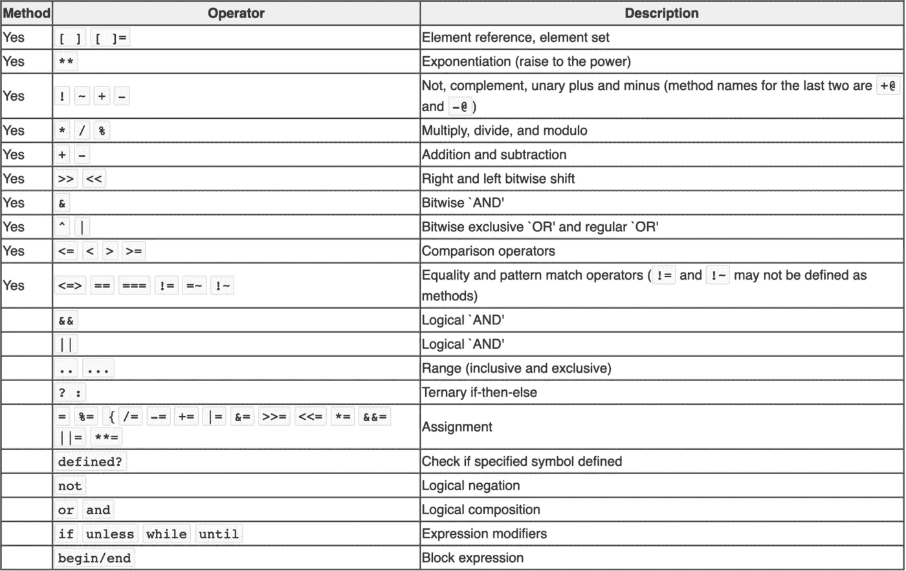

# Ruby 运算符优先级

> 原文：<https://blog.devgenius.io/ruby-operator-precedence-1cb9f9c31835?source=collection_archive---------13----------------------->


照片由 [Gayatri Malhotra](https://unsplash.com/@gmalhotra?utm_source=medium&utm_medium=referral) 在 [Unsplash](https://unsplash.com?utm_source=medium&utm_medium=referral) 上拍摄

在 Ruby 中，表达式的结果由运算符优先级决定。这是一组规则，控制 Ruby 如何决定每个操作符接受哪些操作数。操作数只是运算符使用的值。它们是表达式求值的结果。

> “先看，后想，然后测试。但总是先看到。否则，你只会看到你所期待的。”
> 
> —道格拉斯·亚当斯

# Ruby 优先级示例

当人类评估表达式时，他们通常从左边开始，然后向右移动(这在数学上不正确，但这是大多数人本能的做法)。例如，从左到右，以下表达式得出的结果为 300:

10 + 20 * 10 = 300

这是因为当我们把 10 加到 20 时，我们得到 30，然后乘以 10 得到 300。当您让 Ruby 执行同样的计算时，您会得到非常不同的结果:

```
irb(main):003:0> 10 + 20 * 10
=> 210
```

这是因为运算符优先级。Ruby 有一套规则，告诉它如何计算表达式中的运算符。很明显，Ruby 赋予乘法运算符(*)比加法运算符(+)更高的优先级。

# 覆盖优先级

Ruby 的内置优先级可以通过将表达式的低优先级部分括在括号中来覆盖。举个例子:

```
(10 + 20) * 10
=> 300
```

在前面的示例中，括号中的表达式片段在高优先级乘法之前进行计算。类似于手工做数学时总是先计算括号。

# 先后顺序表

当您需要知道 Ruby 使用的操作符优先级时，请查阅下表。该表按优先级升序列出了所有运算符:



“方法”列中带有“是”的运算符是可以被覆盖的方法。

# 评估顺序

您可能在某处听说或读到过优先级决定表达式求值的顺序。然而，评估过程比简单地决定先评估什么要复杂得多。实际上，优先级只是 Ruby 中的一部分；其他部分是从左到右求值、从右到左求值、短路和三元表达式。其中的每一个都独特地改变了操作的顺序。对确切区别的讨论超出了本文的范围，但是我鼓励您自己去试验这些区别。

一个有趣的消息是，尽管像`do...end`和`{}`这样的块具有最低的优先级，但它们并不等同。`{}`的优先级略高于`do...end`，因此，根据您使用的块类型，您可能会得到不同的结果。

# 结论

理解运算符优先级是编写行为符合预期的代码的关键。如果有疑问，请始终使用括号来覆盖默认优先级。