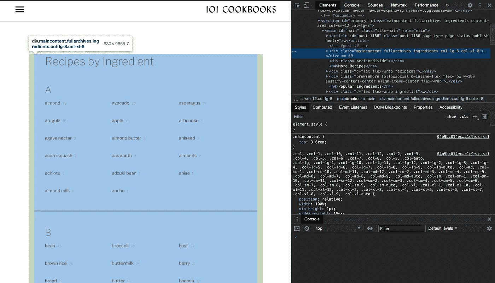
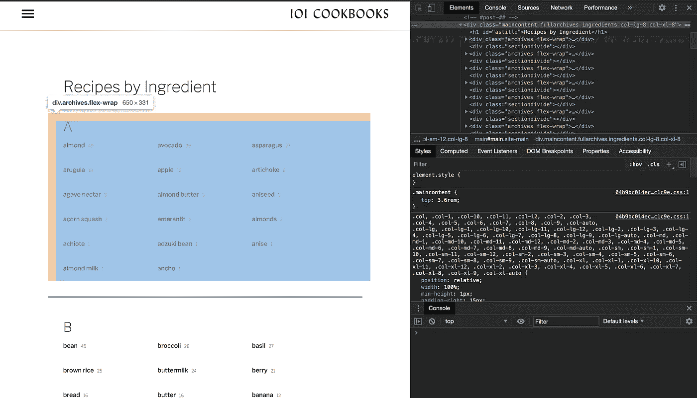
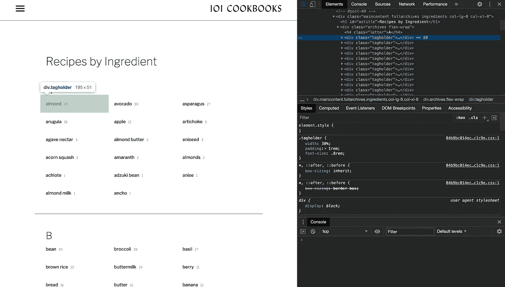
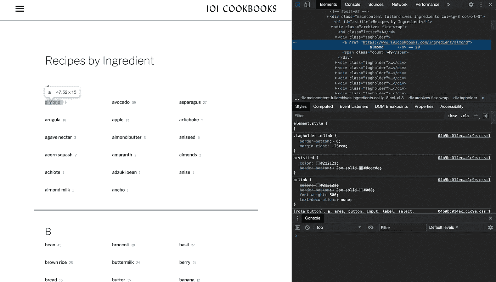

# 使用 Nokogiri 的 Ruby 网页抓取

> 原文：<https://blog.devgenius.io/ruby-web-scraping-using-nokogiri-54a116e64471?source=collection_archive---------3----------------------->

# 概观

Nokogiri 是一个开源的 Ruby 库，用来读取 HTML 和 XML，基本上是用来从网站上读取信息，供你的应用程序使用。


尼图·乔治在 [Unsplash](https://unsplash.com?utm_source=medium&utm_medium=referral) 上的照片

# 装置

要将 Nokogiri 添加到您的应用程序中，您只需运行以下命令

```
gem install nokogiri
```

安装后，确保您需要 nokogiri 和 open-uri。

```
require 'nokogiri' 
require 'open-uri'
```

# 从网站抓取

要从网站上抓取，您需要您想要抓取的页面的 url。然后将 url 传递给 URI.open 方法以获取 HTML。之后，将 HTML 传递给 Nokogiri::HTML 方法，以获得一组可以使用 Nokogiri 解析的节点。

```
url = 'https://www.101cookbooks.com/ingredient.html'
html = URI.open(url)
doc = Nokogiri::HTML(html)
```

# 过程数据

从网站上抓取数据有点复杂。您需要弄清楚您想从 DOM 中读取的数据在哪里。一种方法是检查元素并将鼠标悬停在 HTML 中的元素上。弹出窗口将显示您可以使用的元素的 CSS。



```
content = doc.css("div.maincontent.fullarchives.ingredients.col-lg-8.col-xl-8")
```

在这种情况下，我们希望阅读该网站中的所有成分。所有的成分都按字母顺序分组，但是都包含在一个 div 容器中。所有的元素都在第一个节点中，所以我们使用第一个索引并解析它的子节点。



如果我们检查每组配料，它们都包含在一个 div 中，带有我们可以检查的类“archives”和“flex-wrap”。之后，我们需要看看它的孩子。



配料的文本被包装在一个超链接中，该超链接又被一个带有“tagholder”类的 div 包装。

```
content[0].children.each_with_index do |div, index|
  if(div.attributes["class"] && div.attributes["class"].value == "archives flex-wrap")
    div.children.each do |child|        
      if(child.attributes["class"] && child.attributes["class"].value == "tagholder")          
        child.children.each do |li|            
          if(!li.attributes["class"] && li.children[0])
            ingredient = li.text
            # Remove tabs
            ingredient = ingredient.gsub("\t", "")              
            # Remove end lines
            ingredient = ingredient.gsub("\n", "")
            Ingredient.create(name: ingredient.titleize)            
          end          
        end        
      end      
    end  
  end
end
```

检索配料名称后，它用于创建配料。这可以用于测试数据或初始数据。

# 结论

网络抓取对于读取和处理其他应用程序是有用的，但是缺点是你需要明确你想要读取的数据。这意味着，如果开发人员改变设计，删除东西，甚至移动一些东西，Nokogiri 可能无法正确读取数据。对于需要不断检查数据的应用程序来说，使用 web 抓取可能不是最好的。但是如果你只需要一次数据，那么网络抓取是一个有效的选择。