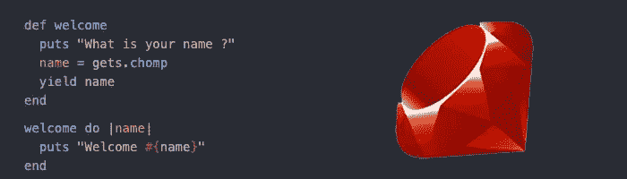

# Ruby —使用块

> 原文：<https://blog.devgenius.io/ruby-working-with-blocks-1640e6861d0c?source=collection_archive---------8----------------------->



**简介**

Ruby 程序员广泛使用块，它们是语言的基础部分。因此，对积木的良好理解将真正帮助你建立一个良好的基础，在此基础上你可以继续学习其他更复杂的概念。

块是组合在一起的一段代码，稍后可以执行这段代码来完成某项任务。块是一段语法，但不是对象。块连接到方法调用。没有方法就不能有块。你会经常看到块和方法一起使用，但是需要注意的是块不是一个参数或者一个变量或者一个方法。可以使用花括号或 do end 关键字来定义块。这两者在优先顺序上有细微的区别。在代码执行期间，大括号具有更高的优先级。不过现在，只要记住这是 Ruby 程序员使用的惯例，多行语句使用 do end 语法，单行语句使用大括号。如果你是一个初学者，你可能会看到块类似于方法。但是你需要明白它们有什么不同。一旦你定义了一个方法，你可以一次又一次的调用它，但是块只能执行一次。此外，与方法不同，块一旦完成执行就不会持久。我们在方法中使用块的原因是，如果你想定制附加在方法上的功能，你可以使用块。当你使用块的时候，这个方法将包含所有通用的并且在块中保持不变的东西，并且将包含独特的或者可定制的动作。

**写一块**

定义一个块有两种方法，一种是用“*花括号*，一种是用“ *do* ”和“end”关键字。让我们看一些例子。

花括号:

```
3.times { puts “This is how you write a block” }
```

带关键字:

```
3.times do
  puts “This is how you write a block”
  puts “This is how you write a block with do and end”
end
```

上面的两个示例代码做同样的事情。打印输出“这是你如何写一个块”3 次。如果你仔细观察，你会发现如果它是一个单独的语句，花括号允许你以简洁易读的形式写一个块。同样，如果块由多个语句组成，那么用 do，end 关键字将它括起来更有意义。

让我们看另一个例子:

让我们用值 7、8 和 9 创建一个数组。然后我们调用这个数组上的每个方法，指定我们想要对这些项目做什么。在这种情况下，我们将打印它们。

```
arr = [7,8,9]
```

花括号:

```
arr.each { |element| puts element }
```

带关键字:

```
arr.each do |element|
  puts element
end
```

**编写块方法**

让我们看看如何利用块来编写我们自己的方法。在这种情况下，block 被认为是我们方法的一个参数。

我们的方法:

```
def my_method
  puts “Inside my method”
end
```

阻止:

```
my_method do
  puts “block as argument”
end
```

当你运行这个代码块的时候，你只能看到我的方法里面的*是 put put。原因是，即使我们传递了 block block 方法，我们也没有指定如何处理它，所以这个方法忽略了它。让我们修改方法来执行代码块。为此，我们将添加一个名为“yield”的关键字。*

我们的方法:

```
def my_method
  puts “Inside my method”
  yield
end
```

阻止:

```
my_method do
  puts “block as argument”
end
```

现在我们的输出看起来像这样:

```
Inside my method
block as argument
```

如果你想在你的方法中多次执行你的代码块，你需要在所有这些地方添加关键字" yield"。

```
def my_method
  yield
  puts “Inside my method”
  yield
endmy_method do
  puts “ — — — — — -”
end
```

现在我们的输出看起来像这样:

```
— — — — — -
Inside my method
— — — — — -
```

**有争论的街区**

块可以像方法一样接受参数。每当我们编写一个带参数的块时，你可以认为参数被传递给了这个块。让我们看一个例子:

```
def welcome
  puts “What is your name ?”
  name = gets.chomp
  yield name
endwelcome do |name|
  puts “Welcome #{name}”
end
```

在这段代码中，方法捕获用户输入并将其分配给 name 变量，然后将其传递给块，并块打印输出。

如果我们运行上面代码，我们会得到这样的结果:(用户输入 John 的名字)

```
**Welcome John**
```

**用调用方法**调用程序块

Yield 不是调用块的唯一方式，块可以接受多个参数。让我们看看谁可以使用 block.call 方法调用一个块。

```
def welcome(question, &my_block)
  puts question
  name = gets.chomp
  my_block.call(name)
endwelcome(“What is your name ?”) do |name|
  puts “Welcome #{name}”
end
```

这类似于前面的块参数示例。这里我们的 greet 方法有两个参数，一个问题和块名 my_block。注意“my_block”前的“&”符号，这就是我们如何通知 ruby 这不是另一个参数，而是一个块。另外，现在我们用 my_block.call 方法替换了“yield”。如果您运行这段代码，您将得到与上面带有参数示例的块相同的结果。

现在您已经知道如何编写 Ruby 块了。因此，开始在您的应用程序中使用它们，看看有什么不同。