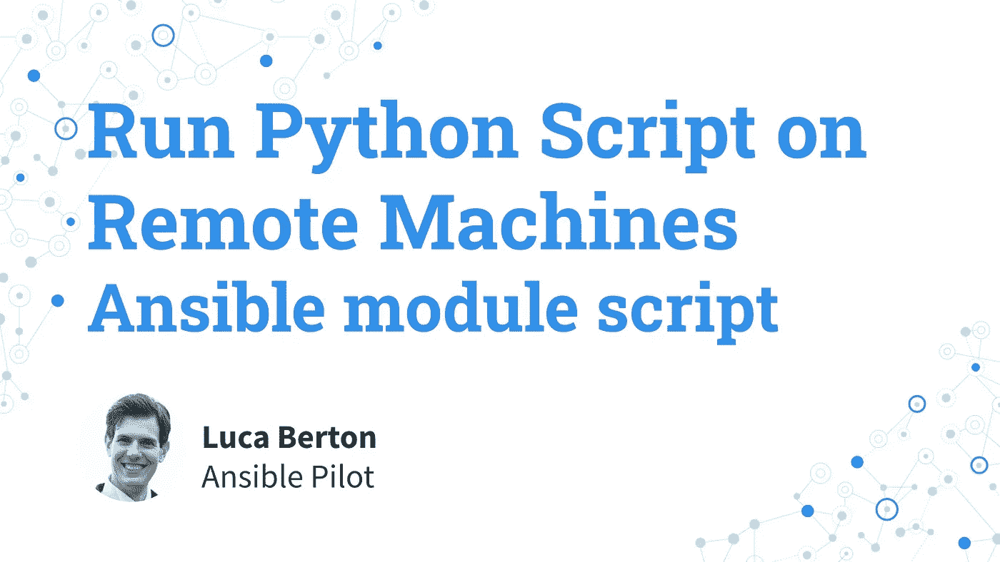

# 在远程机器上运行 Python 脚本— Ansible 模块脚本

> 原文：<https://blog.devgenius.io/run-a-python-script-on-remote-machines-ansible-module-script-2dd0f64fae43?source=collection_archive---------11----------------------->

## 在使用 Ansible Playbook 和脚本模块将“cars.py”自定义 Python 脚本传输并处理为 Ansible JSON 变量之后，如何在远程机器上自动执行该脚本。

# Python 脚本转移后如何在远程机器上运行？

我将向您展示一个带有一些简单的 Ansible 代码的现场演示。我是卢卡·伯尔顿，欢迎来到今天的 Ansible Pilot。

# 在远程机器上运行 Python 脚本

*   `ansible.builtin.script`
*   传输后在远程节点上运行本地脚本

让我们来谈谈可转换模块“脚本”。

全名是“ansible.builtin.script ”,这意味着它是 ansible-core 中包含的 ansible 内置模块的一部分。

该模块的目的是在传输之后在远程节点上运行本地脚本。

# 因素

*   `cmd` *字符串—* 脚本名称或路径
*   `executable` *字符串—* 可执行文件的名称或路径

我来总结一下模块``script`的主要参数。

这个模块没有任何必需的参数，但是在这个用例中，一些选项是必需的。

``cmd`'参数指定脚本名或路径。

``executable`'参数指定解释器名称或路径。

# 链接

*   [https://docs . ansi ble . com/ansi ble/latest/collections/ansi ble/builtin/script _ module . html](https://docs.ansible.com/ansible/latest/collections/ansible/builtin/script_module.html)

# 演示

让我们跳到现实生活中的一个可行的剧本，在传输 Python 脚本之后，在远程机器上运行它。

我将向您展示如何创建一个``cars.py`'定制 Python 脚本，该脚本输出一个 JSON 文件，将其传输到远程机器，并使用``python3`'解释器执行它。

## 密码

*   cars.py

```
#!/usr/bin/env python3import jsoncars = {
    "manufacturers": [
        "Acura", "Alfa-Romeo", "Aston-Martin", "Audi", "Bentley", "BMW",
        "Bugatti", "Buick", "Cadillac", "Chevrolet", "Chrysler", "Citroen",
        "Deus Automobiles", "Dodge", "Ferrari", "Fiat", "Ford", "Geely",
        "Genesis", "GMC", "Honda", "Hyundai", "Infiniti", "Jaguar", "Jeep",
        "Kia", "Koenigsegg", "Lamborghini", "Lancia", "Land Rover", "Lexus",
        "Lincoln", "Lotus", "Maserati", "Maybach", "Mazda", "McLaren", "Mercedes",
        "Mini", "Mitsubishi", "Nissan", "Opel", "Pagani", "Peugeot", "Pontiac",
        "Porsche", "Ram", "Renault", "Rolls-Royce", "Skoda", "Smart", "Subaru",
        "Suzuki", "Tesla", "Toyota", "Volkswagen", "Volvo"
    ]
}print(json.dumps(cars, indent=4))
```

*   run_python_script.yml

```
---
- name: run Python script
  hosts: all
  tasks:
    - name: run cars.py script
      ansible.builtin.script:
        executable: python3
        cmd: cars.py
      register: cars_raw_output - name: print cars_raw_output
      ansible.builtin.debug:
        var: cars_raw_output
        verbosity: 2 - name: convert output to JSON
      ansible.builtin.set_fact:
        cars_list: "{{ cars_raw_output.stdout | from_json }}" - name: print cars_list
      ansible.builtin.debug:
        var: cars_list
```

## 执行

```
ansible-pilot $ ansible-playbook -i ../virtualmachines/demo/inventory run_python_script.ymlPLAY [run Python script] **************************************************************************TASK [Gathering Facts] ****************************************************************************
ok: [demo.example.com]TASK [run cars.py script] *************************************************************************
changed: [demo.example.com]TASK [print cars_raw_output] **********************************************************************
skipping: [demo.example.com]TASK [convert output to JSON] *********************************************************************
ok: [demo.example.com]TASK [print cars_list] ****************************************************************************
ok: [demo.example.com] => {
    "cars_list": {
        "manufacturers": [
            "Acura",
            "Alfa-Romeo",
            "Aston-Martin",
            "Audi",
            "Bentley",
            "BMW",
            "Bugatti",
            "Buick",
            "Cadillac",
            "Chevrolet",
            "Chrysler",
            "Citroen",
            "Deus Automobiles",
            "Dodge",
            "Ferrari",
            "Fiat",
            "Ford",
            "Geely",
            "Genesis",
            "GMC",
            "Honda",
            "Hyundai",
            "Infiniti",
            "Jaguar",
            "Jeep",
            "Kia",
            "Koenigsegg",
            "Lamborghini",
            "Lancia",
            "Land Rover",
            "Lexus",
            "Lincoln",
            "Lotus",
            "Maserati",
            "Maybach",
            "Mazda",
            "McLaren",
            "Mercedes",
            "Mini",
            "Mitsubishi",
            "Nissan",
            "Opel",
            "Pagani",
            "Peugeot",
            "Pontiac",
            "Porsche",
            "Ram",
            "Renault",
            "Rolls-Royce",
            "Skoda",
            "Smart",
            "Subaru",
            "Suzuki",
            "Tesla",
            "Toyota",
            "Volkswagen",
            "Volvo"
        ]
    }
}PLAY RECAP ****************************************************************************************
demo.example.com           : ok=4    changed=1    unreachable=0    failed=0    skipped=1    rescued=0    ignored=0ansible-pilot $
```

## 冗长二执行

```
ansible-pilot $ ansible-playbook -i ../virtualmachines/demo/inventory run_python_script.yml -vv
ansible-playbook [core 2.13.1]
  config file = None
  configured module search path = ['/Users/lberton/.ansible/plugins/modules', '/usr/share/ansible/plugins/modules']
  ansible python module location = /usr/local/Cellar/ansible/6.1.0/libexec/lib/python3.10/site-packages/ansible
  ansible collection location = /Users/lberton/.ansible/collections:/usr/share/ansible/collections
  executable location = /usr/local/bin/ansible-playbook
  python version = 3.10.5 (main, Jun 23 2022, 17:15:32) [Clang 13.0.0 (clang-1300.0.29.30)]
  jinja version = 3.1.2
  libyaml = True
No config file found; using defaults
Skipping callback 'default', as we already have a stdout callback.
Skipping callback 'minimal', as we already have a stdout callback.
Skipping callback 'oneline', as we already have a stdout callback.PLAYBOOK: run_python_script.yml *******************************************************************
1 plays in run_python_script.ymlPLAY [run Python script] **************************************************************************TASK [Gathering Facts] ****************************************************************************
task path: /Users/lberton/prj/github/ansible-pilot/how-to-run-script/run_python_script.yml:2
ok: [demo.example.com]
META: ran handlersTASK [run cars.py script] *************************************************************************
task path: /Users/lberton/prj/github/ansible-pilot/how-to-run-script/run_python_script.yml:5
changed: [demo.example.com] => {"changed": true, "rc": 0, "stderr": "Shared connection to demo.example.com closed.\r\n", "stderr_lines": ["Shared connection to demo.example.com closed."], "stdout": "{\r\n    \"manufacturers\": [\r\n        \"Acura\",\r\n        \"Alfa-Romeo\",\r\n        \"Aston-Martin\",\r\n        \"Audi\",\r\n        \"Bentley\",\r\n        \"BMW\",\r\n        \"Bugatti\",\r\n        \"Buick\",\r\n        \"Cadillac\",\r\n        \"Chevrolet\",\r\n        \"Chrysler\",\r\n        \"Citroen\",\r\n        \"Deus Automobiles\",\r\n        \"Dodge\",\r\n        \"Ferrari\",\r\n        \"Fiat\",\r\n        \"Ford\",\r\n        \"Geely\",\r\n        \"Genesis\",\r\n        \"GMC\",\r\n        \"Honda\",\r\n        \"Hyundai\",\r\n        \"Infiniti\",\r\n        \"Jaguar\",\r\n        \"Jeep\",\r\n        \"Kia\",\r\n        \"Koenigsegg\",\r\n        \"Lamborghini\",\r\n        \"Lancia\",\r\n        \"Land Rover\",\r\n        \"Lexus\",\r\n        \"Lincoln\",\r\n        \"Lotus\",\r\n        \"Maserati\",\r\n        \"Maybach\",\r\n        \"Mazda\",\r\n        \"McLaren\",\r\n        \"Mercedes\",\r\n        \"Mini\",\r\n        \"Mitsubishi\",\r\n        \"Nissan\",\r\n        \"Opel\",\r\n        \"Pagani\",\r\n        \"Peugeot\",\r\n        \"Pontiac\",\r\n        \"Porsche\",\r\n        \"Ram\",\r\n        \"Renault\",\r\n        \"Rolls-Royce\",\r\n        \"Skoda\",\r\n        \"Smart\",\r\n        \"Subaru\",\r\n        \"Suzuki\",\r\n        \"Tesla\",\r\n        \"Toyota\",\r\n        \"Volkswagen\",\r\n        \"Volvo\"\r\n    ]\r\n}\r\n", "stdout_lines": ["{", "    \"manufacturers\": [", "        \"Acura\",", "        \"Alfa-Romeo\",", "        \"Aston-Martin\",", "        \"Audi\",", "        \"Bentley\",", "        \"BMW\",", "        \"Bugatti\",", "        \"Buick\",", "        \"Cadillac\",", "        \"Chevrolet\",", "        \"Chrysler\",", "        \"Citroen\",", "        \"Deus Automobiles\",", "        \"Dodge\",", "        \"Ferrari\",", "        \"Fiat\",", "        \"Ford\",", "        \"Geely\",", "        \"Genesis\",", "        \"GMC\",", "        \"Honda\",", "        \"Hyundai\",", "        \"Infiniti\",", "        \"Jaguar\",", "        \"Jeep\",", "        \"Kia\",", "        \"Koenigsegg\",", "        \"Lamborghini\",", "        \"Lancia\",", "        \"Land Rover\",", "        \"Lexus\",", "        \"Lincoln\",", "        \"Lotus\",", "        \"Maserati\",", "        \"Maybach\",", "        \"Mazda\",", "        \"McLaren\",", "        \"Mercedes\",", "        \"Mini\",", "        \"Mitsubishi\",", "        \"Nissan\",", "        \"Opel\",", "        \"Pagani\",", "        \"Peugeot\",", "        \"Pontiac\",", "        \"Porsche\",", "        \"Ram\",", "        \"Renault\",", "        \"Rolls-Royce\",", "        \"Skoda\",", "        \"Smart\",", "        \"Subaru\",", "        \"Suzuki\",", "        \"Tesla\",", "        \"Toyota\",", "        \"Volkswagen\",", "        \"Volvo\"", "    ]", "}"]}TASK [print cars_raw_output] **********************************************************************
task path: /Users/lberton/prj/github/ansible-pilot/how-to-run-script/run_python_script.yml:11
ok: [demo.example.com] => {
    "cars_raw_output": {
        "changed": true,
        "failed": false,
        "rc": 0,
        "stderr": "Shared connection to demo.example.com closed.\r\n",
        "stderr_lines": [
            "Shared connection to demo.example.com closed."
        ],
        "stdout": "{\r\n    \"manufacturers\": [\r\n        \"Acura\",\r\n        \"Alfa-Romeo\",\r\n        \"Aston-Martin\",\r\n        \"Audi\",\r\n        \"Bentley\",\r\n        \"BMW\",\r\n        \"Bugatti\",\r\n        \"Buick\",\r\n        \"Cadillac\",\r\n        \"Chevrolet\",\r\n        \"Chrysler\",\r\n        \"Citroen\",\r\n        \"Deus Automobiles\",\r\n        \"Dodge\",\r\n        \"Ferrari\",\r\n        \"Fiat\",\r\n        \"Ford\",\r\n        \"Geely\",\r\n        \"Genesis\",\r\n        \"GMC\",\r\n        \"Honda\",\r\n        \"Hyundai\",\r\n        \"Infiniti\",\r\n        \"Jaguar\",\r\n        \"Jeep\",\r\n        \"Kia\",\r\n        \"Koenigsegg\",\r\n        \"Lamborghini\",\r\n        \"Lancia\",\r\n        \"Land Rover\",\r\n        \"Lexus\",\r\n        \"Lincoln\",\r\n        \"Lotus\",\r\n        \"Maserati\",\r\n        \"Maybach\",\r\n        \"Mazda\",\r\n        \"McLaren\",\r\n        \"Mercedes\",\r\n        \"Mini\",\r\n        \"Mitsubishi\",\r\n        \"Nissan\",\r\n        \"Opel\",\r\n        \"Pagani\",\r\n        \"Peugeot\",\r\n        \"Pontiac\",\r\n        \"Porsche\",\r\n        \"Ram\",\r\n        \"Renault\",\r\n        \"Rolls-Royce\",\r\n        \"Skoda\",\r\n        \"Smart\",\r\n        \"Subaru\",\r\n        \"Suzuki\",\r\n        \"Tesla\",\r\n        \"Toyota\",\r\n        \"Volkswagen\",\r\n        \"Volvo\"\r\n    ]\r\n}\r\n",
        "stdout_lines": [
            "{",
            "    \"manufacturers\": [",
            "        \"Acura\",",
            "        \"Alfa-Romeo\",",
            "        \"Aston-Martin\",",
            "        \"Audi\",",
            "        \"Bentley\",",
            "        \"BMW\",",
            "        \"Bugatti\",",
            "        \"Buick\",",
            "        \"Cadillac\",",
            "        \"Chevrolet\",",
            "        \"Chrysler\",",
            "        \"Citroen\",",
            "        \"Deus Automobiles\",",
            "        \"Dodge\",",
            "        \"Ferrari\",",
            "        \"Fiat\",",
            "        \"Ford\",",
            "        \"Geely\",",
            "        \"Genesis\",",
            "        \"GMC\",",
            "        \"Honda\",",
            "        \"Hyundai\",",
            "        \"Infiniti\",",
            "        \"Jaguar\",",
            "        \"Jeep\",",
            "        \"Kia\",",
            "        \"Koenigsegg\",",
            "        \"Lamborghini\",",
            "        \"Lancia\",",
            "        \"Land Rover\",",
            "        \"Lexus\",",
            "        \"Lincoln\",",
            "        \"Lotus\",",
            "        \"Maserati\",",
            "        \"Maybach\",",
            "        \"Mazda\",",
            "        \"McLaren\",",
            "        \"Mercedes\",",
            "        \"Mini\",",
            "        \"Mitsubishi\",",
            "        \"Nissan\",",
            "        \"Opel\",",
            "        \"Pagani\",",
            "        \"Peugeot\",",
            "        \"Pontiac\",",
            "        \"Porsche\",",
            "        \"Ram\",",
            "        \"Renault\",",
            "        \"Rolls-Royce\",",
            "        \"Skoda\",",
            "        \"Smart\",",
            "        \"Subaru\",",
            "        \"Suzuki\",",
            "        \"Tesla\",",
            "        \"Toyota\",",
            "        \"Volkswagen\",",
            "        \"Volvo\"",
            "    ]",
            "}"
        ]
    }
}TASK [convert output to JSON] *********************************************************************
task path: /Users/lberton/prj/github/ansible-pilot/how-to-run-script/run_python_script.yml:16
ok: [demo.example.com] => {"ansible_facts": {"cars_list": {"manufacturers": ["Acura", "Alfa-Romeo", "Aston-Martin", "Audi", "Bentley", "BMW", "Bugatti", "Buick", "Cadillac", "Chevrolet", "Chrysler", "Citroen", "Deus Automobiles", "Dodge", "Ferrari", "Fiat", "Ford", "Geely", "Genesis", "GMC", "Honda", "Hyundai", "Infiniti", "Jaguar", "Jeep", "Kia", "Koenigsegg", "Lamborghini", "Lancia", "Land Rover", "Lexus", "Lincoln", "Lotus", "Maserati", "Maybach", "Mazda", "McLaren", "Mercedes", "Mini", "Mitsubishi", "Nissan", "Opel", "Pagani", "Peugeot", "Pontiac", "Porsche", "Ram", "Renault", "Rolls-Royce", "Skoda", "Smart", "Subaru", "Suzuki", "Tesla", "Toyota", "Volkswagen", "Volvo"]}}, "changed": false}TASK [print cars_list] ****************************************************************************
task path: /Users/lberton/prj/github/ansible-pilot/how-to-run-script/run_python_script.yml:20
ok: [demo.example.com] => {
    "cars_list": {
        "manufacturers": [
            "Acura",
            "Alfa-Romeo",
            "Aston-Martin",
            "Audi",
            "Bentley",
            "BMW",
            "Bugatti",
            "Buick",
            "Cadillac",
            "Chevrolet",
            "Chrysler",
            "Citroen",
            "Deus Automobiles",
            "Dodge",
            "Ferrari",
            "Fiat",
            "Ford",
            "Geely",
            "Genesis",
            "GMC",
            "Honda",
            "Hyundai",
            "Infiniti",
            "Jaguar",
            "Jeep",
            "Kia",
            "Koenigsegg",
            "Lamborghini",
            "Lancia",
            "Land Rover",
            "Lexus",
            "Lincoln",
            "Lotus",
            "Maserati",
            "Maybach",
            "Mazda",
            "McLaren",
            "Mercedes",
            "Mini",
            "Mitsubishi",
            "Nissan",
            "Opel",
            "Pagani",
            "Peugeot",
            "Pontiac",
            "Porsche",
            "Ram",
            "Renault",
            "Rolls-Royce",
            "Skoda",
            "Smart",
            "Subaru",
            "Suzuki",
            "Tesla",
            "Toyota",
            "Volkswagen",
            "Volvo"
        ]
    }
}
META: ran handlers
META: ran handlersPLAY RECAP ****************************************************************************************
demo.example.com           : ok=5    changed=1    unreachable=0    failed=0    skipped=0    rescued=0    ignored=0ansible-pilot $
```

## [https://github.com/lucab85/ansible-pilot](https://github.com/lucab85/ansible-pilot)

# 概述

现在您知道了如何在用 Ansible 传输 Python 脚本之后，在远程机器上运行它。

我希望你喜欢读这篇文章。如果你愿意支持我成为一名作家，可以考虑注册[成为一名媒体成员](https://ansiblepilot.medium.com/membership)。每月只需 5 美元，你就可以无限制地使用 Medium。

订阅 [YouTube 频道](https://www.youtube.com/channel/UC5MNbTYRHSCu9vAki3z9SmA)、 [Medium](https://ansiblepilot.medium.com/) 和[网站](https://www.ansiblepilot.com/)，不要错过 Ansible Pilot 的下一集。

# Ansible 的最佳资源

# 视频课程

*   [通过 200 多个示例学习 Ansible Automation&实践课程:通过一些真实的例子学习 Ansible，了解如何使用最常见的模块和 ansi ble 剧本](https://www.udemy.com/course/ansible-by-examples-devops/?referralCode=8E065F6D6F8622A3DEC8)

# 书

*   [可通过示例回答:针对 Linux 和 Windows 系统管理员和开发人员的 200 多个自动化示例](https://leanpub.com/ansiblebyexamples)
*   [适用于 Windows 的示例:针对 Windows 系统管理员和开发人员的 30 多个自动化示例](https://leanpub.com/ansibleforwindowsbyexamples)
*   [Ansible For Linux by Examples:针对 Linux 系统管理员和开发人员的 100 多个自动化示例](https://leanpub.com/ansibleforlinuxbyexamples)
*   [Ansible Linux 文件系统示例:30 多个针对现代 IT 基础设施的 Linux 文件和目录操作自动化示例](https://leanpub.com/linuxfileanddirectorybyansibleexamples)
*   [通过示例负责容器和 Kubernetes:10 多个自动化示例来自动化容器、Kubernetes 和 OpenShift](https://leanpub.com/ansible-for-kubernetes-by-examples)
*   [负责安全示例:100 多个自动化示例，用于自动化现代 IT 基础架构的安全和验证合规性](https://leanpub.com/ansibleforsecuritybyexamples)
*   可行的技巧和窍门:10 多个可行的例子来节省时间和自动化更多的任务
*   [Ansible Linux 用户&按示例分组:20 多个关于现代 IT 基础设施的 Linux 用户和分组操作的自动化示例](https://leanpub.com/ansiblelinuxusersandgroupsbyexamples)
*   [ansi ble For VMware by Examples:10 多个自动化您的 VMware 基础架构的示例(Ansible by Examples)](https://leanpub.com/ansible-for-vmware-by-examples)
*   [Ansible For PostgreSQL by Examples:10 多个自动化 PostgreSQL 数据库的示例](https://leanpub.com/ansible-for-postgresql-by-examples)
*   [ansi ble For Amazon Web Services AWS By Examples:10 多个自动化 AWS 现代基础设施的示例](https://leanpub.com/ansible-for-aws-by-examples)

# 捐赠

[](https://patreon.com/lucaberton) [## 卢卡·伯尔顿正在为 Ansible | Patreon 创建软件开源

### 今天就成为卢卡·伯尔顿的赞助人:获得世界上最大会员的独家内容和体验…

patreon.com](https://patreon.com/lucaberton) [](https://github.com/sponsors/lucab85) [## GitHub 赞助商上的赞助商@lucab85

### 我是一个活跃的开源贡献者，参与到了 Ansible 社区中，尽管我到处都是。@lucab85 的…

github.com](https://github.com/sponsors/lucab85) 