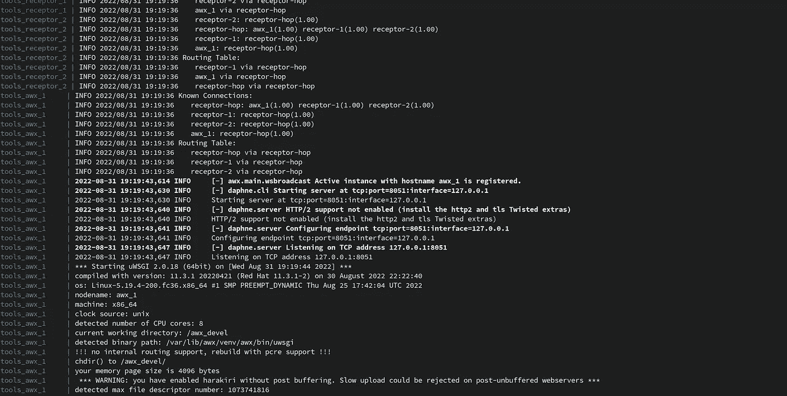
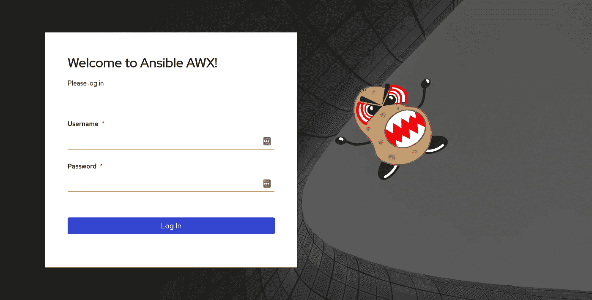
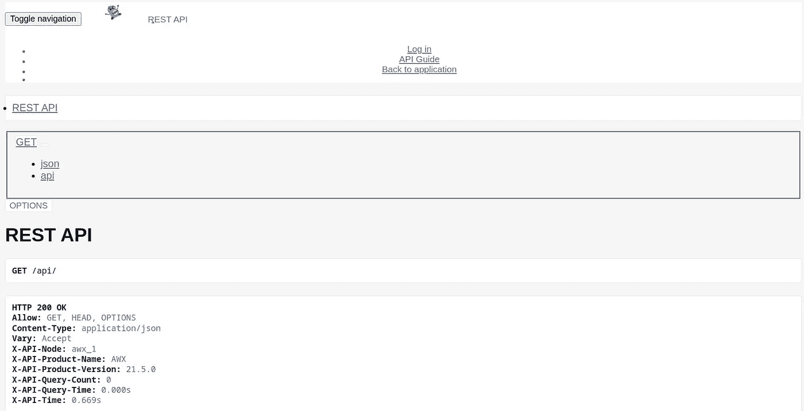
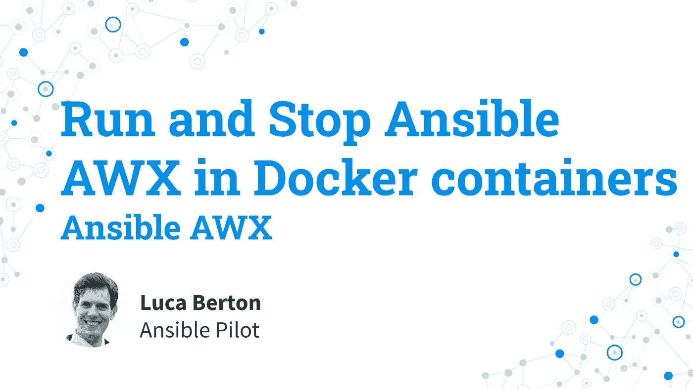

# 在码头集装箱中运行和停止 ansi ble AWX-ansi ble AWX

> 原文：<https://blog.devgenius.io/run-and-stop-ansible-awx-in-docker-containers-ansible-awx-5959bd72aae5?source=collection_archive---------2----------------------->

## 如何在 Docker 容器中启动和停止 Ansible AWX modern web-UI 和 API 接口及要求 PostgreSQL 和 Redis？

# 如何在 Docker 容器中运行和停止 Ansible AWX？

我将向您展示如何在 Docker 容器中启动和停止 Ansible AWX。您可以利用 AWX 现代网络用户界面和 API 接口。
仅推荐有经验的用户和开发者在 Docker 容器中运行。我是卢卡·伯尔顿，欢迎来到今天的《神秘飞行员》节目。

# 链接

*   [https://github . com/ansi ble/awx/blob/devel/tools/docker-compose/readme . MD # run-awx](https://github.com/ansible/awx/blob/devel/tools/docker-compose/README.md#run-awx)

# 演示

如何在 Docker 容器中运行和停止 Ansible AWX？
这需要在上一课中为 Docker 容器从头构建一个可解析的 AWX。

## 密码

一旦为 Docker 容器成功构建了 Ansible AWX，就可以使用下面的命令运行 AWX 容器。

这个过程也在旋转 PostgreSQL 和 Redis 容器的需求。

```
$ make docker-compose
```

您的会话将附加到 AWX 容器，并在容器启动时开始实时观察日志消息和事件。

第一次启动环境时，运行数据库迁移以构建 PostgreSQL 初始数据库模式和数据。

默认情况下，您的机器上运行着六个 Docker 容器:`tools_awx_1`、`tools_postgres_1`、`tools_redis_1`、`tools_receptor_hop`、`tools_receptor_1`、`tools_receptor_2`。

您可以使用`docker ps`命令验证系统中运行的容器:

```
[lberton@ansible awx]$ docker ps 
CONTAINER ID   IMAGE                            COMMAND                  CREATED        STATUS         PORTS                                                                                                                                                                                                                                                                                                                                                                                NAMES
bce34be76a94   ghcr.io/ansible/awx_devel:HEAD   "/entrypoint.sh rece…"   14 hours ago   Up 2 minutes   22/tcp, 8013/tcp, 8043/tcp, 8080/tcp                                                                                                                                                                                                                                                                                                                                                 tools_receptor_2
c11c7c1114f1   ghcr.io/ansible/awx_devel:HEAD   "/entrypoint.sh rece…"   14 hours ago   Up 2 minutes   22/tcp, 8013/tcp, 8043/tcp, 8080/tcp                                                                                                                                                                                                                                                                                                                                                 tools_receptor_1
05589a6b6185   quay.io/ansible/receptor:devel   "/usr/local/bin/dumb…"   14 hours ago   Up 3 minutes   0.0.0.0:5555->5555/tcp, :::5555->5555/tcp, 7323/tcp                                                                                                                                                                                                                                                                                                                                  tools_receptor_hop
d9570e9d9027   ghcr.io/ansible/awx_devel:HEAD   "/entrypoint.sh laun…"   14 hours ago   Up 3 minutes   0.0.0.0:2222->2222/tcp, :::2222->2222/tcp, 0.0.0.0:6899->6899/tcp, :::6899->6899/tcp, 0.0.0.0:7899-7999->7899-7999/tcp, :::7899-7999->7899-7999/tcp, 0.0.0.0:8013->8013/tcp, :::8013->8013/tcp, 0.0.0.0:8043->8043/tcp, :::8043->8043/tcp, 0.0.0.0:8080->8080/tcp, :::8080->8080/tcp, 22/tcp, 0.0.0.0:8888->8888/tcp, :::8888->8888/tcp, 0.0.0.0:3000->3001/tcp, :::3000->3001/tcp   tools_awx_1
c39fe279ecb2   postgres:12                      "docker-entrypoint.s…"   14 hours ago   Up 3 minutes   5432/tcp                                                                                                                                                                                                                                                                                                                                                                             tools_postgres_1
820ebdc15a10   redis:latest                     "redis-server /usr/l…"   14 hours ago   Up 3 minutes   6379/tcp                                                                                                                                                                                                                                                                                                                                                                             tools_redis_1
[lberton@ansible awx]$
```



# 访问 Ansible AWX 网站用户界面

可在 URL[https://localhost:8043/获得 Ansible AWX Web-UI。](https://localhost:8043/.)

与您的浏览器成功连接将会显示以下登录屏幕([https://localhost:8043/#/log in](https://localhost:8043/#/login))。



# 访问 Ansible AWX Web API

可在 URL[https://localhost:8043/API/获得 Ansible AWX API。](https://localhost:8043/api/.)

与浏览器的成功连接将向您显示以下 API 端点(https://localhost:8043/api/)。Ansible AWX API 是一个可浏览的 API，所以很容易通过浏览器导航。请注意，一些 API 端点需要认证。



# 概述

现在您知道了如何在 Docker 容器中运行和停止 Ansible AWX。

我希望你喜欢读这个。如果你想支持我成为一名作家，考虑注册[成为一名中等会员](https://ansiblepilot.medium.com/membership)。每月仅需 5 美元，您即可无限制地使用 Medium。

订阅 [YouTube 频道](https://www.youtube.com/channel/UC5MNbTYRHSCu9vAki3z9SmA)、[media](https://ansiblepilot.medium.com/)、 [Substack](https://ansiblepilot.substack.com/) 和[网站](https://www.ansiblepilot.com/)不要错过下一集的 Ansible Pilot。

# 可移植的最佳资源

## 视频课程

*   [通过 200 多个例子学习可移植自动化&实践课:通过一些如何使用最常见模块的真实例子和可移植行动手册](https://click.linksynergy.com/deeplink?id=euGmLrdj*Ec&mid=39197&murl=https%3A%2F%2Fwww.udemy.com%2Fcourse%2Fansible-by-examples-devops%2F%3FreferralCode%3D8E065F6D6F8622A3DEC8)学习可移植自动化。

## 书

*   [可通过示例用于 VMware:VMware 基础架构自动化分步指南](https://www.amazon.com/Ansible-VMware-Examples-Step-Step/dp/1484288785/)
*   [可举例:Linux 和 Windows 系统管理员和 DevOps 的 200 多个自动化示例](https://leanpub.com/ansiblebyexamples)
*   [适用于 Windows 示例:Windows 系统管理员和 DevOps 50+自动化示例](https://leanpub.com/ansibleforwindowsbyexamples)
*   [可通过示例移植到 Linux:Linux 系统管理员和 DevOps 的 100 多个自动化示例](https://leanpub.com/ansibleforlinuxbyexamples)
*   [示例可移植的 Linux 文件系统:现代 IT 基础设施的 Linux 文件和目录操作的 40 多个自动化示例](https://leanpub.com/linuxfileanddirectorybyansibleexamples)
*   [可通过示例用于容器和 Kubernetes:20+自动化示例用于自动化容器、Kubernetes 和 OpenShift](https://leanpub.com/ansible-for-kubernetes-by-examples)
*   [可通过示例实现安全性:自动化 IT 现代基础架构的安全性和合规性的 100 多个自动化示例](https://leanpub.com/ansibleforsecuritybyexamples)
*   [可行的技巧和窍门:10 多个可行的例子来节省时间和自动化更多的任务](https://leanpub.com/ansible-tips-and-tricks)
*   [Ansible Linux 用户&按示例分组:20 多个关于现代 IT 基础设施的 Linux 用户和组操作的自动化示例](https://leanpub.com/ansiblelinuxusersandgroupsbyexamples)
*   [Ansible For PostgreSQL by Examples:10+个自动化 PostgreSQL 数据库的示例](https://leanpub.com/ansible-for-postgresql-by-examples)
*   [ansi ble For Amazon Web Services AWS By Examples:10 多个自动化 AWS 现代基础设施的示例](https://leanpub.com/ansible-for-aws-by-examples)

# 捐赠

[](https://patreon.com/lucaberton) [## 卢卡·伯尔顿正在为 Ansible | Patreon 创建软件开源

### 今天就成为卢卡·伯尔顿的赞助人:获得世界上最大会员的独家内容和体验…

patreon.com](https://patreon.com/lucaberton) [](https://github.com/sponsors/lucab85) [## GitHub 赞助商上的赞助商@lucab85

### 我是一个活跃的开源贡献者，参与到了 Ansible 社区中，尽管我到处都是。@lucab85 的…

github.com](https://github.com/sponsors/lucab85) 