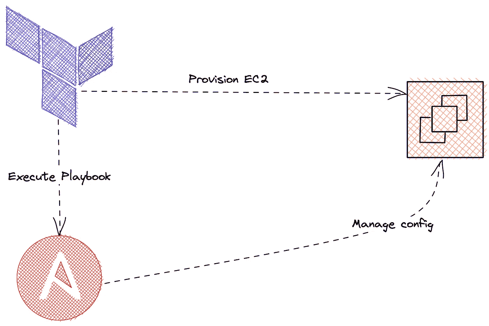
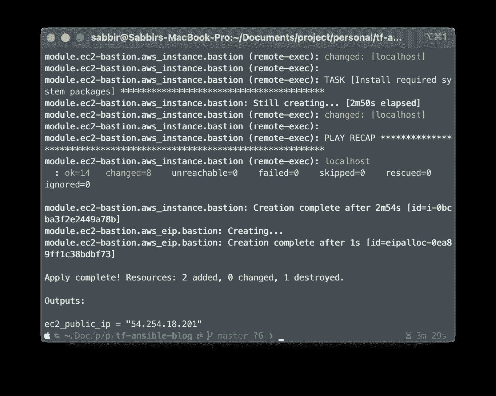

# 从 Terraform 运行 Ansible 剧本:在 AWS 中供应和配置 Bastion 主机

> 原文：<https://blog.devgenius.io/run-ansible-playbook-from-terraform-provision-and-configure-bastion-host-in-aws-df5420804100?source=collection_archive---------3----------------------->

通常，我们必须将 EC2 实例配置为堡垒主机，然后我们运行可行的行动手册或初始化脚本来安装包或配置系统。但是如果我们一次完成 terraform 和 ansible，既可以节省时间，又可以减少劳动。

在这篇文章中，我们将学习如何实现这个目标。我们将建立一个堡垒主机并自动安装 docker 和 docker-compose v2！



## 终端时间

[](https://github.com/by-sabbir/terraform-ansible-ec2) [## GitHub-by-sab Bir/terraform-ansible-ec2:用 terra form 部署 EC2，用 ansi ble 配置

### 使用 terraform 部署 ec2 并使用 ansi ble-GitHub-by-sab Bir/terra form-ansi ble-EC2 进行配置:使用…部署 EC2

github.com](https://github.com/by-sabbir/terraform-ansible-ec2) 

克隆存储库，并在以下位置编辑文件

*   `modules/ec2/variables.tf`
*   `modules/sshkey/variables.tf`
*   `./variables.tf`

用您的 VPC ID、公共子网、私有和公共密钥来更改变量。如果从头开始部署或者使用外部的`terraform data resource.`，这个过程也可以自动化，但是这超出了本文的范围。现在运行以下命令:

```
terraform plan
```

这将显示供应计划和/或显示基础代码是否有任何错误。

假设前面的命令成功执行，让我们调配基础架构—

```
terraform apply --auto-approve
```

成功完成后，您将得到类似于下面的内容，



厉害！现在你应该能够通过在`[modules/ec2/variables.tf](https://github.com/by-sabbir/terraform-ansible-ec2/blob/550736a9044a6c49fbc7272a234d086e1a3a3bd8/modules/ec2/variables.tf#L14)`指定的私钥 ssh 到服务器

## 近距离观察

—

**项目结构**

对于这个项目，我决定采用`moduler`或`module-based`的方法。这使我们能够重用 IaC。此外，您可以使用这种模式为生产中的所有基础设施资源启动一个平台`monorepo`。

```
.
├── ansible
├── modules
│   ├── ec2
│   └── sshkey
└── main.tf
```

`ansible`文件夹包含一个安装脚本和`playbook.`文件夹，我们主要关注的是`modules`文件夹。这包含了基础架构的所有资源。我们可以使用任何资源的`outputs`来供应其他资源，我们可以在该文件夹中独立地更新/删除基础架构的任何组件。我就是喜欢这个 IaC 结构。

现在，剩下的就简单了。让我们从`modules/ec2/main.tf`开始剖析下面的地形代码行 79–126，

我们将 EC2 的`connection`方法声明为 SSH，因此我们为该块提供了一个私钥，就个人而言，我每天都会将`ed25519`用于公钥加密。这将由`file`和`remote-exec`置备程序使用。让我们来看看`ansible/install.sh`文件——

这是一个非常简单的脚本，我们正在更新新创建的虚拟机的包缓存，然后安装 ansible。最后，我们运行 ansible 剧本。ansible playbook 包含安装 docker 和 compose 插件的必要步骤。

> 注意:我没有管理状态和锁定。如果您将它用于生产，请使用您选择的远程状态和锁定机制。

## 清理

```
terraform destroy
```

就是这样！改进/想法将受到高度赞赏。

快乐的建筑设计…