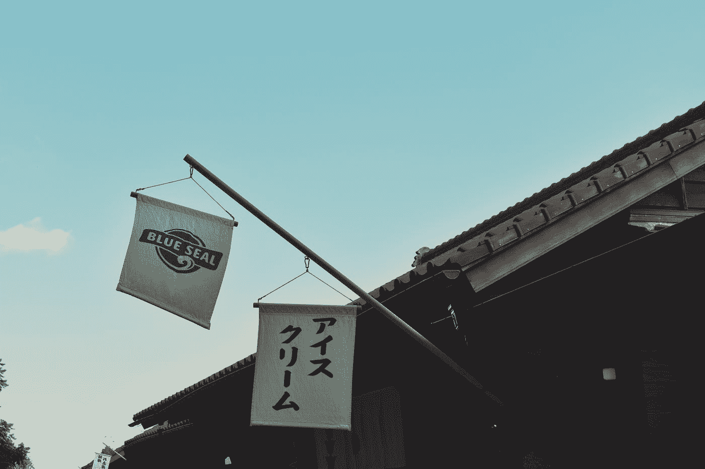
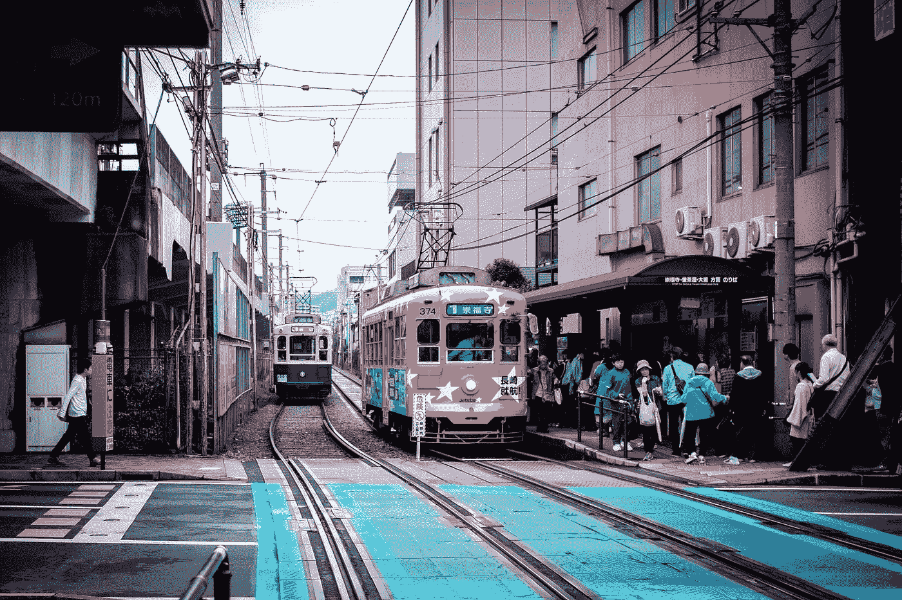

# AVL 树的衰败

> 原文：<https://blog.devgenius.io/run-down-of-avl-trees-full-run-down-e8551a5fc981?source=collection_archive---------7----------------------->

如果你是数据结构的灵魂伴侣，你可能已经听说过很多关于那些怪异的👹能够自动重新平衡自身的自平衡树。听起来很有魅力，不是吗？🤩

让我们来看看它们是由什么组成的，以及你可以如何做 so🧑‍💻

目录:

1.  数据结构简介
2.  树木的问题
3.  AVL 树简介

*   平衡系数:平衡和高度
*   旋转

4.代码部分

5.结尾部分


由[布莱克·康纳利](https://unsplash.com/@blakeconnally?utm_source=medium&utm_medium=referral)在 [Unsplash](https://unsplash.com?utm_source=medium&utm_medium=referral) 上拍摄的照片

# 关于树的简短介绍

如果你需要储存，有很多种树可以让你利用它们的长处📂和搜索数据。仅举几个例子:

*   普通二叉树
*   二分搜索法树(又名英国夏令时)
*   堆(最小/最大堆、斐波那契堆等)
*   Trie(发音像 t-r-y)
*   自平衡树(最著名的是 AVL，红黑树):它们源于 BST

## 我们为什么需要它们？

例如，你需要存储和搜索数据。有哪些替代方案？

*   **array:** 当我们遍历整个结构时，搜索的平均速度是 O(n ),但是一切都是有序的
*   **哈希表:**搜索平均为 O(1)，因为数据在**而不是**所谓的“*背靠背*的内存槽内。但它是无序的。
*   **图表:**复杂/需要使用各种技术& &对于需要快速搜索的任务来说并不完美
*   **集合:**无序为哈希表。从我的角度来看，它们是哈希表和数组的混合，因为它们没有前者的键值对，而是像后者一样无序。但是，如果您需要快速检查存在，search 是 O(1)。
*   **链表(双链表和单链表):**如果您需要访问第一个或最后一个元素，这对于存储数据非常有用。另外，除了因为需要在内存中重建链接而使插入为 O(n)的数组之外，在这里找到元素并从*上一个*和*下一个*改变链接要快得多

因此，如果我们需要数据结构来存储元素并快速找到它们呢？答案是树木。尤其是当我们谈到 BST 时。搜索/插入/删除是 O(log n):我们在每一步上减半搜索，就像在**二分搜索法中一样。**

> 注意:从 python 3.6 实现的**散列表**称为**字典**是有序的，但这是一个例外而不是规则

## 树木的问题

听起来我们一般不需要对 BST 做任何修改？唉，一切都要复杂得多😵

M eet **偏斜度**。简单来说，问题是树向某一部分倾斜，这破坏了 O(log n)搜索的美观。实际上，它退化为 O(n)。

```
 n
	/ \
       n   n
      /
     n
    /
   n
```

那么，我们能做些什么呢？总的来说，没什么🤷‍♂️:但是还有另一种数据结构，或者说，被改变的数据结构，被称为自平衡 BST。

在这篇文章中，我想把重点放在 AVL 树作为上述问题的解决方案。

# AVL 树

有两件事要记住:平衡和旋转。让我们更进一步了解他们。

## 保持平衡

> Tl 是左子树，Tr 是右子树

**高度**的公式:`H = max(H(Tl), H(Tr)) + 1`

**平衡**的公式:`B(n) = H(Tl) — H(Tr)`

为了训练，让我们观察下面的例子和计算。**高度**和**平衡。**

**至关重要**🤚🤚关于身高和平衡的关系，我困惑了很长一段时间。**实际上，它们是交织在一起的。**如何？- >我们继续吧

> 请记住，单个节点的高度是 0，但缺少节点的高度是-1

```
 3
	   / \
	  1   4
	 / \
	0   2
```

**高度:**

1.  H(0) = max(-1，-1) + 1 = 0
2.  H(2) = max(-1，-1) + 1 = 0
3.  H(3) = max(0，0) + 1 = 1
4.  H(4) = max(-1，-1) + 1 = 0
5.  H(3) = max(1，0) + 1 = 2

**平衡:**

1.  B(0) = -1-(-1) = 0
2.  B(2) = -1-(-1)= 0
3.  b(1)= 0–0 = 0。**取高度为 0，高度为 2。**
4.  B(4) = -1-(-1)=0
5.  b(3)= 1–0 = 0。**取身高 3，身高 4。**

我们有一棵平衡的树。下一步是观察不平衡的一个:

```
 4
	    /
	   3
	  /
	 2
	/ \
       1   0
```

高度:

1.  H(1) = max(-1，-1) + 1 = 0
2.  H(0) = max(-1，-1) + 1 = 0
3.  H(2) = max(0，0) + 1 = 1
4.  H(3) = max(1，-1) + 1 = 2
5.  H(4) = max(2，-1) + 1 = 3

快速“目测”后，我们可以推断:

1.  B(1) = -1-(-1) = 0
2.  B(0) = -1 -(-1) = 0
3.  B(2) = 0-0 = 0。取高度 1 和 0。
4.  B(3) = 1 -(-1) = 2。取 2 的高度
5.  B(4) = 2-(-1) = 3。取 3 的高度

所以，是 3。到底是什么意思？我们如何使用它？

## 平衡因素

一般定义的余额是 abs(1)。这意味着如果某个部分大于 1 或小于-1 `=>`偏斜度。但是为什么我们甚至会有正负**平衡因子**？它与所谓的*重量*有关。

**左重树& &右重树**是子树偏向其中一个子树的树。我所说的子树并不是指`root`，而是任何带有子树的`node`。即，在上面的图片中，3 可以被认为是左倾的节点，而不仅仅是 4。记住这一点。

> 左重:大于 1 的正平衡系数
> 
> 右重:负平衡系数小于-1

## 旋转

显而易见的一步是以某种方式重新平衡树，使它再次平衡，这就是我们聚集在这里的目的。有 4 种主要方法可以做到这一点:

*   左旋转(也称为左-左)
*   右旋(也称为右-右)
*   左右旋转
*   左右旋转

当以这种方式被推搡时，它们可能看起来奇怪和不清楚，这就是为什么我想把它们归类。从上面回忆**沉重**。

> 左重树:右旋转&左右旋转
> 
> 右重树:左旋转&左右旋转

在我们确定了他们的子群之后，让我们深入研究他们应用的特殊情况。

**右旋转**

我们有下面的树，它明显不平衡，2 是平衡，我们想修复它。

```
 3       2
    /	    / \
   2    => 1   3
  /
 1
```

让我给你看一个有趣的模式:

```
 x
          / \
         y  purple
        / \
      red blue
```

这就是对待帮助我的树的方式。看，3 是 x，2 是 y，1 是红色。你知道他们会怎么照顾右转的 T7 吗？

```
 y
     / \
   red  x
       / \
     blue purple
```

为什么这样`=>`回想一下它是 **BST** 的形式，其中左边小于上面的节点，右边大于/等于。**蓝色**比 y 大，但比 x 小**红色**比 x 小，y. **紫色**比 x 大我们把 y 拖到上面，把 x 放在右边，蓝色放在 x 的左边，紫色下到 x 的右边，红色向上拖到 y 的左边(准确的说，变化不大)。

因此，在上面的例子中，我们把 2 向上拉(它是 y)，把 x 放在右边，红色是 1 保持不变。如果 2 的右边有 2，它会去哪里？`=>`先到了 2 的右边，然后到了 3 的左边。

**左右旋转**

```
 3       3     2
	   /       /     / \
	  1   =>  2  => 1   3 
	   \     /
	    2   1
```

在这里我们不能简单地做右旋。为什么？让我们试试:

```
 3       1
   /         \
  1   =>      3
   \         /
    2       2
```

一点也不平衡。这就是为什么我们需要做一个特技，首先做 1 和 2 的左转。之后，对整棵树做右旋转。你可以在上图前一张图看到它。

> 不要害怕如果你不知道，我会提供代码摘录

**向左旋转**

```
 1                2
	 \              / \
	  2      =>    1   3
	   \
	    3
```

与**右一**相似，但采用镜像方式

之前:

```
 x
          / \
      purple y 
            / \
          red blue
```

之后:

```
 y
       / \
      x  blue
     / \
 purple red
```

为什么这样`=>` **紫色**最小。**红色**比 x 大，但比 y 小。**蓝色** —比 x 大& & y，旋转后一切看起来都和**右**一样。

**左右旋转**

```
 1        1          2  
	 \        \        / \
	  3  =>    2   => 1   3
	 /          \
	2            3
```

> 练习:尝试应用左右旋转的逻辑，找出为什么简单的左**不能拯救我们**

如果你没有得到什么，请在评论中留言，我可以帮助你！🙌

我知道这很艰难😓。休息一会儿，看下一张图…



[Sei](https://unsplash.com/@itssecondkaki?utm_source=medium&utm_medium=referral) 在 [Unsplash](https://unsplash.com?utm_source=medium&utm_medium=referral) 上拍摄的照片

## 代码部分

如果你想观察用 **Python** 和 **Kotlin** 写的全部代码，你可以访问下面的链接到我的回购。

[](https://github.com/SleeplessChallenger/Self-Balancing-Trees/tree/main/AVL_trees) [## 自我平衡树/主无眠挑战者的 AVL 树/自我平衡树

### 自平衡树的解释和代码。通过以下方式为无眠挑战者/自平衡树的发展做出贡献…

github.com](https://github.com/SleeplessChallenger/Self-Balancing-Trees/tree/main/AVL_trees) 

> 重要提示:不要忘记，再平衡不仅发生在整棵树的根部，也发生在子树上

假设我们有下面的树，`7`是我们新添加的节点。

```
 13
     /  \   11   21
   /
  8
 /
7
```

很明显，这棵树不平衡，而且向左倾斜。回想一下上面的注释:不仅仅是`root`充当了前一个扇区中模式的`x`。在我们的例子中，它将`11`指出差异。

处理该方法的步骤:

> 叶节点是没有左右子节点的节点

1.在正确位置插入新值作为**叶**节点
2。更新高度
3。检查平衡
4。当我们递归进入树时，我们将
逐层返回，更新高度并检查
的平衡。因此，在某个时刻，我们可以捕捉不平衡的东西

我们在🧐发现了它

等等，等等，等等…你是怎么发现的？我不知道它是如何工作的😩

## 题外话:

1.  基本情况是如果`node`是 None，我们返回我们的新节点。
2.  我们把它系在左边或右边的孩子身上。在我们的案例中:

```
8.left = Node(7)
```

3.我们将**高度**增加 1，并检查**平衡**是否正常
4。通过`return root`再次返回上一层，这里:

```
11.left = Node(8)
```

从上面重做步骤，这里我们发现了**左侧重**的问题。

## 从题外话回来

1.  我们看到那棵树是**左倾**，因此我们输入`curr_balance > 1`
2.  `root`在这种情况下就是`11` 。我们需要弄清楚:我们的新`Node(7)`是否比`root`的`.left/.right`更`**> || <**`。
    正如我们看到的，它更小，这就是为什么我们只做`_right_rotate()`。下面观察一下
3.  为了澄清，让我们用数字来使生活变得更容易。我们用`11`作为`node`输入这个方法

```
8 = 11.left
None = 8.right

# perform rotation
8.right = 11
11.left = None
```

4.接下来，返回作为子树的新根的`y_node`，同时`11`移动到这个根的右边。模式中描述的一切。

> 如你所见，8 用它拖着 7，
> 弹出一层，而 11 到达 8 的`.right`拖着`.right`，如果这样的
> 存在的话(在我们的例子中是没有)

如果..😲😲😲我们要举例说明**左右旋转。**

```
 Other nodes
     /
    11
   /
  8
   \    9
```

这里我们用`Node(9)`代替 7

放置节点的所有过程都是一样的。我们甚至再次在`11`发现问题。怎么会？所以:

*   起初**高度** :
    1。H(9) = max(-1，-1) + 1 = 0
    2。H(8) = max(-1，0) + 1 = 1
    3。H(11) = max(1，-1) + 1 = 2
*   接下来，**平衡** :
    1。b(8)=-1–0 = 0
    2。B(11) = 1-(-1)=2

现在，您渴望看到模式上的所有内容，以便在头脑中搞清楚事情:

> 你可以再检查一下**左右**旋转部分为什么简单的**左右**旋转不起作用

首先，我们用作为`root`供应的`11.left`制造`_left_rotate()`。观察下面的方法:

让我们比较图形和模式:

```
9 = 8.right
None = 9.left

# perform rotation
9.left = 8
8.right = None
```

它看起来会像这样:

```
 11
        /
       9
      /
     8
      \
       None 
```

接下来，我们将`9`作为新的`.left`返回到`11`。接下来，我们如前所述执行`_right_rotate()`。

> 个人训练:看`left`旋转& & `right-left`旋转

非常困难的事情👺…

在最后一大块之前再休息一次🙌🏻



照片由[克里斯蒂安陈](https://unsplash.com/@christianchen?utm_source=medium&utm_medium=referral)在 [Unsplash](https://unsplash.com?utm_source=medium&utm_medium=referral) 上拍摄

## 删除节点

最后，如果我们想删除节点呢？这棵树是如何控制一切的？🕵🏻‍♂️

树的示例:

```
# Some nodes
     /
    8
     \      10
     /  \    9   11
```

想象一下，`8`下面是要成为 deleted❌的代码，在那之后让我来引导你通过它。

**后续步骤:**

1.  递归遍历，直到我们在方法的上半部分点击`else`。这意味着我们已经找到了目标
2.  我们看到`.left` & & `.right`都不为空，于是再次输入`else`
3.  调用`._get_min_value_node(node.right)`，我们将尝试从当前**要删除的节点**中找到右边子树上最小的节点
4.  当我们以`10`为根进入这个方法时，首先将基于它进行检查:`10 != None`和`10.left != None` = >再次用`10.left`调用这个方法，这意味着`9`是下一次调用的`root`。
5.  `9 != None` **但** `9.left == None` = >返回`9`到上层
6.  回到`delete_node()`处，将`node.value`替换为`8` - > `9`
7.  接下来，我们需要从右边的子树中删除`9`。实际上，与上述操作相同:

*   注意我们在`node.right`上调用`delete_node`(`9.right`也就是`8.right`)
*   `delete_node()`中的`node.left == None`是我们点击的地方，我们返回 None，因为`9.right`是 None

8.对每一个`root`重新计算**平衡** & & **高度**

> 记住根是每个有子树的节点

9.但是这里不是简单的**左重** / **右重**，我们需要检查子树中的所有节点是否也是平衡的，因此逻辑有点复杂。

## 结尾部分

我希望你熬过了这次艰难的旅程🌊这绝对是复杂的，我敢肯定你的头是悸动🤯

不要匆忙，多读几遍，一定要用久经考验的钢笔和铅笔法做笔记📝。如有任何问题，欢迎在下面的任何地方写评论或联系我:

*   领英:[www.linkedin.com/in/sleeplesschallenger](http://www.linkedin.com/in/sleeplesschallenger)
*   GitHub:[https://github.com/SleeplessChallenger](https://github.com/SleeplessChallenger)
*   leet code:[https://leetcode.com/SleeplessChallenger/](https://leetcode.com/SleeplessChallenger/)
*   电报:@无眠挑战者

PS:非常感谢->

*   Back2Back SWE 视频:【https://youtu.be/vRwi_UcZGjU 
*   GeeksForGeeks 代码:【https://www.geeksforgeeks.org/avl-tree-set-1-insertion/ 