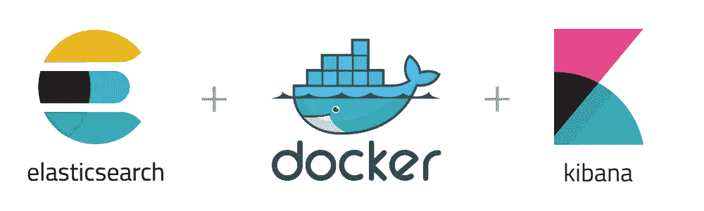

# 将 Elasticsearch 和 Kibana 作为 Docker 容器运行

> 原文：<https://blog.devgenius.io/run-elasticsearch-and-kibana-as-docker-containers-c5f5f5460afd?source=collection_archive---------5----------------------->



在[之前的文章](https://medium.com/@mhdabdel151/elasticsearch-and-kibana-on-windows-lets-get-started-ff005f1fe2fc)中，我们看到有几种方法可以创建 Elasticsearch 和 Kibana 部署，包括最简单和最快的方法，即使用 stack 提供的[云服务](https://cloud.elastic.co/registration)或在您自己的机器上进行本地部署。因此，我们介绍了 Windows 上的本地部署。今天我们将讨论第三种方式，即使用 Docker 容器。

对于那些不熟悉的人来说， **Docker** 是一个在软件容器中部署特定程序的平台。**容器**是预定义的单元，可以即时生成以部署某些应用程序或环境。我建议阅读[这篇](https://medium.com/@kmdkhadeer/docker-get-started-9aa7ee662cea)精彩的文章来熟悉 Docker。

容器基本上只是一个运行的进程。每个容器与其自己的私有文件系统通信，私有文件系统由 Docker **镜像**提供，镜像包含运行应用程序所需的所有组件。

Elastic Docker 注册表使 *Elasticsearch 和 Kibana 的 Docker 图像*可供下载。您可以在这里获得所有标签和发布的 Docker 图片的列表[。](https://www.docker.elastic.co/)

你现在知道为了安装 Elasticsearch 和 Kibana，你必须首先安装适合你的系统的 Docker 版本。接下来，您必须按顺序执行以下指令，以检索 Elastic 团队在 [Docker Hub](https://hub.docker.com/) 上为您提供的图像:

```
docker pull docker.elastic.co/elasticsearch/elasticsearch:8.3.3docker pull docker.elastic.co/kibana/kibana:8.3.3
```

在撰写本文时，Kibana 和 Elasticsearch 的版本是 8.3.3。下载完图片后，你需要启动 Elasticsearch。但在此之前，Docker- *stans* 会明白，我们必须首先预测我们的两个未来容器之间的通信，并创建一个 **Docker 网络**，我们使用命令:

```
docker network create elknetwork
```

随后，我们通过运行以下命令，将 Elasticsearch 容器与之前创建的网络相关联，从而启动该容器:

```
docker run -- name esc1 -- net elknetwork -p 9200:9200 -p 9300:9300 -it docker.elastic.co/elasticsearch/elasticsearch:8.3.3
```

与上一篇文章中提到的过程相同，复制为*弹性客户端*生成的*密码*，以及为 Kibana 生成的*注册令牌*。为了检查容器是否已经启动，以及 Elasticsearch 是否正在运行，您可以通过进入[*https://localhost:9200*](https://localhost:9200)来尝试与默认完成部署的界面进行交互。您应该会看到这样的响应:

```
{ name: "DESKTOP-8LF96KY", cluster_name: "elasticsearch", cluster_uuid: "MsnI8_QEVRSSPKc-6Tw2XQ", version: { number: "8.3.3", build_flavor: "default", build_type: "zip", build_hash: "801fed28df74dbe527f89b71b098ccaff89d2c56", build_date: "2022-07-23T19:30:09.227964828Z", build_snapshot: false, lucene_version: "9.2.0", minimum_wire_compatibility_version: "7.17.0", minimum_index_compatibility_version: "7.0.0" }, tagline: "You Know, for Search"}
```

既然 Elasticsearch 已经上线，那就让我们来照顾一下 Kibana 吧。既然我们已经提取了相应的图像，我们只需要为 Kibana 创建另一个容器，将它连接到运行 Elasticsearch 的同一个网络*上，瞧。这可以通过运行以下命令来完成:*

```
docker run --name kibc1 --net elknetwork -p 5601:5601 docker.elastic.co/kibana/kibana:8.3.3
```

屏幕上会返回一个唯一的链接，你所要做的就是输入首次启动 Elasticsearch 时获得的*注册* *令牌*并与之前生成的信息连接，就这样。


如果出于某种原因，您想要重置 *elastic* 用户密码，没有什么比这更简单的了，您只需使用以下命令启动[**elastic search-reset-password**](https://www.elastic.co/guide/en/elasticsearch/reference/8.3/reset-password.html)工具:

```
docker exec -it esc1 /usr/share/elasticsearch/bin/elasticsearch-reset-password -u elastic
```

此外，在某些情况下，您可能需要生成一个新的 Kibana 注册令牌，因为这些令牌仅在创建后的 30 分钟内有效。这是通过运行 [**弹性搜索-创建-注册-令牌**](https://www.elastic.co/guide/en/elasticsearch/reference/8.3/create-enrollment-token.html) 工具来完成的:

```
docker exec -it esc1 /usr/share/elasticsearch/bin/elasticsearch-create-enrollment-token -s node
```

为了使事情更加集中，我们可以使用***【docker-compose】***，但不要担心，这可能是未来文章的主题。

今天到此为止，请随意查看官方文档了解更多细节和配置。感谢您的阅读，如果您对本文有任何问题或评论，请在下面留下您的评论。

我们下次再见，看更多的帖子。

阿卜杜尔-巴吉