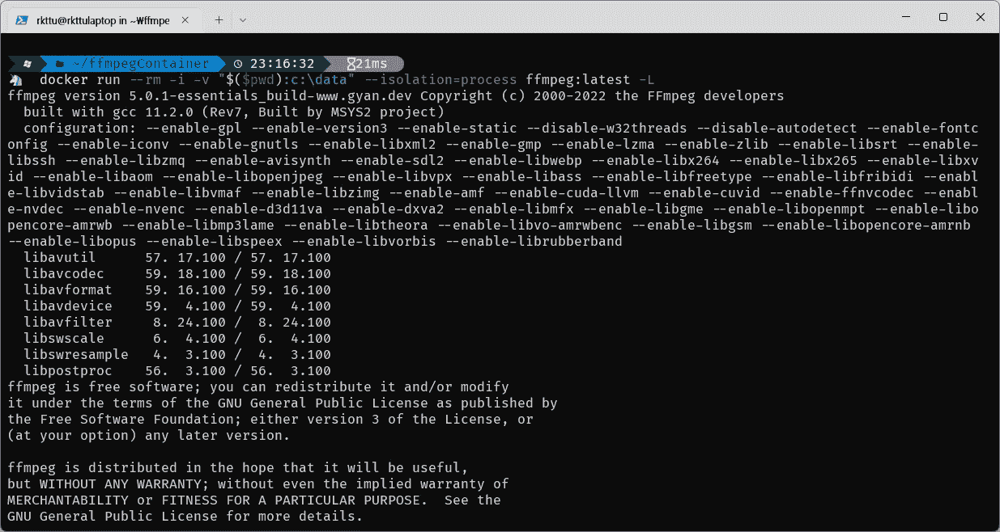

# 在 Windows 容器上运行 FFMPEG

> 原文：<https://blog.devgenius.io/run-ffmpeg-on-the-windows-container-771fdabd5e00?source=collection_archive---------11----------------------->

**免责声明:**本文测试了最新的 LTSC Windows Server 版本 2022 和 Windows 11 Pro (x64)。Windows Server 2016 和 2019 不提供“Windows Server”基础映像。


[斯凯工作室](https://unsplash.com/@skyestudios?utm_source=unsplash&utm_medium=referral&utm_content=creditCopyText)在 [Unsplash](https://unsplash.com/s/photos/multimedia?utm_source=unsplash&utm_medium=referral&utm_content=creditCopyText) 拍摄的照片

从 Windows Server 2022 开始，[微软发布了一种新的基础映像，名为“Windows Server”](https://hub.docker.com/_/microsoft-windows-server/)“WindowsServer”基本映像与名为“Windows”的现有基本映像相同，但专为 Windows Server 特定的功能集及其发布节奏而设计。

FFmpeg 是一个跨平台的多媒体转码软件，可以处理各种音频、视频和图像格式。您可能会认为，如果容器能够处理这些多媒体工作负载，那么它将是许多用户和公司的一项出色服务。然而，遗憾的是，Windows 版本的 FFMPEG 需要桌面 API 来运行其功能，而服务器核心容器映像没有 API。

在这种情况下，我们应该考虑使用“Windows”基础映像，它有一套完整的 API。但是，此映像不适合发布 cadence 现有的 nano 服务器和服务器核心映像。这意味着您无法提取带有标签“ltsc2022”的基本“Windows”映像相反，您必须选择标记“20H2”，它遵循客户端版本方案。

名为“WindowsServer”的基础映像始终解决了这个问题。您可以将基本映像名称从服务器核心更改为服务器；几乎所有的标签都会匹配你现有的版本方案。

# 在 Windows 容器上安装 Chocolatey 软件包管理器

您可以在全新的社区驱动的包管理器(如 Chocolatey 包管理器)上获得许多基于开源的 Windows 命令行工具。所以我也想利用 Windows 容器中的包管理器。

然而，与~nix 环境不同，Windows 应用程序不保证即使它们有任何错误也将返回退出代码零。因为这个性格，你可能会吃亏；您不能使用软件包管理器构建您的映像。这种繁琐也打击了我的工作。

经过一番试错，我找到了一个稳定简洁的方法来对冲这个问题。让我们看看下面的代码存根。

```
RUN powershell.exe \
  Set-ExecutionPolicy Bypass -Scope Process -Force; \
  iwr -Uri '[https://community.chocolatey.org/install.ps1'](https://community.chocolatey.org/install.ps1') -UseBasicParsing -OutFile $home/choco_install.ps1; \
  powershell $home/choco_install.ps1; \
  del $home/choco_install.ps1; \
  exit 0;
```

[在其原始形式](https://chocolatey.org/install)中，安装 PowerShell 脚本传递给 Invoke-Expression cmdlet 以最小化磁盘 I/O。但是使用这种方法，此 RUN 命令以非零退出代码结束，使构建过时。

相反，我将这个合并的命令分成了多行。下载一个 PowerShell 脚本文件到主目录，通过再次调用 PowerShell 解释器运行脚本。使用这种方法，后续命令不会影响退出代码。

然后，删除安装脚本，因为它的任务已经结束。最后，确保整个脚本应该返回退出代码零，以继续构建过程。

这样，我就可以制作一个基于 chocolatey 的 Windows 容器基础映像。此外，这种解决方法适用于服务器核心映像。

# 在一行中安装一个包

类似地，当我尝试——或者——choco 命令自己一次安装多个软件包时，choco 命令也不能很好地工作。让我们看看下面的代码存根。

```
RUN powershell.exe \
  powershell choco install chocolatey-compatibility.extension -y --force; \
  powershell choco install chocolatey-core.extension -y --force; \
  powershell choco install ffmpeg --version=5.0.1 -y --force; \
  exit 0;
```

当你第一次通过包管理器安装任何一个包时，包管理器会自动安装两个核心包；“巧克力兼容性扩展”和“巧克力核心扩展”包。

不幸的是，如果多个软件包已经开始，安装过程将会过时，这些症状看起来有点像 Windows 容器环境导致的错误。

当我拆分软件包设置命令时，奇怪的故障消失了。

# 放在一起

让我们看看完整的 Dockerfile 脚本。

```
FROM mcr.microsoft.com/windows/server:ltsc2022USER ContainerAdministratorEXPOSE 3389/tcpRUN powershell.exe \
  Set-ExecutionPolicy Bypass -Scope Process -Force; \
  iwr -Uri '[https://community.chocolatey.org/install.ps1'](https://community.chocolatey.org/install.ps1') -UseBasicParsing -OutFile $home/choco_install.ps1; \
  powershell $home/choco_install.ps1; \
  del $home/choco_install.ps1; \
  exit 0;RUN powershell.exe \
  powershell choco install chocolatey-compatibility.extension -y --force; \
  powershell choco install chocolatey-core.extension -y --force; \
  powershell choco install ffmpeg --version=5.0.1 -y --force; \
  exit 0;ENTRYPOINT [ "ffmpeg.exe" ]
```

然后，您可以使用下面的命令构建一个 FFmpeg Windows 容器。

```
docker build -t ffmpeg:latest --isolation=process --no-cache .
```

然后，让我们运行 FFmpeg 容器进行测试。

```
docker run --rm -i --isolation=process ffmpeg:latest -L
```

您可以看到 FFmpeg 二进制文件的许可信息消息。在服务器核心容器中，FFmpeg 失败，因为容器 OS 映像没有所需的 API。



FFmpeg 运行在 Windows 容器上

让我们看看是否可以用这个 FFmpeg 窗口容器将 MP4 视频转码成 10 秒的 GIF 图像。在这个场景中，我将使用著名的视频剪辑“[大巴克兔子](https://peach.blender.org/):-)

```
curl.exe -L [http://commondatastorage.googleapis.com/gtv-videos-bucket/sample/BigBuckBunny.mp4](http://commondatastorage.googleapis.com/gtv-videos-bucket/sample/BigBuckBunny.mp4) -o movie.mp4
```

下载后，我将把当前目录挂载到容器中，作为“c:\data”路径。然后，通过 Docker CLI 参数传递 FFmpeg 参数，如下所示。(请注意，该命令是一个 PowerShell 命令。)

```
docker run --rm -i -v "$($pwd):c:\data" --isolation=process ffmpeg:latest -ss 281.2 -t 4 -i c:\data\movie.mp4 -vf "fps=10,scale=320:-1:flags=lanczos,split[s0][s1];[s0]palettegen[p];[s1][p]paletteuse" -loop 0 -y c:\data\movie.gif
```

代码摘自[示例图库网站](https://www.codegrepper.com/code-examples/shell/ffmpeg+mp4+to+gif)。

**一个陷阱:**如果您的容器构建以 ContainerUser 帐户结束，您将无法读取或写入 bind 挂载目录。如果您希望在主机和容器之间交互文件，则必须显式使用 ContainerAdministrator 帐户。

运行该命令后，您将在工作目录中获得一个小的 GIF 文件，如下所示。:-D


瞧啊。在 Windows 容器中由 FFmpeg 转换的 GIF 图像。

# 结论

启动 Windows Server 2022 和 Windows 11，您可以安全地忽略容器映像的内部版本号和操作系统的内部版本号。它们的强耦合性已经消失了，现在你可以让你的 Windows 容器作为一个进程隔离的容器随时运行而不用担心。

此外，由于整个“Windows Server”容器基础映像，您现在可以将更复杂的应用程序构建到一个容器中。正因为如此，我们可以在容器中流畅地运行 FFmpeg 应用程序。

不幸的是，Azure 容器实例仍然不支持 Windows Server 2022 主机，因此基于 Windows Server 的 FFmpeg 无服务器应用程序今天不可用(截至 2022 年 7 月)。然而，我预计微软迟早会将对 Windows Server 2022 的支持添加到现有的 ACI 或 Azure Container Apps (ACA)基础架构中。

在此之前，您可以使用基于 Windows 服务器的虚拟机规模设置来支持基于 Windows 的复杂多媒体工作负载，从而实现您的视频转码云。