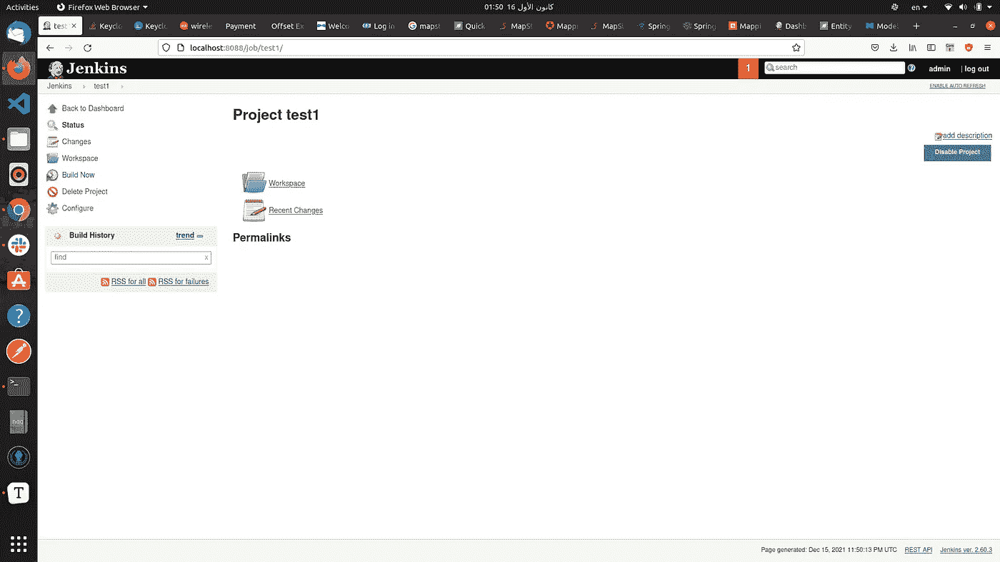

# 用 Docker 图像运行 Jenkins

> 原文：<https://blog.devgenius.io/run-jenkins-with-docker-image-ba999cba8975?source=collection_archive---------5----------------------->


## 简介:

在本文中，我将詹金斯作为一个 docker 映像运行，但您必须阅读 [**什么是詹金斯**](https://medium.com/@abdalrhmanalkraien/what-is-jenkins-bc8bebcc05cf) 并阅读什么是[**CI/CD 概念**](https://medium.com/@abdalrhmanalkraien/what-is-ci-cd-concept-375cb226cf3d)

在未来，我想使用詹金斯建立管道，并通过我的管道处理我与詹金斯的项目。我将更新这篇文章的所有链接，关于詹金斯的文章，你可以在下面的部分找到任何更新

## 阅读本文前必须阅读的重要文章

*   从这个链接你可以看到一个什么样的詹金斯
*   您可以通过此链接了解什么是 CI/CD

## 好了，现在让我们运行一下詹金斯图像，以便在其他时间使用:

> ***非常重要的注意:***
> 
> ***你的机器里必须有 docker 才能跟我申请***

第一步，我想创建一个与 jenkines 一起使用的 docker 网络

```
docker  network create jenkins
```

第二步，我想创建我的 docker 文件

```
docker run \--name myjenkins \ 1--rm \ 2--detach \ 3-p 8088:8080 -p 50000:50000 \ 4-v ~/project/Jenkins_Test/CD-CD-deployment/volume/:/var/jenkins_home \ 5jenkins/jenkins:lts\ 6
```

**现在我想解释一下上面的代码:**

1.  (*可选*)因为在运行 docker 时默认取任何容器特定的名称。
2.  (*可选*)当关闭詹金斯镜像时，那么 docker 会自动删除 Docker 容器
3.  (*可选*)在后台运行 docker 镜像如果你想停止 docker 容器你可以写这个命令`docker stop container-name or container-id`
4.  (可选)在端口 8088 运行 Jenkins，默认情况下 docker 将在端口 8080 运行 Jenkins
5.  将容器内的目录`/var/jenkins_home`映射到名为`jenkins-data`的 Docker 卷。这将允许由这个 Docker 容器的 Docker 守护进程控制的其他 Docker 容器从 Jenkins 装载数据。
6.  将容器内的/~/project/Jenkins _ Test/CD-CD-deployment/volume 目录映射到名为 jenkins-data 的 Docker 卷。这将允许由这个 Docker 容器的 Docker 守护进程控制的其他 Docker 容器从 Jenkins 装载数据。
7.  选择将使用的 Jenkins 版本。

> 您可以使用下面的代码运行 Jenkins，没有任何问题

```
docker run --name myjenkins --rm --detach  -p 8088:8080 -p 50000:50000 -v /home/abed/project/Jenkins_Test/CD-CD-deployment/volume/:/var/jenkins_home jenkins/jenkins:lts
```

> 如果**在 Jenkins 内部运行 docker**有问题，在上面的命令中你可以使用下面的命令稳定，如果你想在 Jenkins 内部运行 docker 镜像。但是在本文中，您可以毫无问题地使用上面的命令。

```
docker run --name myjenkins --rm -u 0 -d   -p 8088:8080 -p 50000:50000 -v $(which docker):/usr/bin/docker  -v /home/abed/project/Jenkins_Test/CD-CD-deployment/volume/:/var/jenkins_home -v /var/run/docker.sock:/var/run/docker.sock  -e JAVA_OPTS:-Djava.awt.headless=true  jenkins/jenkins:ltsafter that you must go to this link to check Jenkins if already exist or not please open this link **http://localhost:8088**if the Jenkins is already run you must input Jenkins password you can found it in the Jenkins Volume we are already defined it when run Jenkins image
```

之后，您必须进入此链接检查詹金斯是否已经存在，请打开此链接`[**http://localhost:8088**](http://localhost:8088)`

如果 Jenkins 已经运行，您必须输入 Jenkins 密码，您可以在 Jenkins 卷中找到它，我们已经在运行 Jenkins 映像时定义了它

> **在我的情况下，我选择了卷，我可以找到我的密码时，执行以下命令在终端**
> 
> `**cat Jenkins_Test/CD-CD-deployment/volume/secrets/initialAdminPassword**`
> 
> 这个密码提供者由詹金斯来运行你的图像

当设置完成后，你可以点击这个链接[**http://localhost:8088**](http://localhost:8088)当打开这个链接时，你可以看到如下的图片，这意味着 Jenkins 已经在你的机器上运行了


## 现在我想在金斯做第一份工作

这是一个简单的工作，只是我想创建一个名为**测试 1** 的工作，我想打印消息时，建立这个工作

*   在第一步中，我想点击上面的创建新的工作按钮看看下面的图像


*   之后，我想为我的新工作选择一个名称，在我的例子中称为“test1 ”,并选择自由风格项目


*   现在我在**配置中**到我想要的新作业，转到**构建**部分，选择**执行 Shell** 并写入 Shell 内部，然后点击**应用**和**保存**


*   现在我有了新的工作，但我想测试我的工作，我想**建立**我的工作表单工作仪表板，在进行此操作之前，我想点击**立即建立**



*   现在，我想显示作业状态，以及是否执行我的命令来执行此操作，我需要转到**构建历史**部分，然后我想选择我的构建，在我的情况下，我的构建编号是 **#1** ，我需要单击它


*   之后，我将转到**控制台输出**并查看输出内容


# 结论

在本文中，我解释了如何通过 docker 运行 Jenkins 映像，在构建映像时使用什么属性，以及如何在进入 Jenkins 端口时运行映像，在哪里可以找到 Jenkins 密码以及如何获取密码。

我解释了如何和詹金斯一起创造新的工作机会

感谢阅读，你可以问我任何关于詹金斯的事情

# 参考

[https://www.jenkins.io/doc/book/installing/docker/](https://www.jenkins.io/doc/book/installing/docker/)

[https://hub.docker.com/_/jenkins](https://hub.docker.com/_/jenkins)

[https://github.com/jenkinsci/docker/issues/785](https://github.com/jenkinsci/docker/issues/785)

[https://github.com/jenkinsci/docker/issues/785](https://github.com/jenkinsci/docker/issues/785)

[https://hub.docker.com/r/jenkins/jenkins/](https://hub.docker.com/r/jenkins/jenkins/)