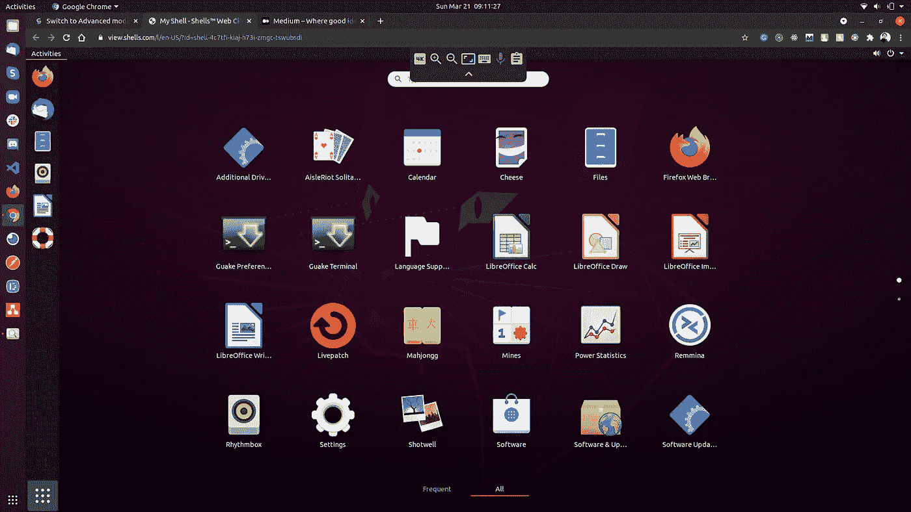
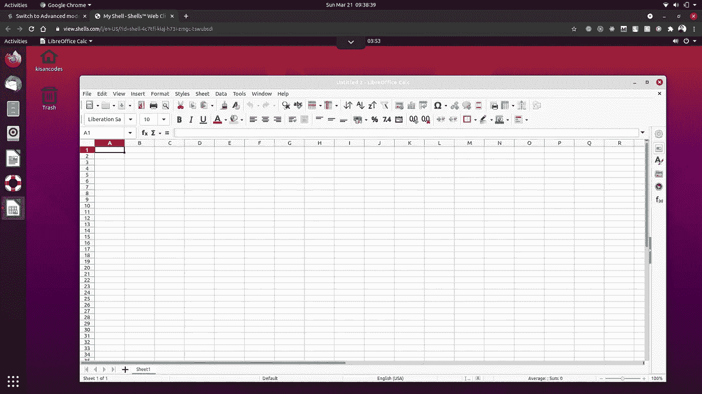

# 随时随地在任何设备的浏览器中运行 Linux

> 原文：<https://blog.devgenius.io/run-linux-in-the-browser-with-any-device-anywhere-b122ab70c844?source=collection_archive---------1----------------------->

## 在您最喜欢的浏览器中体验虚拟机

Ubuntu 20.04 LTS 炮弹

几年前，当我从 Windows 转向 Linux 操作系统时，一切对我来说都不容易。从 Windows 操作系统出来，你会错过很多图形的东西，比如 Adobe 软件，Microsft office 等等。

如果你的日常工作依赖于该软件，你不能在你的机器上安装 Linux，因为该软件在 Linux 机器上是不可用的。大多数人会向你推荐这些软件的不同替代品，但他们仍然不能像你用 adobe 或微软软件那样做。

现在 Linux 无处不在。它运营着国际空间站(ISS)、纽约证券交易所和其他关键任务项目。许多软件开发人员也更喜欢 Linux。

最近我发现了一个新的基于云的工具，叫做 shells.com来运行 Linux 机器。如果你不想安装并尝试这些 Linux 发行版，你可以使用 shells.com 的[来尝试。你所需要的只是一个浏览器和一个互联网连接。我已经用了一段时间了。这是一个很酷的想法——随时随地在任何设备上运行 Linux，强大的云计算机为其提供动力。](https://www.shells.com/?_a=NAtWu9)

# 什么是 Shells.com？

贝壳上的自由

Shells.com 是一项基于云的服务，在浏览器上运行 Linux，由一群云计算机提供支持。它能让你在任何设备的浏览器上体验虚拟机。

它可从以下网站获得:

## 谁会用贝壳？

Shells 是为每天使用 Linux 的人设计的。价格实惠。那些需要便携式电脑的人会发现它非常有用。

# Shells 入门

为了开始使用[Shells.com](https://www.shells.com/?_a=NAtWu9)，你需要先注册一个账户。你可以走了。添加您想要的任何 Linux(shell)发行版，就大功告成了。就这么简单。

# 包扎

我遇到过很多一开始就纠结于 Linux 的人，因为他们中的大多数人需要 Linux 上没有的 windows 软件。如果你真的不想在你的机器上安装 Linux，[shell](https://www.shells.com/?_a=NAtWu9)是你最完美的选择。你甚至不需要在 Virtualbox 或 VMWare 上安装它。你可以通过任何由云计算机驱动的设备将你的计算机带到任何地方。你可以在一分钟内尝试不同的发行版(Ubuntu，Debian，KDE 等)。

你觉得这个想法怎么样？请在评论中告诉我。