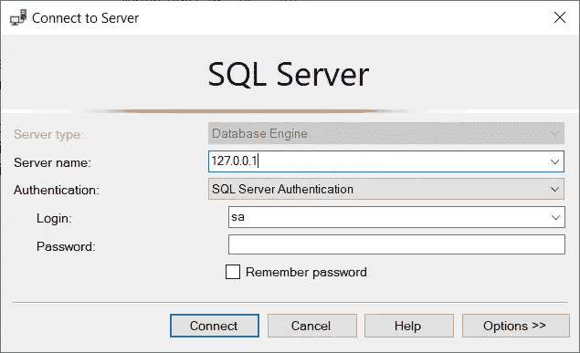

# 使用 Docker Desktop 在几分钟内运行 Microsoft SQL

> 原文：<https://blog.devgenius.io/run-microsoft-sql-in-minutes-using-docker-desktop-4e31f5e23083?source=collection_archive---------4----------------------->

你好世界！


今天，我们将看看如何在您的计算机上快速运行 Microsoft SQL Server，而不必以标准方式安装它。


在本教程中，我们将:

*   安装 Docker 桌面
*   下载 MSSQL 容器
*   运行容器
*   连接到服务器

# 0.要求和目标

对于本教程，您需要:

*   Docker 桌面
*   一个数据库工具(在本教程中我们将使用 [SSMS](https://docs.microsoft.com/it-it/sql/ssms/download-sql-server-management-studio-ssms?view=sql-server-ver16)

我们将在下一步安装 Docker 桌面。

本教程的目标是:

*   码头工人初学者
*   需要在计算机上安装 SQL server 实例的人

# 1.安装需求

# Docker 桌面

我们首先需要安装的是 Docker 桌面:

[](https://www.docker.com/products/docker-desktop/) [## Docker 桌面

### 安装 Docker 桌面-最快的容器化应用程序的方式。Docker 订阅服务协议有…

www.docker.com](https://www.docker.com/products/docker-desktop/) 

找到与您的操作系统和 CPU 架构匹配的版本并下载。之后，只需运行安装程序，并按照屏幕上的指示。如果你不能安装 Docker，你可能需要启用 WSL2 或 Hyper-V(如果你在 Windows 上)。官方文档中有更多相关信息:

[](https://docs.docker.com/desktop/windows/install/) [## 在 Windows 上安装 Docker 桌面

### 更新 Docker 桌面条款 Docker 桌面在大型企业(超过 250 名员工或…

docs.docker.com](https://docs.docker.com/desktop/windows/install/) 

安装完成后，您应该在操作系统上运行 docker。要检查一切是否正常，只需打开一个终端，写下:

`docker ps`

如果你的操作系统显示一个错误，可能是设置有问题(我建议你查看官方文档)。如果该命令有效，那么您就可以开始下一步了。

# 2.下载容器

现在我们需要检索包含我们需要的 MSSQL 版本的容器。您可以在此处找到可用容器的列表:

 [## Microsoft | Docker Hub 提供的 Microsoft SQL Server

### Docker 引擎的 Linux 上的微软 SQL Server 的官方图像。

hub.docker.com](https://hub.docker.com/_/microsoft-mssql-server) 

对于本教程，我将使用 2022 版的 MSSQL:

> 码头工人拉 mcr.microsoft.com/mssql/server:2022-latest

运行这个命令后，Docker 将开始把容器下载到您的机器上。

一旦下载完成，我们就可以运行我们的服务器实例了。

# 3.运行容器

要运行容器，我们需要将以下命令写入终端:

```
docker run -e "ACCEPT_EULA=Y" -e "SA_PASSWORD=yourStrong(!)Password" -p 1433:1433 -d mcr.microsoft.com/mssql/server:2022-latest
```

在该命令中，您可以更改两项内容:

1.  SA_PASSWORD:更改数据库的 sysadmin 用户的密码。这需要是一个强密码(所以一定要添加特殊字符，比如感叹号)。
2.  -p 1433:1433:这显示了我们将公开以连接到数据库的端口(公开:内部)。如果您已经在端口 1433 上运行了某个程序，那么您需要将其更改为其他程序

# 4.连接到数据库

要连接到数据库，您需要打开 DB tool 客户端并转到其连接向导。对 SSMS 来说，这应该马上开放:



这里我们需要写:

*   服务器名称:您的本地 IP (127.0.0.1)。如果你已经改变了端口，你需要在逗号后面写上(127.0.0.1，端口)
*   登录:sa(这是 sysadmin 用户)
*   密码:您在上一步中定义的密码

您现在应该连接到您的数据库:


# 捐款之类的

如果您愿意支持我，请考虑使用我的推荐订阅 Medium:

[](https://medium.com/@inzaniak/membership) [## 通过我的推荐链接加入媒体-翁贝托格兰多

### 阅读翁贝托·格兰多(以及媒体上成千上万的其他作家)的每一个故事。您的会员费直接支持…

medium.com](https://medium.com/@inzaniak/membership) 

如果您不想激活订阅计划，但仍想支持我，请考虑从 Bandcamp 购买我的音乐:

[https://inzaniak.bandcamp.com](https://inzaniak.bandcamp.com/)

# 其他 URL:

个人网址:[https://inzaniak . github . io](https://inzaniak.github.io/)
社交链接:[https://inzaniak.github.io/links.html](https://inzaniak.github.io/links.html)
Linkedin:[https://www.linkedin.com/in/umberto-grando-a8527b150/](https://www.linkedin.com/in/umberto-grando-a8527b150/)

