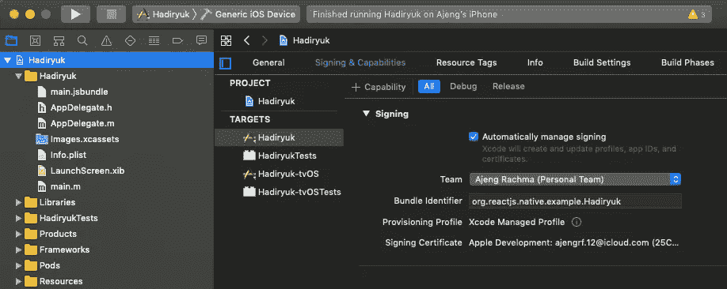
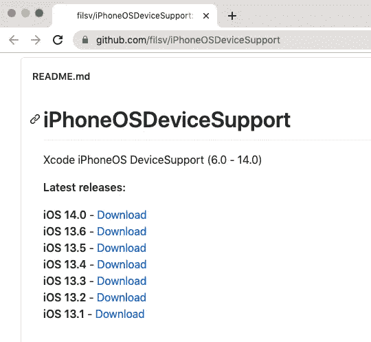
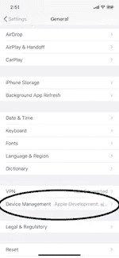

# 在 iOS 设备上运行 React 原生应用

> 原文：<https://blog.devgenius.io/run-react-native-app-on-ios-device-6e8c67afb44b?source=collection_archive---------1----------------------->

[Yura Fresh](https://unsplash.com/@mr_fresh?utm_source=medium&utm_medium=referral) 在 [Unsplash](https://unsplash.com?utm_source=medium&utm_medium=referral) 上的照片

如何在 iOS 设备上运行 react 原生应用？

如果你读了这篇文章，我假设你已经有一个 react 本地应用程序在开发中运行。首先要做的是用 USB 线把你的 iOS 设备连接到 Mac 上。打开你的 react 原生应用的目录，导航到 ios 文件夹，双击 ***。xcworkspace* 文件打开 Xcode。接下来，打开**产品**菜单，转到**目的地**，选择您的设备。**

如果你没有[苹果开发者](https://developer.apple.com/)账户，你必须创建一个，以便能够在 iOS 设备上运行你的项目。然后在**目标**中选择您的项目，并前往**签约&能力**选择您的团队。对测试目标进行同样的操作。

您现在可以构建和运行项目，如果一切设置正确，您的应用程序将在您的设备上启动。

但是当我构建我的项目时，我面临这个错误:

> *这款 iPhone 11 运行的是 iOS 13.5，这个版本的 Xcode 可能不支持。*

有两种方法可以解决这个问题，第一种是更新你的 Xcode。但是，还有一个更好的方法，那就是在[这里](https://github.com/filsv/iPhoneOSDeviceSupport)下载 Xcode 的支持文件。

Xcode iPhone OS 支持

下载您需要的版本，解压缩，关闭 Xcode，然后将文件放在这里:

/Applications/xcode . app/Contents/Developer/Platforms/iphone OS . platform/device support/

如果您重新打开 Xcode 并重新构建项目，您的应用程序应该会在您的设备上启动。耶！

照片由[布鲁斯·马尔斯](https://unsplash.com/@brucemars?utm_source=medium&utm_medium=referral)在 [Unsplash](https://unsplash.com?utm_source=medium&utm_medium=referral) 上拍摄

但话说回来，你在你的设备屏幕上看到“不可信的开发者”。好了，放松，在我们最终可以在我们的设备上运行应用程序之前，只剩下一步了。

在您的设备上，打开**设置**，转到**常规**，然后选择**设备管理**。然后，可以按 ***“信任:苹果开发者….”***

瞧，react 本地应用程序在 iOS 设备上成功启动！

希望有帮助！谢谢，注意安全！