# 运行您的。使用 Azure 批处理的 Azure 数据工厂中的. NET 代码

> 原文：<https://blog.devgenius.io/run-your-net-code-in-azure-data-factory-using-azure-batch-ecd2494c16f2?source=collection_archive---------7----------------------->

运行您的。NET 可执行文件(.在批处理服务下使用自定义活动

# 概观

当将 SQL Server 从内部迁移到云时，总会有人问如何将 SSIS 包或其他 ETL 作业迁移到云？Azure Data Factory SSIS 集成运行时(IR)提供在云中运行 SSIS 包。如果你想更深入地了解它，你可以阅读我的文章《如何使用 Azure Data Factory (ADF)中的 SSIS 集成运行时迁移你的 SSIS 包》,网址是[使用 Azure SQL Server 托管实例运行你的 SSIS 包|作者:Afzal Muhammad | Dev Genius](/run-your-ssis-packages-using-azure-sql-server-managed-instance-d98f652b9e82)

但是，在某些情况下，这些 ETL 作业或 SSIS 包运行可执行文件，如。作为工作流或 ETL 管道的一部分。如果您正在将在内部运行的 SQL Server 迁移到 PaaS，这将变得更具挑战性，因为无法访问 PaaS compute 来运行这些可执行文件。

在这些挑战中，Azure Batch 可以方便地解决这个问题。在本文中，我将设置 Azure Data Factory (ADF)管道，它将为批处理服务执行自定义活动。

## 本文是《在 Azure 批处理中运行您的应用程序》的扩展，作者是 af zal Muhammad | 2022 年 10 月| Medium 。

# 将项目上传到存储帐户

在 Visual Studio 中使用“自包含”发布项目后，压缩项目文件。将您的应用程序发布为*自包含*会生成一个包含。NET 运行库和库，以及您的应用程序及其依赖项。该应用程序的用户可以在没有的计算机上运行它。已安装. NET 运行时。

在存储帐户中创建一个容器，并在存储帐户中上传项目 zip 文件，如下所示。请确保此存储帐户也链接到 Azure 批处理帐户。

也上传 7z.zip 和 7z.dll。需要它们来解压缩代码文件。

您可以从以下网址下载 7zip

[下载(7-zip.org)](https://www.7-zip.org/download.html)

存储帐户容器的内容应该如下所示。

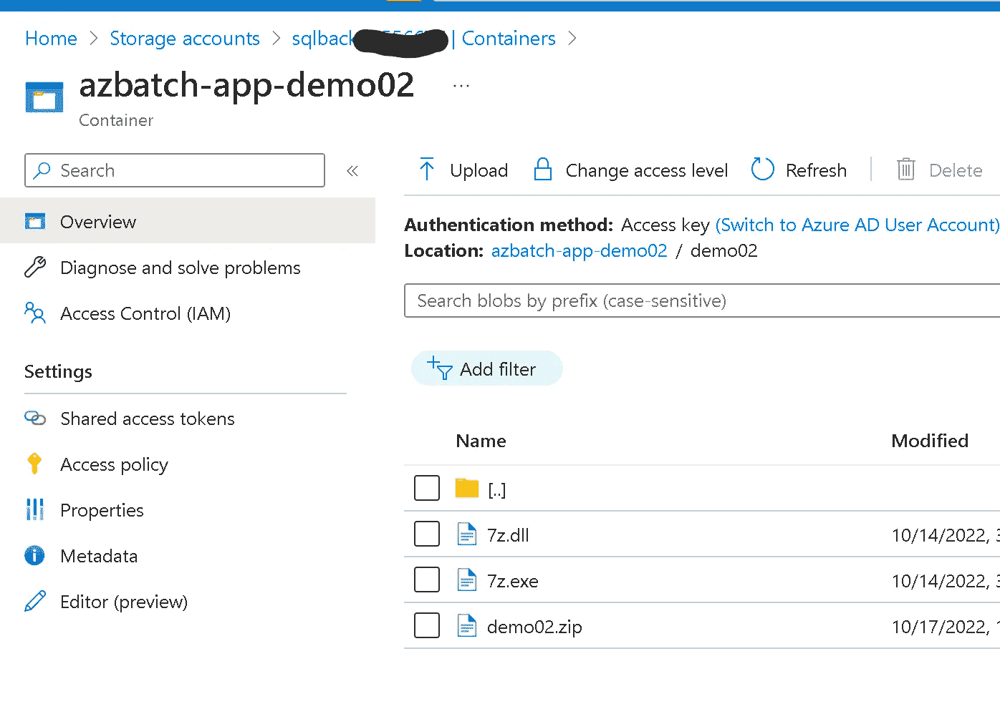

# 创建指向存储帐户的链接服务

创建指向存储帐户的链接服务。在 ADF 中，单击管理→链接服务→新建

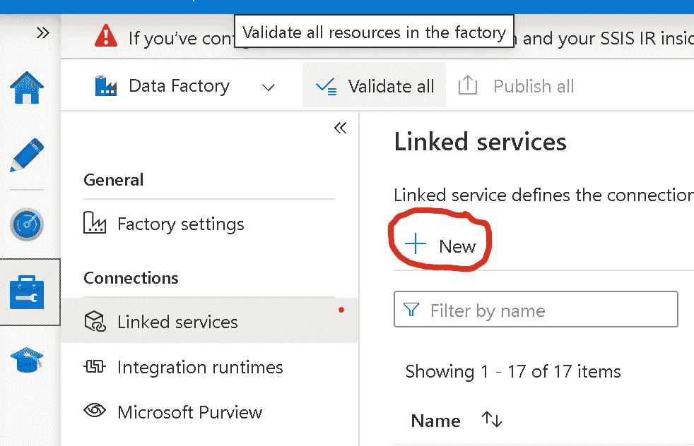

寻找天蓝色斑点。选择 Azure Blob 存储。

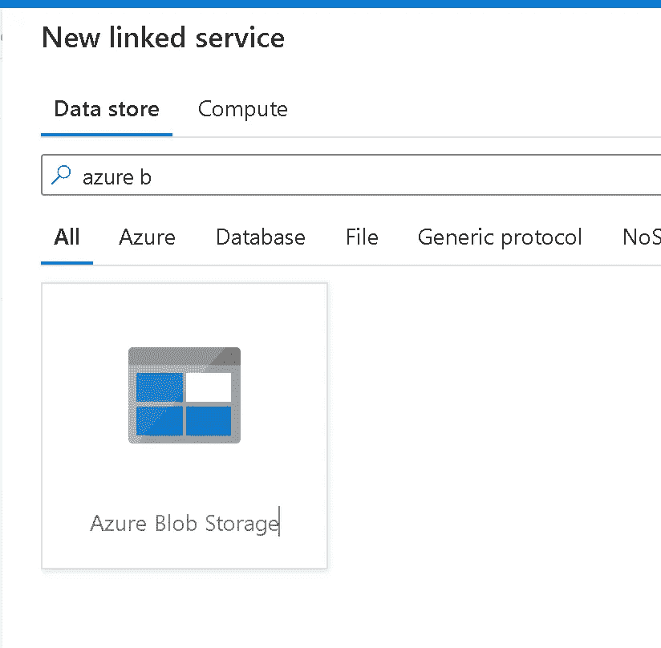

使用访问密钥连接到存储帐户，并测试连接。在生产设置中，建议使用 Azure Key Vault。

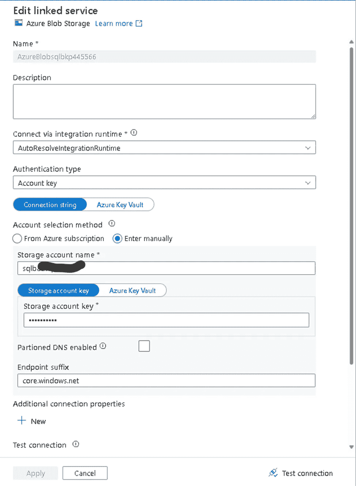

# 创建 Azure 批处理帐户的链接服务

创建 Azure 批处理帐户的链接服务。在 ADF 中，单击管理→链接服务→新建

寻找 Azure batch 并选择 Azure Batch

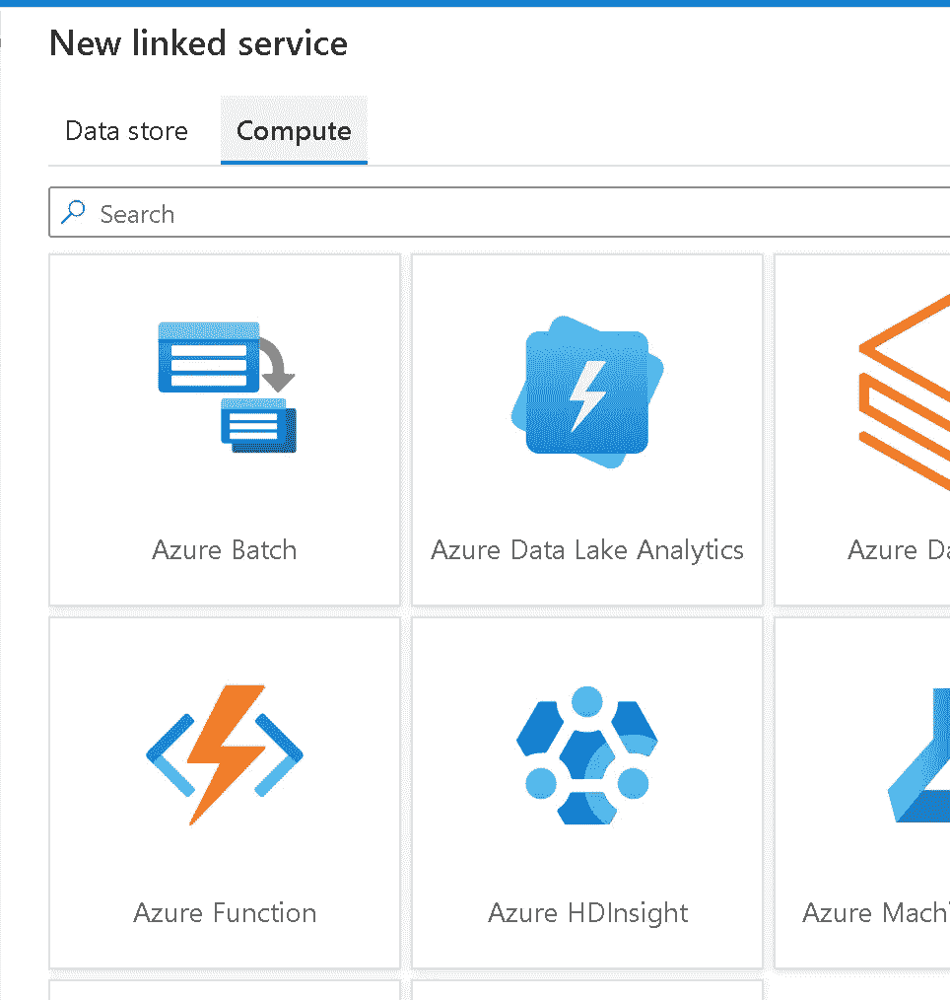

如下所示创建 Azure Batch link 服务。建议将 Azure Key Vault 用于访问密钥。

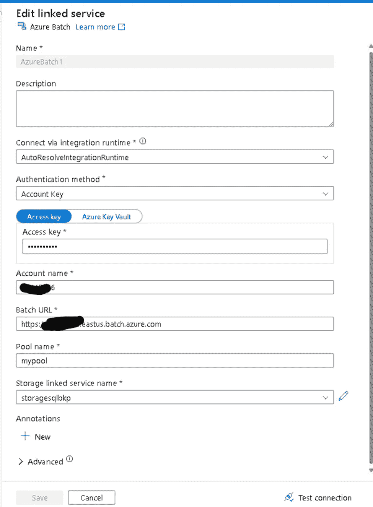

# 创建管道

点击作者→+→管道→管道，如下图所示。

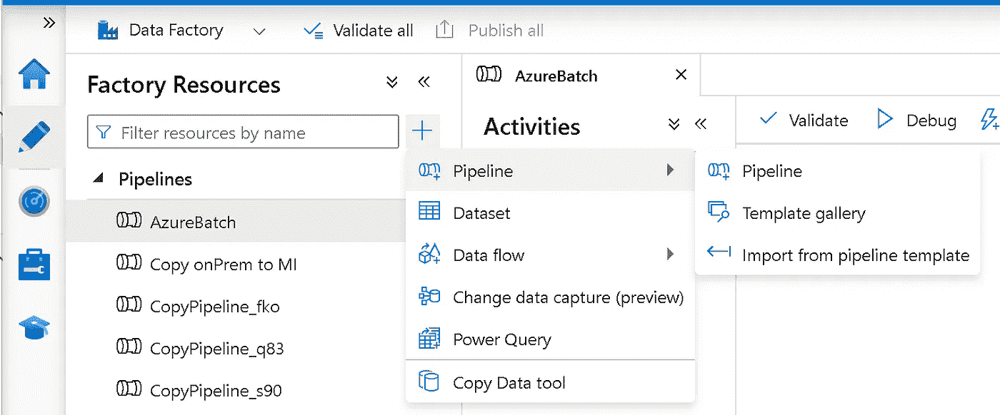

## 添加自定义活动

要在管道中使用自定义活动，请完成以下步骤:

1.  在 pipeline Activities 窗格中搜索 *Custom* ，并将一个自定义活动拖到 pipeline 画布上。
2.  如果尚未选择，请在画布上选择新的自定义活动。

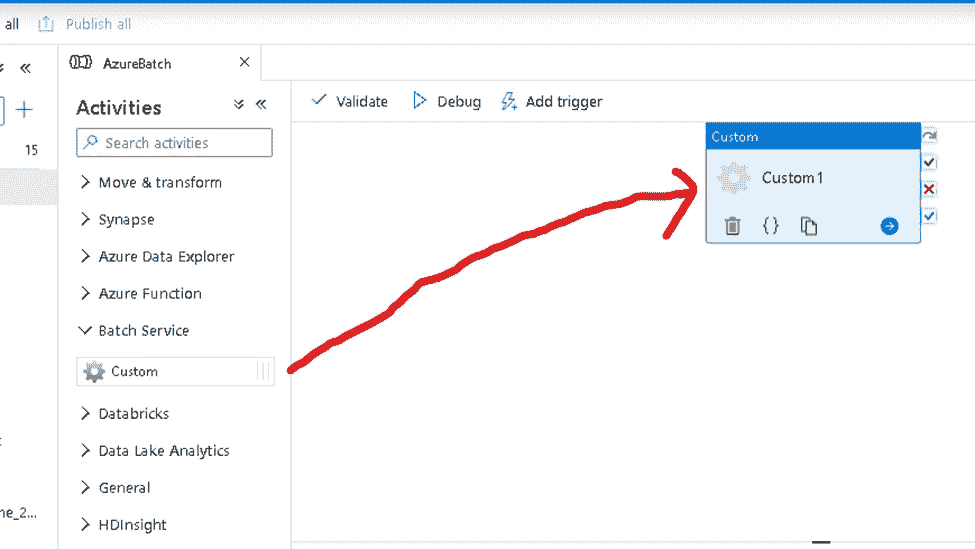

3.选择“Azure Batch”选项卡以选择或创建将执行自定义活动的新 Azure Batch 链接服务。

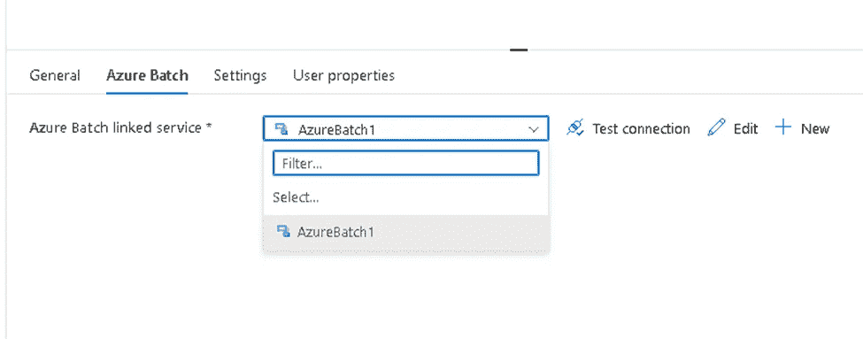

4.选择设置选项卡。

5.键入以下命令

```
cmd /c “7z e -y demo02.zip && demo02.exe”
```

6.选择 blob 存储链接服务。这是 Azure storage 链接到存储自定义应用程序的存储帐户的服务。

7.指定自定义应用程序及其所有依赖项的文件夹路径

8.确保通过单击测试连接到达存储 blob

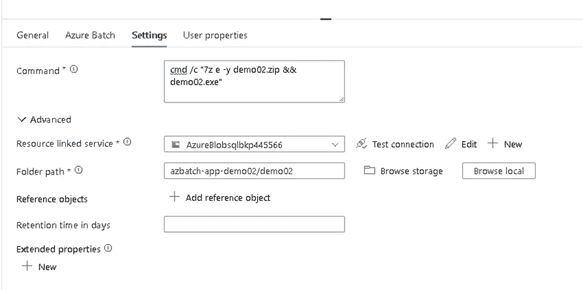

# 管道运行

发布管道，然后单击添加触发器→立即触发

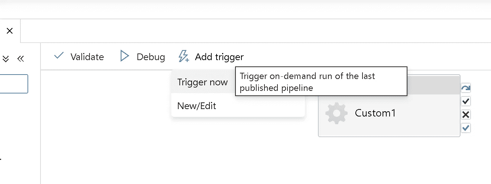

看看管道运行。监控→管道运行

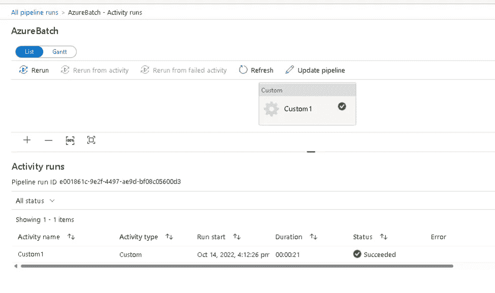

# 使生效

现在让我们验证一下是否一切正常！！！

在验证过程中，请遵循以下步骤。

访问 Azure 批处理帐户。单击作业。你会看到如下所示的“adfv2- <pool name="">”。点击此工作 ID。</pool>

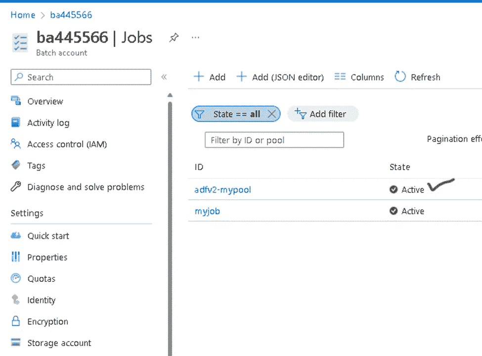

单击 ADF 由于管道运行而创建的任务。任务一旦提交，就进入“运行”阶段，然后“完成”，如下所示。

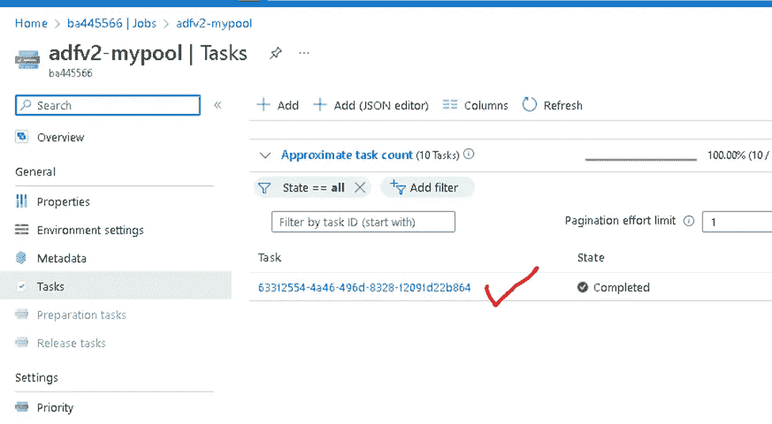

点击任务。然后单击 stdout.txt。如果任务由于某种错误而失败，您可以在 stderr.txt 文件中看到错误。

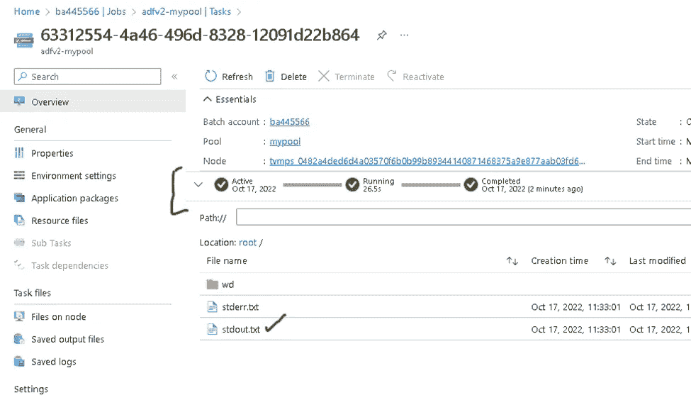

下面是在计算节点中作为任务运行的控制台应用程序的输出。

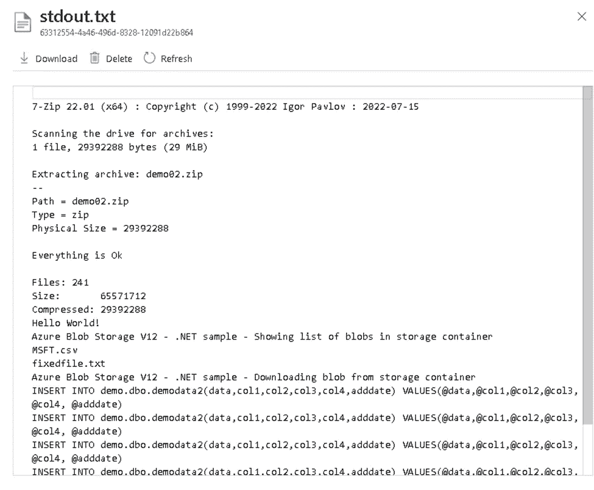

# 验证 SQL MI 中的输出

C#代码从存储帐户下载文本文件，解析/转换它，然后将数据上传到 SQL MI 数据库表中。这可以通过运行如下所示的 SQL 查询来验证。

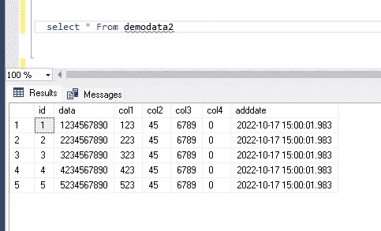