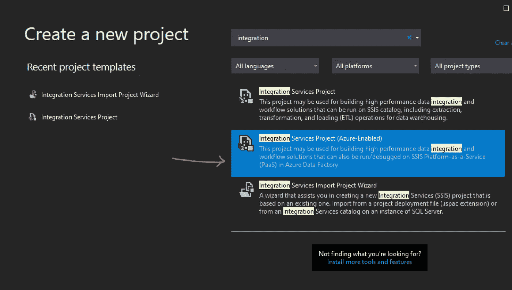
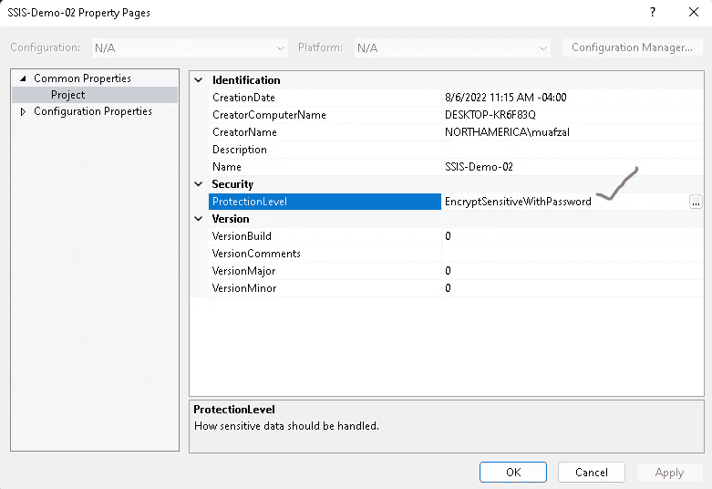

# 使用 Azure SQL Server 托管实例运行 SSIS 包

> 原文：<https://blog.devgenius.io/run-your-ssis-packages-using-azure-sql-server-managed-instance-d98f652b9e82?source=collection_archive---------8----------------------->

## 迁移 SSIS 软件包选项— IaaS 或 PaaS

# 介绍

与在 Azure 上运行相比，使用本地 SQL Server 的 SSIS 的工作方式有所不同。此外，并不是所有的 SSIS 包都是云原生的。如果我们计划迁移本地 SSIS 包，我们需要非常详细地了解我们的选项。从广义上讲，有两个主要选择:

1.  将 SSIS 软件包迁移到 IaaS
2.  将 SSIS 软件包迁移到平台即服务

将 SSIS 迁移到 IaaS 与它在内部运行的方式有些相似。在这个选项中，您在 Azure 基础架构上配置一个虚拟机，安装 SQL Server Integration Services，安装后您可以在 SSIS 数据库或文件系统上部署您的包。这消除了迁移过程中的许多繁重工作。然而，它伴随着管理开销。此外，这种方法不是云原生的，这限制了您迈向 ETL 现代化的旅程。

第二种方法是使用 Azure Data Factory (ADF)迁移 SSIS 包，并利用 Azure SSIS 集成运行时(IR)。Azure SSIS IR 是一个 Azure 虚拟机的托管集群，您可以在其中执行 SSIS 包。通过创建 IR，您可以指定节点的计算能力(纵向扩展)以及集群将拥有的节点数量(横向扩展)。

本文描述了如何使用 Azure SQL Server 托管实例(MI)运行存储在文件系统(如 Azure 文件)中的 SSIS 包。

# 先决条件

阅读在 SQL Server MI 中运行 SSIS 包的先决条件非常重要。

要使用此功能，[下载](https://docs.microsoft.com/en-us/sql/ssms/download-sql-server-management-studio-ssms)并安装最新的 SQL Server Management Studio (SSMS)。版本支持详情如下:

*   要在 SSISDB 或文件系统中运行包，请安装 SSMS 版本 **18.5** 或更高版本。
*   要在包商店中运行包，请安装 SSMS 版本 **18.6** 或更高版本。

## ***你还需要*** [***在 Azure 数据工厂中提供一个 Azure-SSIS 集成运行时***](https://docs.microsoft.com/en-us/azure/data-factory/tutorial-deploy-ssis-packages-azure) ***。SSIS IR 使用 SQL 托管实例作为端点服务器。***

SQL Server MI 使用 SSIS 集成运行时作为运行包的计算引擎。SQL MI 是 PaaS，SSIS 不使用 SQL MI 计算引擎作为运行您的 SSIS 软件包的来源。

SSIS IR 使用 vNET 注入，可以注入到 SQL MI vNET 的子网中。请记住，它不能注入到 SQL MI 子网的子网中，因为该子网仅专用于 SQL MI。如果它被注入到 vNET 而不是 SQL MI，请确保 vNET 对等或站点到站点 VPN 必须配置为从 SQL MI 访问 Azure VM 的 SSIS IR 管理的群集。

# 高层建筑

该设置的高级架构如下所示。

该架构为 Azure 数据工厂提供私有端点。

*   应该使用私有端点设置存储帐户，并将其连接到受管实例 vNet 的一个子网
*   SSIS-IR 应该配置有到相同子网的 vNet 注入
*   或者，您也可以配置 VPN 网关，通过自托管集成运行时(SHIR)连接您的内部 SQL server
*   为安装 SSIS-IR 的子网配置防火墙规则，以允许端口 29876 和 29877

# 在 Azure 数据工厂(ADF)中设置 SSIS IR

阅读我下面的文章来设置 ADF 中的 SSIS IR。它涵盖了如何在 Azure Data Factory 中设置 SSIS IR 的分步过程

> [*了解 SSIS 包迁移到 Azure 数据工厂。*](https://muafzal.medium.com/understanding-ssis-packages-migration-to-azure-data-factory-6e07d9957f5d)

您可以在 ADF 的集成运行时选项卡中验证 SSIS IR 的成功运行状态，如下所示。

# 在 Visual Studio 中创建 SSIS 包

下一步是安装 Visual Studio 数据工具，其中安装了在开发人员工作站上本地创建 SSIS 包所需的包和块。

通过从以下链接下载 azure 2017 集成服务功能包来安装它

[从微软官方下载中心下载 Microsoft SQL Server 2017 Integration Services Feature Pack for Azure](https://www.microsoft.com/en-us/download/details.aspx?id=54798)

通过选择任一 integration services 项目模板，创建如下所示的新项目

右键单击项目，然后单击“属性”。将保护级别设置为**encryptsensitivithpassword**。这将加密与包相关的敏感信息，如包中指定的 SQL 密码和其他访问密钥。

提供加密密码。在 SQL MI 中配置 SSIS 程序包作业时，您将需要此密码

## 包装设计

现在在 VS 中创建一个包。创建一个分步的包超出了本文的范围。为了简单起见，设计了一个包作为概念验证，如下所示。这个包从 SQL MI 表中读取数据作为源，并将其作为 CSV 格式存储在 Azure 存储中作为接收器或目的地。一旦完成，包将看起来如下所示。

程序包准备就绪后，确保程序包没有任何错误。右键单击项目并选择 Build 菜单项，如下所示。

“输出”选项卡将显示成功的构建。

现在将 package.dtsx 文件复制到 Azure 存储帐户中。

本文不包括在集成服务目录中部署包。SSIS 目录数据库使管理、执行、迁移和计划包变得更加容易。要将包部署到 SSIS 数据库目录中，请阅读我下面的详细文章[了解 SSIS 包迁移到 Azure 数据工厂|作者:Afzal Muhammad | Medium](https://muafzal.medium.com/understanding-ssis-packages-migration-to-azure-data-factory-6e07d9957f5d)

SSIS 目录数据库是在 SQL Server 2012 和 SQL Server Integration Services(SSIS)的早期版本中引入的，我们过去将 SSIS 包保存在文件共享或 MSDB 中，并将配置数据保存在 XML 或 SQL 数据库中。仍然有许多企业在使用独立的软件包，并期待着迁移和现代化战略。

# 创建 SQL Server 代理作业

将 package.dtsx 文件复制到存储帐户后，启动 SQL Server Management Studio (SSMS)并连接到 SQL MI。

展开 SQL Server 代理→作业。右键单击并选择“新任务”，如下所示。

在常规选项卡中，指定作业的名称和所有者。

在步骤选项卡中，单击“新建”。提供步骤名称并单击类型下拉列表。选择“SQL Server Integration Services 包”，如下所示。

在包选项卡下，单击包位置下拉列表，然后选择文件系统。

点击文件源类型下拉菜单，并选择 Azure 文件存储

包路径是`\\<storage account name>.file.core.windows.net\<file share name>\<package name>.dtsx`。

在“包文件访问凭据”下，输入 Azure 文件帐户名和帐户密钥以访问 Azure 文件。域设置为 Azure。

提供我们之前在 VS 中为保护级别设置的加密密码。

单击确定。

现在，右键单击“作业”,然后单击“在步骤开始作业”,如下所示。

这将启动 SSIS 包的执行，并使用 SSIS IR compute 来运行该包。

# 将 SSIS 作业迁移到 ADF

SSMS 也可用于将相同的作业迁移到 ADF。右键单击作业并选择“将 SSIS 作业迁移到 ADF”

现在按照 SSIS 工作迁移向导进行操作

在 ADF 中选择 SSIS IR。

为来源和目的地创建 SSIS 程序包映射。在这种情况下，源和目标是相同的，如下所示。

选择需要迁移的作业。

域→Azure

用户名→包含包的存储帐户

密码→存储帐户访问密钥

加密密码→VS 中保护级别的包设计期间配置的加密密码

为迁移的 ADF 的 Azure 资源管理器(ARM)模板配置输出路径

单击迁移

成功迁移后，启动 ADF。你会发现一条管道

点击“执行 SSIS 套餐”活动。然后选择“Settings”选项卡，以验证与我们之前在迁移向导中指定的内容相匹配的包位置和包访问凭据。

现在，SSIS 包将在 ADF 中的“执行 SSIS 包”活动中运行。单击添加触发器→立即触发以执行管道。

# 将 SSIS 安排在蔚蓝色

在 SSMS，SSIS 软件包可以被安排在 Azure 上运行。**该特性会在您的 ADF 下自动创建数据集成管道、活动和触发器，这意味着它会像我们在前面的步骤中解释的那样首先进行迁移。**

要在 Azure 中安排 SSIS，右键单击 Jobs 并选择“在 Azure 中安排 SSIS ”,如下所示。

它首先验证 SSIS 红外。确保 SSIS IR 已全部设置并处于运行状态。否则，这将无法进行。

阅读 blow note，因为它提到了其管道、活动和触发器的创建。

在“包”选项卡中，单击“包位置”下拉列表中的“文件系统”。

指定包路径和访问凭证，类似于我们在本文档前面几节中所做的。

单击“时间表”选项卡并指定时间表。这将在 Azure Data Factory 的 ADF →Manage →Triggers 部分创建一个管道触发器。单击“确定”完成向导。

登录 ADF 并在 ADF→管理→触发器中验证触发器

**结论**

您可以在 ADF 中创建一个 Azure-SSIS IR 来本机执行驻留在 SQL 托管实例中的 SSIS 包。