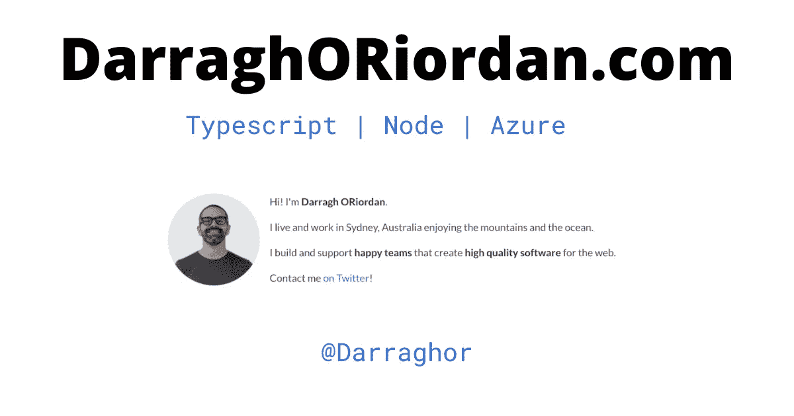

# 在 Dokku 中使用 Postgres 运行 NodeJS 应用程序

> 原文：<https://blog.devgenius.io/running-a-nodejs-app-with-postgres-in-dokku-a1d3f160956d?source=collection_archive---------21----------------------->


由 [NASA](https://unsplash.com/@nasa?utm_source=medium&utm_medium=referral) 在 [Unsplash](https://unsplash.com?utm_source=medium&utm_medium=referral) 上拍摄的照片

我有一些看不到太多流量的副业，所以我在一个 5 美元的数字海洋水滴上运行它们。

Dokku 是一个开源的类似 Heroku 的平台。在一个 Dokku 实例上创建和维护多个应用程序非常容易。非常适合 solo 制作者。

你可能想要的大多数公共服务都有插件，比如 PostgreSQL 或 Redis。

这是我们要做的

1.  Dokku 简介
2.  如何运行 Dokku 实例
3.  创建新的 Dokku 应用程序
4.  添加数据库服务
5.  公开数据库以进行调试和测试(可选)
6.  向应用程序添加域
7.  为您的应用程序添加任何配置变量
8.  向应用程序添加 SSL
9.  将 Dokku 遥控器添加到您的应用程序中
10.  将您的应用程序推送到 Dokku
11.  维护您的 Dokku 服务器

# 1.为什么是多库？

我没有时间担心任何个人项目的基础设施，我也不想为他们学习新技术。Dokku 用一个漂亮的 CLI 来管理应用程序。DigitalOcean 将服务器管理包装在一个漂亮的 web UI 和 CLI 中。简直绝配！

对于实现，我希望 monorepos 和 monoliths 和关系数据库，因为这是我最了解的。我并不是说这比其他选择更好，这只是我技能的最佳运用。

所以如果你也想跑独石，看看 dokku 吧！

# 2.获取 Dokku 实例

数字海洋有一个便宜的液滴，你可以用。因此，请访问数字海洋，创建一个新的“Dokku”droplet，并按照他们的说明设置如何登录到您的新 droplet。你可以使用[一个推荐链接](https://m.do.co/c/1ee4e460bc81)免费获得一个 droplet。

您需要使用 SSL 连接到 DigitalOcean droplet。为此，您必须使用现有的证书或创建一个新的证书，并使用数字海洋的用户界面将公钥上传到服务器。

```
# generate a new certificate 
ssh-keygen -t ed25519 -C "your_email@example.com" # when asked for a name call it "digitaloceandokku" or similar 
# enter a pass phrase 
# add the cert to ssh agent ssh-add -K ~/.ssh/digitaloceandokku
```

将公钥上传到数字海洋。

如果您还没有一个文件，现在添加一个`config`文件到`~/.ssh`目录。您需要在这里添加一个条目，让 macos 使用 keychain 来储存您的密码短语，并为您自己提供一个连接到新服务器的快捷方式！

```
Host dokku-as-darragh 
  HostName 123.123.123.123 # replace with your IP User root
  IdentityFile ~/.ssh/digitaloceandokku # replace with your cert
  AddKeysToAgent yes 
  PreferredAuthentications publickey 
  UseKeychain yes 
  IdentitiesOnly yes
```

现在你应该能够轻松地连接到你的数字海洋水滴

搞定了。您应该会看到一个提示，其中包含要访问的设置 url。去那里看看，然后按你喜欢的方式布置。如果你对 ssh 有问题，你可以在这里阅读我的关于开放 ssl 配置的文章。

我建议给 Dokku 实例添加一个域名，并让它使用虚拟主机。使用此配置，您将获得每个应用程序的新 url，例如`my-app-name.mydomain.com`。

现在您可以开始使用`dokku`命令了。如`dokku apps:list`。

# 关于冻结终端和 ssh 的注意事项

当您打开 ssh 连接时，它会接管您的输入，因此常规的退出和退出命令不起作用。如果您不使用 ssh 会话，它将在数字海洋端关闭，但不会在您端关闭。终端似乎已经“冻结”。

您可以用`~.`终止 ssh，这将把您带回您的终端。

# 3.创建应用程序

我们将为 dokku 添加一个名为`house-lister`的应用程序。

```
dokku apps:create house-lister
```

# 4.添加数据库服务

如果您还没有在实例上使用 Postgres，您必须安装插件

```
sudo dokku plugin:install https://github.com/dokku/dokku-postgres.git postgres
```

现在添加一个数据库，并将其链接到新的应用程序

```
dokku postgres:create houselisterdatabase dokku postgres:link houselisterdatabase house-lister
```

# 5.公开数据库以进行调试和测试(可选)

Dokku 使用内部网络，因此您的数据库免受攻击者的攻击。如果您想临时连接到它进行调试，那么您可以使用下面的方法将其公开到 internet。

```
dokku postgres:expose houselisterdatabase 5432 # un-expose the DB when done! dokku postgres:unexpose houselisterdatabase
```

小心那个。让数据库一直处于打开状态是不必要的，也是有风险的。

# 6.向应用程序添加域

您可以添加域名，使应用程序在互联网上可见。

您必须添加一个指向 DigitalOcean droplet 的 IP 地址的 DNS 记录。您可以添加一个通配符来简化操作，也可以添加特定的地址。

你可以在这里阅读更多关于 DNS 和域名如何工作的信息[。](https://www.darraghoriordan.com/2021/12/12/squarespace-dns-domain-ips/)

在 Dokku 上分配域的命令有

```
# list existing domains 
dokku domains list house-lister # add domains 
dokku domains add house-lister house-lister.mydomain.com # remove any default domain you don't need - dokku allows you to have multiple domains on the instance dokku domains:remove house-lister house-lister.anotherdomain.com
```

# 7.为您的应用程序添加任何配置变量

你可能需要为 dokku 插件添加一些环境变量。例如，参见下面的“让我们加密”。

do kku config:set house-lister APP _ ENVIRONMENT _ VAR _ ONE = ' the value ' APP _ ENVIRONMENT _ VAR _ TWO = ' the value '

# 8.向应用程序添加 SSL

这是可选的，但是现在推荐使用 SSL，而且它是免费的。

Dokku 有一个让我们加密的插件。如果它不在那里，你必须安装它。

```
sudo dokku plugin:install [https://github.com/dokku/dokku-letsencrypt.git](https://github.com/dokku/dokku-letsencrypt.git)
```

您需要配置一些 env 变量，因此让我们加密您的电子邮件地址。外挂文档值得一读:[https://github.com/dokku/dokku-letsencrypt](https://github.com/dokku/dokku-letsencrypt)

不要忘记设置一个 cron 来每 30 天左右自动更新你的证书。

```
# Enable SSL for the application dokku letsencrypt:enable house-lister
```

# 9.将 Dokku 遥控器添加到您的应用程序中

Dokku 使用 Git 进行部署。您将应用程序推送到 dokku remote 并触发构建。

在您的`**local computer**`上运行此程序，同时在您的应用程序代码中创建新的遥控器。

注意，这次不是根用户

请注意，这不是在 digital ocean droplet 上运行，而是在本地计算机的应用程序存储库中运行。

```
git remote add dokku dokku@dokku-as-darragh:house-lister
```

# 10.将您的应用程序推送到 Dokku

在您的本地机器上运行这个

```
git push dokku master:master
```

搞定了。您应该会看到应用程序部署成功。

# 关于证书错误的一个注记

如果在设置证书时出现此错误，您可能在为应用程序设置域之前尝试添加证书。

```
nginx: [emerg] cannot load certificate "/home/dokku/house-lister/tls/server.crt": BIO_new_file() failed (SSL: error:02001002:system library:fopen:No such file or directory:fopen('/home/dokku/house-lister/tls/server.crt','r') error:2006D080:BIO routines:BIO_new_file:no such file)
```

这种情况将应用程序网络设置为不良状态。您可以使用下面的命令进行清理

```
# clean up 
dokku proxy:ports-remove myapp 443 dokku domains:set myapp myapp.com.br www.myapp.com.br # now add the cert again dokku letsencrypt myapp
```

# 11.维护您的 Dokku 服务器

你必须自己维护水滴。只要你记得登录和`apt update && apt upgrade`。

您还应该偶尔更新您的 dokku 实例。

```
sudo apt-get update dokku apps dokku ps:stop <app> sudo apt-get install -qq -y dokku herokuishdokku ps:rebuildall
```

用插件升级来跟进 dokku 升级

```
dokku plugin:update postgres
```

# 摘要

Dokku 使运行个人项目的网络应用程序变得容易。每月 5 美元对于你从数字海洋中得到的东西来说是惊人的价值。你可以通过[一个推荐链接](https://m.do.co/c/1ee4e460bc81)免费获得一个 droplet。

我们大多数个人项目的使用率都很低，因此 droplet 足以运行多个应用程序。

如果文章中的任何内容对你不起作用，请在 Twitter 上联系我！



*原载于*[](https://www.darraghoriordan.com/2021/12/29/run-node-app-postgres-dokku-digital-ocean/)**。**