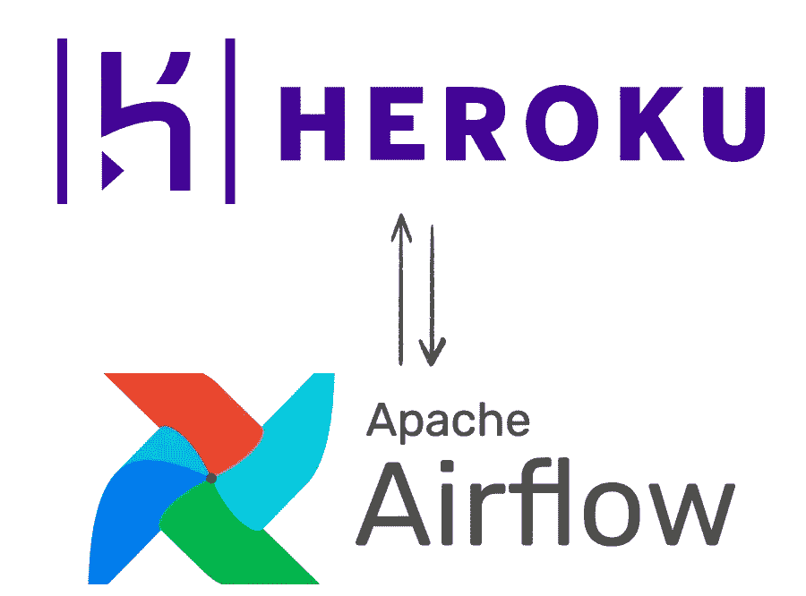

# 开始在 Heroku 上使用气流(第二部分)

> 原文：<https://blog.devgenius.io/running-airflow-on-heroku-part-ii-c9797a36f11f?source=collection_archive---------3----------------------->

在前一篇文章中，我们将环境配置为在本地运行`Airflow`。在本文中，我们将配置您的`Heroku`,并对我们的应用程序进行第一次部署。

在本文中，我们将讨论一些主题:

*   配置 fernet 密钥
*   使当地环境更类似于生产
*   在`Heroku`设立项目
*   在`Airflow`中创建认证用户
*   部署

听起来很多，不是吗？但是你会发现这些步骤都很简单。我还会教你一些技巧，这样我们就可以让你的`Airflow`在`Heroku`自由层中更有活力和效率。

# 配置 Fernet 密钥

此时，我们需要创建一个名为`generate_kernet_key.py`的文件，我们将使用它来生成一个敏感数据加密密钥，供`Airflow`使用。

# 将本地环境设置得更像生产环境

`Heroku`是一个出色的平台，让我们实施应用变得更加容易。但正如我们所知，开发任何一种更接近实际运行的应用总是好的，为此我们将做一些改变，使您的本地环境运行起来与我们在`Heroku`中发现的非常相似。为此，我们需要更改运行`airflow db init`命令时创建的`airflow.ctg`文件。

这个文件只在本地使用，但是让我们把它做成我们在生产中会看到的样子。在该文件中，我们将修改以下数据:

*   定义气流的 PostgresSQL 关系数据库
*   注册适当的执行者类型来运行我们的 DAGS
*   通过我们的`generate_fernet_key.py`脚本用 Fernet 生成一个密钥

让我们进行以下更改:

有了这些设置，我们的`Airflow`将使用 PostgreSQL 数据库来存储 DAGS 及其执行的元数据。

现在让我们删除我们的`airflow.db`文件，并重新运行我们的`airflow db init`命令，以便我们的迁移应用到数据库。

# 在 Heroku 建立项目

在这一步，我们将配置`airflow`以便在`Heroku`上运行时正确工作，因此我们需要设置一些环境变量。

*在本帖中，我们假设您已经创建了 Heroku 帐户并在本地进行了配置。*

为此，我们将使用`config:set` let's go？

用这两个命令，我们在 **Heroku** 上创建你的应用，并添加 **Postgres** 到其中。

现在我们将设置在`heroku:`中运行气流所需的变量

现在我们已经定义了我们的设置，让我们进入整个过程中最简单的部分，创建我们的`Procfile`文件。这个文件是 Heroku 用来运行你的应用程序的，在这个文件中，我们将传递我们想要 Heroku 运行的命令，以使我们的气流正常工作。

在您的`Procfile`文件中，它应该包含以下几行:

# 在气流中创建用户

在上一篇文章中，我们的用户是由 airflow 自动创建的，在本文中，我将教您如何使用您的密码创建您的用户，只需运行以下命令:

选择你的密码，快乐❤️

# 部署到 Heroku

现在，我们可以进行第一次部署了，只需在您的命令终端中输入 3 行代码，就可以完成部署:

一旦完成，你的应用程序将安静地运行在 Heroku 上，在下一篇文章中，我们将介绍如何创建功能性 Dag 并最大限度地利用 airflow 的电力。再见🚀