# 使用 Python UDFs 在生产中运行 dbt

> 原文：<https://blog.devgenius.io/running-dbt-in-production-with-python-udfs-ec28744d619?source=collection_archive---------2----------------------->

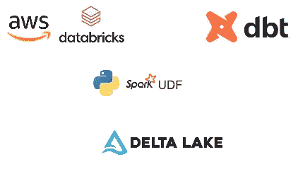

## 组织方面

dbt 和 databricks 证明了自己是 SQL 转换工具和 spark warehouse 的有力结合。除了增量表的优势(如写入的原子性)和数据块的特殊功能(如优化的文件大小)之外，3D (dbt、数据块、增量)组合还可以作为数据工程的强大工具和现代数据堆栈的核心部分。

3D synergy 使我们在 Explorium 迈出了一大步，这是任何数据发现组织都必须执行的一步，以证明其可扩展性-让您的数据工程师构建框架，而不是管道。

> [*Explorium*](https://www.explorium.ai/) *通过将组织的数据与世界上最可靠的来源相集成，使组织能够找到正确的数据，构建预测模型，并做出明智的业务决策。*

随着您的数据团队的增长，劳动分离的价值变得清晰，对数据工程师的需求减少。数据产品开发人员和分析师是那些拥有领域专业知识的人，他们是那些生活和呼吸特定数据集的人，他们使用 SQL 构建转换逻辑。数据工程师的角色变得与管道有些正交，他的主要职责是提供一种简单的、很少或没有代码的标准化方法来构建 ETL，如何确保数据质量和新鲜度，并提供监控管道、数据谱系和数据目录的能力。

如标题所示，我们将主要讨论数据转换部分。更重要的是，我们将展示责任分离框架概念实际上是如何允许您将组织的不同部分粘合在一起的。在 Explorium 中，软件工程团队开发 python 库——实体转换器已经有很长一段时间了。这个库是我们 Explorium 数据模型库的一部分。听起来像是全球性的，这些转换器是一个大型软件项目的一部分，确保对实体是什么以及每个数据记录如何适应我们庞大的知识图表进行复杂的验证。

作为转换器的一个更具体的例子，我们使用 **libpostal，**一个 C 库，使用统计 NLP 解析/规范化世界各地的街道地址。这样一个包含在我们的 python 库中的库当然可以在 PySpark 作业中使用。然而，接下来我们需要用预安装的 C 库来配置机器环境。这是每个开发人员都需要的。别忘了 dbt 不能注册 python UDFs。抛开无代码的纯 SQL 标准化方法不谈。那么，如何将 python 项目的强大功能转化为自动化的无代码 ETL 基础设施呢？或者简单地说，如何使所有这些转换器在我们所有的 dbt 项目中作为 SQL 函数可用？

## 技术方面

这篇文章的目的是描述一个高层次的解决方案，然而，这将是有帮助的，而不必深入到一些使这个解决方案可行的非平凡的技术细节。

首先，让我们回顾一下 dbt 项目开发的过程，以及我们可以使用哪些 udf 注册选项。值得一提的是，我们只讨论 dbt-core 及其扩展，而不是 dbt-cloud。

dbt-spark 或 dbt-databricks 是 python 库，可以用作 cli 工具，在本地机器上开始开发项目。为了在样本数据上运行或调试它，我们将其配置为使用 sql-endpoint 或 cluster。下面是分别用于 SQL 和集群的两个概要文件:

```
sql-serverless:
  outputs:
    dev:
      host: *.cloud.databricks.com
      http_path: /sql/1.0/endpoints/***
      schema: hive_metastore.silver_dev
      threads: 4
      token: ***
      type: databricks
  target: dev

cluster:
  outputs:
    dev:
      host: ***.cloud.databricks.com
      http_path: sql/protocolv1/o/***
      schema: silver_dev
      threads: 4
      token: ***
      type: databricks
  target: dev
```

请注意，由于 SQL 端点使用 Unity Catalog，因此您必须指定 hive_metastore。所有配置单元表访问的前缀。我们使用 AWS Glue，silver_dev 是 Glue“数据库”之一。
之后，假设你已经安装了 dbt-databricks，你可以运行:
`dbt run --profiles-dir profiles_dir --profile sql-serverless` 或者
`dbt run --profiles-dir profiles_dir --profile cluster`

第一个选项响应速度更快，因为没有集群启动时间。
现在假设我们想在模型中使用 spark udfs。其中一个选择是用 Scala/Java 实现它们，例如用于计算 [h3](https://www.uber.com/en-IL/blog/h3/) 的 udf:

```
package ai.explorium.dbtUdfs

object GeoUdfs {
  val *h3Core* = H3Core.*newInstance*()
  val *h3ify*: (Double, Double, Int) => String = (lat, lon, res) => *h3Core*.geoToH3Address(lat, lon, res)
  val *h3Udf* = F.*udf*(*h3ify*)
}

class ExploriumUDFRegistrator extends (SparkSessionExtensions => Unit){
  private val *LOG* = Logger.*getLogger*(this.getClass)

  override def apply(sparkExt: SparkSessionExtensions) {
    sparkExt.injectCheckRule((spark => {
      *LOG*.info("Registering UDFs")
      spark.udf.register("H3_UDF", GeoUdfs.*h3Udf*)
      (_: LogicalPlan) => Unit
    }))
  }
}
```

构建 h3_udf.jar 之后，我们需要确保它在启动时被加载到集群的 jars 目录中——这可以通过创建以下 init 脚本来实现:

```
#!/bin/bash
cp /dbfs/tmp/h3_udf.jar /databricks/jars/h3_udf.jar
```

此外，我们需要向集群添加以下 spark 配置:

`spark.sql.extensions ai.explorium.dbtUdfs.ExploriumUDFRegistrator`

这样做之后，我们将得到 h3_udf:

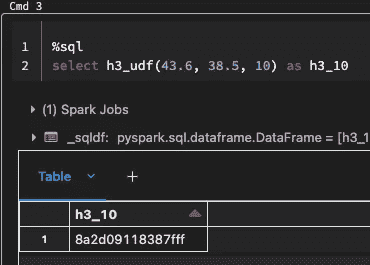

最令人兴奋的是，连接到这个集群的本地 dbt cli 也能够使用这个 udf。这个集群上的每个 spark 上下文都会发生这种情况，因为它是 hive udf。然而，在 Python 中，没有办法在 databricks 集群上注册 hive udfs。这意味着，如果您的公司有一个大的 python 项目，我们希望将其功能用作 SQL UDFs，我们必须将它们注册为 spark UDFs:

```
spark.udf.register("my_udf", my_python_func, StringType())
```

这段代码将在一个 spark 上下文上运行，并将使`my_udf`只在这个上下文上可用。这意味着连接到集群的任何 dbt 项目都不会识别该 udf。鉴于这些限制，我们建议基于 3 个部分的解决方案:

1.  在 dbt 配置文件中使用本地 spark 上下文，同时利用 spark 会话在同一 databricks 作业的任务之间共享的事实。
2.  用自定义 docker 映像处理特殊的 c 库安装。
3.  udf 注册的软件模式。

# 在 dbt 配置文件中使用本地火花上下文

为了让 databricks 作业使用与其运行时相同的 spark 上下文，我们将使用下面的 dbt 配置文件。

```
target: dev
  outputs:
    dev:
      type: spark
      method: session
      host: **localhost**
      threads: 2
      schema: silver_dev
```

对于 dbt 命令的执行，我们将使用 dbt python SDK:

```
import dbt.main
from dbt.logger import log_managerdbt.main.handle_and_check(['run', '--profiles-dir',
 '.', '--profile', 'my_dbt_profile'])
log_manager._file_handler.reset()
```

上面的代码可以作为 python 任务执行，或者只在笔记本中执行。

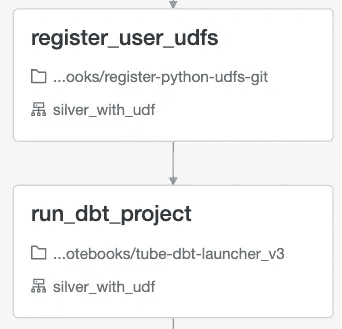

债务数据 bricks 作业的任务

如果同一个 databricks 作业的前一个 python 任务已经注册了一些 pyspark UDF——这些将可用于上述 dbt 项目执行。

狂热的 Databricks 用户知道在 databricks 中有一个可用的 dbt-task，但是在撰写这篇博客的时候，我们发现这个功能还不完善，对于生产来说太不稳定了。

# 处理特殊的 c 库和其他安装

首先，让我们看看如何安装 dbt——有几种方法，但最适合的是为集群提供一个[引导脚本](https://docs.databricks.com/clusters/init-scripts.html#cluster-scoped-init-script):

```
#!/bin/bash -xe
sudo apt-get update
apt-get install libffi-dev # resolving dbt dependency hell
/databricks/python/bin/pip install dbt-core==1.2.*
/databricks/python/bin/pip install dbt-spark==1.2.*
```

关于特殊库，我们使用[自定义容器](https://docs.databricks.com/clusters/custom-containers.html)，例如:

```
FROM databricksruntime/standard:9.x
...
RUN cd /usr/local && curl -sL https://github.com/openvenues/libpostal/archive/refs/tags/v1.1.tar.gz | tar -xz
...
```

稍后，当您将自定义映像推送到 ECR 或另一个中心后，在集群定义中指定以下设置:

```
"docker_image": {
    "url": "***.dkr.ecr.eu-west-1.amazonaws.com/udf:latest"
}
```

现在，您可以在 **register_python_udf** 任务中运行`spark.udf.register`语句，并使用您的特殊地址解析 udf。但是，让我们看看如何将这个简单的 databricks 作业一般化，作为我们团队注册任何 UDF 和在任何 dbt 项目上运行任何 dbt 命令的基础设施。

# udf 注册的软件模式

如上所述，我们正在处理一个现有的用于转换的 python 项目。它定义了基类:

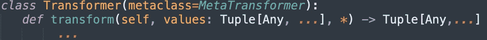

然后每个具体的类实现它自己的转换:

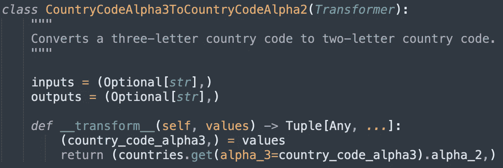

另一件重要的事情是，所有的转换器都在转换器包的 __init.py__ 文件中以 un __all__ 变量列出。

让我们回忆一下，为了将变压器注册为 UDF，我们需要了解什么— `spark.udf.register`有 3 个参数:

1.  UDF 名称—我们可以直接从类实例中获得一个蛇案例名称:

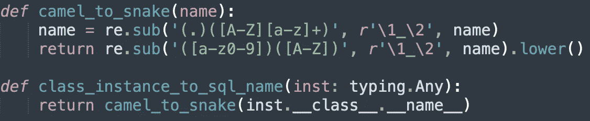

2.可调用(callable )-为方便起见，我们总是为注册的每个 udf 返回以下结构:

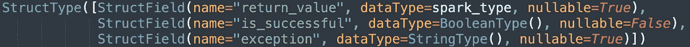

spark_type 是您的可调用返回类型

为了得到这个可调用函数，我们可以考虑使用类似于[的高阶函数](https://en.wikipedia.org/wiki/Higher-order_function#Python):

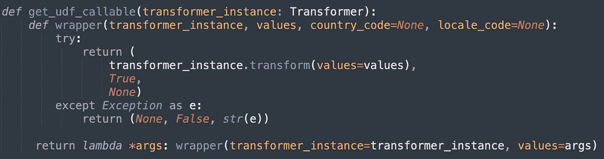

3.返回类型(spark_type) —如果您的转换器返回一个复杂的不可序列化的对象，并且可能需要您实现自己的“python 到 spark 类型”逻辑(就像我们所做的那样)，那么可能会涉及到这个问题。对于简单的情况，你可以考虑使用 [_parse_datatype_string](https://spark.apache.org/docs/2.1.2/api/python/_modules/pyspark/sql/types.html) 函数。

最终，我们的用户将为我们提供他们的 python 包和他们的转换器，按照上面的模式实现。我们的工作是安装这个包并注册 __all__ 中列出的所有变压器:

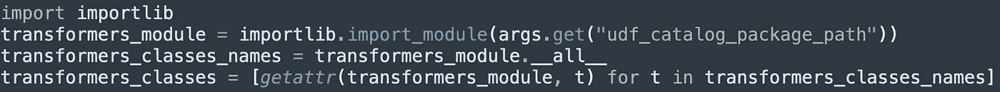

让我们逐行解释上面的代码:

我们需要实现一个通用的导入逻辑，因为我们的代码接收包名作为参数，然后使用同一个包。

`importlib.import_module(args.get(“udf_catalog_package_path”))` — udf_catalog_package_path 是包内的 transformers 模块的路径。示例:

用户提供他们的软件包，称为 explorium_transformation。转换器本身(转换器目录模块)和 __init.py__ 位于 explorium_transformation 模块中:

```
explorium_transformation\
   transformers\ 
     __init.py__
     my_tranformer.py
     ...
```

所以在这种情况下`udf_catalog_package_path`就是
**explorium _ transformation . transforms**

然后我们把所有变形金刚的名单拿出来:
`transformers_module.__all__`

然后从
模块中依次获取类:`getattr(transformers_module, <transformer class name>)`

接下来，我们可以组合上述所有功能，并简单地注册所有 UDF:

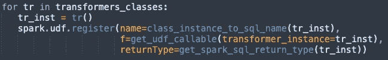

现在，提供的包装中的所有变压器都可用

在接下来的文章中，我们将更深入地描述该解决方案如何集成到 Explorium 的数据基础架构解决方案中，现在，我们只概述一下集成了上述功能的架构:

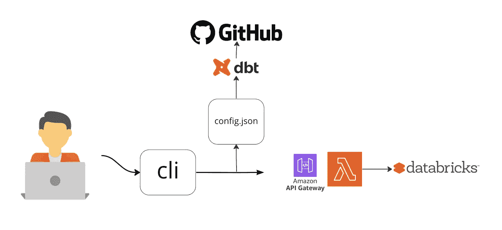

AWS lambda 上的后端创建数据块作业

为了在生产中运行 dbt 项目，我们的用户使用了一个 cli 工具，该工具要求他填写并提交一个 json 文件:

```
{
    "dbt_git_url": "https://github.com/explorium-ai/anton-dbt",
    "dbt_git_branch": "main",
    "udf_catalog_git_branch": "main",
    "udf_catalog_git_url": "https://github.com/my-transformers",
    "udf_catalog_package_path": "geo.address_transformers"
}
```

在这里，用户指定他们的 dbt 项目在 GitHub 上的位置，以及 python transformer 包在哪里+包中实际的 transformer 模块在哪里。所有这些参数足以执行我们上面描述的所有注册逻辑。

总结:我们概述了提供自动化数据基础设施的行业需求，我们看到了将大型 python 项目功能迁移到 SQL 并利用其与 dbt 的表达能力的需求，我们提供了在生产中运行这些项目的技术和架构解决方案。

仍然有很多有趣的问题，比如

*   如何方便地开发调试一个使用 udf 的 dbt 项目？(我们已经看到本地 dbt cli 仍然没有注册 UDF)
*   如何协调**t**transformation dbt 项目作业与**e**extraction 和 **l** oad 作业？
*   如何整合数据血统、数据质量和新鲜度保证？
*   在哪个层面上(dbt 项目还是基础设施？)我们是否应该解决像作业等幂和回填这样的挑战？
*   如何让 pyspark UDFs 不那么慢？

这些以及更多的数据挑战将在下一篇文章中讨论。