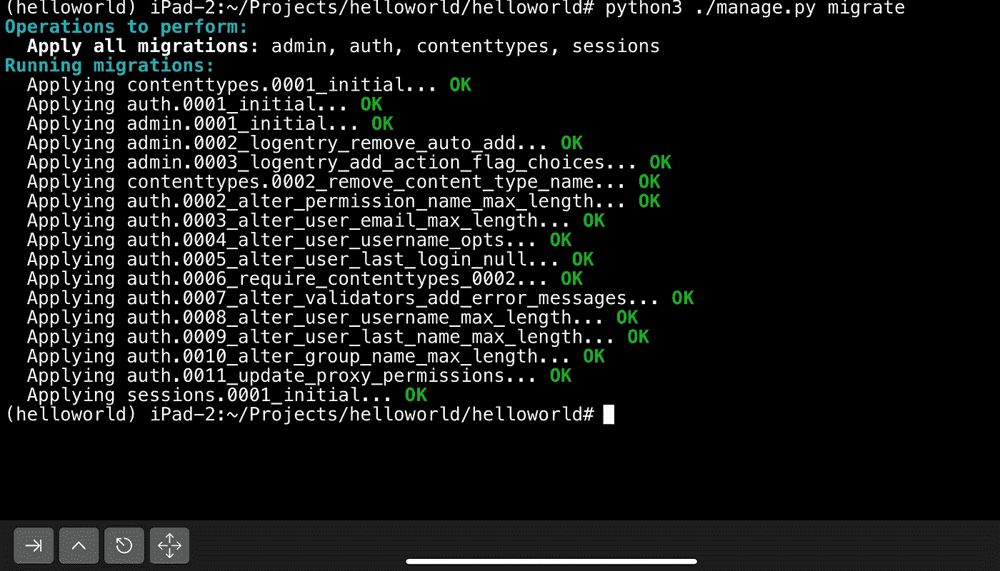

# 在 iPad 上运行 Django 应用程序

> 原文：<https://blog.devgenius.io/running-django-applications-in-ipad-310bc8bc228e?source=collection_archive---------0----------------------->


[https://unsplash.com/photos/Y0I5DEbx8ck](https://unsplash.com/photos/Y0I5DEbx8ck)

H 你有没有想过 iPad 或 iPhone 是否支持其环境的终端？嗯，是的。如你所知，名为 iSH 的免费开源应用程序确实如此。

iSH 不需要任何黑客或越狱。iSH 本身执行仿真，并且还支持一些互操作特性，包括套接字监听、文件共享等。所以你可以依靠它，只要电池性能允许。

最近我发现这种方法挺管用的。所以我决定分享这个技巧。我将一步步向您介绍如何在 iPadOS 中运行您的 Django 应用程序。

# 在你开始之前

请确认您现在可以阅读这篇文章。如果你在开始之前就考虑好这些因素，那是最好的。

首先，iSH 仍在开发中。您可能无法实现所有的 shell 体验或工作中的一些关键工具——本文旨在构思和演示。

第二，注意你的网络连接！本教程导致大量的流量使用。确保您使用的是不计费、免费、无限制的 Wi-Fi 连接。如果没有，你可能会被发票压得喘不过气来！

最后，注意你剩余电量。这个教程造成了很大的功耗。

还有，我建议你最好用硬件键盘，不要用内置键盘。它让你的工作空间更大。；-)

好看吗？那我们开始吧！

# 在 App Store 获取您的鱼

你可以在 https://apps.apple.com/us/app/ish-shell/id1436902243 的[app store 获得 iSH 应用。但遗憾的是，由于苹果的政策，iSH 的官方版本不包括 apk 包管理器。](https://apps.apple.com/us/app/ish-shell/id1436902243)

您可以运行下面的命令来恢复 apk 软件包管理器。

```
wget -qO- http://dl-cdn.alpinelinux.org/alpine/v3.12/main/x86/apk-tools-static-2.10.5-r1.apk | tar -xz sbin/apk.static && ./sbin/apk.static add apk-tools && rm sbin/apk.static && rmdir sbin 2> /dev/null
```

# 更新、升级现有软件包

iSH 包含 Alpine Linux 发行版。所以你可以通过 APK 工具来管理你的分发包。

让我们用下面的命令更新最新的包信息。

```
apk update
```

然后，出于安全考虑，升级一些预装的包，修复 bug。

```
apk upgrade
```

# 安装 Python 3，虚拟环境和 Django

让我们安装 Python 3 解释器。

```
apk add python3
```

安装后，检查 Python 安装是否正确。

```
python3 —-version
```

然后，升级 PIP (Python 包管理器)以安装额外的包。

```
pip3 install —-upgrade pip
```

要使用 Django，您需要安装 bash shell 和 virtualenv Python 包。

```
apk add bashpip3 install virtualenv
```

所有的事情都做完了吗？然后，让我们在您的主目录中创建一个虚拟环境。虚拟环境的名称是 helloworld。

```
cd ~/virtualenv helloworldcd helloworld
```

最后，激活虚拟环境，确保只在其虚拟环境中安装 Django 和相关的依赖项，而不是全局范围。激活后，提示符将指示当前虚拟环境的名称。

```
source ./bin/activate
```


# 创建、初始化和运行 Django 网站

让我们在虚拟环境中安装 Django 框架。

```
pip3 install django
```

安装后，您可以使用 Django-admin 工具。使用这个工具，您可以搭建网站和本地 SQLite 数据库的新实例(这在 iSH 环境中也受支持)。)

```
django-admin startproject helloworldcd ./helloworld
```

本地 SQLite 数据库的当前状态与项目数据库定义不同步。您应该使用迁移脚本。

```
python3 ./manage.py migrate
```



此外，最好保护应用程序的安全，并且您需要在启动网站之前创建一个默认的超级管理员帐户。运行下面的命令，并遵循对话框。

```
python3 ./manage.py createsuperuser
```


现在可以运行 Django 服务器了。请运行以下命令启动。使用—不安全的开关，Django 将允许任何到服务器的传入连接。

```
python3 ./manage.py runserver —-insecure 0.0.0.0:8000
```

你可以发现 Django 服务器在你的 iPad 上成功运行。:-D


# 使用多任务功能

本质上，你可以在你的 iPhone 上运行这个教程，而不仅仅是在 iPad 上。但是这两种环境都不支持后台进程。因此，如果您运行 Django 服务器，然后在 iSH 上激活另一个应用程序，如 Safari 或 Google Chrome，iSH 很快就会挂起。因此，在 iPhone 上调试 Django 应用程序的体验并不好。

我建议你最好在你的 iPad 设备上使用这种方法，因为 iPadOS 支持分屏多任务处理。

对于那些不熟悉拆分视图的人，请在苹果网站上查找这个帮助文档。iSH 已经支持 iPad OS 上的分屏功能。

[https://support.apple.com/en-us/HT207582](https://support.apple.com/en-us/HT207582)

那我们来做个分景吧。在左边，你可以放置你最喜欢的网络浏览器，在右边，你可以放置激活 iSH 应用，它运行 Django 服务器。

可以通过地址 http://localhost:8000 访问 Django 服务器。


瞧啊。另外，您可以通过 http://localhost:8000/admin 访问管理页面。提供您的凭证之前，你指定前面的步骤，然后你会得到一个整洁和熟悉的管理页面！


控制台显示您正确连接 iPad 上的本地服务器的日志。

# 更多提示

如果你认真考虑使用这个环境，你可以做更多像下面这样的事情。

*   用您的密钥对安装 VIM、Git(或 Subversion、CVS)和 SSH。
*   在终端内部安装多任务 TMUX。

如果你是工作副本应用程序的忠实粉丝，FileProvider 实现正在路上。你可以在 https://github.com/tbodt/ish/pull/543 的[跟踪进展并对此专题做出贡献。:-)](https://github.com/tbodt/ish/pull/543)

[](https://www.buymeacoffee.com/rkttu)