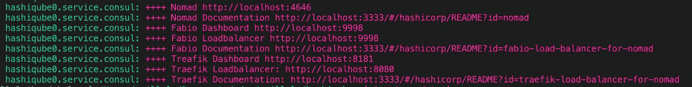
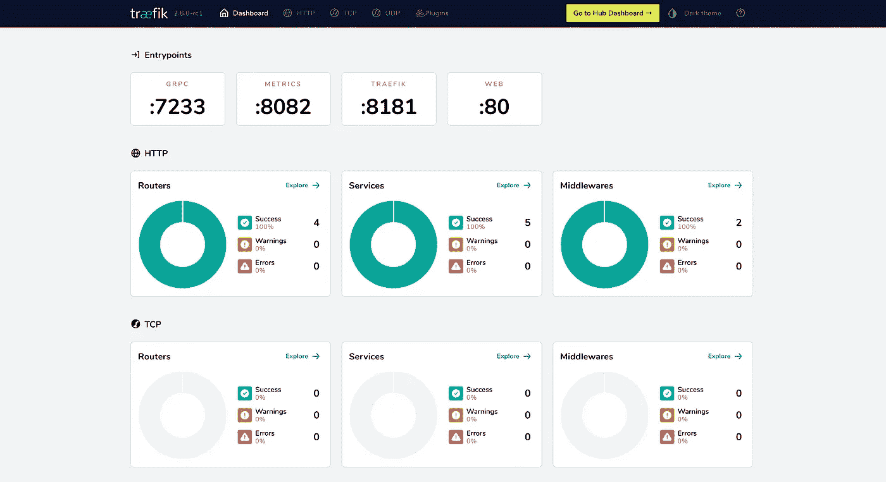

# 机箱中的 HashiCorp 堆栈:使用浮动 Docker 提供程序运行 HashiQube

> 原文：<https://blog.devgenius.io/running-hashiqube-using-the-vagrant-docker-provider-3e551c0eca97?source=collection_archive---------7----------------------->


白雪覆盖的蜘蛛网。Adri Villela 的照片。

如果你关注了我在 HashiQube 上的[文章，你就会知道我是它的超级粉丝。对于门外汉，](https://medium.com/@adri-v/list/hashiqube-bfdcb9c84e10) [HashiQube](https://github.com/servian/hashiqube) 提供了一个完整的 [HashiCorp](https://HashiCorp.com) 堆栈，包括但不限于[流浪者](https://www.nomadproject.io/)、[金库](https://www.vaultproject.io)和[执政官](https://consul.io)，使用[流浪者](https://vagrantup.com)。

我已经有几个月没碰过哈希古布了😭在我离开 HashiQube 的时候，我给自己买了一台 14 英寸的 M1 Mac。显然，我非常渴望在我的新机器上尝试 HashiQube。但问题就在这里:[当时，VirtualBox 没有运行在苹果硅(M1/M2)处理器上](https://apple.stackexchange.com/questions/422565/does-virtualbox-run-on-apple-silicon)。幸运的是，我的恐慌非常短暂，因为 [HashiQube](https://github.com/servian/hashiqube) 的维护者之一 Riaan Nolan 找到了一个解决方案:在 Docker 上运行 HashiQube。你看，虽然大多数人通常使用 [VirtualBox 的浮动提供程序](https://developer.hashicorp.com/vagrant/docs/providers/virtualbox)运行浮动，但你也可以使用[浮动停靠程序提供程序](https://developer.hashicorp.com/vagrant/docs/providers/docker)。Riaan 有一篇很棒的博文，讲述了他对 HashiQube 所做的一些调整，这样它就可以使用 Docker Provider 运行，而且[你绝对应该去看看](https://medium.com/@riaan.nolan/running-hashiqube-on-multi-arch-arm-and-x86-multi-os-linux-mac-windows-with-docker-desktop-4695e152cacb)。此外，该解决方案同样适用于 M1 和非 M1(如英特尔)处理器。

我不是来重新讨论 Riaan 的解决方案的。这篇文章的目的是强调以下几点:

*   我使用浮动 Docker 提供程序运行 HashiQube 的经验。
*   我为自己的书呆子目的对它做了一些修改，你可能也会觉得有用！
*   我在旅途中遇到的一些问题。

我们开始吧！

> **注:** *看来* [*VirtualBox 现在应该运行在 M1/M2 的 MAC 上*](https://osxdaily.com/2022/10/22/you-can-now-run-virtualbox-on-apple-silicon-m1-m2/) *。我自己没有试过，尽管我的一个同事尝试在他的 M1 Mac 电脑上运行 VBox 中的 Windows，但没有成功。*

# 设置

当我在 2021 年开始玩 HashiQube 的时候，我[创造了自己的 HashiQube 叉子](https://github.com/avillela/hashiqube)。然而，我还没有对[上游回购](https://github.com/servian/hashiqube)做出贡献，因为它包含了一些我自己的定制。

我的[现有的 HashiQube 教程](https://medium.com/@adri-v/list/hashiqube-bfdcb9c84e10)是基于[我的 fork](https://github.com/avillela/hashiqube) ，为了保证这些不断裂，我在我的 fork 中创建了一个新的分支，叫做`[m1_main](https://github.com/avillela/hashiqube/tree/m1_main)`。这个分支是基于最近在[上游 HashiQube repo](https://github.com/servian/hashiqube) 中的工作，它使用了流浪码头工人提供者。

以下是我的一些修改。

## 绕道 Traefik 有什么新功能？

在我开始修改 Traefik 之前，我想指出，自从我上次在 Nomad 上使用它以来，Traefik 已经发生了相当大的变化，我很高兴 Riaan 在 HashiQube 上做了所有繁重的工作来获得 Traefik 的最新和最棒的版本。必须热爱开源社区！💜

那么有什么变化呢？首先，Traefik 现在已经完全与 Nomad 整合在一起了。在以前，你需要用 Nomad 运行 Consul 来利用 Traefik 的服务发现。现在，领事中间人出局了。

为了启用特定服务的 Traefik 服务发现，您需要在您的`service`节中执行以下操作，如下面的代码片段所示:

*   添加我们熟悉和喜爱的 Traefik 标签
*   将`provider = "nomad"`添加到您的配置

```
service {
  name = "traefik-dashboard"
  provider = "nomad"
  tags = [
    "traefik.enable=true",
    "traefik.http.routers.dashboard.rule=Host(`traefik.localhost`)",
    "traefik.http.routers.dashboard.service=api@internal",
    "traefik.http.routers.dashboard.entrypoints=web",
  ]

  port = "http"

  check {
    type     = "tcp"
    interval = "10s"
    timeout  = "5s"
  }
}
```

完整的例子，[见 traefik.nomad](https://github.com/avillela/hashiqube/blob/f77e72bf9a4343e02f3c04e786ba012c2da1de3b/hashicorp/nomad/jobs/traefik.nomad#L32-L49) 的第 23–49 行。

另一个变化是`traefik.nomad`作业中的 Traefik 配置。在以前，Traefik 是通过一个 [TOML](https://en.wikipedia.org/wiki/TOML) 文件配置的，该文件通过`template`节提供给 Traefik 容器实例，就像这样(参见 [old traefik.nomad，第 72–100 行](https://github.com/avillela/hashiqube/blob/2916a65f2dfb4764102ad48bd5cf69941ff5c483/hashicorp/nomad/jobs/traefik.nomad#L72-L100)):

```
 template {
        data = <<EOF
[entryPoints]
    [entryPoints.web]
    address = ":80"
    [entryPoints.metrics]
    address = ":8082"
    [entryPoints.grpc]
    address = ":7233"

[api]
    dashboard = true
    insecure  = true

[log]
    level = "DEBUG"
# Enable Consul Catalog configuration backend.
[providers.consulCatalog]
    prefix           = "traefik"
    exposedByDefault = false

    [providers.consulCatalog.endpoint]
      address = "http://localhost:8500"
      scheme  = "http"
EOF

        destination = "local/traefik.toml"
      }
```

现在，它看起来干净多了，就像这样(见[new traefik . nomad lines 69–86](https://github.com/avillela/hashiqube/blob/f77e72bf9a4343e02f3c04e786ba012c2da1de3b/hashicorp/nomad/jobs/traefik.nomad#L69-L86)):

```
 task "server" {
      driver = "docker"
      config {
        image = "traefik:v2.8.0-rc1"
        ports = ["admin", "http", "api", "metrics", "grpc"]
        args = [
          "--api.dashboard=true",
          "--api.insecure=true", ### For Test only, please do not use that in production
          "--log.level=DEBUG",
          "--entrypoints.web.address=:${NOMAD_PORT_http}",
          "--entrypoints.traefik.address=:${NOMAD_PORT_admin}",
          "--entrypoints.metrics.address=:${NOMAD_PORT_metrics}",
          "--entrypoints.grpc.address=:${NOMAD_PORT_grpc}",
          "--providers.nomad=true",
          "--providers.nomad.endpoint.address=http://10.9.99.10:4646" ### IP to your nomad server 
        ]
      }
    }
```

如您所见，配置现在作为`args`被传递到容器实例中。但是参数中的这些`NOMAD_PORT_xyz`值(例如`NOMAD_PORT_http`)有什么关系呢？嗯，它们只是对 Traefik Jobspec 的`network`节中定义的端口的引用。例如，假设我们定义一个名为`http`的端口，如下所示([参见 traefik.nomad，第 11–13 行](https://github.com/avillela/hashiqube/blob/f77e72bf9a4343e02f3c04e786ba012c2da1de3b/hashicorp/nomad/jobs/traefik.nomad#L11-L13)):

```
network {
  port  "http"{
     static = 80
  }
...
}
```

在我们的 Jobspec 中，这个端口可以在 Jobspec 的其他地方作为`${NOMAD_PORT_http}`引用。漂亮。该死的。酷毙了。😎

## Traefik 作业规范调整

现在你们都明白了新 Traefik 配置的样子，是时候谈谈我对 [upstream traefik.nomad](https://github.com/servian/hashiqube/blob/master/hashicorp/nomad/jobs/traefik.nomad) 文件的修改了。我做了两处改动:

1.  将 gRPC 与 Traefik 一起使用
2.  通过端口 80 使 Traefik 仪表板可用

让我们开始吃吧。

**使用 gRPC 和 Traefik**

为什么要为此烦恼呢？因为现在大量的服务使用 gRPC，我希望能够在 Nomad 中运行使用 gRPC 的服务。因为 Traefik 是我的负载平衡器，所以我需要在 Traefik 中进行配置来实现这一点。

我运行的一个使用 gRPC 的服务是 [OpenTelemetry Collector](https://docs.lightstep.com/otel/quick-start-collector) 。OpenTelemetry Collector 可以通过 HTTP 和 gRPC 接收仪器数据，我希望两种方法都可用。

为了将 gRPC 与 Traefik 一起使用，我首先必须在`traefik.nomad` ( [第 26–28 行](https://github.com/avillela/hashiqube/blob/f77e72bf9a4343e02f3c04e786ba012c2da1de3b/hashicorp/nomad/jobs/traefik.nomad#L26-L28))中定义一个 gRPC 端口:

```
network {
  ...
  port "grpc" {
    static = 7233
  }
  ...
}
```

接下来，在 Traefik `task`小节中，我需要让 Traefik 知道 gRPC 端口。这是通过`traefik.nomad`中的[线 73](https://github.com/avillela/hashiqube/blob/f77e72bf9a4343e02f3c04e786ba012c2da1de3b/hashicorp/nomad/jobs/traefik.nomad#L73) 和[线 81](https://github.com/avillela/hashiqube/blob/f77e72bf9a4343e02f3c04e786ba012c2da1de3b/hashicorp/nomad/jobs/traefik.nomad#L81) 完成的:

```
task "server" {
  driver = "docker"
  config {
    image = "traefik:v2.8.0-rc1"
    ports = ["admin", "http", "api", "metrics", "grpc"]
    args = [
      ...
      "--entrypoints.grpc.address=:${NOMAD_PORT_grpc}",
      ...
    ]
  }
```

您还需要配置服务的 Jobspec 来使用 gRPC。在我的例子中，这意味着配置[open telemetry Collector job spec](https://github.com/avillela/hashiqube/blob/m1_main/hashicorp/nomad/jobs/otel-collector.nomad)，我将在本文稍后介绍。

**通过端口 80 使 Traefik 仪表板可用**

当我第一次将 Traefik 添加到 HashiQube 时，我通过`[http://traefik.localhost](http://traefik.localhost.)`设置了 Traefik 仪表盘。我想在我的`m1_main`分公司做同样的事情。我这样做是通过如下配置我的`traefik-dashboard`服务:

```
service {
  name = "traefik-dashboard"
  provider = "nomad"
  tags = [
    "traefik.enable=true",
    "traefik.http.routers.dashboard.rule=Host(`traefik.localhost`)",
    "traefik.http.routers.dashboard.service=api@internal",
    "traefik.http.routers.dashboard.entrypoints=web",
  ]
  ...
}
```

值得注意的事项:

*   `traefik.http.routers.dashboard.entrypoints=web`告诉我们仪表板在 web 端口上可用(由于 [this config](https://github.com/avillela/hashiqube/blob/f77e72bf9a4343e02f3c04e786ba012c2da1de3b/hashicorp/nomad/jobs/traefik.nomad#L11-L13) 和 this [config](https://github.com/avillela/hashiqube/blob/f77e72bf9a4343e02f3c04e786ba012c2da1de3b/hashicorp/nomad/jobs/traefik.nomad#L78) ，我们将其配置为端口`80`
*   `traefik.http.routers.dashboard.rule=Host(`traefik.localhost`)`配置显示 Traefik 仪表盘将在`[http://traefik.localhost](http://traefik.localhost.)`对我们可用。

你可以点击查看完整的 Jobspec 列表[。](https://github.com/avillela/hashiqube/blob/m1_main/hashicorp/nomad/jobs/traefik.nomad)

## 配置 Nomad，允许它从私有的 GitHub 容器注册表中提取 Docker 图像

你需要在你的 Jobspec 中从一个私有的 [GitHub 容器注册表](https://docs.github.com/en/packages/working-with-a-github-packages-registry/working-with-the-container-registry)中提取 Docker 图像吗？没问题！我给 nomad.sh 添加了[一些配置来启用这个功能。这是基于](https://medium.com/@adri-v/just-in-time-nomad-running-traefik-on-hashiqube-7d6dfd8ef9d8)[我之前在 HashiQube](https://medium.com/@adri-v/just-in-time-nomad-running-traefik-on-hashiqube-7d6dfd8ef9d8) 上的工作，只是将相同配置的一个端口转移到我的新`[m1_main](https://github.com/avillela/hashiqube/tree/m1_main)`分支。更多信息，请查看这篇博文(跳到 HashiQube 部分的 ***运行科技雷达应用的第 3 步)。***

## 配置 Nomad/Vault 集成

有时候你会想从你的职业说明书中获取保险库的秘密。为了做到这一点，我[配置了 nomad.sh 和 vault.sh](https://medium.com/@adri-v/just-in-time-nomad-configuring-hashicorp-nomad-vault-integration-on-hashiqube-388c14cb070a) 以使 nomad 能够获取保险库机密。同样，这是基于[我之前在 HashiQube](https://medium.com/@adri-v/just-in-time-nomad-configuring-hashicorp-nomad-vault-integration-on-hashiqube-388c14cb070a) 上的工作，只是将相同的配置移植到我的新`[m1_main](https://github.com/avillela/hashiqube/tree/m1_main)`分支。更多详情，请查看这篇博文。

## 开放式遥测收集器作业规范

当我第一次将[open telemetry Collector job spec 添加到 HashiQube](https://medium.com/tucows/just-in-time-nomad-running-the-opentelemetry-collector-on-hashicorp-nomad-with-hashiqube-4eaf009b8382) 时，它只通过 HTTP 摄取遥测数据。在这次更新中，它同时支持 HTTP 和 gRPC。我还更新了 Jobspec，以便更好地使用 Traefik 的更新版本。

为了将收集器 Jobspec 配置为与 HTTP 和 gRPC 一起使用，我需要将以下端口添加到`otel-collector.nomad`的`network`节中(参见第[31–36](https://github.com/avillela/hashiqube/blob/f77e72bf9a4343e02f3c04e786ba012c2da1de3b/hashicorp/nomad/jobs/otel-collector.nomad#L31-L36)行):

```
network {
  ...
  port "otlp" {
    to = 4317
  }
  port "otlphttp" {
    to = 4318
  }
  ...
}
```

收集器通过端口`4318`接收 HTTP，通过端口`4317`接收 gRCP，上面的端口定义反映了这一点。

我还需要在`otel-collector.nomad`中为每个端口定义`service`节(参见[第 169–188 行](https://github.com/avillela/hashiqube/blob/f77e72bf9a4343e02f3c04e786ba012c2da1de3b/hashicorp/nomad/jobs/otel-collector.nomad#L169-L188)):

```
service {
  provider = "nomad"
  tags = [
    "traefik.tcp.routers.otel-collector-grpc.rule=HostSNI(`*`)",
    "traefik.tcp.routers.otel-collector-grpc.entrypoints=grpc",
    "traefik.enable=true",
  ]        
  port = "otlp"
}

service {
  provider = "nomad"
  tags = [
    "traefik.http.routers.otel-collector-http.rule=Host(`otel-collector-http.localhost`)",
    "traefik.http.routers.otel-collector-http.entrypoints=web",
    "traefik.http.routers.otel-collector-http.tls=false",
    "traefik.enable=true",
  ]
  port = "otlphttp"
}
```

上述配置现在将允许程序通过 HTTP 和 gRPC 向收集器发送 OpenTelemetry 数据。

> **注意:** *由于我们使用的是 Traefik 的新的改进版本，您会注意到我们还设置了* `*provider = "nomad"*` *。*

**要通过 HTTP** 调用 OTel 收集器，您的端点应该是`otel-collector-http.localhost`。为什么？首先，因为`traefik.http.routers.otel-collector-http.rule=Host(`otel-collector-http.localhost`)`说端点的主机是`otel-collector-http.localhost`。端口是`80`，因为配置`traefik.http.routers.otel-collector-http.entrypoints=web`要求将容器端口`4318`映射到端口`80`，我们[在 traefik.nomad](https://github.com/avillela/hashiqube/blob/f77e72bf9a4343e02f3c04e786ba012c2da1de3b/hashicorp/nomad/jobs/traefik.nomad#L11-L13) 中将其公开为 HTTP 端口。

要查看真实示例的效果，请查看[这个样例 Go 代码](https://github.com/avillela/go-otel-instrumentation/blob/7bd3cf52c586a489a49aaf7415c6d653ede14d84/server.go#L33)。

**要通过 gRPC** 调用 OTel 收集器，您的端点应该是`otel-collector-grpc.localhost:7233`。为什么？首先，因为`traefik.tcp.routers.otel-collector-grpc.rule=HostSNI(`*`)`说端点的主机是`*`。通常，我会想用一些更具体的东西，比如`otel-collector-grpc.localhost`而不是`*`。不幸的是，如果您想使用不带 TLS 的 TCP 路由器(这是您需要用于带 Traefik 的 gRPC 的配置的一部分)，[这就是要走的路](https://community.traefik.io/t/configuration-of-non-http-port-without-tls/5901/2)。如果你试图在配置中放入`*`以外的东西，Traefik。威尔。尖叫。在。你。😱但是这也意味着在你的调用代码中，你可以把任何你想要的作为主机名，并且它会工作。所以我选择调用我的端点`otel-collector-grpc.localhost`，这样就遵循了与我的 HTTP 端点相同的命名约定。但是对于我们的 HTTP 端点，端口号是`80`，对于 gRPC，端口号是`7233`。为什么不是`4317`？因为在我们的服务配置中，`traefik.tcp.routers.otel-collector-grpc.entrypoints=grpc`标签要求将容器端口`4317`映射到端口`7233`，我们[在 traefik.nomad](https://github.com/avillela/hashiqube/blob/f77e72bf9a4343e02f3c04e786ba012c2da1de3b/hashicorp/nomad/jobs/traefik.nomad#L26-L28) 中将其公开为 gRPC 端口。

要查看真实例子的效果，请查看这个样例 Go 代码。

## 名字解析

因此，还记得我们是如何在 Traefik 配置中定义一系列端点的吗:

*   `otel-collector-grpc.localhost`
*   `otel-collector-http.localhost`
*   `traefik.locahost`

好吧，这些端点不会被解析，除非您将它们添加到您的`/etc/hosts`文件中，如下所示:

```
127.0.0.1   traefik.localhost
127.0.0.1   otel-collector-http.localhost
127.0.0.1   otel-collector-grpc.localhost
```

为什么我们要将这些映射到`127.0.0.1`？当流浪者提供 HashiQube 时，它会启动一个 Docker 镜像来运行流浪者、执政官和金库(以及其他东西)，我们可以分别通过`[http://localhost:4646](http://localhost:4646/)`、`[http://localhost:8500](http://localhost:8500,)`和`[http://localhost:8200](http://localhost:8200,)`使用它们。这意味着对于所有的意图和目的，就好像游牧者，执政官和金库都在`localhost`上运行。因此，当我们更新我们的`/etc/hosts`文件时，我们将主机名映射到本地主机 IP，`127.0.0.1`。

## 暴露端口

等等……我们还没有完成端点的工作。因为我们仍然需要在我们的`Vagrantfile`中公开我们的 HTTP 和 gRPC 端口，否则我们实际上不能从我们的客户机器中访问它们。为此，只需将这些行添加到您的`Vagrantfile`(参见[行 110](https://github.com/avillela/hashiqube/blob/f77e72bf9a4343e02f3c04e786ba012c2da1de3b/Vagrantfile#L110) 和[行 112](https://github.com/avillela/hashiqube/blob/f77e72bf9a4343e02f3c04e786ba012c2da1de3b/Vagrantfile#L112) ):

```
...
config.vm.network "forwarded_port", guest: 80, host: 80 # traefik dashboard
...
config.vm.network "forwarded_port", guest: 7233, host: 7233 # gRPC (traefik config)
...
```

现在我们已经准备好启动 HashiQube 了！

# 运行哈希库贝

## 先决条件

*   [Docker](https://www.docker.com/) (撰写本文时的版本为 20.10.17)
*   [流浪者](https://www.vagrantup.com/)(撰写本文时的版本为 2.3.1)
*   [一个 GitHub 个人接入令牌(PAT)](https://docs.github.com/en/authentication/keeping-your-account-and-data-secure/creating-a-personal-access-token)

## 启动

在你点燃 HashiQube 之前，我想指出几件重要的事情。

首先，如果您将`DOCKER_DEFAULT_PLATFORM`环境变量设置为`linux/amd64`，您必须在启动 HashiQube 之前 ***取消设置*** 它，它将不会正确设置。我之所以指出这一点，是因为我的默认设置是`DOCKER_DEFAULT_PLATFORM=linux/amd64`，因为我需要我的 OpenTelemetry 工作，而这个小设置在启动 HashiQube 时让我陷入混乱。

其次，我想快速指出的是，当您通读[快速入门](http://cd hashiqube # if you aren't already there vagrant up --provision-with basetools,docker,vault,consul,nomad --provider docker)时，您会注意到 living provisioning 命令如下所示:

```
vagrant up --provision-with basetools,docker,vault,consul,nomad --provider docker
```

`--provision-with`标志允许我指定我想在 HashiQube 中引导的服务。省略这个标志会引导出一大堆我不一定想要或需要的其他工具。在我的例子中，我只是想提出金库，执政官和游牧者。但是为什么还包括`basetools`和`docker`？我需要`basetools`来配置 HashiQube 使用的基本 Docker 映像。我需要`docker`，这样我就可以使用 Nomad 来运行容器化的工作负载。您可能还记得，nomad[支持各种不同的工作负载，而不仅仅局限于容器](https://medium.com/tucows/just-in-time-nomad-80f57cd403ca)。此外，需要注意的是，金库、执政官和游牧者必须按照这个顺序进行设置。执政官靠金库，游牧者靠金库和执政官。

好了……是时候发动哈希库贝了。要开始工作，[请遵循这里的说明](http://cd hashiqube # if you aren't already there vagrant up --provision-with basetools,docker,vault,consul,nomad --provider docker)。一旦 HashiQube 启动序列完成，您应该会看到类似这样的内容:



HashiQube 启动序列末尾的屏幕截图。

启动一切可能需要 10 分钟以上，所以请耐心等待。😁

让我们做一个小小的抽查，以确保一切顺利。首先，让我们去`[http://localhost:4646](http://localhost:4646:)` [:](http://localhost:4646:) 看看 Nomad


部署了 Traefik 的 Nomad UI 的屏幕截图。

请注意，Traefik 作业已经部署。这意味着我们可以通过进入`[http://traefik.localhost](http://traefik.localhost:)` [:](http://traefik.localhost:) 来启动 Traefik 仪表板



http://traefik.localhost 上 Traefik 仪表板的屏幕截图

现在你知道了！你现在和流浪汉码头提供商一起经营 HashiQube！最棒的是，无论你用的是英特尔电脑还是 M1 Mac 电脑，你都可以运行这段代码。吼吼！！🎉

# 最后的想法

我惊喜地发现，在我的 M1 Mac 电脑上运行最新版本的 HashiQube，使用的是[vagger Docker Provider](https://developer.hashicorp.com/vagrant/docs/providers/docker)。很高兴知道除了 [VirtualBox 流浪提供者](https://developer.hashicorp.com/vagrant/docs/providers/virtualbox)之外，你还有一个选择，同样有效！此外，我发现使用上游回购作为我的基线，我能够相对容易地合并我自己的修改。

我有几个一直渴望开始的小游牧项目，现在我终于可以开始了。我等不及要和你们分享这些了！我希望这也能让你对 M1(以及更远的地方)的 HashiQube 感到兴奋！

我现在要奖励你一张我可爱的毛茸茸的小朋友的照片，它们是邦尼(瑞普，我的小鞭炮)、穆基和菲比。


毛茸茸的朋友:邦妮、穆琪和菲比。由[阿德里·维勒拉](https://adri-v.medium.com)拍摄。

和平、爱和准则。🦄 🌈 💫

