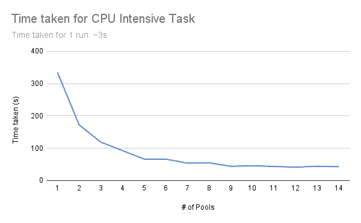
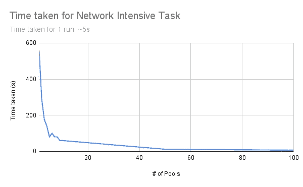

# 使用多处理模块在 Python 中一次运行多个函数

> 原文：<https://blog.devgenius.io/running-multiple-functions-at-once-in-python-using-the-multiprocessing-module-4c1fe3ed9878?source=collection_archive---------1----------------------->

好的，那么您想要快速并行地运行 CPU/IO 密集型任务？为什么不直接用 C，C#，GoLang，或者 Rust？虽然 python 比大多数语言都慢，并不是这类任务的首选，但它的直观性和社区支持使它更容易原型化并快速迭代你的想法。还需要我提醒你 python 有多少开源包吗？从 ML 到音频编辑，你几乎可以找到任何东西的包！

# **问题陈述**

我有一个函数需要完成以下任务:

1.从存储中读取大量文件(I/O 密集型)

2.对数据运行一些密集型计算(CPU 密集型)

3.将最终结果上传到云存储桶(I/O 密集型)

# **运行多线程与多进程**

对于我的问题陈述，运行多个进程而不是线程是有意义的，因为:

1.该函数主要是 CPU 密集型，而不是 IO 密集型

2.每个函数调用都可以在自己的内存空间中运行

3.进程调度由操作系统而不是 Python 来处理

4.不用担心 **Python 全局解释器锁(GIL)**

# **多重处理模块**

多处理模块有助于产生与线程模块非常相似的进程。

下面是一个示例代码:

```
from multiprocessing import Pool

def functionToRunParallely(i)
  # do Work
  return i

noOfPools = 5

if __name__ == "__main__"
with Pool(noOfPools) as p:
  p.map(functionToRunParallely,[arg1,arg2,...])
```

您可以将池的数量设置为与 CPU 中的核心数量相同。增加池的数量会占用更多内存，但如果该功能是 CPU 密集型的，则不一定会提高速度。我们可以通过下面的例子来验证这一点:

# **池数量对性能的影响**

## **池数量与 CPU 密集型任务的计算时间**

我们将采用一个简单的函数，它非常低效地计算自然数的和，直到 100000000。下面的函数在我的系统上运行大约需要 3 秒钟

```
# Simple function that takes ~3 seconds to run
def pureCpuIntensive(x):
    sum=0
    for x in range(100000000):
        sum+=x
```

结果如下:



**外卖**

1.  池的数量仅取决于可用核心的数量。之后，所用时间大致不变。
2.  对于大于 8 的池数，所用的时间会波动，内存使用量会继续上升。

## **池数量网络密集型任务的计算时间**

我已经编写了一个简单的后端，在发送请求之前将请求延迟 5 秒。我将它部署在 localhost 上，以消除结果中我的互联网连接的不确定性。我们将使用一个简单的函数向后端发出 GET 请求并保存请求。以下功能在我的系统上运行大约需要 5 秒钟

```
def pureNetworkIntensive(i): 
  x =requests.get("http://localhost:8000")
```

结果如下:



**外卖**

1.  即使在池数量>可用核心数量后，所用时间也会减少。这是因为当函数在等待服务器的响应时，多处理模块开始处理下一个函数。因此，在这种情况下，池在等待响应时“共享”CPU 资源。
2.  一旦池数量超过可用核心数量，池之间的切换就会产生开销。在某些情况下，开销可能比使用多个池实现的最小化更大。

# **多处理模块的缺点**

1.  产生池和管理输入会占用大量内存
2.  局部变量不在子进程之间共享
3.  未针对基于网络/IO 的功能进行优化

# 结论

多重处理模块最适合并行运行 CPU 密集型任务。这些函数有自己的存储空间，并且独立于其他函数运行。然而，对于网络密集型功能，这不是最有效的运行方式。在这种情况下，多线程更加有用和高效。