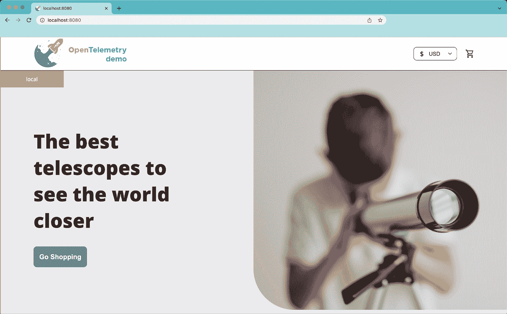
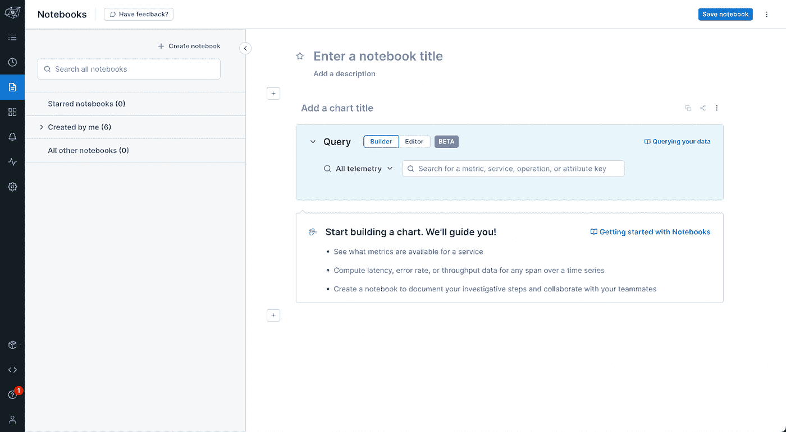
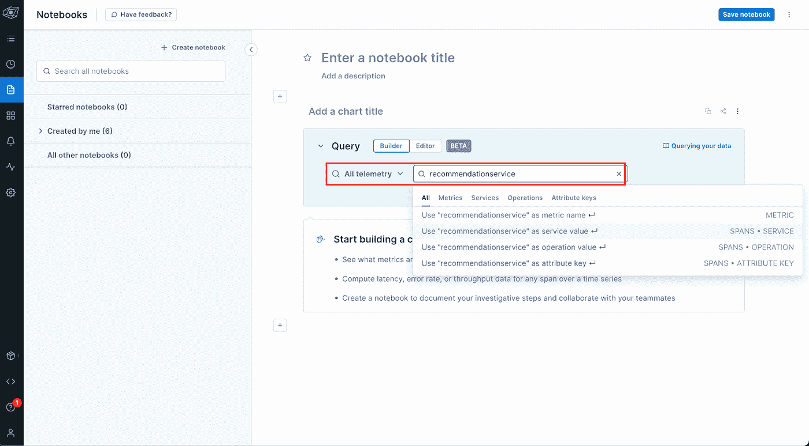
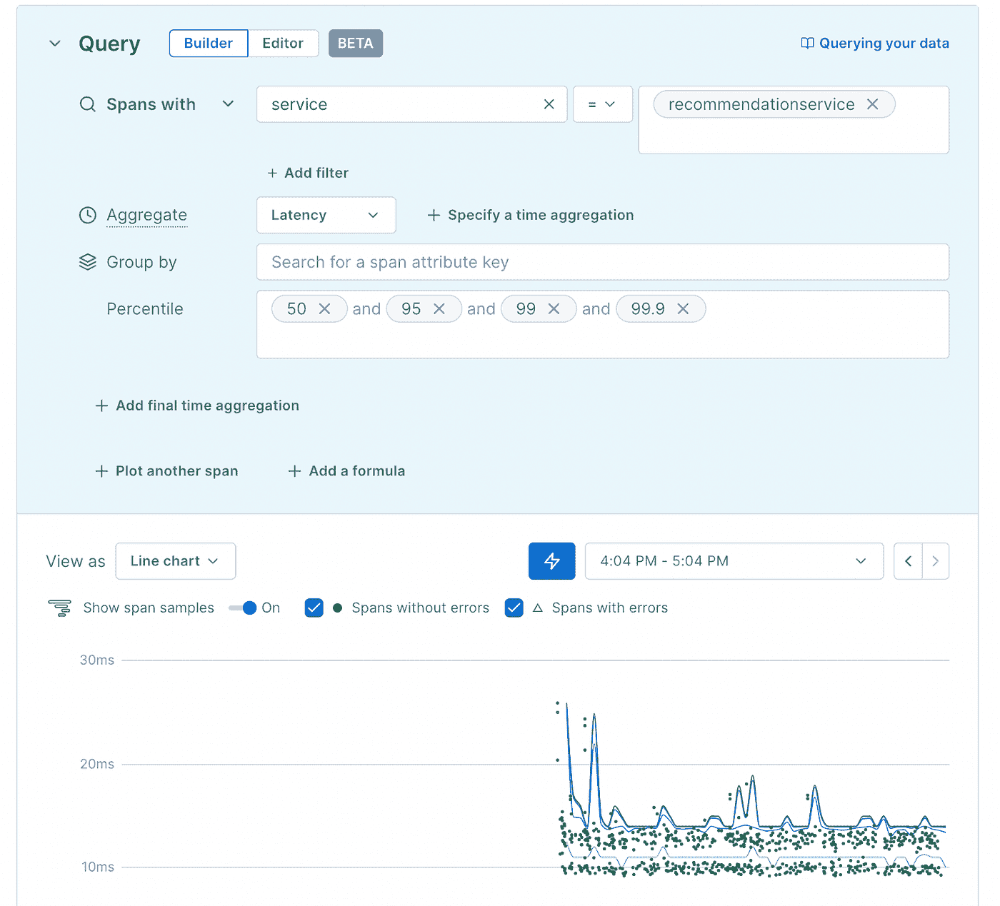
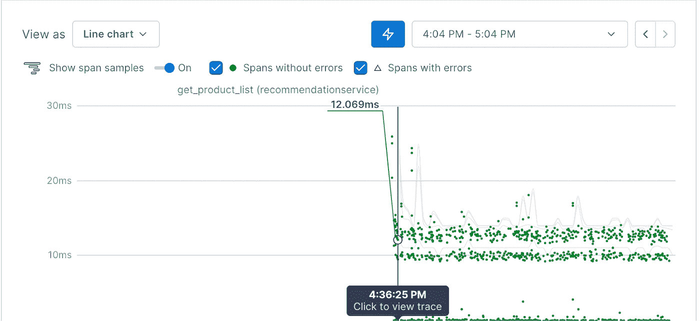
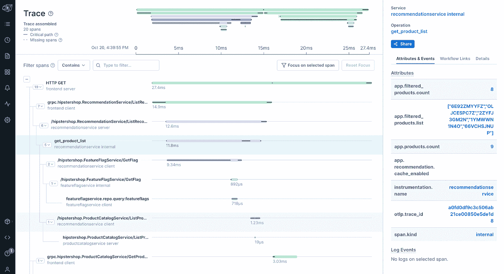

# 在 Kubernetes 中运行 OpenTelemetry 演示应用程序

> 原文：<https://blog.devgenius.io/running-opentelemetry-demo-app-in-kubernetes-95dccd613e0b?source=collection_archive---------1----------------------->


犁地。阿德里·维勒拉的照片

如果你是第一次接触 [OpenTelemetry](http://OpenTelemetry.io) 并希望在现实生活中看到它，那么 [OpenTelemetry 演示应用](https://github.com/open-telemetry/opentelemetry-demo)是快速入门的好方法。在我之前的一篇博客文章中，我向你展示了如何启动并运行演示程序，并向 Lightstep 发送跟踪信息。这很好，但我们都知道，在“真实世界”中，我们没有使用 Docker Compose 在本地运行我们的容器化工作负载。相反，我们使用容器编排器来运行它们，例如 [Kubernetes](https://kubernetes.io/) 和 [Nomad](https://nomadproject.io/) 。记住这一点，如果我们能在 [Kubernetes](http://kubernetes.io) 中运行 [OpenTelemetry 演示应用](https://github.com/open-telemetry/opentelemetry-demo)岂不是非常非常好？如果我们能把这些痕迹发送给 Lightstep，那不是更好吗？

好了，不要再看了，我的朋友，因为今天，这正是我们要做的！

你准备好了吗？我们开始吧！

# 辅导的

## 先决条件

开始之前，您需要以下材料:

*   [一个轻步账号](https://app.lightstep.com/signup/developer?signup_source=docs)
*   您想要使用的 Lightstep 项目的 [Lightstep 访问令牌](https://docs.lightstep.com/docs/create-and-manage-access-tokens#create-an-access-token)
*   库伯内特星团
*   [舵](https://helm.sh/docs/intro/install/)

> **注:** *撰写本文时使用的 OpenTelemetry 演示 App 版本为* `*0.9.6*` *版本。*

## 步伐

**1-初始化舵**

```
helm repo add open-telemetry https://github.com/open-telemetry/opentelemetry-helm-charts
```

**2-创建 YAML 值文件**

OTel 演示应用掌舵图需要一个`values.yaml`文件。现在，与图表一起开箱的那个很好，但它向耶格发送了痕迹。在我们的例子中，由于我们想向 Lightstep 发送跟踪，我们需要稍微修改一下。让我们从创建我们自己的 YAML 价值观文件开始:

```
touch values-ls.yaml
```

然后打开`values-ls.yaml`并添加:

> 注意: *为了简单起见，我最初没有考虑耶格和普罗米修斯的配置。如果你想看两者兼而有之的例子，请看这里的*[](https://gist.github.com/lakamsani/c329f211bf2a6f3d1c685ae02d4ff828)**。(感谢*[*Vamsee Lakamsani*](https://medium.com/u/7f80ff75f838?source=post_page-----95dccd613e0b--------------------------------)*的分享！)**

*好吧…那么我们到底做了什么？？很高兴你问了！*

*简单地说，我们正在覆盖 [OpenTelemetry 演示应用图表](https://github.com/open-telemetry/opentelemetry-helm-charts/blob/main/charts/opentelemetry-demo/values.yaml)中的`values.yaml`。但是我们只覆盖我们需要覆盖的部分——特别是 OTel 收集器配置，所以我们可以向 Lightstep 发送跟踪。它看起来非常像我们熟悉和喜爱的收藏家配置 YAML。但也不尽然。因为它只是收集器配置的一部分。你看，[演示应用图表使用 OpenTelemetry Collector Helm 图表作为子图表](https://github.com/open-telemetry/opentelemetry-helm-charts/blob/main/charts/opentelemetry-demo/Chart.yaml)。收集器图表显示的所有配置都可以在演示图表中找到。因此，当您填充自己的 values.yaml 版本时，您需要做的就是包含您希望修改或添加的收集器配置。在我们的例子中，我们正在做以下事情:*

*   *配置一个新的导出器 otlp/ls，它允许我们向 Lightstep 发送跟踪*
*   *将新的导出器添加到我们的度量和跟踪管道中*
*   *更新日志导出器以使用调试日志级别。*

*您会注意到，在配置`otlp/ls`导出器时，我们设置了下面的头值:`“lightstep-access-token”: “${LS_TOKEN}”`。但是`${LS_TOKEN}`到底是从哪里来的呢？？很棒的问题！这让我想到了第二个值得注意的部分。*

*你可能已经注意到了我们的`opentelemetry-collector`配置中的`extraEnvs`部分。在这里，我们可以配置安装在 Kubernetes 收集器 pod 上的环境变量。我们不希望在`values-ls.yaml`中暴露我们的秘密，因为那是一个安全禁忌。相反，我们引用一个名为 otel-collector-secret 的秘密，它作为环境变量`LS_TOKEN`挂载。哒哒！🎉*

*PS:我们将在下一步创建秘密。*

> ****注:*** 我很清楚，你不会想在现实生活中使用 Kubernetes 的秘密来存储你的 Lightstep 访问令牌，因为它们只是 [base64 编码的](https://en.wikipedia.org/wiki/Base64)。相反，你会希望将你的秘密存储在一个秘密管理器中，比如你的云提供商附带的一个(例如 [Azure Key Vault](https://medium.com/dzerolabs/kubernetes-saved-today-f-cked-tomorrow-a-rant-azure-key-vault-secrets-%C3%A0-la-kubernetes-fc3be5e65d18) 、 [Google Secret Manager](https://cloud.google.com/secret-manager) )，或者 [HashiCorp Vault](https://vaultproject.io/) 。*

***3-部署应用***

*现在我们知道发生了什么，让我们将应用程序部署到 Kubernetes！*

```
*export LS_TOKEN=”<YOUR_LS_TOKEN>”kubectl create ns otel-demo
kubectl create secret generic otel-collector-secret -n otel-demo — from-literal=LS_TOKEN=$LS_TOKENhelm upgrade my-otel-demo open-telemetry/opentelemetry-demo -f <path-to-values-ls-file>/values-ls.yaml -n otel-demo --install*
```

*其中`<path-to-values-ls-file>`是您新创建的`values-ls.yaml`所在的路径。*

*一定要用自己的[光步访问令牌](https://docs.lightstep.com/docs/create-and-manage-access-tokens#create-an-access-token)替换`<YOUR_LS_TOKEN>`。*

***4-访问 OTel 演示应用***

*您可以通过 Kubernetes port-forward 访问演示应用程序:*

```
*kubectl port-forward -n otel-demo svc/otel-demo-app-frontend 8080:8080*
```

*要访问前端，请访问 [http://localhost:8080](http://localhost:8080/) :*

**

*继续探索令人惊叹的望远镜和配件的选择，并购买一些。😉🔭*

***5-查看 Lightstep 中的痕迹！***

*我们现在可以跳到 Lightstep，查看一些[痕迹](https://opentelemetry.io/docs/concepts/observability-primer/#understanding-distributed-tracing)。让我们通过创建一个[笔记本](https://docs.lightstep.com/docs/use-notebooks)来做到这一点。*

*首先，点击左侧导航栏上的小页面图标(下面以蓝色突出显示)。这将显示以下页面:*

**

*接下来，我们为我们的踪迹建立我们的查询。让我们看看来自`recommendationservice`的痕迹。我们将在“所有遥测”旁边的字段中输入`recommendationservice`。因为这是一项服务，所以从下拉列表中选择第二个值，即“使用‘推荐服务’作为服务值”，如下所示:*

**

*选择该值后，您将看到如下图表:*

**

*小绿点代表该服务的跟踪样本。将鼠标悬停在其中一个上，亲自查看！*

**

*如果你点击这些点中的一个，你将被带到跟踪视图。在您单击之前，请确保先保存您的笔记本(不要担心，在您离开该页面之前，您会收到提醒)！*

*这里是我们点击上面的`get_product_list`点(操作)时看到的轨迹视图:*

**

# *最后的想法*

*今天，我们升级了我们的 [OpenTelemetry 演示应用](https://github.com/open-telemetry/opentelemetry-demo)游戏，从运行它到 Docker Compose ，再到将它部署到 Kubernetes。我们做到了这一点，这要归功于 [OpenTelemetry 演示应用 Helm Chart](https://github.com/open-telemetry/opentelemetry-helm-charts) ，并且我们使用了自己的[版本 values.yaml](https://gist.github.com/avillela/ecc6929f60c563febadb305edf006cf4) 以便我们可以向 Lightstep 发送跟踪和指标。*

*这应该会让你在 Kubernetes 中运行一个成熟的 OTel 应用程序感觉良好！*

*现在，我要奖励你一张奥利章鱼的画，是我 14 岁的女儿画的。*

**

*奥利章鱼在画画。由[@ old _ fashion _ glassed](https://instagram.com@old_fashion_glazed/)绘制*

*和平、爱和准则。🦄 🌈 💫*

*OpenTelemetry 演示应用程序一直在寻找反馈和贡献者。考虑[加入 OTel 社区](https://github.com/open-telemetry/community/blob/main/community-membership.md#member)，帮助 OpenTelemetry 变得更棒！*

*对今天的博文有疑问吗？跟我说话！你可以通过电子邮件、 [Twitter](https://twitter.com/adrianamvillela) 或 [LinkedIn](https://www.linkedin.com/in/adrianavillela/) 随意联系。*

*希望收到你们的来信！*