# 在云上运行 Python 代码(Microsoft Azure 函数)

> 原文：<https://blog.devgenius.io/running-python-codes-on-cloud-microsoft-azure-function-fbf0dd59d5d1?source=collection_archive---------0----------------------->

## 通过 Http 和时间触发器理解和利用 Azure 功能的能力


资料来源:ft.com

微软刚刚突破了 1 万亿美元的市值，智能云业务是其业务的关键驱动力之一，占其收入的 37%。Azure functions 是 Azure cloud function 的组件之一，它允许用户基于时间(时间触发器)或每当触发时运行功能。难怪越来越多的模型被部署到仅提供按需成本计算的云功能，而不是启动虚拟机来持续运行功能或在本地服务器上运行。

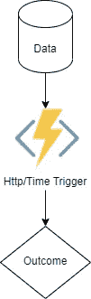

图一。数据转换

**问题陈述**

上传一个样本图书数据集，只提取用中文书写的书名。这是通过将数据转换代码上传到运行在 http 和时间触发器上的 Azure 函数来完成的，这产生了可用于各种原因的转换数据。

*Http trigger* :本质上这意味着一个 azure function，包含了你的 python 代码，存放在 azure function 中，无论何时通过它的 web 服务器 ping 它，它都会被启用

*时间触发*:这意味着在某个时间间隔，包含你的 python 代码的 azure 函数会在这个时间间隔运行。

**安装可视化代码、Azure CLI、node.js、Azure 功能核心工具和 Github 桌面**

你要做的第一件事是[下载可视化代码](https://code.visualstudio.com/)，我已经用多个 ide 进行了编码，我发现可视化代码在模型部署阶段很容易使用。

其次你要做的就是[安装 Azure CLI](https://docs.microsoft.com/en-us/cli/azure/install-azure-cli-windows?tabs=azure-cli) 。安装完 CLI 后，下一个需要安装的插件是 node.js。网上有大量关于如何安装的教程。

最后，你必须安装 [Azure function core tools](https://docs.microsoft.com/en-us/azure/azure-functions/functions-run-local?tabs=v4%2Cwindows%2Ccsharp%2Cportal%2Cbash%2Ckeda) ，它允许你直接从你的终端上传代码。

要测试您是否已经正确安装了所有东西，您可以通过键入以下代码来进行检查

```
C:\Users\tan_k>func ## test to see if you have installed azure func properly
C:\Users\tan_k>az ## see if you have installed azure CLI properly
```

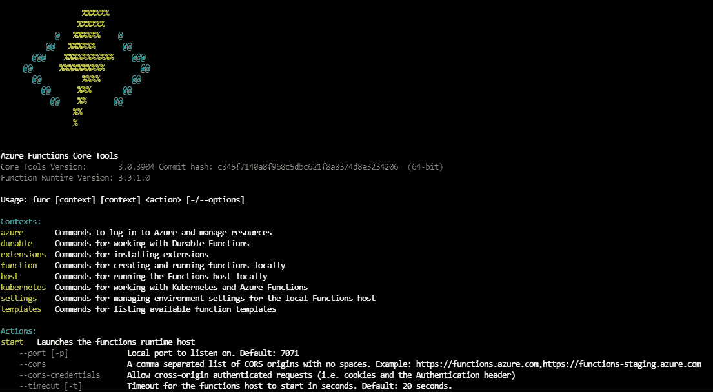

图一。键入 func 时您将看到的示例

**创建 JSON 数据**

我们将做一个简单的数据提取和转换。被推入函数应用程序的数据是 JSON 格式的。

> JSON 总体上使用更少的数据，所以你**降低了成本，提高了解析速度**。可读性:JSON 结构简单易懂。映射到域对象更容易

在这个例子中，我将创建一个样本 JSON 文件，并触发 azure 函数，该函数将提取信息并转换它。数据是使用 [JSON 生成器](https://app.json-generator.com/)创建的。记住您的密钥和 url 很重要，这可以在图 2 中找到。

图书样本数据集

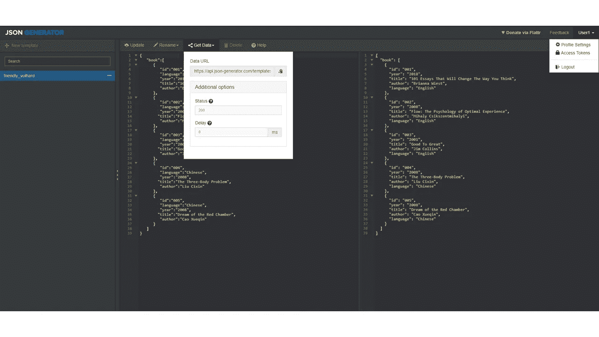

图二。单击数据 url 并访问令牌(记住令牌)

测试您是否正确存储了数据。您可以访问这个[站点](https://reqbin.com/)并输入如图 3 所示的详细信息。

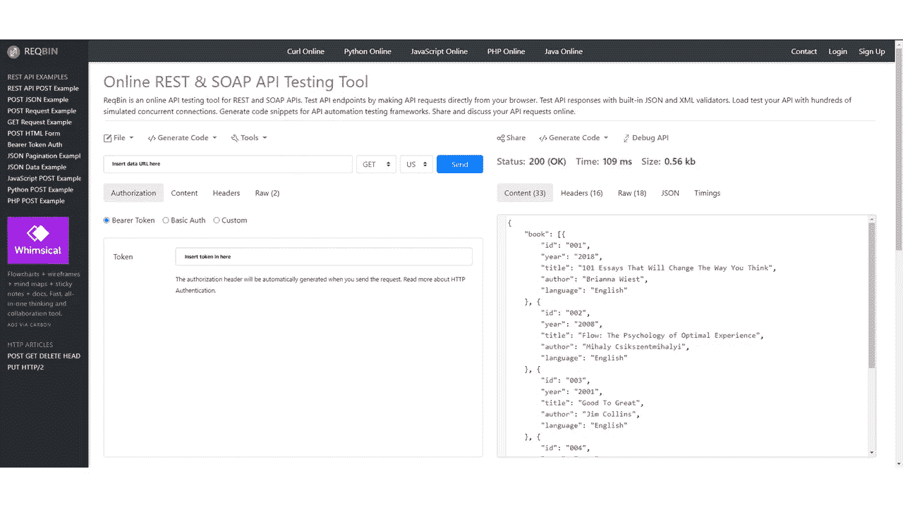

图 3。正确加载数据的图示。

现在我想解释一下正在发生的事情。JSON 生成器生成一个 API，您可以随时从它那里获取数据。在您请求之后，您将收到一个 JSON 文件。

如果您不理解 JSON 是什么或者如何访问 JSON 文件中的信息，请不要担心。当我们深入研究代码时，我们将进入更多的细节。

**克隆 Github 环境**

Github 网址:[https://github.com/kmt112/A2Ztutorial](https://github.com/kmt112/A2Ztutorial)

下载 github desktop 并从那里登录 github(强烈建议您创建一个帐户，如果您有帐户的话)。此后，克隆 repo，右键单击 github repo 并选择 run with Microsoft visual codes。所有的文件夹都应该在适当的位置并可供使用。

**设置 Azure 功能**

目前，微软正在发放免费积分，所以一定要在这里注册。首先，创建一个资源组，然后，你必须建立一个 web 存储帐户，记住，由于云服务器是区域性的，所以你最好选择一个离你最近的区域。完成后，您将创建一个功能应用程序。这是你存放代码的地方。

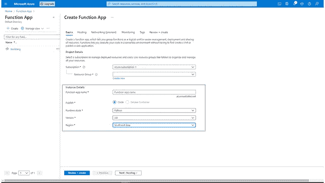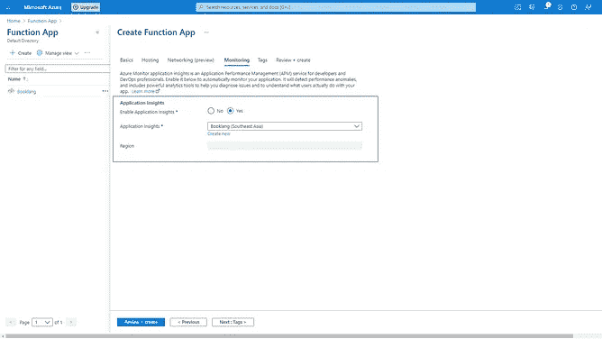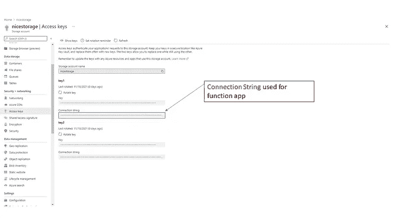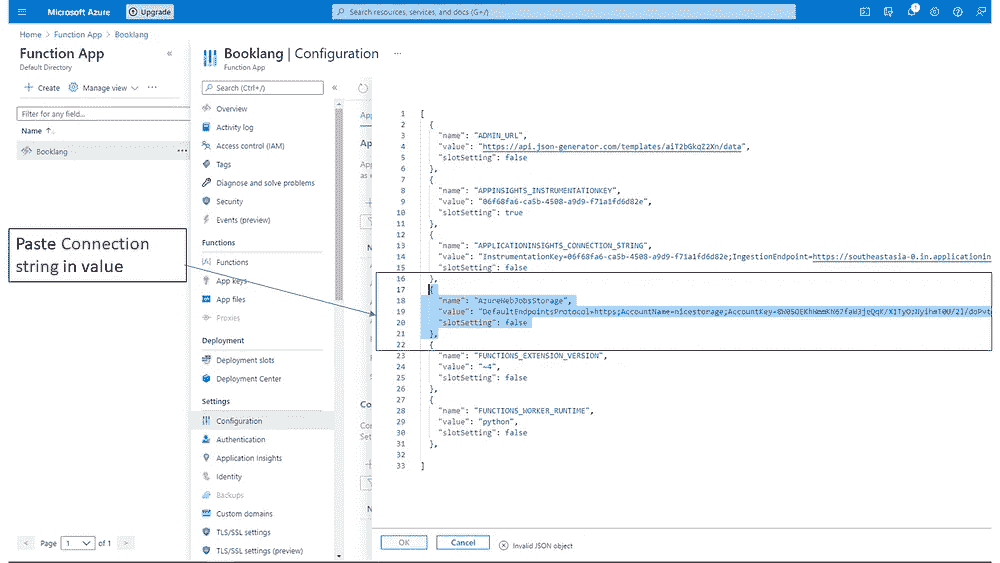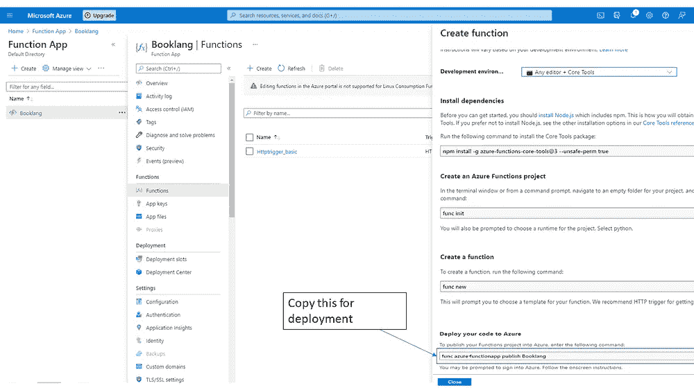

图 4。所有部署程序的说明

此外，一旦您创建了 web 存储帐户，请复制访问密钥，因为我们稍后将再次使用它们。

**设置应用洞察**

每一个好的功能应用程序都必须有必要的日志信息，应用洞察让你看到你的代码的哪一部分出了问题，我们可以从哪里编辑它。因此，正确插入 logging.info 行非常重要，这样您就可以看到代码是否给出了正确的响应。

**代码**

所附的代码将只提取必要的中文书名。

代码基本上是不言自明的。然而，我想指出几个关键点。

1.  将所有可配置文件放入 os.enviro['xx']中是一个很好的做法。因此，在生产阶段，您只需要调整配置文件，这减少了麻烦，而不是去改变它的代码。
2.  在 extract_JSON 函数中。我运行了一个 for 循环来访问内部分配的字段。Content['book']访问存储的信息，如果书的语言==中文，我们复制出书名。

# **Http 触发器:上传 python 代码，触发 webhooks**

现在所有的准备工作都已经完成，我们现在将开始上传代码，并通过时间触发器和 http 触发器来触发它们。

**设定工作目录**

现在你在可视化代码上，首先要做的是键入 az 登录。自从我们最后一次测试以来，它应该已经工作了。登录后，将您的工作目录更改为您在本地终端中创建的工作目录。如果你从 github 桌面打开，它应该已经在同一个工作目录中了。

**Function.json 和 host.json**

在上传代码之前，创建一个 function.json 概要文件是很重要的。基本上，它是一大堆代码，给 azure function 应用程序指示这是什么类型的触发器，以及它们之间是什么类型的通信(GET，POST)。

**配置配置**

进入高级编辑并填写必要的字段。

Azure web 存储字符串=复制自图 4。

Admin_url =复制管理 url。

Secret_token =从您创建的 JSON 生成器复制。

**代码上传**

转到 azure function，复制图 2 中的命令行。在 azure 终端中运行。要验证您是否正确上传了代码，请登录您的 azure function 应用程序，查看代码是否已上传。

**代码测试**

有多种方法可以测试您的代码是否运行正常。该代码将返回一个 JSON 文件，其中包含所有用中文编写的书籍。通过触发我们的 http 函数应用程序的 webhook，它将从 JSON generator 中提取数据，提取必要的标题并将其作为输出推送。这个过程发生在每次你的 http 函数 app 被触发的时候(因此得名 http trigger)。

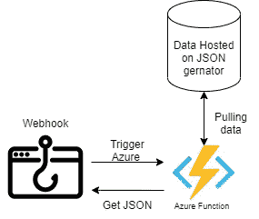

图 6。数据流

回到 Httptrigger，复制你的 azure 函数 URL。前往

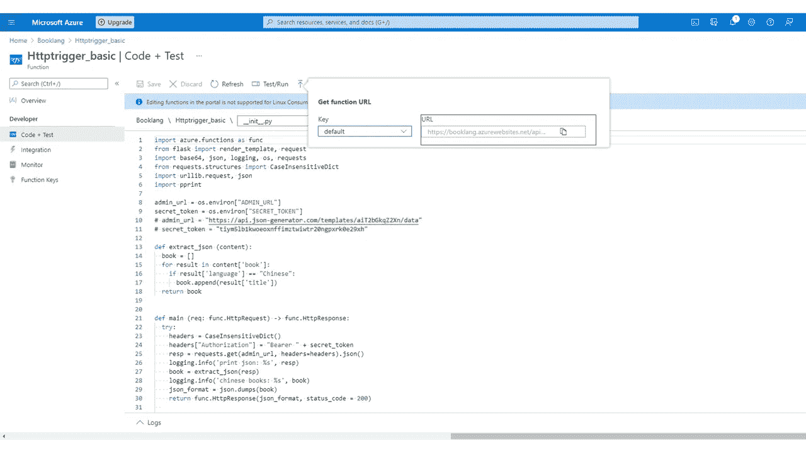

图 7。HTTP 触发器的函数 URL 的位置

而且你已经成功部署了一个功能 app。复制 Http URL 并粘贴到[这里](https://reqbin.com/)以查看结果。

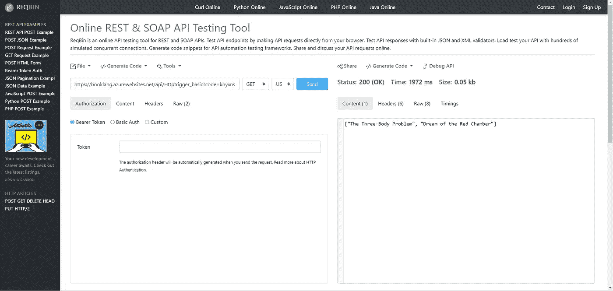

图 8。JSON 输出示例

**监控**

所以你可能会问，除了看最终的 Http 响应，我还能怎么知道我的代码在运行呢？我们之前已经安装了监控应用程序，它会告诉您是否正确安装了该应用程序。另一个需要注意的要点是，在监视日志中，它将显示所有的 logging.info。

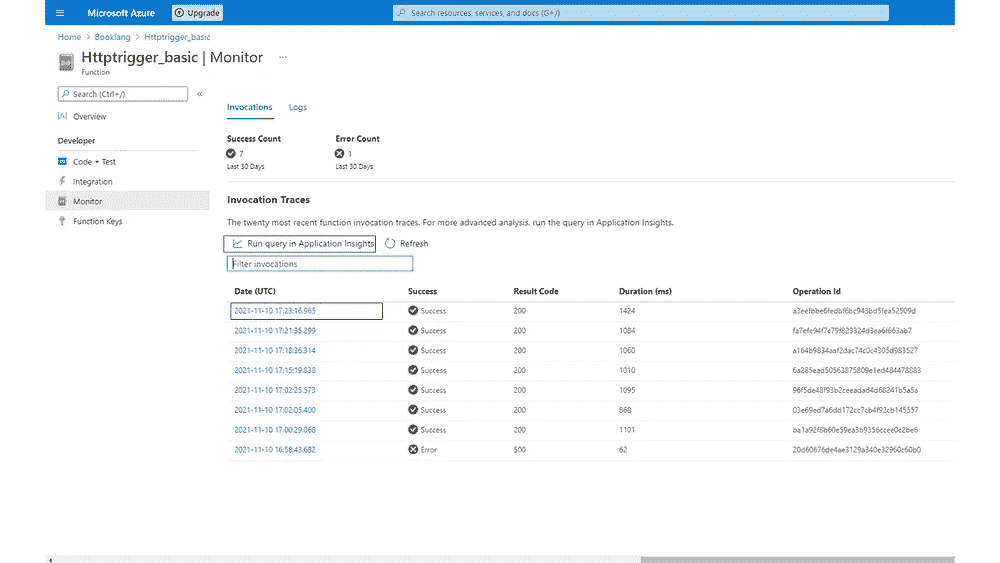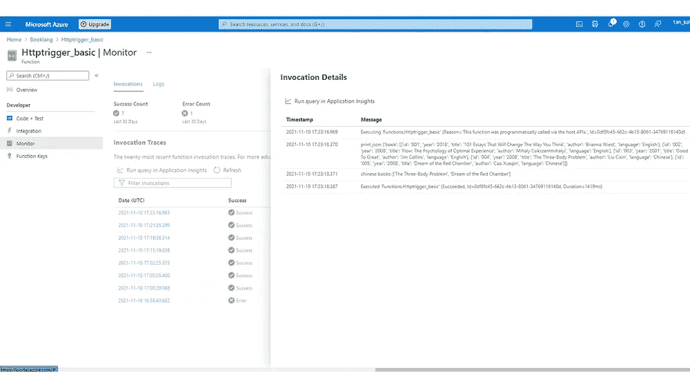

图 9。监控日志中显示的日志记录信息

# **时间触发:上传 python 代码，理解 Cron 表达式。**

每 5 分钟触发一次

**function.json (Cron 表达式)。**对于时间触发，function.json 略有不同。主要是因为 cron 表达式的引入。Cron 表达式本质上是一组基于时间的指令。cron 表达式集将放在 schedule 下的 function.json 下。从这个[站点](https://ncrontab.swimburger.net/)获取进一步的 cron 表达式。

**监控**。最后，您可以通过监视日志在固定的时间监视时间触发器。

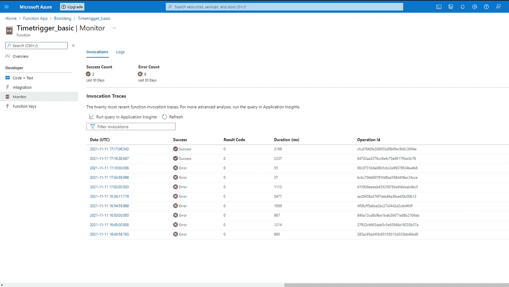

图 10。请注意，日志每 5 分钟触发一次

# 结论

Azure function app (AWS Lambda，google functions)应用广泛。一个明显的例子是使用 API 触发器来触发 azure 函数执行特定的任务并返回数据。通过 http webhooks 或基于时间的函数触发函数可以显著提高效率。

作为一个数据爱好者，我有兴趣创建一个 web 应用程序或聊天机器人，每当用户输入不同的预测特征时，它们都可以触发不同的 ML/AI 任务。请关注第 2 部分，在那里我将分享如何使用前端 webapp 接口部署机器学习模型。