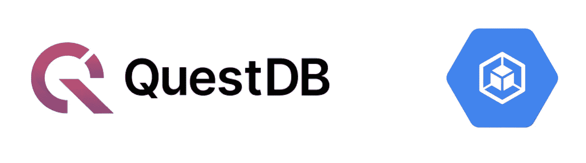
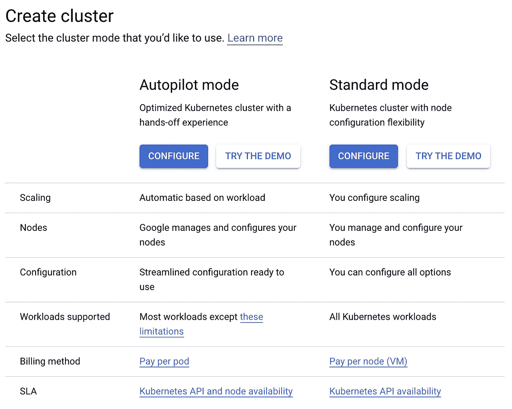
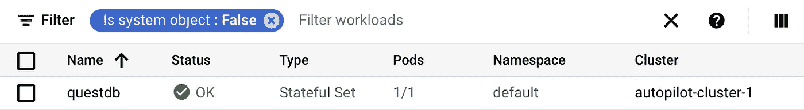
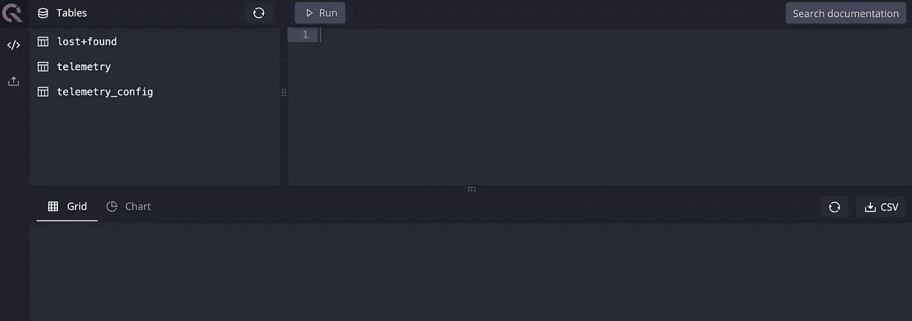
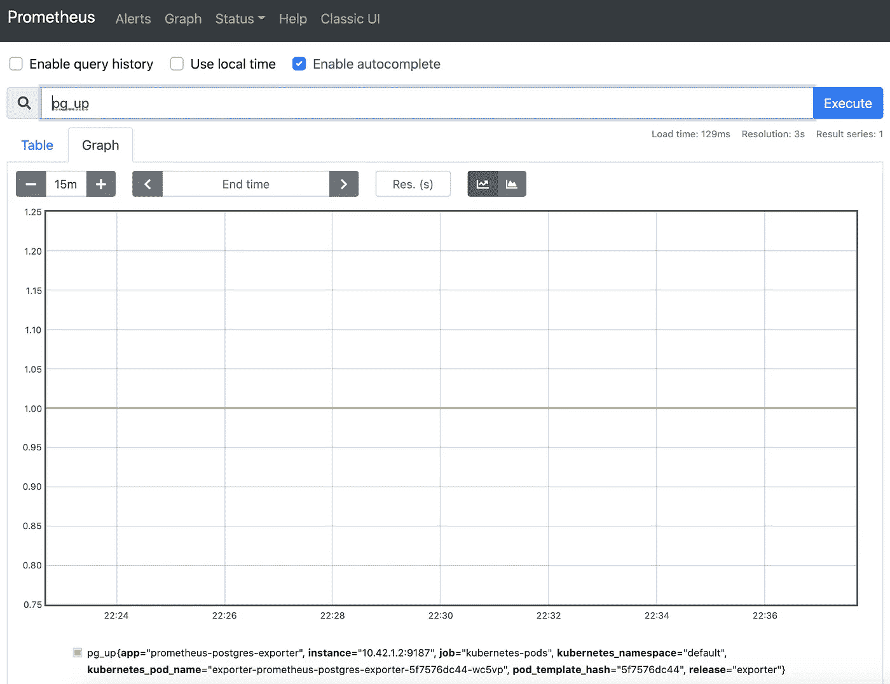
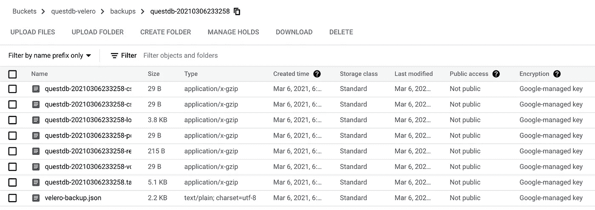

# 在 GKE 自动驾驶仪上运行 QuestDB

> 原文：<https://blog.devgenius.io/running-questdb-on-gke-autopilot-dab25fd76e66?source=collection_archive---------4----------------------->

通过监控和自动化备份扩展 QuestDB Helm 图表，以实现生产就绪设置。



最近，我一直在尝试使用 QuestDB 作为主要的时间序列数据库来流式传输和分析物联网/金融数据:

*   [使用物联网核心和 QuestDB 流式传输心率数据](https://levelup.gitconnected.com/streaming-heart-rate-data-with-iot-core-and-questdb-84304069592e)
*   [带卡夫卡和 QuestDB 的实时密码跟踪器](https://medium.com/swlh/realtime-crypto-tracker-with-kafka-and-questdb-b33b19048fc2)

虽然我能够在这两个项目中验证 QuestDB 在存储大量数据和快速查询数据方面的能力，但我主要是通过 Docker 在我的笔记本电脑上运行它们。为了扩展我的实验，我想创建一个更适合生产的设置，包括 Kubernetes 上的监控和灾难恢复。因此，在本指南中，我们将与普罗米修斯和韦莱罗一起完成在 GKE 建立 QuestDB 的过程。

# 先决条件

*   [GCP 账户](https://cloud.google.com/)
*   [gcloud CLI](https://cloud.google.com/sdk/docs/install)
*   [舵 3](https://v3.helm.sh/docs/intro/install/)

# 设置 GKE 自动驾驶仪

作为一名 DevOps 工程师/SRE，我是 GKE 的超级粉丝，因为与其他可用的托管 Kubernetes 选项相比，它提供了很多现成的功能，比如集群自动缩放、网络策略插件和托管 Istio。最近，谷歌云宣布了 [GKE 自动驾驶仪](https://cloud.google.com/blog/products/containers-kubernetes/introducing-gke-autopilot)，这是一种新的模式，可以进一步自动化库本内特操作，包括节点管理、安全/强化和资源优化。它将云运行的无服务器体验与 GKE 的灵活性和特性结合在一起。实际上，这意味着您现在需要为 pod 的使用付费，而不是为底层 Kubernetes 节点的计算和存储付费，这使得它成为资源利用率未知的项目的绝佳选择。

创建一个新的 GKE 自动驾驶仪集群也非常简单。不需要设置 Terraform 或 VPCs/auto scaler/节点组。只需创建一个谷歌云账户，导航至[谷歌库本尼斯引擎](https://cloud.google.com/)，启用库本尼斯引擎 API，点击“创建集群”:



单击“自动驾驶模式”下的“配置”按钮，为集群命名，并等待几分钟，让集群准备就绪。我在`us-east1`区域使用默认名称`autopilot-cluster-1`(现在可以随意跳过其他部分)。

要配置 Kubernetes 上下文通过 Helm 与集群交互，使用下面的`gcloud`命令获取凭证:

```
$ gcloud container clusters get-credentials autopilot-cluster-1 --region us-east1
```

# 部署 QuestDB

QuestDB 提供了一个官方的舵图，默认情况下，它使用 50Gi PVC 来部署单个 StatefulSet pod。要安装图表，请添加 QuestDB Helm repo 并通过运行以下命令进行部署:

```
$ helm repo add questdb [https://helm.questdb.io/](https://helm.questdb.io/)
$ helm upgrade --install questdb questdb/questdb
```

由于 GKE 自动驾驶仪不预配置节点容量，pod 最初将被标记为不可调度。等待几秒钟，直到 cluster autoscaler 触发扩展事件并安排`questdb` pod。



对于快速冒烟测试，端口转发 HTTP 端点并与 web 控制台 UI 交互:

```
$ kubectl port-forward questdb-0 9000:9000
```



# 监控 Postgres 指标

至此，我们有了一个健康的、正在运行的 QuestDB 实例。然而，如果不检查应用程序日志，就没有简单的方法来确定整个系统的健康状况并从 QuestDB 中获取指标。出于性能原因，QuestDB 团队决定将 REST 端点从其`min` [HTTP 服务器中分离出来，该服务器在端口 9003](https://questdb.io/docs/operations/health-monitoring/) 上保存一个简单的健康状态。这个端口目前没有通过 Helm chart 公开，因此需要更改 StatefulSet 和 Service 部分，以允许探测器定期检查这个端点。

不幸的是，QuestDB 目前还没有提供一个全面的指标端点，可以与 Prometheus 或 Postgres 进行本地集成。此支持的公开 Github 问题如下:

*   [[#532]添加普罗米修斯指标端点](https://github.com/questdb/questdb/issues/532)
*   [[#837]增加对公开数据库状态的支持，类似于 pg_stat_database 和 pg_stat_activity](https://github.com/questdb/questdb/issues/837)

尽管如此，我还是希望部署 Prometheus Postgres Exporter 来至少跟踪 QuestDB 的 up/down 状态，并建立一个框架来在这些特性可用时监控 Postgres 指标。

## 暴露 Postgres 端口

首先，我们需要修改默认的 QuestDB 图表，以暴露端口 8812 (Postgres 端点)。创建一个名为`questdb-values.yaml`的新 YAML 文件:

```
service:
  expose:
    postgresql:
      enabled: true
      port: 8812
```

更新现有部署:

```
$ helm upgrade --install questdb questdb/questdb -f questdb-values.yaml
```

## 安装 Prometheus Postgres 导出器

普罗米修斯头盔图由`prometheus-community`管理:

```
$ helm repo add prometheus-community https://prometheus-community.github.io/helm-charts
```

接下来，我们需要修改默认值来抓取 QuestDB 并禁用默认指标，因为 QuestDB 当前没有存储`pg_stat_database`或`pg_stat_activity`。我们还希望 Prometheus 抓取我们的指标，所以我们需要添加注释来指定我们的抓取端口。

创建另一个名为`exporter-values.yaml`的 YAML 文件:

```
config:
  datasource:
    host: questdb-0.questdb-headless
    user: admin
    password: quest
    port: '8812'
    database: qdb
    sslmode: disable
  disableDefaultMetrics: trueannotations: 
  prometheus.io/scrape: 'true'
  prometheus.io/port: '9187'
```

现在我们可以安装 Postgres 导出器了:

```
$ helm upgrade -i postgres-exporter prometheus-community/prometheus-postgres-exporter -f exporter-values.yaml
```

最后，我们可以安装 Prometheus 来收集这些指标。创建一个新的 YAML 文件来保存我们的 Prometheus 配置，`prometheus-values.yaml`:

```
alertmanager:
  enabled: false
nodeExporter:
  enabled: false
pushgateway:
  enabled: false
```

由于我们还没有来自 QuestDB 的真实指标，我们将只部署 Prometheus 服务器并接受默认配置。

```
$ helm upgrade -i prometheus prometheus-community/prometheus -f prometheus-values.yaml
```

访问控制面板，通过端口转发运行我们的查询:

```
$ export POD_NAME=$(kubectl get pods --namespace default -l \ "app=prometheus,component=server" -o jsonpath="{.items[0].metadata.name}")
  kubectl --namespace default port-forward $POD_NAME 9090
```

打开 localhost:9090，检查我们是否能够抓取`pg_up`:



*(注:如果您正在寻找生产就绪的监控设置，请参考四部分系列“*[*Prometheus 和 Grafana*](https://yitaek.medium.com/practical-monitoring-with-prometheus-grafana-part-i-22d0f172f993) *的实际监控”。)*

# 使用 Velero 自动备份

[Velero](https://velero.io/) 是一款开源工具，用于备份和恢复 Kubernetes 资源和持久卷。这对于灾难恢复(拍摄快照)或数据迁移非常有用。Velero 在 Kubernetes 集群内运行，并与各种存储提供商(如 AWS S3、GCP 存储、Minio)以及 [restic](https://velero.io/docs/v1.5/restic/) 集成，以按需或按计划拍摄快照。

## 装置

Velero 可通过[舵](https://vmware-tanzu.github.io/helm-charts/)或通过 [CLI](https://velero.io/docs/v1.5/basic-install/) 工具安装。总的来说，CLI 似乎获得了最新的更新，而 Helm chart 稍微落后于兼容的 Docker 映像。

```
# for MacOS
$ brew install velero# for Windows
$ choco install velero
```

## 配置服务器组件

要在 GCP 设置 Velero，我们需要:

*   [创建一个 GCS 存储桶](https://github.com/vmware-tanzu/velero-plugin-for-gcp#Create-an-GCS-bucket)
*   [为 Velero 设置权限](https://github.com/vmware-tanzu/velero-plugin-for-gcp#Set-permissions-for-Velero)
*   [安装并启动 Velero](https://github.com/vmware-tanzu/velero-plugin-for-gcp#Install-and-start-Velero)

## 创建 GCS 存储桶

给出一个唯一的 bucket 名称，并使用`gsutil`工具创建 bucket(用您的 BUCKET 名称替换< YOUR_BUCKET >):

```
PROJECT_ID=$(gcloud config get-value project)
BUCKET=<YOUR_BUCKET>gsutil mb gs://$BUCKET/
```

## 设置 GCP 权限

创建服务帐户:

```
gcloud iam service-accounts create velero \
 — display-name “Velero service account”
```

将计算权限附加到服务帐户:

```
SERVICE_ACCOUNT_EMAIL=$(gcloud iam service-accounts list \
  --filter="displayName:Velero service account" \
  --format 'value(email)')ROLE_PERMISSIONS=(
    compute.disks.get
    compute.disks.create
    compute.disks.createSnapshot
    compute.snapshots.get
    compute.snapshots.create
    compute.snapshots.useReadOnly
    compute.snapshots.delete
    compute.zones.get
)

gcloud iam roles create velero.server \
    --project $PROJECT_ID \
    --title "Velero Server" \
    --permissions "$(IFS=","; echo "${ROLE_PERMISSIONS[*]}")"

gcloud projects add-iam-policy-binding $PROJECT_ID \
    --member serviceAccount:$SERVICE_ACCOUNT_EMAIL \
    --role projects/$PROJECT_ID/roles/velero.server

gsutil iam ch serviceAccount:$SERVICE_ACCOUNT_EMAIL:objectAdmin gs://${BUCKET}
```

下载服务帐户密钥并保存为`credential-velero`:

```
gcloud iam service-accounts keys create credentials-velero \
    --iam-account $SERVICE_ACCOUNT_EMAIL
```

现在我们可以安装 Velero 并启用 GCS 插件了:

```
velero install \
    --provider gcp \
    --plugins velero/velero-plugin-for-gcp:v1.1.0 \
    --bucket $BUCKET \
    --secret-file ./credentials-velero
```

最后，我们可以使用 cron 字符串创建一个时间表:

```
velero schedule create questdb --schedule "0 7 * * *" -l "app.kubernetes.io/instance=questdb" --include-namespaces default
```

我们可以验证在我们的存储桶中进行的备份:



(*注:关于 Velero 上的深度潜水，请参考 Kubernetes 上的“* [*灾难恢复*](https://medium.com/dev-genius/disaster-recovery-on-kubernetes-98c5c78382bb) *”*)

# 后续步骤

为了优化性能，QuestDB 选择从头构建一个与 ANSI SQL 兼容的时间序列数据库，而不是像 TimescaleDB 那样构建在 Postgres 之上。此外，作为一个较新的产品，QuestDB 缺少一些企业功能(例如复制、高可用性、从快照恢复)以及与其他流行项目的集成。不过，有了 Prometheus Postgres exporter 和 Velero，我们可以在 Kubernetes 上配置一个生产就绪的 QuestDB。我希望在将来的版本中，当监控和 ops 特性得到支持时，能够改进这个设置。