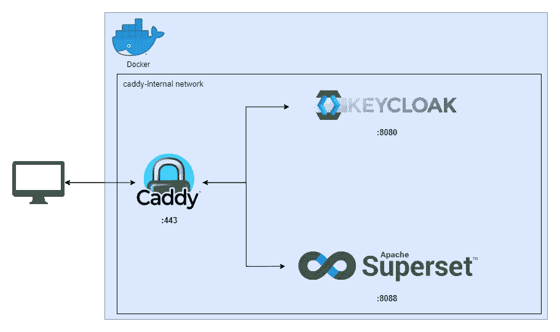

# 在 Docker 中使用 OpenIdConnect (Keycloak)运行超集

> 原文：<https://blog.devgenius.io/running-superset-with-openidconnect-keycloak-in-docker-9ef1558d1ea3?source=collection_archive---------0----------------------->

超集是一个伟大的现代数据探索和可视化平台。我们这里要讲的是认证！

根据超集文档:

> 超集中的安全性由 Flask AppBuilder (FAB)处理，这是一个构建在 Flask 之上的应用程序开发框架。FAB 提供认证、用户管理、权限和角色。

默认情况下，如 FAB 文档中所述，支持五种身份验证类型:

*   数据库ˌ资料库
*   开放 Id
*   轻量级目录访问协议
*   远程用户
*   OAuth(需要 authib)

现在，人们很容易感到困惑，认为 OpenId Connect 可以开箱即用，因为 OpenId 是受支持的，但 sadl 并非如此。

一个简单的解决方法是使用 Oauth，因为 OpenId Connect 扩展了 OAuth，通常可以使用 OAuth 进行连接。

然而，在我们的例子中，我们希望完全使用 OpenId Connect，所以我们的手会有点乱。

我们将使用 Keycloak 作为我们的 OIDC 提供商，因为它是开源的。然而，OIDC 作为一个标准，这篇文章应该适用于几乎所有的供应商。

为了确保您可以在家里测试，我们将在本地机器上使用 Docker 来完全实现它！这使得事情变得更加棘手，因为联网和安全不像公开访问时那么容易。

*这已经通过了 Keycloak v20.0.2 和超集 v2.0.1 的测试。*

# 设置

为了让事情更清楚一些，我们的设置如下所示:



我们将有 3 个独立的 docker-compose 文件来使事情变得更好和独立:

*   小盒子
*   钥匙锁
*   超集

Caddy 是一个很好的反向代理，它甚至可以在您的本地机器上为您处理 SSL 证书。这使得它很容易保护您的服务。

更多关于球童的信息可以在 https://caddyserver.com/docs/的[找到](https://caddyserver.com/docs/)

这不是我们这里的情况，但是 Caddy 也可以用来反向代理其他服务。这就是为什么把它放在自己的 docker compose 文件中很好。

为了让我们所有容器之间的交流更好更容易，让我们在应用程序之间创建一个网络。

```
docker network create caddy-internal
```

为了减轻我们的本地开发者/用户体验，我修改了我的 hosts 文件来为 Keycloak 和 Superset 创建假的 URL。

在 windows 中可以在*C:\ Windows \ System32 \ drivers \ etc*中找到，在 Linux 或 Mac 上你会在 */etc/hosts* 文件夹中找到这个文件。

向其中添加以下几行:

```
127.0.0.1           keycloak.local
127.0.0.1           superset.local
```

如果需要，将 ip 地址更改为可以访问 docker 实例的地址。

# 钥匙锁

根据 Keycloak 文档，建议您构建映像以获得优化的体验。很明显，您可以尝试一下，但是出于这个示例的目的，我们将使用已经编译好的 dev 映像。

```
services:
  app:
    image: quay.io/keycloak/keycloak:latest
    container_name: keycloak
    environment:
      - KEYCLOAK_ADMIN=admin
      - KEYCLOAK_ADMIN_PASSWORD=admin
    restart: always
    ports:
      - 8088:8088
    networks:
      - keycloak
      - caddy-internal
    command: "start-dev --db=postgres --features=token-exchange --proxy=edge --db-url=jdbc:postgresql://db:5432/keycloak --db-username=keycloak --db-password=keycloak --hostname=keycloak.local"

  db:
    image: postgres:12
    restart: always
    environment:
      - POSTGRES_USER=keycloak
      - POSTGRES_PASSWORD=keycloak
      - POSTGRES_DB=keycloak
    networks:
      - keycloak
    volumes:
      - keycloak_db:/var/lib/postgresql/data
volumes:
  keycloak_db:

networks:
  keycloak:
    external: false
  caddy-internal:
    external: true
```

一些重要的事情:

*   确保根据您的需要更新— db-url。如果你照原样使用这个 docker compose，它应该就可以了。
*   相应地更改主机名。同样，如果你在你的本地机器上并且像我一样编辑了主机文件，你应该已经设置好了。
*   如你所见，keycloak 应用程序将加入球童内部网络。这将使事情变得简单。

我们去旋转吧！

```
docker compose up -d
```

如果一切顺利，那么您应该能够在 http://localhost:8088 上访问 Keycloak。

*Keycloak 本身可以处理端口 8443 上的 https，但是因为我们将使用 Caddy 进行 SSL，所以我们将坚持使用 http 版本。*

# 小盒子

为了确保一切正常，让我们设置球童！

```
# docker-compose.yaml
services:
  caddy:
    image: caddy:latest
    restart: unless-stopped
    networks:
      - caddy-internal
    ports:
      - "443:443"
    volumes:
      - $PWD/Caddyfile:/etc/caddy/Caddyfile
      - caddy_data:/data
      - caddy_config:/config

volumes:
  caddy_data:
  caddy_config:

networks:
  caddy-internal:
    external: true
```

Caddy 的配置存储在 Caddyfile 中，在我们的例子中，caddy file 位于 docker 编写文件的旁边。

```
# Caddyfile

keycloak.local {
    reverse_proxy keycloak:8080
}

superset.local {
    reverse_proxy superset_app:8088
}
```

Caddyfile 语法非常简单。在这里，我们只需声明我们的两个域(本地域)并反向代理到所需的服务和端口。因为 Caddy、Keycloak 和 Superset 都共享同一个网络(caddy-internal ),所以可以直接使用容器名。

让我们启动 Caddy 并检查是否一切正常。

```
docker compose up -d
```

现在 Keycloak 应该可以在 [https://keycloak.local](https://keycloak.local.) /上访问了

注意，现在我们可以使用 HTTPS，而不仅仅是 HTTP，因为 Caddy 处理我们的证书。

要检查我们的 Keycloak 是否配置正确，请尝试使用用户名 admin 和密码 admin 登录管理界面。

如果你停留在加载页面上，检查 Keycloak 中设置的主机名变量是否正确。否则 Keycloak 可能无法加载一些资源。

对于 Keycloak 配置，我不再赘述。有大量的资源，包括 Keycloak 文档。但是，在继续之前，请确保您已经配置了以下内容:

*   至少一个客户端(OIDC)
*   至少有一个注册了电子邮件、名字和姓氏以及密码的用户
*   确保在实际设置中，要求 SSL 选项设置为“外部请求”

如果一切都准备好了，你就可以继续了！

# 超集

现在到了有趣(也可能是最棘手)的部分！

因为我们必须调整超集，所以我们需要它的源代码。正如它的文档([https://superset . Apache . org/docs/installation/installing-superset-using-docker-compose/](https://superset.apache.org/docs/installation/installing-superset-using-docker-compose/))中所建议的那样，无论如何，对于 Docker 安装，让我们继续克隆 repo。

```
git clone https://github.com/apache/superset.git
```

在启动超集之前，我们要稍微调整一下它的配置。下面是我编辑的 docker-compose-non-dev.yml 文件。

*因为我们不需要改变前端的任何东西，我们可以使用非开发文件来减轻负担。*

```
# docker-compose-non-dev.yml
#
# Licensed to the Apache Software Foundation (ASF) under one or more
# contributor license agreements.  See the NOTICE file distributed with
# this work for additional information regarding copyright ownership.
# The ASF licenses this file to You under the Apache License, Version 2.0
# (the "License"); you may not use this file except in compliance with
# the License.  You may obtain a copy of the License at
#
#    http://www.apache.org/licenses/LICENSE-2.0
#
# Unless required by applicable law or agreed to in writing, software
# distributed under the License is distributed on an "AS IS" BASIS,
# WITHOUT WARRANTIES OR CONDITIONS OF ANY KIND, either express or implied.
# See the License for the specific language governing permissions and
# limitations under the License.
#
x-superset-image: &superset-image apache/superset:${TAG:-latest-dev}
x-superset-depends-on: &superset-depends-on
  - db
  - redis
x-superset-volumes:
  &superset-volumes # /app/pythonpath_docker will be appended to the PYTHONPATH in the final container
  - ./docker:/app/docker
  - superset_home:/app/superset_home

version: "3.7"
services:
  redis:
    image: redis:latest
    container_name: superset_cache
    restart: unless-stopped
    volumes:
      - redis:/data
    networks:
      - superset

  db:
    env_file: docker/.env-non-dev
    image: postgres:10
    container_name: superset_db
    restart: unless-stopped
    volumes:
      - db_home:/var/lib/postgresql/data
    networks:
      - superset

  superset:
    env_file: docker/.env-non-dev
    image: *superset-image
    container_name: superset_app
    command: ["/app/docker/docker-bootstrap.sh", "app-gunicorn"]
    user: "root"
    restart: unless-stopped
    ports:
      - 8088:8088
    networks:
      - caddy-internal
      - superset
    depends_on: *superset-depends-on
    volumes: *superset-volumes

  superset-init:
    image: *superset-image
    container_name: superset_init
    command: ["/app/docker/docker-init.sh"]
    env_file: docker/.env-non-dev
    depends_on: *superset-depends-on
    user: "root"
    volumes: *superset-volumes
    networks:
      - superset
    healthcheck:
      disable: true

  superset-worker:
    image: *superset-image
    container_name: superset_worker
    command: ["/app/docker/docker-bootstrap.sh", "worker"]
    env_file: docker/.env-non-dev
    restart: unless-stopped
    depends_on: *superset-depends-on
    user: "root"
    volumes: *superset-volumes
    networks:
      - superset
    healthcheck:
      test:
        [
          "CMD-SHELL",
          "celery inspect ping -A superset.tasks.celery_app:app -d celery@$$HOSTNAME",
        ]

  superset-worker-beat:
    image: *superset-image
    container_name: superset_worker_beat
    command: ["/app/docker/docker-bootstrap.sh", "beat"]
    env_file: docker/.env-non-dev
    restart: unless-stopped
    depends_on: *superset-depends-on
    user: "root"
    volumes: *superset-volumes
    networks:
      - superset
    healthcheck:
      disable: true

volumes:
  superset_home:
    external: false
  db_home:
    external: false
  redis:
    external: false

networks:
  caddy-internal:
    external: true
  superset:
    external: false
```

在这个文件中，我刚刚更改了以下内容:

*   添加了 caddy 内部网络，并为其分配了应用程序容器
*   添加了超集网络，以确保其余的保持一起工作，并为其分配所有容器

现在让我们试着启动它！

```
docker compose up -d
```

如果一切顺利，你应该能够访问 [http://localhost:8088](http://localhost:8088) 上的超集，也可以访问 [https://superset.local](https://superset.local) 上的超集，因为 Caddy 已经配置好了。

*如果第二个 url 不起作用，尝试在/docker/python path _ dev/superset _ config . py 文件中添加以下行:*

```
ENABLE_PROXY_FIX = True
PROXY_FIX_CONFIG = {"x_for": 1, "x_proto": 1, "x_host": 1, "x_port": 0, "x_prefix": 1}
```

现在，您可以使用默认的“本地”凭证登录。现在让我们尝试将 Keycloak 和 Superset 连接在一起！

如果你的 Keycloak 实例或者你的超集实例不能正常工作，不要再尝试了！

## 将 OIDC 功能添加到超集

现在到了有趣的部分！

让我们不要试图重新发明轮子，让我们使用现有的软件包来处理所有 OIDC 的东西。

为此，我们将使用 flask-oidc。

为了添加我们的自定义代码超集，repo 的根目录下有一个名为“docker”的便利文件夹。在这个文件夹中，我们添加一个名为 requirements-local.txt 的新文件。

该文件应包括以下内容:

```
# /docker/requirements-local.txt
# Custom packages required

flask-oidc==1.3.0
itsdangerous==2.0.1
flask_openid
```

这样，当我们启动超集容器时，它会自动为我们获取那些 Python 包！太好了！

现在我们已经有了所有的包，让我们添加完成所有魔术的代码。

基本上，我们将不得不覆盖两个路由(/登录和/注销)。我们也将不得不存储有关我们的 OIDC 提供商的信息(网址，客户端 id，客户端秘密等)。为此，首先在/docker/pythonpath_dev 目录中添加一个名为 client_secret.json 的新文件。

```
{
  "web": {
    "issuer": "https://keycloak.local/realms/master",
    "auth_uri": "https://keycloak.local/realms/master/protocol/openid-connect/auth",
    "client_id": "myclientid",
    "client_secret": "4H6sra49h4BpV4J1SIGlx0YedwqSUNVx",
    "redirect_uris": ["https://superset.local/*"],
    "userinfo_uri": "http://keycloak:8080/realms/master/protocol/openid-connect/userinfo",
    "token_uri": "http://keycloak:8080/realms/master/protocol/openid-connect/token",
    "token_introspection_uri": "http://keycloak:8080/realms/master/protocol/openid-connect/token/introspect"
  }
}
```

如果你的设置和我的一样，那你应该没问题！注意，因为我们在本地使用它，所以我们有两种类型的 URL。Issuer 和 auth_uri 也将用作重定向。因为我们修改了我们的主机文件，所以我们会很好。

Userinfo、token 和 token_introspection 将由超集“内部”使用。由于 Superset 不知道我们的 hosts 文件，我们将对这些 URL 使用“docker”DNS 名称。

*如果你是公开设置，那么你就不需要这两种类型。把公开网址到处放就行了。*

为了能够使用这些信息，我们必须修改同一个目录中的 superset_config.py 文件。

向其中添加以下几行。

```
'''
---------------------------KEYCLOACK ----------------------------
'''
curr  =  os.path.abspath(os.getcwd())
AUTH_TYPE = AUTH_OID
OIDC_CLIENT_SECRETS =  curr + '/docker/pythonpath_dev/client_secret.json'
OIDC_ID_TOKEN_COOKIE_SECURE = False
OIDC_REQUIRE_VERIFIED_EMAIL = False
OIDC_OPENID_REALM: 'master'
OIDC_INTROSPECTION_AUTH_METHOD: 'client_secret_post'
CUSTOM_SECURITY_MANAGER = OIDCSecurityManager
AUTH_USER_REGISTRATION = True
AUTH_USER_REGISTRATION_ROLE = 'Gamma'
OIDC_VALID_ISSUERS = ['https://keycloak.local/realms/master']
'''
--------------------------------------------------------------
'''
```

如果需要，请确保调整领域和 OIDC _ 有效 _ 发行者的 url。

最后，创建一个名为 keycloack_security_manager.py 的新文件，并向其中添加以下内容。

```
from flask import redirect, request
from flask_appbuilder.security.manager import AUTH_OID
from superset.security import SupersetSecurityManager
from flask_oidc import OpenIDConnect
from flask_appbuilder.security.views import AuthOIDView
from flask_login import login_user
from urllib.parse import quote
from flask_appbuilder.views import ModelView, SimpleFormView, expose
import logging
import urllib.parse

class OIDCSecurityManager(SupersetSecurityManager):

    def __init__(self, appbuilder):
        super(OIDCSecurityManager, self).__init__(appbuilder)
        if self.auth_type == AUTH_OID:
            self.oid = OpenIDConnect(self.appbuilder.get_app)
        self.authoidview = AuthOIDCView

class AuthOIDCView(AuthOIDView):

    @expose('/login/', methods=['GET', 'POST'])
    def login(self, flag=True):
        sm = self.appbuilder.sm
        oidc = sm.oid

        @self.appbuilder.sm.oid.require_login
        def handle_login():
            user = sm.auth_user_oid(oidc.user_getfield('email'))

            if user is None:
                info = oidc.user_getinfo(['preferred_username', 'given_name', 'family_name', 'email'])
                user = sm.add_user(info.get('preferred_username'), info.get('given_name'), info.get('family_name'),
                                   info.get('email'), sm.find_role('Gamma'))

            login_user(user, remember=False)
            return redirect(self.appbuilder.get_url_for_index)

        return handle_login()

    @expose('/logout/', methods=['GET', 'POST'])
    def logout(self):
        oidc = self.appbuilder.sm.oid

        oidc.logout()
        super(AuthOIDCView, self).logout()
        redirect_url = urllib.parse.quote_plus(request.url_root.strip('/') + self.appbuilder.get_url_for_login)

        return redirect(
            oidc.client_secrets.get('issuer') + '/protocol/openid-connect/logout?client_id='+ oidc.client_secrets.get('client_id')+'&post_logout_redirect_uri=' + quote(redirect_url))
```

在这里，我们可以清楚地看到两个不同的路由，登录和注销。

Flask-oidc 处理大部分的魔法，但是如果你想的话，你可以根据你的需要稍微调整一下。在 handle_login 定义中你可以改变我们不存在的用户被创建。也就是说，如果所有声明都没有在 IdToken 中公开，那么您总是可以用其他信息覆盖它。创建用户时，您还可以自定义角色属性。

在注销路由上，执行两个动作。首先从超集中注销，然后重定向到 Keycloak 注销页面。如果第二步没有完成，那么只需重新加载超集页面就可以让您再次登录。

现在是测试这一切的时候了！

关闭所有正在运行的超集容器，并使用以下命令再次启动它们:

```
docker compose up -d
```

一旦他们开始运作，试着去 https://superset.local/

您应该会立即被重定向到 Keycloak 登录页面。测试登录，如果一切正常，那么你应该重定向回超集。

最后尝试注销。您应该被重定向到 Keycloak 注销页面，然后返回到登录页面，因为您将被重定向到 Superset 的登录过程。

我希望这篇文章是有用的！它是基于许多来源和大量测试编写的。请注意，超集和 Keycloak 都变化得非常快，确保您使用的版本与“测试”版本相比没有重大变化是很重要的。