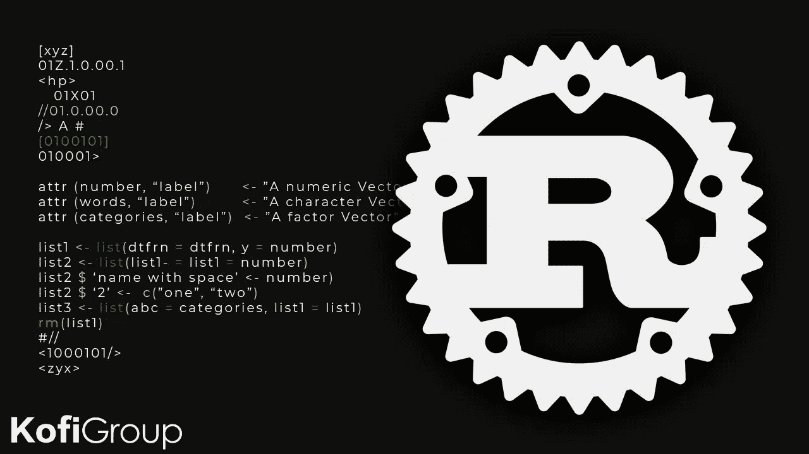

# 锈

> 原文：<https://blog.devgenius.io/rust-4f42693ae0e7?source=collection_archive---------4----------------------->



Rust 是一种静态类型的编程语言，设计用于性能和安全，尤其是安全并发和内存管理。

自从 Rust 基金会发布这种流行的编程语言以来，它已经被许多行业领导者采用，包括 **Mozilla、Dropbox、谷歌、微软和亚马逊**。

**语法:**

```
fn functionname(arguments){
  code
}
```

## Rust 是前端还是后端？

Rust 为后端开发提供了各种 web 框架，包括来自不同供应商的工具、助手和库的组合，每一个都旨在提供一种高效、安全和灵活地构建、测试和运行应用的方法。

## Rust 比 Java 好吗？

说到 Java，这种编程语言明显比 Rust 慢。Rust 提供了更快的启动时间和更小的内存占用。Java 使用垃圾收集进行内存管理，这会降低性能。

# 所有权的概念:

所有权的概念是，当你拥有一样东西时，你可以决定把它交给别人，如果你有一本书，并且你已经读完了它，你可以永久地把它交给别人，而不用担心它。

*   锈

`**fn**` `helper() -> Box<**int**> {`

`**let**`

`**return**` `three; //transfer ownership`

`}`

`**fn**` `main() {`

`// acquire ownership of return value`

`**let**`

`}`

# 借款的概念:

rust 中拥有的值可以被借用，以允许在某段时间内使用。**“&”符号**代表借用的引用。借用的值有一个生命周期，并且仅在该时间内有效。借阻止搬家。当存在有效借用时，我不能转移所有权。我仍然拥有它，但不能转让，直到我把它交出来，真正放弃借来的。

*   锈

`**let**` `a: &**int**;`

`{`

`**let**` `b =3; //b lifetime is not same as a`

`a =&b;`

`} //`

这里“a”和“b”有不同的生存期，所以不会起作用。

*   锈

`**let**` `a: &**int**;`

`**let**`

`a = &b;`

这里“a”和“b”有相同的寿命，所以会起作用。借入可以嵌套。通过克隆，借来的价值可以被拥有。

# Rust 中的内存管理:

1.  Rust 拥有细粒度的内存管理，但一旦创建，就会被自动管理。
2.  在 Rust 中，当你分配内存时，你不必真的释放它，你可以决定何时释放它，但永远不要调用它。Rust 会自动处理它。
3.  每个变量都有一个有效的作用域，一旦超出作用域，就会被自动释放。
4.  在 rust 中，每个程序都从操作系统中分配内存。
5.  Rust 也有一个共享内存，在那里我们可以有一个引用数据，我们可以使用所有权来跟踪引用计数。

## 不同的内存:

**堆:**

*   它是最大的内存块，由 rust 所有权模型管理。
*   所有的动态数据都存储在这个地方。

**栈:**

*   rust 中的所有值都被分配到堆栈上。
*   此时，静态内存是默认分配的。
*   每个线程有一个堆栈。
*   它包括动态数据的结构和指针。

# 可变性:

rust 中的值默认情况下是不可变的，必须标记为可变的(如果需要)。

**例如:**

*   锈

`**let**` `x = 2;`

`x = 9; //it will show an error`

上面的例子将显示一个错误，因为我们没有将它标记为可变的。

*   锈

`**let**` `**mut**` `x = 2;`

`x = 9; //work correctly`

这将很好地工作，因为我们已经将它标记为可变的。在这种情况下，我们显式地改变它。

# 生锈的结构

该结构是 rust 中用户定义的数据类型，用于组合不同类型的不同数据项。结构将数据定义为键值对。 ***struct*** 关键字用于定义 Rust 中的结构。

**语法:**

```
struct Name_of_structure {
  field1:data_type,
  field2:data_type,
  field3:data_type
}
```

**例如:**

*   锈

`**struct**`

`name: String,`

`company: String,`

`employee_id: u32,`

`profile: String`

`}`

`**fn**` `main() {`

`**let**`

`name: String::from("Geek"),`

`company: String::from("Geeksforgeeks.org"),`

`employee_id: 007,`

`profile:String::from("Manager"),`

`};`

`println!("Employee: {} of {} Company bearing EmployeeID {} is of {} level.",`

`value.name,`

`value.company,`

`value.employee_id,`

`value.profile);`

`}`

**输出:**

```
Employee: Geek of Geeksforgeeks.org Company bearing EmployeeID 7 is of Manager level.
```

这是我们如何在铁锈中创造结构的一个例子。这将完美地编译。

# 元组:

rust 中的 tuple 是一种有限异构的复合数据类型，这意味着它可以一次存储多个值。在元组中，没有内置的方法将元素添加到元组中。我们可以使用索引来获取元组的值，但是我们也不能使用 for 循环来迭代元组。

Rust 中的元组使用小括号定义，如下所示:

```
**Syntax:** ("geeksforgeeks", 1, 'geek')
```

**例如:**

*   锈

`// Rust program to get value from tuple`

`// using index`

`**fn**` `main() {`

`**let**` `gfg = ("cp", "algo", "FAANG", "Data Structure");`

`// complete tuple`

`println!("complete tuple = {:?} ", gfg );`

`// first value`

`println!("at 0 index = {} ", gfg.0 );`

`// second value`

`println!("at 0 index = {} ", gfg.1 );`

`// third value`

`println!("at 0 index = {} ", gfg.2 );`

`// fourth value`

`println!("at 0 index = {} ", gfg.3 );`

`}`

**输出:**

```
complete tuple = ("cp", "algo", "FAANG", "Data Structure") 
at 0 index = cp 
at 0 index = algo 
at 0 index = FAANG 
at 0 index = Data Structure
```

# 铁锈类型系统:

在 Rust 中，每个变量、值和项目都有一个类型。*类型*定义了它拥有多少内存以及可以对该值执行哪些操作。下表列出了铁锈的所有类型:

## 编程语言:Rust 刚刚从脸书的 Meta 得到了巨大的推动

[Rust 最初是由 Mozilla 开发的，现在正加入 Meta，成为官方认可的服务器端语言。添加 Rust 作为支持的语言](https://www.zdnet.com/article/the-rust-programming-language-just-got-a-big-boost-from-meta/)